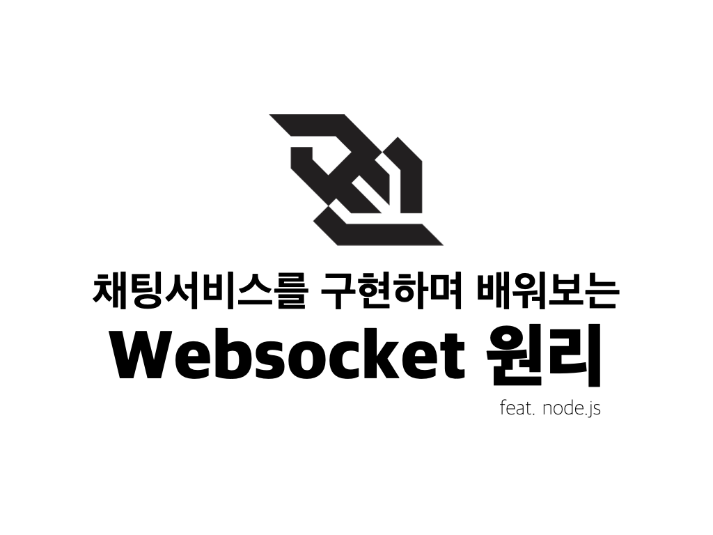
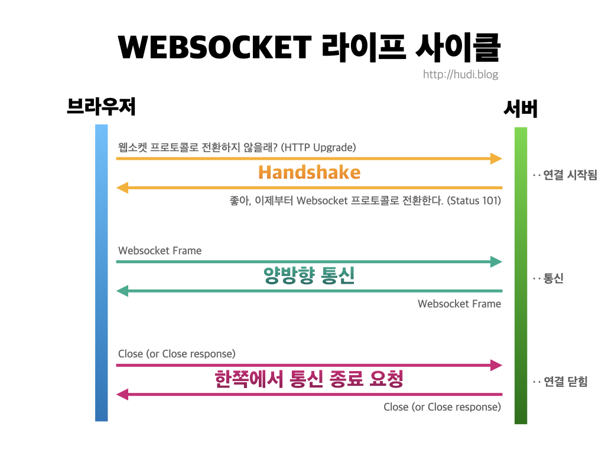
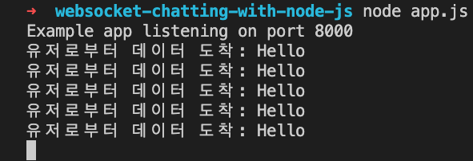
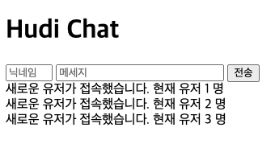
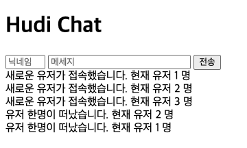
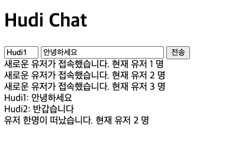

> 본 포스팅에서는 Websocket 의 원리를 배우고, node.js 의 ExpressJS 프레임워크에서 Websocket 서버를 만들어 웹브라우저와 실시간 통신으로 간단한 채팅을 만드는 것을 목표로 한다.



## 1. Websocket 이란?

### 1-1. 정의

웹소켓(Websocket) 은 HTTP 와 구분되는 통신 프로토콜이다. [RFC 6455](https://datatracker.ietf.org/doc/html/rfc6455) 로 국제적으로 표준화 되어있다. HTTP 와 웹소켓은 모두 OSI 참조 모델의 7계층에 위치해있고, TCP 에 의존한다.

많은 사람들이 알고 있는 것 처럼 HTTP 통신은 **요청 (Request)** 와 **응답 (Response)** 이 존재한다. 여기서 요청은 클라이언트가, 응답은 서버가 전송한다. 이런 구조로 서버는 능동적으로 클라이언트에 ‘먼저’ 데이터를 전송할 수 없다. 따라서 클라이언트는 서버의 데이터를 얻기 위해 항상 요청을 해야하고, 서버는 이에 수동적으로 응답해주는 구조로 구성되어있다. 이와 같은 통신 구조를 **반이중통신(Half-Duplex Communication)** 이라고 한다.

이와 다르게 웹소켓은 TCP/IP 의 소켓과 마찬가지로 **전이중통신(Full-Duplex Communication)** 을 지원한다. 웹소켓으로 연결된 서버와 클라이언트는 각 주체가 요청과 응답없이 능동적으로 메세지를 보낼 수 있다.

따라서 웹소켓은 **전이중통신**과 **실시간 네트워킹**이 보장되어야 하는 환경에서 유용하게 사용될 수 있다.

### 1-2. 실시간성 보장을 위한 발버둥

Websocket 이 사용되기 전에는 HTTP 위에서 실시간성을 보장하기 위해 아래와 같은 다양한 기법들이 활용되었다.

#### HTTP 폴링 (Polling)

주기적으로 클라이언트가 서버로 HTTP 요청을 보내고, 즉시 응답을 받는 방식으로 실시간성을 구현하는 기법이다. 서버가 클라이언트에 제공할 데이터가 없어도 클라이언트는 그 사실을 알 수 없으므로, 오버헤드가 발생한다.

#### HTTP 롱폴링 (Long-Polling)

HTTP 폴링 방식과 비슷하지만, 서버가 요청에 대한 연결을 즉시 닫고 응답하지 않고, 일정시간동안 연결을 열어두는 기법이다. 연결이 열려있는 동안 서버가 클라이언트로 제공할 데이터가 발생하면 전송할 수 있어, 그냥 폴링 방식보다는 오버헤드가 비교적 적다.

그럼에도 불구하고 메세지 양 자체가 많을 경우 일반 폴링과 비교하여 큰 성능 향상은 없다.

#### HTTP Streaming

서버에 요청을 보내고 HTTP 연결을 끊지 않은 채 계속 서버로부터 데이터를 수신하는 기법이다. 단, 연결을 끊지 않으므로 클라이언트에서 서버로 데이터를 송신하는데 어려움이 존재한다.

위 모든 방식은 HTTP 프로토콜 기반으로 이루어지는데, 애초에 HTTP 패킷 자체의 크기가 작지 않기 때문에 실시간성을 보장하기 위해 사용되기엔 그리 적합하지는 않다.

### 1-3. 동작 원리



#### 1. 연결수립

최초 연결 요청 시 클라이언트에서 **HTTP를 통해** 웹서버에 요청한다. 이를 핸드셰이크 (Handshake) 라고 한다. 네트워크를 공부해본 사람이라면 TCP 통신에서 3-Way Handshake, 4-Way Handshake 같은 용어를 통해 익숙할 것이라고 생각한다.

핸드셰이크를 위해 클라이언트는 서버에 아래와 같은 요청(HTTP Upgrade)을 보낸다.

```http
GET /chat HTTP/1.1
Host: server.example.com
Upgrade: websocket
Connection: Upgrade
Sec-WebSocket-Key: x3JJHMbDL1EzLkh9GBhXDw==
Sec-WebSocket-Protocol: chat, superchat
Sec-WebSocket-Version: 13
Origin: http://example.com
```

서버는 아래와 같이 응답한다. 101 Status 는 성공을 의미한다.

```http
HTTP/1.1 101 Switching Protocols
Upgrade: websocket
Connection: Upgrade
Sec-WebSocket-Accept: HSmrc0sMlYUkAGmm5OPpG2HaGWk=
Sec-WebSocket-Protocol: chat
```

핸드셰이크가 성공하면, 둘간의 통신 프로토콜은 Websocket 으로 전환된다.

#### 2. 전이중통신

연결이 수립되면 클라이언트와 서버 양측간의 데이터 통신 단계가 시작된다. 서로는 메세지를 보내며 통신하는데, 이 메세지는 **프레임(Frame)** 단위로 이루어진다.

또한, 연결 수립 이후에는 서버와 클라이언트는 언제든 상대방에게 ping 패킷을 보낼 수 있다. Ping 을 수신한 측은 가능한 빨리 pong 패킷을 상대방에게 전송해야한다. 이런 방식으로 서로의 연결이 살아있는지를 주기적으로 확인할 수 있는데, 이를 **Heartbeat** 라고 한다.

#### 3. 연결종료

클라이언트 혹은 서버 양측 누구나 연결을 종료할 수 있다. 연결 종료를 원하는 측이 Close Frame 을 상대쪽으로 전송하면 된다.

## 2. 프로젝트 생성

```bash
$ npm init
$ npm i express ws
```

우리는 node.js 의 ExpressJS 프레임워크와 ws 라는 웹소켓 라이브러리를 사용하여 통신해 볼 것이다. 적절한 디렉토리에서 위 명령을 이용해 프로젝트를 세팅하자.

> 본 포스팅에서는 Websocket 사용에만 집중하기 위해 별도의 프론트엔드 라이브러리는 사용하지 않는다.

## 3. Websocket 통신 맛보기

### 3-1. 클라이언트 코드 생성

프로젝트 루트 디렉토리에서 `public` 이라는 디렉토리를 생성하고 아래와 같이 `index.html` 파일을 작성한다.

```html
<!DOCTYPE html>
<html lang="ko">
  <head>
    <meta charset="UTF-8" />
    <meta name="viewport" content="width=device-width, initial-scale=1.0" />
    <title>Websocket Chatting</title>
  </head>
  <body>
    <h1>Hello Express</h1>
  </body>
</html>
```

### 3-2. 정적파일 서빙

이 정적파일을 서빙할 node.js 서버도 생성해주자. 이 서버는 HTML 파일을 서빙함과 동시에 웹소켓 서버역할을 겸하게 될 것이다.

```js
const express = require("express")
const app = express()

app.use(express.static("public"))

app.listen(8000, () => {
  console.log(`Example app listening on port 8000`)
})
```

루트 디렉토리에 `app.js` 라는 파일을 생성하고, 위와 같이 코드를 작성하자. 접속 포트는 `8000` 번 이다. 그리고 아래의 명령으로 서버를 실행한다.

```bash
$ node app.js
```


위와 같이 localhost:8000 로 접속했을 때, 제대로 html 파일이 서빙된다면 성공이다.

> nodemon, pm2 등을 사용해 파일이 수정될 때 마다 node.js 서버를 재시작 해주는 방법을 사용하면 조금 더 편하게 실습할 수 있다.

### 3-3. Websocket 서버 열기

프로젝트 생성 시 미리 설치해둔 `ws` 모듈을 아래와 같이 불러온다.

```js
const { WebSocketServer } = require("ws")
```

그다음 아래와 같이 웹소켓 서버를 열어준다. 접속 포트는 `8001` 번이다.

```js
// 웹소켓 서버 생성
const wss = new WebSocketServer({ port: 8001 })

// 웹소켓 서버 연결 이벤트 바인드
wss.on("connection", ws => {
  // 데이터 수신 이벤트 바인드
  ws.on("message", data => {
    console.log(`Received from user: ${data}`)
  })
})
```

`wss` 은 웹소켓 서버를 의미하고, 콜백 함수로 받아온 `ws` 는 연결된 클라이언트를 의미한다.

위 코드는 `wss` 에 연결 이벤트를 바인딩하고, 연결된 클라이언트가 메세지를 보내면 그 내용을 그대로 콘솔에 출력하는 동작을 수행한다.

### 3-4. 클라이언트에서 데이터 전송

웹소켓 서버가 제대로 생성되었는지, 그리고 클라이언트로부터 제대로 메세지를 수신하는지 확인하기 위해서 아래와 같이 클라이언트 HTML 파일을 수정해보자.

head 태그 안에는 아래와 같이 스크립트 생성한다.

```html
<script>
  const ws = new WebSocket("ws://localhost:8001")

  function sayHi() {
    ws.send("Hello") // 서버에 데이터 전송
  }
</script>
```

body 태그 안에는 아래와 같이 버튼 추가해서 버튼을 클릭하면 서버로 “Hello” 라는 메세지를 보내게 할 것이다.

```html
<h1>Hello Express</h1>
<button onClick="sayHi()">Say Hi</button>
```

버튼을 클릭했을 때, 아래와 같이 서버에서 데이터를 수신한다면 성공이다.



### 3-5. 서버의 응답

클라이언트가 보낸 메세지를 그대로 다시 클라이언트에게 보내주는 코드를 작성해보자. 서버 코드를 아래와 같이 수정한다.

```js
// 웹소켓 서버 실행
wss.on("connection", ws => {
  // 데이터 수신 이벤트 바인드
  ws.on("message", data => {
    console.log(`Received from user: ${data}`)
    ws.send(`Received ${data}`) // 서버의 답장
  })
})
```

이렇게 `send` 메소드를 사용하여 클라이언트에게 메세지를 전송할 수 있다.

### 3-6. 접속 환영 메세지

이번엔 웹소켓 서버에 연결된 클라이언트에 서버가 먼저 환영 메세지를 보내보자. 아래와 같이 서버 코드를 수정한다.

```js
wss.on("connection", (ws, request) => {
  // request: 클라이언트로 부터 전송된 http GET 리퀘스트 정보

  ws.on("message", data => {
    console.log(`Received from user: ${data}`)
    ws.send(`Received ${data}`)
  })

  ws.send(`Hello, ${request.socket.remoteAddress}`)
  // 연결 직후 해당 클라이언트로 데이터 전송
})
```

이렇듯, 웹소켓은 클라이언트의 요청 없이도 능동적으로 먼저 클라이언트에게 데이터를 전송할 수 있는 **전이중통신 (Full-Duplex Communication)** 을 지원한다. 따라서 HTTP 와 다르게 요청과 응답을 따로 구분하지 않는다.

## 4. 채팅 앱 만들기

### 4-1. 기본틀 작성

기본적인 서버-클라이언트 통신을 맛보았으니 본격적으로 간단한 그룹 채팅 앱을 만들어보자. 아래와 같이 `index.html` 파일을 수정하여 기본 틀을 만든다.

```html
<!DOCTYPE html>
<html lang="ko">
  <head>
    <meta charset="UTF-8" />
    <meta name="viewport" content="width=device-width, initial-scale=1.0" />
    <title>Websocket Chatting</title>

    <script>
      const ws = new WebSocket("ws://localhost:8001")

      // 메세지 전송
      function sendMessage() {}

      // 메세지 수신
      function receiveMessage() {}
    </script>
  </head>
  <body>
    <h1>Hudi Chat</h1>
    <div>
      <input
        type="text"
        id="nickname"
        placeholder="닉네임"
        style="width: 50px"
      />
      <input
        type="text"
        id="message"
        placeholder="메세지"
        style="width: 200px"
      />
      <button>전송</button>
    </div>

    <div id="chat-log"></div>
  </body>
</html>
```

아래와 같이 `app.js` 파일도 처음과 같은 상태로 만들어 놓자.

```js
const express = require("express")
const { WebSocketServer } = require("ws")
const app = express()

app.use(express.static("public"))

app.listen(8000, () => {
  console.log(`Example app listening on port 8000`)
})

const wss = new WebSocketServer({ port: 8001 })

wss.on("connection", (ws, request) => {})
```

### 4-2. 브로드캐스트

일단 유저가 접속할 때 이를 모든 클라이언트에 알리고, 서버에도 로깅하자. 이때, 모든 클라이언트에 메세지를 보내는 것을 브로드캐스트 (Broadcast) 한다고 말한다.

```js
// ...
wss.on("connection", (ws, request) => {
  wss.clients.forEach(client => {
    client.send(`새로운 유저가 접속했습니다. 현재 유저 ${wss.clients.size} 명`)
  })

  console.log(`새로운 유저 접속: ${request.socket.remoteAddress}`)
})
```

> `wss.clients` 는 리스트가 아닌 Set 이므로 개수를 셀 때 `length` 대신 `size` 를 사용하여 받아온다.

### 4-3. 클라이언트에서 수신

그럼 이제 클라이언트에서 서버로부터 도착한 메세지를 받고, 보여주는 부분을 만들어보자.

```js
function receiveMessage(event) {
  const chat = document.createElement("div")
  const message = document.createTextNode(event.data)
  chat.appendChild(message)

  const chatLog = document.getElementById("chat-log")
  chatLog.appendChild(chat)
}

ws.onmessage = receiveMessage
```

이제 클라이언트는 서버측에서 보내는 메세지를 받고, 새로운 HTML element 를 생성해서 유저에게 보여줄 수 있다. 여러 탭을 열어 접속해보자. 아래와 같이 메세지를 제대로 수신하여 표시하면 성공이다.



### 4-4. 유저 연결 끊김 이벤트

유저가 접속할 때 브로드캐스트를 했으니, 이제 유저의 연결이 끊어지면 브로드캐스트를 하여 클라이언트에 이를 알려보자.

```js
wss.on("connection", (ws, request) => {
  ws.on("close", () => {
    wss.clients.forEach((client) => {
      client.send(`유저 한명이 떠났습니다. 현재 유저 ${wss.clients.size} 명`);
    });
  });

  // ...
```

그리고 아까와 같이 여러 탭으로 접속을 한뒤, 제일 먼저 접속한 탭을 제외한 모든 탭을 닫아보자. 아래와 같이 나오면 성공이다.



### 4-5. 채팅 구현

이제 유저가 직접 다른 사용자와 채팅을 할 수 있는 기능을 구현해보자. 먼저 메세지를 보내고 싶은 클라이언트에서 서버로 메세지를 보내야한다. 클라이언트의 `sendMessage` 함수를 아래와 같이 수정하자.

```js
// 메세지 전송
function sendMessage() {
  const nickname = document.getElementById("nickname").value
  const message = document.getElementById("message").value
  const fullMessage = `${nickname}: ${message}`

  ws.send(fullMessage)
}
```

전송 버튼에도 아래와 같이 이벤트를 추가한다.

```html
<button onClick="sendMessage()">전송</button>
```

서버는 클라이언트에서 전송한 채팅 메세지를 받아 연결된 모두에게 브로드캐스트 해야한다. 아래와 같이 서버 코드도 수정해보자.

```js
// ...

ws.on("message", data => {
  wss.clients.forEach(client => {
    client.send(data.toString())
  })
})

// ...
```

> 현재 클라이언트에서 전송되는 데이터를 서버에서 Blob으로 수신하므로 `toString()` 메소드로 String 으로 만들 필요가 있다.

아래와 같이 모든 탭에서 실시간으로 채팅할 수 있다면 성공이다.



### 4-6. 코드 및 사용성 개선

그런데, 아무래도 브로드캐스트를 하는 코드가 중복이 많은 것 같다. 아래와 같이 바꿔주자.

```js
// broadcast 메소드 추가
wss.broadcast = (message) => {
  wss.clients.forEach((client) => {
    client.send(message);
  });
};

wss.on("connection", (ws, request) => {
  ws.on("message", (data) => {
    wss.broadcast(data.toString());
  });

  ws.on("close", () => {
    wss.broadcast(`유저 한명이 떠났습니다. 현재 유저 ${wss.clients.size} 명`);
  });

  wss.clients.forEach((client) => {
    wss.broadcast(
      `새로운 유저가 접속했습니다. 현재 유저 ${wss.clients.size} 명`
    );
  });

  // ...
```

`wss.broadcast` 에 새로운 메소드를 할당하여, `wss.clients.forEach` 로 시작하는 코드가 하나로 줄었다.

그리고 클라이언트에서도 메세지를 보내면, `input` 을 공백으로 만들어주면 더 좋을 것 같다. 아래와 같이 코드를 개선하자.

```js
// ...

function clearMessage() {
  document.getElementById("message").value = ""
}

// 메세지 전송
function sendMessage() {
  const nickname = document.getElementById("nickname").value
  const message = document.getElementById("message").value
  const fullMessage = `${nickname}: ${message}`

  ws.send(fullMessage)
  clearMessage()
}

// ...
```

## 5. 마치며

Websocket 을 직접 사용하는 방법도 좋지만, 사실 node.js 진영에서는 [**socket.io**](https://socket.io) 라는 Websocket 을 Wrapping 하여 더 실시간 통신을 사용할 수 있는 라이브러리가 존재한다.

socket.io 는 Websocket 뿐 아니라 Websocket 을 사용할 수 없는 환경에서는 HTTP long-polling 기법으로 자동으로 대체하여 통신한다. 이후 포스팅에서는 socket.io 을 다뤄보도록 할 예정이다.

## 6. 참고 자료

실제 채팅 서비스는 훨씬 복잡한 구조를 갖겠지만, 우리가 만들어본 그룹 채팅 앱은 Websocket 의 원리를 간단하게 알아보기 위해 많은 점이 생략되었다. 더 자세하게 웹소켓에 대해 공부해보고 싶다면, 아래 참고자료 링크를 읽어보며 공부해보자.

- https://expressjs.com/ko/starter/hello-world.html
- https://expressjs.com/ko/starter/static-files.html
- https://www.npmjs.com/package/ws
- https://developer.mozilla.org/ko/docs/Web/API/WebSockets_API/Writing_WebSocket_client_applications
- https://ko.wikipedia.org/wiki/%EC%9B%B9%EC%86%8C%EC%BC%93
