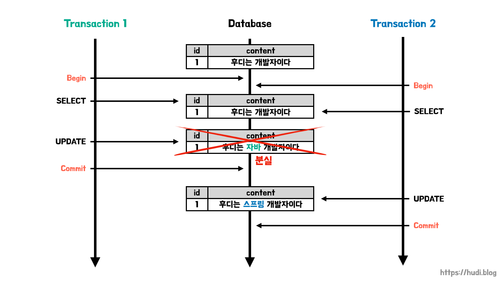
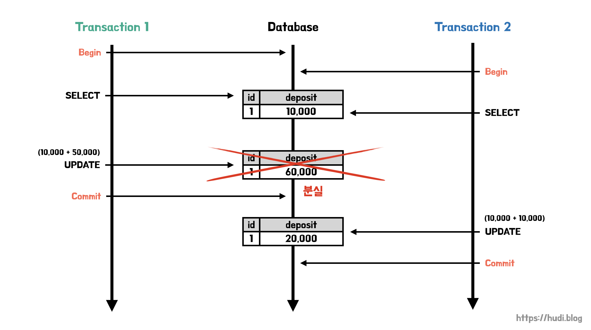

> 설명된 트랜잭션 격리 수준과 락에 대한 대부분의 내용은 MySQL 8.0을 기준으로 하고 있다.

## 트랜잭션 격리 수준

트랜잭션은 ACID(원자성, 일관성, 격리성, 지속성)을 보장해야한다. 트랜잭션은 원자성, 일관성, 지속성을 보장하지만 문제는 격리성이다. 트랜잭션간 완전한 격리를 보장하기 위해서는 동시성 측면에서 많은 손해를 본다. 예를 들어 테이블 따라서 ANSI 표준에서는 트랜잭션 격리 수준을 4단계로 구분하여 병행성과 격리성을 설정할 수 있다. 격리성과 병행성은 서로 역비례 관계이므로 무턱대고 격리 수준을 최대로 높이게되면 성능이 악화될 수 있으므로 적절한 격리 수준 설정이 중요하다.

하지만 이런 트랜잭션 격리 수준으로도 해결하지 못하는 문제가 존재한다.

## 두 번의 갱신 분실 문제 (second lost updates problem)

트랜잭션 격리 수준으로는 해결할 수 없는 문제가 존재한다. 바로 갱신 분실 문제이다. 위키백과의 후디라는 문서를 두 유저가 동시에 편집하는 상황을 가정해보자. 최초 문서의 내용은 ‘후디는 개발자이다’ 이다. 첫번째 유저는 이 내용을 ‘후디는 자바 개발자이다’ 로 변경하고 싶고, 두번째 유저는 ‘후디는 스프링 개발자이다’ 로 변경하고 싶어한다.



유저1과 유저2는 동시에 수정 화면에 진입했고, 원하는 내용을 작성한 뒤, 수정 버튼을 클릭했다. 그리고 위 그림과 같이 유저1의 트랜잭션이 먼저 커밋되고 그 이후에 유저2의 트랜잭션이 커밋되었다. 이 경우 유저1의 트랜잭션의 변경 내용은 사라지게 되고, 유저2의 트랜잭션만이 데이터베이스에 반영된다.

이 경우 처리 방법은 3가지가 있다.

1. **마지막 커밋만 인정하기:** 유저1의 변경 내용을 무시하고, 마지막에 커밋한 유저2의 내용만을 반영한다.
2. **최초 커밋만 인정하기:** 유저1이 수정을 완료했으므로, 유저2의 변경 사항에 대해 오류를 발생시킨다.
3. **충돌하는 내용 병합하기:** 유저1과 유저2의 변경 사항을 병합한다.

상황에 따라 위 3가지 방법 중 적절한 정책을 선택해야한다. 하지만, **트랜잭션의 격리 수준으로는 ‘마지막 커밋만 인정하기’ 외의 정책을 구현할 수 없다**.

두번째 사례를 살펴보자. 조금 더 동시성 이슈에 민감한 송금 관련 트랜잭션이다.



계좌에 10,000원이 있는 상황이다. 트랜잭션1은 50,000원을 입금하고, 트랜잭션2는 10,000원을 입금하는 상황이다. 입금을 위해서는 현재 계좌의 잔액을 읽어오고 입금액을 더한 값으로 잔액을 갱신해야한다. 트랜잭션1이 먼저 시작되어 잔액 10,000원을 읽어왔다. 그리고 근소한 차이로 뒤 이어 트랜잭션2가 시작되어 마찬가지로 잔액 10,000원을 읽어왔다. 트랜잭션1은 읽어온 10,000원에 입금액 50,000원을 더한 60,000원으로 잔액을 갱신하고 커밋한다. 이후 트랜잭션2는 읽어온 10,000원에 입금액 10,000원을 더한 20,000원으로 잔액을 갱신하고 커밋한다. 이 상황에서 **트랜잭션1의 송금 내역은 분실**된다. 절대 일어나서는 안되는 일이다.

트랜잭션 격리 레벨로 이 문제를 어떻게 풀 수 있을까? REPEATABLE READ는 조회한 데이터가 트랜잭션 동안 일관적으로 같은 값을 읽어올 수는 정도의 격리 수준을 제공한다. 그 이상의 레벨이 필요하다. SERIALIZABLE이다. MySQL 기준으로 SERIALIZABLE은 읽기 작업을 하는 데이터에 대해서도 shared lock을 건다. 일관된 읽기 뿐 아니라 실제 읽고 있는 데이터가 다른 트랜잭션에 의해서 변경되지 않음을 보장할 수 있다.

그러면 SERIALIZABLE로 문제가 해결이 될까? 이 경우 두 트랜잭션이 같은 데이터에 대해 s-lock을 걸고 그 직후 서로 x-lock을 거는 상황이 연출되는데, 이 경우 **데드락이 발생**한다. **s-lock과 x-lock은 양립할 수 없기 때문**이다. 두 트랜잭션은 x-lock을 걸기 위해 서로가 s-lock을 해제하는 시점을 무한히 대기하며 타임아웃될 것이다. 물론, 동시성 이슈는 당장 해결되겠지만 데드락이 발생하는 해결 방법을 정상적인 해결 방법으로 볼 수는 없다.

위와 같은 문제를 **두번의 갱신 분실 문제 (second lost updates problem)**라고 부른다. 이와 같이 두번의 갱신 분실 문제와 같은 경우 **트랜잭션으로 처리할 수 있는 범위를 넘어선다**. 따라서 별도의 방법이 필요하다.

## 낙관적 락과 비관적 락

JPA는 데이터베이스에 대한 동시 접근으로부터 엔티티에 대한 무결성을 유지할 수 있게 해주는 동시성 제어 매커니즘을 지원한다. 이 매커니즘에는 낙관적 락과 비관적 락이 존재한다. JPA는 데이터베이스의 트랜잭션 격리 레벨을 READ COMMITTED 정도로 가정한다.

## 낙관적 락 (Optimistic Lock)

대부분의 트랜잭션이 충돌이 발생하지 않을 것이라고 낙관적으로 가정하는 방법이다. 따라서 데이터베이스가 제공하는 락 기능을 사용하지 않고, 엔티티의 버전을 통해 동시성을 제어한다. 즉, 어플리케이션 레벨에서 지원하는 락이다.

### @Version

JPA는 `@Version` 어노테이션을 제공하는데, 이를 사용하여 엔티티의 버전을 관리할 수 있다. `@Version` 적용이 가능한 타입은 Long(long), Integer(int), Short(short), Timestamp 이다. `@Version` 은 아래와 같이 버전 관리용 필드를 만들어 적용한다.

```java
@Entity
public class Board {

  @Id
  private String id;
  private String title;

  @Version
  private Integer version;
}
```

위 `Board` 엔티티가 변경될 때 마다 `version` 이 자동으로 하나씩 증가한다. 그리고 엔티티를 수정할 때, 엔티티를 조회한 시점의 버전과 수정한 시점의 버전이 일치하지 않으면 예외가 발생한다.

두 번의 갱신 분실 문제에서 첫 번째 예시로 들었던 위키백과 사례를 다시 생각해보자. 트랜잭션1과 2가 조회한 엔티티의 버전이 1이라고 가정하자(v1). 트랜잭션1이 트랜잭션2보다 먼저 엔티티를 수정하고 커밋했다. 엔티티는 v2가 된다. 이후 트랜잭션2가 엔티티를 수정하고 커밋하려한다. 트랜잭션2가 조회한 시점에는 v1이었는데, 수정한 시점은 v2이다. 버전의 불일치가 발생하였으므로 예외가 발생한다. 즉, **‘최초 커밋만 인정하기’ 정책을 구현할 수 있다.**

### 버전 정보 비교 방법

JPA가 엔티티를 수정하고 트랜잭션을 커밋하는 시점에, 영속성 컨텍스트를 flush 하면서 아래의 `UPDATE` 쿼리를 실행한다.

```sql
UPDATE BOARD
SET
  title = ?,
  version = ? # 버전 + 1 증가
WHERE
  id = ?,
  and version = ? # 버전 비교
```

위와 같이 데이터가 수정되었을 때, 엔티티의 버전 정보를 증가시킨다. 위 쿼리에서 `WHERE` 절에서 엔티티 조회 시점의 버전으로 데이터를 찾는 조건을 볼 수 있다. 만약 데이터 조회 이후 **엔티티가 수정되었다면 위 `WHERE` 문으로 엔티티를 찾을 수 없다**. 이 때 JPA가 예외를 던진다.

### 주의점

Embedded 타입의 경우 논리적으로 해당 엔티티의 값이므로 수정하면 엔티티의 버전이 증가한다. 반면 연관관계 필드의 경우 연관관계의 주인 필드를 변경할 때에만 버전이 증가한다.

또, `@Version` 으로 추가한 버전 관리 필드는 JPA가 직접 관리하므로 임의로 수정해서는 안된다. 그런데 벌크 연산의 경우 버전을 무시하므로, 벌크 연산을 수행할 때에는 아래와 같이 버전 필드를 강제로 증가시켜야한다.

```sql
update Member m set m.name = '변경', m.version = m.version + 1
```

## 낙관적 락의 LockModeType

LockModeType을 통해서 락 옵션을 변경할 수 있다.

### NONE

별도로 락 옵션을 지정하지 않아도 엔티티에 `@Version` 을 적용하면 기본으로 적용되는 락 옵션이다.

- **용도** : 조회한 엔티티를 수정하는 시점에 다른 트랜잭션으로부터 변경(또는 삭제)되지 않음을 보장한다. 즉, 조회 시점부터 수정 시점까지를 보장한다.
- **동작** : 엔티티를 수정하는 시점에 엔티티의 버전을 증가시킨다. 이때 엔티티의 버전이 조회 시점과 다르다면 예외가 발생한다.
- **이점** : 두 번의 갱신 분실 문제를 해결한다.

### OPTIMISTIC

`NONE` 의 경우 엔티티를 수정해야 버전을 체크하지만, 이 옵션은 엔티티를 조회만 해도 버전을 체크한다. 즉, 한번 조회한 엔티티가 트랜잭션 동안 변경되지 않음을 보장한다.

- **용도** : 엔티티의 조회 시점부터 트랜잭션이 끝날 때 까지 다른 트랜잭션에 의해 변경되지 않음을 보장한다.
- **동작** : 트랜잭션을 커밋하는 시점에 버전정보를 체크한다.
- **이점** : 애플리케이션 레벨에서 DIRTY READ와 NON-REPEATABLE READ를 방지한다.

### OPTIMISTIC_FORCE_INCREMENT

낙관적 락을 사용하면서 버전 정보를 강제로 증가한다. 엔티티가 물리적으로 변경되지 않았지만, 논리적으로는 변경되었을 경우 버전을 증가하고 싶을 때 사용한다.

예를 들어 게시물과 첨부파일 엔티티가 1:N 관계로 있다고 가정하자. 게시물에 첨부파일이 하나 추가된 상황은 게시물 엔티티의 물리적 변경은 일어나지 않았지만, 논리적인 변경은 일어났다. 이때 버전을 변경하고 싶다면 해당 락 옵션을 사용하면 된다.

- 용도 : 논리적인 단위의 엔티티 묶음을 관리할 수 있다.
- 동작 : 엔티티가 직접적으로 수정되어 있지 않아도, 트랜잭션을 커밋할 때 UPDATE 쿼리를 사용해 버전 정보를 강제로 증가시킨다. 이때 엔티티의 버전을 체크하고 일치하지 않으면 예외가 발생한다. 이때 추가로 엔티티의 정보도 실제로 변경되었다면 2번의 버전 증가가 발생한다.
- 이점 : 강제로 버전을 변경하여 논리적인 단위의 엔티티 묶음을 버전관리할 수 있다.

## 비관적 락 (Pessimistic Lock)

비관적 락은 실제로 데이터베이스의 락을 사용하여 동시성을 제어하는 방법이다. 주로 쿼리에 `SELECT ... FOR UPDATE` 구문을 사용하고, 버전 정보는 사용하지 않는다. 락을 직접 걸기 때문에 아래의 두 가지 특징이 있다.

1. 엔티티가 아닌 스칼라 타입을 조회할 때도 사용할 수 있다.
2. 데이터를 수정하는 즉시 트랜잭션의 충돌을 감지할 수 있다.

## 비관적 락의 LockModeType

### PESSIMISTIC_WRITE

비관적 락이라고 하면 일반적으로 해당 옵션을 의미한다.

- 용도/동작 : 데이터베이스에 `SELECT ... FOR UPDATE` 를 사용하여 배타 락을 건다.
- 이점 : NON-REPEATABLE READ를 방지한다.

### PESSIMISTIC_READ

데이터를 반복 읽기만 하고 수정하지 않을 때 사용한다. 일반적으로 잘 사용하지 않는다고 한다. 데이터베이스 대부분은 방언에 의해 PESSIMISTIC_WRITE 로 동작한다.

- 동작 : `SELECT ... FOR SHARE` (`LOCK IN SHARE MODE`)

### PESSIMISTIC_FORCE_INCREMENT

비관적 락 중 유일하게 버전 정보를 사용한다. 비관적 락이지만 버전 정보를 강제적으로 증가시킨다. 하이버네이트의 경우 `nowait` 를 지원하는 데이터베이스에 대해서 `FOR UPDATE NOWAIT` 옵션을 적용하고, 그렇지 않다면 `FOR UPDATE` 를 적용한다.

## 동시성 제어 메커니즘과 트랜잭션 격리 수준의 차이점

처음 공부를 시작할 때 낙관락/비관락 같은 JPA의 동시성 제어 메커니즘과 DBMS의 트랜잭션 격리 수준의 차이점이 잘 구분가지 않아 혼동스러웠다. Stackoverflow의 한 게시글(**[How are locking mechanisms (Pessimistic/Optimistic) related to database transaction isolation levels?](https://stackoverflow.com/questions/22646226/how-are-locking-mechanisms-pessimistic-optimistic-related-to-database-transact)**)을 보고 어느정도 이 혼동이 해소되었다.

결론부터 이야기하자면 **JPA의 동시성 제어 메커니즘은 특정 엔티티에 대한 동시 접근을 막기 위해 사용**한다. 반면, **트랜잭션 격리 수준은 트랜잭션 동안의 일관된 데이터 읽기를 고려하기 위해 적용**한다.

DBMS에 따라 격리 레벨에 대한 세부 구현은 다르겠지만, 위 스택오버플로우 게시글에 따르면 대부분의 데이터베이스는 트랜잭션 격리 레벨을 구현할 때 락을 사용하지 않는다고 한다. 자세히 공부해보지는 않았지만, MySQL 만해도 트랜잭션 내부에서 일관된 읽기를 구현하기 위해 락 대신 MVCC(Multi Version Concurrency Control)을 사용한다. 특별한 예외로는 SERIALIZABLE은 조회 중인 데이터를 다른 트랜잭션이 변경하려고 할 때 락을 획득한다.

반면 낙관락/비관락은 그 관심사가 엔티티에 대한 동시 접근에 대한 처리이다. 한 트랜잭션이 특정 엔티티에 접근하고 있을 때 다른 트랜잭션이 해당 엔티티를 변경할 수 없도록 버전을 사용하거나 락을 걸어 해결한다. 즉, 트랜잭션 격리 수준과는 관계가 없다.

## 참고

- 자바 ORM 표준 JPA 프로그래밍, 김영한
- [https://stackoverflow.com/questions/22646226/how-are-locking-mechanisms-pessimistic-optimistic-related-to-database-transact](https://stackoverflow.com/questions/22646226/how-are-locking-mechanisms-pessimistic-optimistic-related-to-database-transact)
- [https://stackoverflow.com/questions/16957638/serializable-transactions-vs-select-for-update](https://stackoverflow.com/questions/16957638/serializable-transactions-vs-select-for-update)
