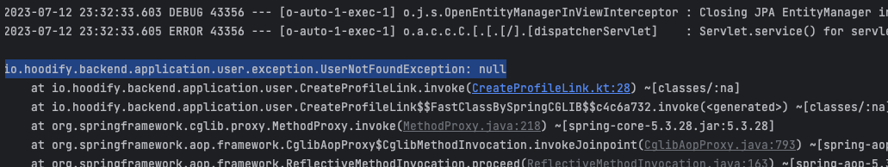
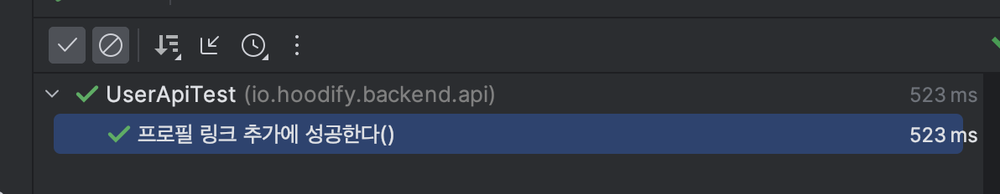

## 테스트 전략에 대한 고민

스프링 부트를 사용하여 사이드 프로젝트를 하고 있다. 나는 테스트 작성을 중요하게 생각하고, 테스트 작성을 그다지 싫어하지는 않는 편이다. 그래도 테스트 작성은 다소 지루한 작업이라는 점은 사실이기 때문에 좋은 (혹은 작성하기 즐거운) **테스트에 대한 고민**이 많았다.

[**달록**](https://github.com/woowacourse-teams/2022-dallog) 프로젝트를 할 때에는 테스트를 레이어 하나 하나 정말 꼼꼼히 작성해야한다고 생각해서, 다소 **테스트가 커버하는 범위가 겹친다고 하더라도, Acceptance Test, Service Layer Test, Domain Unit Test 모두 작성**했다. 테스트 하는 로직이 다소 겹친다고 해도, 레이어 별 테스트는 테스트의 관심사가 다르다는 생각이었다. 물론 이게 이상적인 테스트라는 생각은 변함없다. 다만 회사를 다니면서 느꼈던 점은 모든 일에는 **마감기한**이 있다는 점이다. 이번 사이드 프로젝트에서는 **생산성과 안정성 그 중간의 절묘한 합의점**을 찾고 싶었다.

고민 끝에 낸 결론은 <u>**E2E 테스트 우선으로 작성하고, 비즈니스적인 엣지 케이스를 별도의 유닛 테스트로 커버하자**</u> 라는 전략이다. 여기서 E2E 테스트라 함은 클라이언트의 HTTP 요청을 시작으로, 데이터베이스 레이어까지 내려갔다가, 클라이언트에게 HTTP 응답을 내려주는 일련의 모든 과정을 테스트 하는 것을 말한다.

그래서 이전에는 테스트 성능 문제로 사용하지 않았던 `@SpringBootTest(webEnvironment = SpringBootTest.WebEnvironment.RANDOM_PORT)` 를 이 프로젝트에서는 적극적으로 사용할 것이다. 또 **Testcontainers**를 사용해서 테스트가 실행될 때 도커로 MySQL 컨테이너까지 띄워 진정한 의미의 E2E 테스트를 실행할 수 있도록 계획하고 있다. (아직은 사용이 편해서 H2를 사용하고 있긴하다)

각설하고 이 E2E 테스트 환경을 만들어가면서 발생했던 **JPA Lazy Loading**에 대한 문제와 이를 해결한 방법에 대한 내용을 이야기해보겠다.

## 엔티티 소개

문제 상황을 이야기하기 전에 간단히 프로젝트에서 사용중인 엔티티 코드 3개를 설명한다. 코드는 엔티티 연관관계 정도만 빠르게 파악할 수 있도록 설명할 때 필요 없는 필드는 제외하고 가져왔다.

**User.kt**

```kotlin
@Entity
@Table(name = "users")
class User(
    // ...
    @OneToOne(fetch = FetchType.LAZY, cascade = [CascadeType.ALL])
    @JoinColumn(name = "profile_id")
    val profile: Profile,
) : BaseEntity()
```

**Profile.kt**

```kotlin
@Entity
class Profile(
    // ...
    @OneToMany(cascade=[CascadeType.ALL])
    @JoinColumn(name = "profile_id")
    val links: MutableList<ProfileLink> = mutableListOf(),
) : BaseEntity()
```

**ProfileLink.kt**

```kotlin
@Entity
class ProfileLink(
    // ...
)

```

`User` 가 `Profile` 을 **one-to-one** 으로 참조, `Profile` 이 `ProfileLink` 를 **one-to-many** 로 참조하고 있는 구조이다. 여기서 주목해야할 점은 **모든 fetch 전략이 지연로딩** 이라는 점이다.

> 💬 JPA를 사용할 때 one-to-many 대신 many-to-one 을 사용하는 것이 좋다라는 의견이 많은데, 내가 직접 **one-to-many 연관관계의 문제점을 겪어본 것이 아니므로 굳이 one-to-many 를 선택**했다. one-to-many 를 사용하면서 직접 그 문제를 겪어보고 싶은 마음도 있었고, 사실 내 생각엔 one-to-many가 many-to-one 보다 더 직관적인 연관관계라는 생각도 들었기 때문이다.

## 마주한 문제점

> 프로젝트는 **Kotlin + Spring Boot + Spring Data JPA** 스택을 사용하며, 테스트 프레임워크로는 **JUnit5와 Kotest**를 함께 사용하고 있으며, **WebTestClient**를 사용하여 HTTP 요청을 보낸다.

### 처음에 구상했던 테스트 코드의 모습

```kotlin
@Test
fun `프로필 링크 추가에 성공한다`() {
    // Given
    val user = userRepository.save(fixture<User>())

    // When
    val request = fixture<ProfileLinkCreateRequest>()
    val exchange = webTestClient.post()
        .uri(Uris.Users.PROFILE_LINKS, user.id)
        .bodyValue(request)
        .exchange()

    // Then
    assertSoftly {
        exchange.expectStatus().isOk
        user.profile.links shouldHaveSize 1
        user.profile.links.first().type shouldBe request.type
        user.profile.links.first().url shouldBe request.url
    }
}
```

대강 위와 같은 모습의 테스트 코드를 원했다. `Given` 절에서는 JPA Repository를 이용해서 테스트에서 사용할 **픽스쳐를 데이터베이스에 저장**한다. `When` 절에서는 WebTestClient를 사용하여 **HTTP 요청**을 보내 API를 실행한다. `Then` 절에서는 HTTP 응답에 대한 검증과, `저장`, `수정`, `제거` 등 데이터베이스를 조작한 작업이 있었다면, 직접 **데이터베이스에서 실제 의도된 변화가 이루어졌는지 검증**한다.

JPA를 꽤 사용해본 사람이라면, 위 코드의 문제점이 무엇인지 알 수 있을 것이라고 생각한다.

> 💬 참고로 테스트 격리는 별도로 @BeforeEach 를 사용해서 Database를 clean up 한다.

### Issue. Then 절에서 발생하는 LazyInitializationException

앞서 엔티티 구조를 설명하며, 모든 fetch 전략이 **지연로딩**이라는 점을 짚고 넘어갔다. 따라서 위 테스트 코드를 그대로 실행하면 아래와 같은 `LazyInitializationException` 예외를 만나게될 것이다.

```
org.hibernate.LazyInitializationException: failed to lazily initialize a collection of role: io.hoodify.backend.domain.user.model.Profile.links, could not initialize proxy - no Session
```

이유가 무엇일까? `Then` 절 시점의 `user` 는 이미 JPA의 **영속성 컨텍스트에서 준영속(detached) 상태로 전이**되었기 때문이다.

Spring Data JPA를 사용하고 있으므로 코드의 `UserRepository` 의 구현체는 `SimpleJpaRepository` 이다. `SimpleJpaRepository` 는 `CrudRepository` 를 구현하며, Spring Data JPA가 만들어서 우리에게 주입해주는 레포지토리 구현체이다. `SimpleJpaRepository` 는 내부적으로 `EntityManager`를 사용하여 JPA의 여러 기능을 추상화하여 우리에게 제공해준다.

`SimpleJpaRepository` 클래스 코드를 보면 아래와 같이 `@Transactional` 어노테이션이 붙어있는 것을 확인할 수 있다.

```kotlin
@Repository
@Transactional(readOnly = true) // 👈
public class SimpleJpaRepository<T, ID> implements JpaRepositoryImplementation<T, ID> {
  // ...
```

따라서 별도로 외부에서 트랜잭션을 설정하지 않으면, `UserRepository` 의 **메서드들은 각자 독립적인 트랜잭션에서 동작**하게 될 것이다. 그리고 **영속성 컨텍스트의 생존 범위는 일반적으로 트랜잭션 범위와 동일**하다. 즉 Repository의 **메소드가 끝나면 영속성 컨텍스트는 닫히게** 되고, 이때 가져온 엔티티는 **즉시 준영속 상태로 전이**된다.

엔티티가 준영속 상태가 되었다는 이야기는, 엔티티가 **Entity Manager의 관리 범위 밖**으로 나갔다는 이야기이며, 이는 즉 **Lazy Loading을 사용할 수 없다**는 것을 의미한다. 따라서 `Then` 절에서 `LazyInitializationException` 가 발생한 것이다.

> 💬 물론 OSIV가 true라면 영속성 컨텍스트는 View 까지 생존하지만, 문제가 발생한 곳은 테스트 코드이므로 OSIV와 상관없다.

## 해결 과정

위 문제를 여러 방법으로 해결을 시도해보았다. 이를 크게 4가지로 나누어본다.

### Solution1. 테스트 메서드를 @Transactional로 묶기

엔티티가 준영속 상태가 되어서 문제가 발생했다면, 엔티티가 영속 상태로 유지되면 되는 것 아닌가? 아주 간단하게 해결할 수 있었던 문제였다. 가벼운 마음으로 테스트 메서드에 `@Transactional` 어노테이션을 붙여보자.

```kotlin
@Test
@Transactional // 👈
fun `프로필 링크 추가에 성공한다`() {
    // ...
```

그리고 테스트를 실행해보자. 하지만 불행히도 아래와 같이 `When` 절에서 WebTestClient가 HTTP 요청을 보내자마자 `UserNotFoundException` 사용자 정의 예외가 발생했다. 분명히 `Given` 절에서 엔티티를 저장했는데, 왜 API에서는 엔티티를 찾지 못하는 문제가 발생할까?



답은 간단하다. `When` 절이 실행되는 시점에 **트랜잭션이 커밋되지 않았기 때문**이다. 어, 그런데 `When` 절도 같은 트랜잭션에 묶여 있으니 동일한 영속성 컨텍스트를 바라보고 있을 것이고, `Given` 에서 1차 캐시에 올라간 엔티티를 그대로 사용할 수 있는 것 아닌가? 언뜻 보면 `When` 절 코드가 같은 트랜잭션에 묶여 실행될 것 같지만 아쉽게도 그렇지 않다.

테스트는 `@SpringBootTest(webEnvironment = SpringBootTest.WebEnvironment.RANDOM_PORT)` 를 사용하여 실행되고 있다고 앞서 이야기했다. `RANDOM_PORT` 옵션을 사용하면 **실제 서블릿 컨테이너가 테스트와는 별개의 쓰레드에서 실행**된다. 따라서 `Given`, `Then` 절과 `When` 절 (정확히는 When절에서 실행된 다른 쓰레드의 API) 의 **트랜잭션은 물리적으로 다르다**.

따라서 `When` 절에서 실행된 API는 엔티티를 찾을 수 없다는 예외를 던지는 것이다. 아직 데이터베이스에 데이터가 커밋되지 않았기 때문이다.

### Solution2. RANDOM_PORT 대신 MOCK 사용하기

`@SpringBootTest`의 `webEnvironment = RANDOM_PORT` 설정을 포기하고 `MOCK` 을 사용하는 방법이다. 큰 문제는 예상되지 않지만 (사실 오히려 더 편하고, 성능도 좋다), 애초에 내가 처음에 계획했던 **E2E 테스트 (실제 HTTP 요청으로 시작해, HTTP 응답으로 끝나는 테스트) 의 조건**을 만족하지 않으므로 빠르게 포기했다.

### Solution3. 픽스쳐도 HTTP 요청으로 생성하기

`Given` 절도 `When` 절과 **동일하게 HTTP 요청**을 보내는 것이다. 그리고 테스트 메서드를 `@Transactional` 메소드로 묶으면, `Given`, `When`, `Then` 은 모두 **독립된 트랜잭션**에서 실행될 수 있다. 아래와 같은 느낌이다.

```kotlin
@Test
@Transactional
fun `프로필 링크 추가에 성공한다`() {
    // Given
    val userRequest = fixture<UserRegisterRequest>()
    val savedUserId = webTestClient.post()
        .uri(Uris.Users.USERS)
        .bodyValue(userRequest)
        .exchange()
        .returnResult<Map<String, String>>().run {
            // response body 로부터 생성된 엔티티 ID 꺼내오는 코드
            // ...
        }

    // When
    val profileLinkRequest = fixture<ProfileLinkCreateRequest>()
    val exchange = webTestClient.post()
        .uri(Uris.Users.PROFILE_LINKS, savedUserId)
        .bodyValue(profileLinkRequest)
        .exchange()

    // Then
    val user = userRepository.findById(savedUserId)!!
    assertSoftly {
        // ...
    }
}
```

`Given` 에서 User 엔티티를 저장하고 트랜잭션이 커밋된 이후에 `When` 절이 실행될 것이므로 엔티티를 찾을 수 없는 에러도 발생하지 않으며, `Then` 절에서도 Lazy Loading 을 마음껏 사용할 수 있다. 하지만 나는 이 방법을 선택하지 않았다.

첫번째로 **안그래도 이미 느린 테스트를 더 느리게 만들 수 있다**. 테스트 픽스쳐를 생성하는 과정까지 HTTP 요청이 발생하게 되면, 안 그래도 실제 서버를 실행해 테스트하는 `RANDOM_PORT` 특성상 이미 느린 테스트를 더 느리게 해서 개발 효율을 전반적으로 떨어트릴 수 있다.

두번째로 **테스트 코드가 프로덕션 코드에 영향**을 줄 수 있다. 나는 현재 굳이 필요성을 느끼지 않아 API의 모든 응답을 비워서 내려주고 있다. 그런데 위 형식의 테스트를 사용하기 위해서는 필연적으로 테스트 픽스쳐를 생성하는 API는 생성된 엔티티에 대한 정보를 응답으로 내려줘야한다. 테스트를 위해 프로덕션 코드를 변경하는 것은 굉장히 안티패턴이라고 생각한다.

세번째로 **엔티티를 생성하는 API가 개발되어 있지 않다면, 굳이 API를 새로 만들어야**한다. 심지어 필요 없더라도 말이다. 두번째와 비슷한 맥락의 문제점이다. 당장에는 이런 문제는 발생하지 않았지만, 필연적으로 발생할 문제라고 생각된다.

위 3가지 이유로 나는 이 방법을 선택하지 않았다.

### Solution4. Then절만 별개 트랜잭션으로 묶기

결론부터 말하자면, 이 방법을 선택하게 되었다.

내가 겪은 문제는 사실 `Then` 절에서 Lazy Loading만 가능하면 모두 해결된다. 그 이야기는, `Then` **절만 어떻게든 독립적인 트랜잭션으로 묶어 실행**하면 되는 것이다.

처음에는 `SimpleJpaRepository` 가 사용중인 Entity Manager를 가져와 트랜잭션 전파 통해 트랜잭션 경계를 더 넓게 가져갈 수 있지 않을까 하는 생각으로 여러가지를 시도했지만, 이 방법은 쉽지 않았다. 고민하던 중 아주 쉽고 명료한 해결 방법이 떠올랐다. `Then` 절만 `@Transactional` 을 사용해서 묶어버리는 것이다.

```kotlin
@Test
fun `프로필 링크 추가에 성공한다`() {
    // Given
    val user = userRepository.save(fixture<User>())

    // When
    // ...

    // Then
    `프로필 링크 추가에 성공한다 Then`(exchange, user.id, profileLinkRequest)
}

@Transactional
fun `프로필 링크 추가에 성공한다 Then`(
    exchange: ResponseSpec,
    userId: Long,
    profileLinkRequest: ProfileLinkCreateRequest,
) {
    val foundUser = userRepository.findById(userId)!!
    assertSoftly {
        // ...
    }
}
```

처음에는 위와 같은 형태를 생각했지만, 결론적으로 이는 불가능하다. `@Transactional` 은 스프링 **AOP 기반**으로 동작하기 때문에 **같은 클래스 내부의 함수를 호출한 경우 트랜잭션이 정상적으로 동작하지 않을 수** 있다. 이에 관련한 글은 별도로 작성해보겠다.

설령 위 방법이 가능하다고 하더라도, `Then` 절 마다 새로운 메소드를 만들고, 파라미터를 넘겨주는 일은 보통 번거로운 일은 아닐것이다.

같은 클래스 메소드간 호출이 불가능하다면, **클래스를 별개**로 만들면 된다. 물론 `Then` 절 전용 클래스를 만들어서 위 예제처럼 `프로필 링크 추가에 성공한다 Then()` 이런 메소드를 테스트 코드마다 만드는 방법도 있겠지만, 생각만해도 별로다.

나는 이를 **람다**를 사용해서 일반화하여 해결하였다.

```kotlin
@Component
class Transaction {
    @Transactional
    operator fun <T> invoke(functionInTransaction: () -> T?): T? {
        return functionInTransaction()
    }
}
```

위와 같이 `Transaction` 이라는 Bean 을 만들고, 람다를 받아 그냥 그대로 실행해주는 `invoke()` 메소드를 만들었다.

```kotlin
@Test
fun `프로필 링크 추가에 성공한다`() {
    // Given
    val user = userRepository.save(fixture<User>())

    // When
    // ...

    // Then
    transaction { // 👈
        val foundUser = userRepository.findAll().first()
        assertSoftly {
            exchange.expectStatus().isOk
            foundUser.profile.links shouldHaveSize 1
            foundUser.profile.links.first().type shouldBe request.type
            foundUser.profile.links.first().url shouldBe request.url
        }
    }
}
```

그리고 이 `Transaction` 을 위와 같이 `Then` 절에서 사용하면, 정말 간편하게 `Then` 절의 트랜잭션만 따로 분리해낼 수 있다.



드디어 아무런 문제 없이 테스트가 정상적으로 통과하는 모습을 볼 수 있다. `LazyInitializationException` 도 `UserNotFoundException` 도 발생하지 않는다.

> 💡 코틀린에서는 `invoke()` 메소드를 정의하면, 클래스를 메소드처럼 축약하여 호출하는 것이 가능해진다. `invoke()` 만 제외한다면, 비교적 가독성은 떨어지겠지만 자바에서도 동일하게 구현이 가능할 것이다.

### 마치며

오랜만에 즐거운 트러블 슈팅을 했던 것 같다. 끝내 새벽 2시를 넘겨도 해결하지 못해 체념한채로 잠자리에 들려고 누운 순간 해결방법이 떠올라서, 다시 곧바로 일어나 코드를 작성했고 끝내 성공했다. 오랜만에 코딩하면서 크게 설렜던 것 같다.

JPA 연관관계 맵핑을 사용해본 것도 오랜만이라서, 공부했던 개념들이 흐릿해져서 고생을 좀 했다. 그래도 스프링 트랜잭션과 JPA 영속성 컨텍스트에 대해 더 확실히 알게된 경험이었다.
