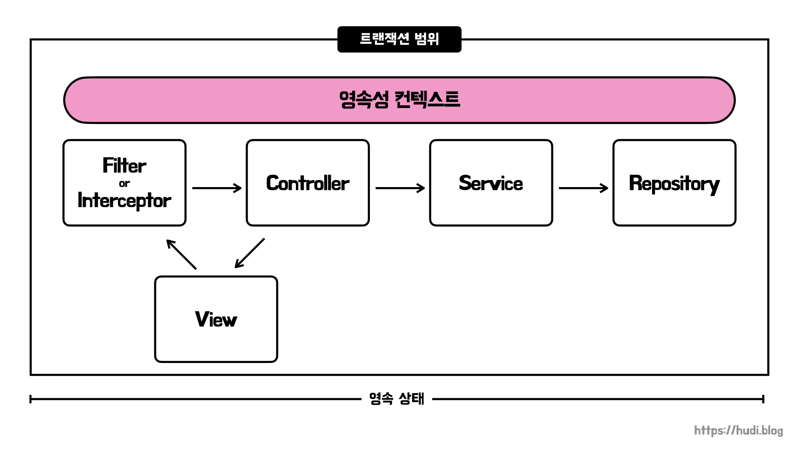
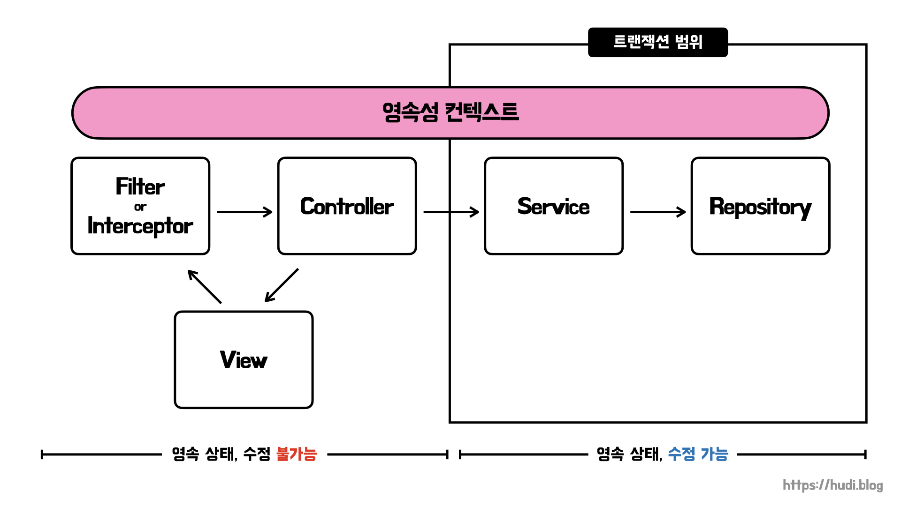
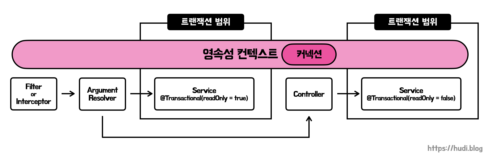
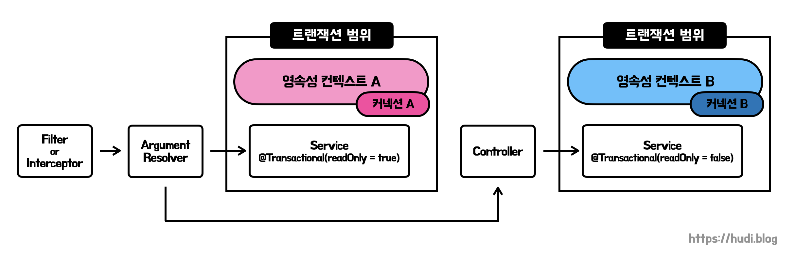

> 이 글은 우아한테크코스 4기 [달록팀의 기술 블로그](https://dallog.github.io/multi-datasource-issue-with-osiv)에 게시된 글 입니다.

## 🤢 문제 상황

며칠전 저는 **[데이터베이스 레플리케이션을 통한 쿼리 성능 개선 (feat. Mysql, SpringBoot)](https://hudi.blog/database-replication-with-springboot-and-mysql/)** 포스팅에서 MySQL과 스프링부트 환경에서 레플리케이션을 적용하는 방법에 대해 다뤄보았습니다. DB 레플리케이션을 적용하여 읽기 성능을 향상시키기 위해서는 스프링부트에서 다수의 DataSource를 설정하고, 트랜잭션의 `readOnly` 옵션에 따라 DataSource를 잘 분기하는 것이 중요합니다.

포스팅을 작성할 때에는 새로운 프로젝트를 만들어 학습을 진행하였으므로 큰 문제없이 레플리케이션 적용에 성공하였습니다. 문제는 달록에 이를 적용할 때 발생하였습니다. **분명 서비스 메소드의 트랜잭션 옵션을** `readOnly = false` **로 설정했는데, 읽기 전용 데이터베이스(replica)로 쿼리가 날아갔습니다**. 제대로 DataSource가 라우팅되지 않고 있는 상황이었죠. 대체 무엇이 문제였을까요?

## 💡 실마리 발견

### 로그인 상태에서만 발생하는 문제

이것저것 시도해보다 이상한 점을 발견했습니다. 카테고리를 생성하거나, 일정을 생성하는 등 로그인 된 상태에서는 DataSource 분기가 제대로 이뤄지지 않았습니다. 서비스 메소드 `@Transactional` 어노테이션에 무슨 설정을 해도, 항상 DataSource는 `readOnly` 가 `true` 일때 선택되는 replica DB 였습니다. 하지만, **회원을 생성하는 로직에서는 이상하게 쓰기 전용(source) DB에 대한 DataSource가 정상적으로 선택**되었습니다.

### 트랜잭션을 사용하는 HandlerMethodArgumentResolver

달록은 스프링이 제공하는 `HandlerMethodArgumentResolver` 를 사용하여, Access Token 으로부터 member id를 꺼내오고, 회원의 실제 존재여부를 검증한 뒤, Controller의 파라미터에 member id를 담고있는 `LoginMember` 라는 DTO를 전달합니다. 그리고 이 로직은 로그인이 된 상태에서 호출되는 API에서만 동작하죠. 즉, 회원가입 로직에서는 실행될 필요가 없는 로직입니다.

아래는 `AuthenticationPrincipalArgumentResolver` 의 코드 일부입니다.

```java
@Component
public class AuthenticationPrincipalArgumentResolver implements HandlerMethodArgumentResolver {

    // ...

    @Override
    public Object resolveArgument(final MethodParameter parameter, final ModelAndViewContainer mavContainer,
                                  final NativeWebRequest webRequest, final WebDataBinderFactory binderFactory) {
        // ...

        Long id = authService.extractMemberId(accessToken);
        // AuthService 메소드 호출

        return new LoginMember(id);
    }
}
```

위 코드를 보시다시피 `AuthenticationPrincipalArgumentResolver` 는 `AuthService` 의 `extractMemberId()` 메소드를 사용합니다. `extractMemberId()` 에서 위에서 이야기한 member id 추출, 회원 존재 여부 검증, `LoginMember` 생성등을 진행합니다. 아래와 같이 말이죠.

```java
/* AuthService 클래스 코드 */

@Transactional(readOnly = true) // 실제로는 클래스에 선언되어 있습니다.
public Long extractMemberId(final String accessToken) {
    Long memberId = tokenCreator.extractPayload(accessToken);
    memberRepository.validateExistsById(memberId);
    return memberId;
}
```

즉, `AuthenticationPrincipalArgumentResolver` 의 코드는 트랜잭션을 사용합니다. 그리고 여러 시행착오 끝에 `AuthService.extractMemberId()` 메소드 트랜잭션의 `readOnly` 옵션에 따라 선택된 DataSource가 다른 트랜잭션에서도 그대로 사용되는 것을 알아냈습니다.

실제로 `extractMemberId()` 메소드 트랜잭션의 `readOnly` 를 `false` 로 설정하니 이후 트랜잭션에서도 replica DB 대신 source DB로 쿼리를 날리는 것을 확인했습니다.

## 🤔 트랜잭션 전파 때문인가…?

처음에는 `AuthService.extractMemberId()` 와 그 이후에 실행되는 서비스 메소드간 트랜잭션 전파가 발생하여 DataSource 라우팅이 발생하지 않는다고 추측했습니다. 하지만 이상합니다. 분명 저는 컨트롤러 레이어에서는 트랜잭션 전파가 발생하지 않는다고 알고 있었기 때문입니다.

하지만 그래도 혹시나 하는 마음에서 트랜잭션 전파 옵션을 `REQUIRES_NEW` 로 설정해보았습니다. 트랜잭션 전파 옵션을 `REQUIRES_NEW` 로 설정하면, 앞에서 이미 시작한 트랜잭션이 있든 없든 상관없이 항상 새로운 트랜잭션을 만듭니다.

```java
@Transactional(propagation = Propagation.REQUIRES_NEW)
```

기대와 달리 위와 같이 트랜잭션 전파 옵션을 변경하더라도 DataSource 라우팅이 정상적으로 동작하지 않았습니다. 즉, 컨트롤러 메소드에서 서비스 메소드의 트랜잭션 간 전파가 발생한 문제는 아니었던 것입니다.

## 🧵 원인은 OSIV(open session in view)

삽질 방향을 계속 스프링이 트랜잭션을 관리하는 방법에 초점을 맞추다보니 전혀 문제 해결에 대한 감을 잡지 못했습니다. 끝내 문제를 해결하지 못하고, 같은 우테코 크루인 루키에게 도움을 요청했습니다. 루키는 문제를 보자마자 단번에 **OSIV(open session in view) 문제**라는 것을 발견하였습니다. (루키 땡큐 🙏)

그렇다면, 대체 OSIV가 무엇이고 왜 이런 문제의 원인이 되었을까요? OSIV는 JPA에서 사용되는 개념으로 **영속성 컨텍스트를 뷰와 컨트롤러 즉 프레젠테이션 레이어까지 열어둔다**는 의미입니다. 그렇다면 왜 JPA는 컨트롤러 까지 영속성 컨텍스트를 열어둘까요? 바로 **지연 로딩(lazy loading)을 사용하기 위함**입니다.

OSIV가 활성화되어 있다면, 서비스 계층에서 컨트롤러 계층으로 직접 엔티티를 반환하더라도, 컨트롤러에서 지연 로딩을 통해 내부 필드를 읽어올 수 있습니다. 달록은 서비스 계층에서 무조건 DTO를 반환하여 엔티티나 도메인을 프레젠테이션 레이어까지 노출하지 않도록 규칙을 정해두어 한번도 OSIV를 사용해볼 일이 없었는데요. 그래서 저도 이번에 처음 알게된 개념입니다 😮

### 요청 당 트랜잭션 방식의 OSIV



과거에 사용된 OSIV 방식입니다. 서블릿 필터 혹은 스프링 인터셉터에서 영속성 컨텍스트와 트랜잭션을 생성하고, 요청의 처음부터 끝까지 유지하는 방식입니다. 유저의 요청 내내 영속성 컨텍스트가 살아있으므로, 엔티티도 영속상태를 끝까지 유지합니다. 즉, 지연 로딩을 사용할 수 있죠.

하지만 이 방식에는 문제점이 존재합니다. 영속성 컨텍스트가 컨트롤러와 뷰에서까지 유지되면, 엔티티도 영속상태를 유지한다고 했었죠. 이 상황에서 트랜잭션까지 함께 유지되다 보니 엔티티를 뷰나 컨트롤러에서 변경할 수 있게 됩니다.

유저의 이름을 `***` 으로 가려서 클라이언트에게 보내줘야할 상황을 가정해봅시다. 컨트롤러는 아래와 같이 서비스 계층에서 전달받은 `Member` 엔티티를 수정합니다.

```java
class MemberController {

    public ResponseEnttiy<Member> findMember(final Long id) {
        // ...
        member.setName("***");
        // ...
    }
}
```

여기서 문제가 발생합니다. 요청 당 트랜잭션 방식의 OSIV는 뷰가 렌더링되면, 트랜잭션을 커밋합니다. 즉, 위 코드에서는 트랜잭션이 커밋되고, 영속성 컨텍스트가 플러시 되는데, JPA의 더티 체킹(dirty checking)으로 인해 `setName()` 메서드를 사용해 수정된 엔티티 내용이 실제 DB에 반영되게 됩니다. 정말 심각한 문제죠.

따라서 (1) 엔티티 자체를 읽기전용 인터페이스로 제공하거나, (2) 엔티티를 한번 래핑하여 반환하거나, (3) DTO로 변환하여 반환하는 방법등으로 해결해야합니다. 이런 문제점으로 인하여 최근에는 요청 당 트랜잭션 방식의 OSIV 방식은 거의 사용되지 않는다고 합니다.

### 스프링 OSIV

그렇다면 최근에 사용되는 OSIV 방식은 무엇일까요? 바로 스프링 프레임워크에서 제공하는 스프링 OSIV입니다. 요청 당 트랜잭션 OSIV 방식의 가장 큰 문제점은 뷰나 컨트롤러 즉, 프레젠테이션 계층에서 엔티티를 수정할 수 있다는 문제점입니다.

스프링 프레임워크가 제공하는 OSIV 방식은 무엇이 다를까요? 스프링 OSIV는 트랜잭션을 비즈니스 계층까지만 사용한다는 것 입니다. 아래 그림을 살펴볼까요?



중요한 것은 위 구조로 인해 프레젠테이션 레이어에서 더이상 엔티티를 수정할 수 없도록 개선이 되었다는 점 입니다.

## 😡 그래서 왜 OSIV가 문제인데?

이렇게 OSIV에 대해 구구절절 알아보았는데요, 그래서 결국 왜 OSIV가 DataSource 라우팅이 안되는 이슈의 원인이었을까요? 위에서 이야기했듯 OSIV를 사용하면 영속성 컨텍스트가 API 요청 내내 유지되는 것을 확인할 수 있죠.

영속성 컨텍스트는 `EntityManager` 를 생성할 때 하나가 생성됩니다. 그리고 `EntityManager` 는 데이터베이스 연결이 필요한 시점에 커넥션을 획득해옵니다. 이때 커넥션 풀에서 커넥션을 획득해오니, `DataSource` 를 사용하겠죠?

문제는 여기서 발생합니다. 저희가 `AbstractRoutingDataSource` 를 사용한 목적은 서비스 메소드마다 다른 `DataSource` 를 사용해서 다른 커넥션을 획득하기 위함이었습니다. 하지만 OSIV 덕에 영속성 컨텍스트는 프레젠테이션 레이어까지 유지되고, 한번 커넥션을 얻어온 `EntityManager` 는 또 다시 커넥션을 얻으려하지 않습니다. 즉, `AbstractRoutingDataSource` 를 통한 라우팅이 발생하지 않습니다. 애초에 새로운 커넥션을 가져올 필요가 없으니까요. 더 자세히 알아볼까요?



로그인 된 사용자만 호출할 수 있는 API는 `HandlerMethodArgumentResolver` 에서 `AuthService` 를 호출하는 과정이 추가된다고 말씀드렸죠. 실제 비즈니스 로직은 그 이후에 실행됩니다. 즉, 두번의 트랜잭션이 실행되는 것이죠. 그런데 OSIV가 활성화된 상태에서는 이 두 트랜잭션이 같은 영속성 컨텍스트에서 실행됩니다.

`HandlerMethodArgumentResolver` 가 `AuthService` 를 호출한 시점에서 이미 영속성 컨텍스트는 커넥션을 획득한 상태입니다. 따라서 이후 컨트롤러가 다른 서비스를 실행할 시점의 영속성 컨텍스트는 다시 커넥션을 획득할 필요가 없습니다. 당연히 이미 가지고 있으니까요.

**영속성 컨텍스트도 한번 생성**하고, 따라서 **커넥션을 한번만 획득**하기 때문에, `DataSource` **의 선택도 Filter/Interceptor가 호출되는 시점에 단 한번** 이루어집니다. 즉, `DataSource`의 분기가 정상적으로 이루어지지 않습니다.



반면, OSIV를 비활성화하면 영속성 컨텍스트의 생존 범위는 트랜잭션 시작부터 종료까지로 좁혀집니다. 즉, 트랜잭션이 시작될 때 영속성 컨텍스트가 실행되고, 트랜잭션이 끝날 때 까지 유지됩니다. 즉, **영속성 컨텍스트가 여러번 생성**되고, **커넥션도 여러번 획득**하고, 따라서 `DataSource` 도 **개별 트랜잭션마다 선택**됩니다. 즉, `DataSource` 의 분기가 정상적으로 이루어집니다.

그렇다면 OSIV는 어떻게 비활성화 할까요? 아래와 같이 `application.yml` 에서 `open-in-view` 를 `false` 로 설정하면 됩니다. 더이상 OSIV를 사용하지 않겠다는 뜻이죠.

```yaml
spring:
  jpa:
    open-in-view: false
```

설정을 이렇게 변경하고, 다시 테스트해보면 이제 DataSource 라우팅이 정상적으로 동작합니다!

## 마치며

DataSource 라우팅이 이렇게 오래 걸릴 태스크가 아니라고 생각했는데 많이 얕봤던 것 같습니다. 특히, 이번 태스크를 진행하며 사용하는 프레임워크나 라이브러리에 대한 깊은 이해가 얼마나 중요한지 다시금 상기하게 되었습니다. 저는 OSIV라는 키워드 자체를 알지 못하고 있었거든요. 그래서 전혀 해결의 실마리를 잡지 못하고 있었습니다. JPA를 깊게 이해하고 있던 루키가 아니었다면, 아마 DB 레플리케이션을 포기했을지도 모릅니다 😅

## 참고

- 자바 ORM 표준 JPA 프로그래밍, 김영한
- [https://incheol-jung.gitbook.io/docs/study/jpa/3](https://incheol-jung.gitbook.io/docs/study/jpa/3)
- [https://github.com/woowacourse-teams/2021-nolto/issues/700](https://github.com/woowacourse-teams/2021-nolto/issues/700)
- [https://github.com/woowacourse-teams/2021-gpu-is-mine/issues/399](https://github.com/woowacourse-teams/2021-gpu-is-mine/issues/399)
