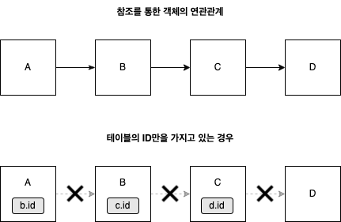

우아한테크코스 백엔드 과정에서 데이터베이스를 사용하는 어플리케이션을 개발하며 **'이건 객체지향적인 설계가 아닌 것 같은데?'** 라는 생각을 자주 해왔다. Repository 와 DAO 를 통해, 데이터베이스에서 데이터를 가져와 데이터를 조립하는 작업을 가상의 컬렉션에서 객체를 꺼내오듯이 추상화하였지만, 여전히 고민은 계속되었다. (의도한 것은 아니었지만, 우테코 리뷰어분은 내 코드를 보고 ORM과 비슷하게 설계하려 한것 같아 인상깊다고 말씀해주셨다)

여전히 객체간 순환참조 문제가 발생하였고, 테이블의 데이터를 객체로 조립(SQL 매핑)하는 코드를 작성하는데 많은 시간을 사용하였다. 최근 김영한님의 강의를 들으며 JPA를 공부하면서 이런 고민들이 정말 자연스러운 고민이고, 선배 개발자들도 많이 해온 고민이라는 것을 알게되었다. 내가 그간 ORM 없이 객체지향스럽게 코드를 작성하려고 노력하는 과정 속에서 느꼈던 점을 김영한님의 강의 내용과 함께 정리해보려 한다.

## 패러다임의 불일치

우리가 가장 많이 사용하는 프로그래밍 패러다임은 단연 객체지향이다. 내가 최근 공부하고 있는 언어인 자바도 객체지향 언어이다. 그리고 우리가 가장 많이 사용하는 데이터베이스는 관계형 데이터베이스이다. MySQL, MariaDB, Oracle 등 잘나가는 DBMS이 대부분 관계형 데이터베이스이다. 김영한님의 표현을 빌리자면 **지금 시대는 객체를 관계형 데이터베이스에 저장하고 관리하는 시대**이다.

이런 패러다임의 불일치로 인한 SQL 중심적인 개발은 많은 문제점을 낳았다.

## SQL 중심적인 개발의 문제점

### 반복적인 객체-테이블 매핑과 CRUD

객체지향, 관계형 데이터베이스 패러다임의 불일치로 인해 우리는 추가적인 작업을 해야한다. **객체를 관계형 데이터베이스에 저장하고 꺼내오기 위해서는 객체를 테이블로, 테이블을 객체로 매핑하는 작업**이다. 이런 매핑 작업은 크게 의미있지도 않고, 시간도 오래 걸리고, 지루하다. 또한 **테이블 구조가 변경되면, 코드의 모든 SQL문을 변경된 테이블 구조에 맞게 수정**해야한다.

그리고 흔히 CRUD 라고 말하는 기능은 일반적으로 거의 모든 테이블에서 필요할 것 이다. **100개의 테이블이 존재한다면, 100개의 CRUD 코드가 필요할 것 이다.** 이런 단순 반복 노동은 정말 재미가 없다.

이런 상황에서 개발자는 비즈니스 로직보다 SQL 매핑 작업에 더 많은 시간을 할애해야할 수도 있다. 자칫하면 걸어다니는 SQL 매퍼가 될수도 있다.

### 객체 그래프 탐색의 어려움


객체지향에서 객체간의 연관관계는 참조를 통해 맺어지고, 관계형 데이터베이스에서 테이블간의 연관관계는 외래키로 맺어진다. SQL 중심으로 코드를 작성하면, 객체의 구조를 테이블에 맞춰야 한다. A1가 A2를 참조하는 형태가 아니라, A1가 A2의 식별자(ID값 등)를 가지고 있는 형태로 객체를 모델링 해야한다.



객체는 자유롭게 객체 그래프를 탐색해야하지만, 테이블 행의 ID를 통한 간접 참조는 이를 불가능하게 한다. 물론 Join 쿼리등을 사용하여 객체가 객체를 참조하는 모양으로 객체를 생성할수는 있겠으나, 쉽지 않다. 즉, 객체간 참조를 통한 연관관계 설정이 어렵다

### 모든 객체를 미리 로딩할 수 없다.

맨 위의 그림에서 A1 객체를 데이터베이스로부터 가져오기 위해서는 A1, B2, B1, A2 테이블을 모두 Join 한 다음 A2 객체를 생성해 B1 객체에 넣어주고, B1 객체는 B2 객체에, B2 객체는 A1 객체에 넣는 과정이 필요하다.

```sql
SELECT * FROM A1
JOIN B2 ON A1.b2Id = B2.id
JOIN B1 ON B2.b1Id = B1.id
JOIN A2 ON B1.a2Id = A2.id
```

객체의 연관관계가 많아질수록 DAO의 쿼리문 또한 계속해서 비대해질 것 이고, 유지보수가 어려워질 것 이다. 또한 성능상으로도 손해일 것 이다. 따라서 필요한 데이터만 조회하는 메서드를 만들어야하는데, 이 또한 유지보수성이 좋지 않다.

```java
a1Dao.getB2();
a1Dao.getB2WithB1();
a1Dao.getB2WithB1WithA2();
...
```

### 진정한 의미의 계층 분할이 어렵다

실제 객체간의 연관관계와 상관없이, 쿼리문에 따라 객체 그래프의 탐색 범위가 제한된다. 실제 객체 그래프와 관련 없이, **실제 쿼리문이 어떤 테이블을 가져오느냐에 따라 탐색할 수 있는 범위는 제한**된다. 이런 문제는 아래의 문제를 낳는다. 코드를 살펴보자.

```java
User user = userDao.find(userId);
user.getOrder(); // 어떤 값일까?
user.getAddress().getZipCode(); // NPE가 발생하진 않을까?
```

위 코드를 안전하게 사용하려면, `getAddress` 를 호출하는 개발자가 `userDao.find()` 가 내부적으로 `Address` 테이블과 Join 하여 쿼리를 하는지 확인해야한다. `Address` 테이블과 Join 하지 않는다면, `user.getAddress()` 의 반환값은 `null` 일 것 이다. 즉, **엔티티를 신뢰할 수 없는 문제**가 발생한다.

레이어드 아키텍처에서는 **다른 레이어가 정상적으로 동작한다는 신뢰**가 있어야 한다. 하지만, 위와 같이 신뢰가 깨져버린 상황에서는 **비즈니스 레이어에서 영속 레이어의 내부 구현을 알고있어야 한다**. 따라서 **진정한 의미의 계층 분할이 어렵다**.

## ORM의 등장

객체를 데이터베이스에 저장하고 관리하는 것이 컬렉션을 사용하는 것 처럼 간단하면 얼마나 좋을까? DB작업을 객체를 컬렉션에 저장하는 것 처럼 추상화 하기 위해, 객체지향과 관계형 데이터베이스간의 패러다임 불일치를 해결하고, SQL 중심적인 개발에서 벗어나 객체 중심으로 개발하기 위해 **ORM (Object Relational Mapping)** 이라는 기술이 등장하였다. 그리고 자바 진영에서는 **JPA**라는 ORM 기술 표준이 존재한다.

ORM과 JPA에 대해서 이후 포스팅에서 중점적으로 다뤄볼 예정이다.
