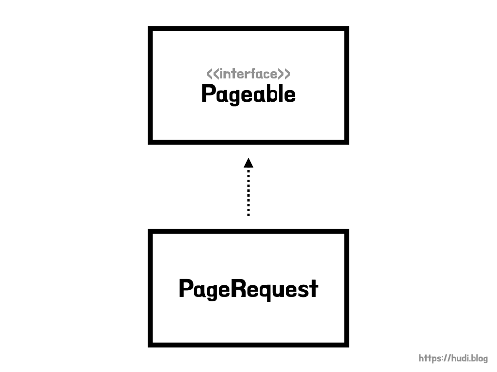
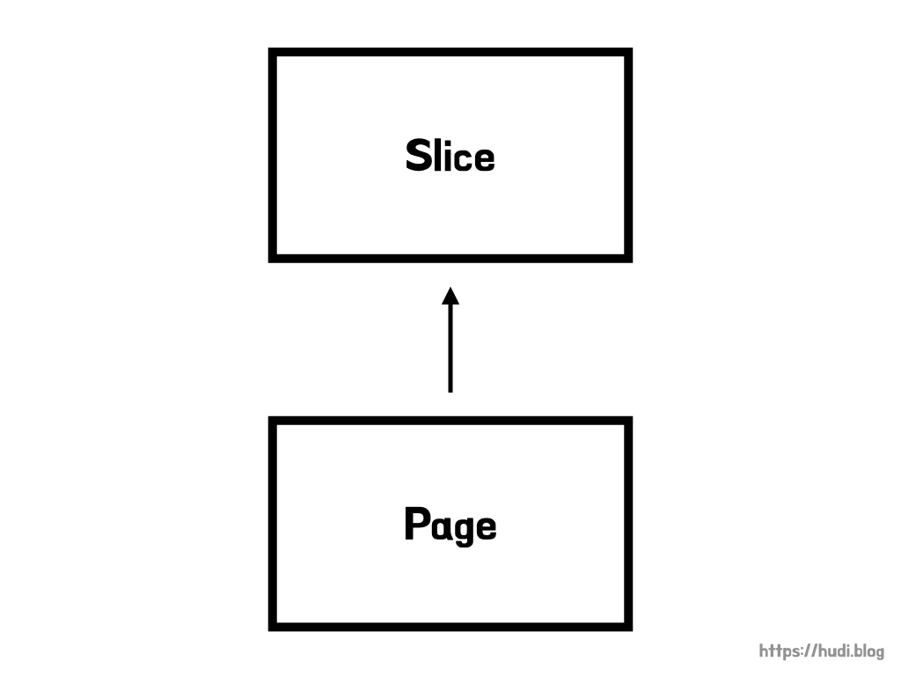

## 페이지네이션 (Pagination)

사용자가 요청했을 때 데이터베이스에 있는 수천, 수만, 수백만 줄의 데이터를 모두 조회하여 제공한다면 서버의 부하가 굉장히 클 것이다. 이를 방지하기 위해서 대부분의 서비스에서는 데이터를 일정 길이로 잘라 그 일부분만을 사용자에게 제공하는 방식을 사용한다. 사용자는 현재 보고 있는 데이터의 다음, 이전 구간 혹은 특정 구간의 데이터를 요청하고, 전달한 구간에 해당하는 데이터를 제공받는다.

페이지네이션이 적용된 예시로는 페이스북, 인스타그램 등의 소셜미디어, 혹은 네이버 카페의 게시물 목록 조회 등이 있겠다. 이 포스트에서는 Spring Data JPA를 통해 어떻게 페이지네이션을 구현할 수 있는지 알아본다.

## 순수 JPA의 페이지네이션

DB 벤더별로 페이지네이션을 처리하기 위한 쿼리는 천차만별이다. 예를 들어 MySQL에서는 `offset` , `limit` 으로 상대적으로 간단히 처리가 가능하지만, Oracle의 경우 상당히 복잡하다. JPA는 이런 여러 **DB 벤더별 방언(dialect)을** 추상화하여 하나의 방법으로 페이지네이션을 구현할 수 있도록 제공해준다.

```java
List<Item> items = entityManager.createQuery("select i from Item i", Item.class)
                    .setFirstResult(0)
                    .setMaxResults(10)
                    .getResultList();
```

`setFirstResult()` 는 결과를 조회해올 시작 지점을 지정한다. MySQL로 따지면 `offset` 이다. `setMaxResults()` 는 조회해올 최대 데이터 수를 지정한다. MySQL로 따지면 `limit` 이다.

이렇게 JPA가 추상화를 해준 덕분에 **DB 벤더 상관없이 페이지네이션을 구현**할 수 있게 되었다.

## Spring Data JPA가 제공하는 페이지네이션

사실 JPA로 페이지네이션 기능을 구현하는 작업은 생각보다 까다롭다. **전체 데이터 개수**를 가져와서 전체 페이지를 계산해야하고, 현재 페이지가 **첫번째 페이지인지**, **마지막 페이지인지**도 계산해야하고, 예상치 못한 페이지 범위를 요청받았을 때 **예외처리**도 해야한다. 이것을 `setFirstResult()` 와 `setMaxResults()` 로만 구현하기에는 어렵지는 않지만, **번거롭고 불편**하다.

Spring Data JPA은 이런 **페이지네이션도 추상화**되어 있다. 페이지 크기와 페이지 순서만 전달하면, 데이터베이스에서 해당 페이지에 해당하는 데이터만 가져올 수 있다.

## Pageable과 PageRequest



`Pageable` 과 `PageRequest` 는 Spring Data에서 제공하는 페이지네이션 정보를 담기 위한 인터페이스와 구현체이다. 페이지 번호와 단일 페이지의 개수를 담을 수 있다.

이를 Spring Data JPA 레포지토리의 파라미터로 전달하여, 반환되는 엔티티의 컬렉션에 대해 페이징할 수 있다.

### PageRequest 생성

아래와 같이 정적 팩토리 메소드를 사용하여 `PageRequest` 를 생성할 수 있다.

```java
PageRequest page = PageRequest.of(0, 10);
```

이때 첫번째 파라미터는 페이지 순서이고, 두번째 파라미터는 단일 페이지의 크기를 의미한다. 또한 페이지 순서는 0부터 시작함에 유의하자.

### Pageable의 ofSize() 스태틱 메소드

`Pageable` 인터페이스는 `ofSize()` 라는 스태틱 메소드를 제공한다. 이 메소드를 사용하면 아래와 같이, `PageRequest` 를 생성할 수 있다. 단, **페이지 번호는 0으로 고정**되고 페이지 사이즈만 설정할 수 있다.

```java
Pageable.ofSize(10);
```

### 조회 결과 정렬

아래와 같이 `Sort` 클래스 혹은 `Sort` 의 내부 enum 클래스인 `Direction` 을 사용하여 정렬을 설정할수도 있다. 정렬 방향을 지정하는 방법은 아래와 같이 다양하다.

```java
PageRequest.of(0, 10, Sort.by("price").descending());
PageRequest.of(0, 10, Sort.by(Direction.DESC, "price"));
PageRequest.of(0, 10, Sort.by(Order.desc("price")));
PageRequest.of(0, 10, Direction.DESC, "price");
```

`PageRequest.of()` 의 세번째 인자로 `Sort` 혹은 `Direction` 을 전달하면 된다. 전달된 `"price"` 는 정렬 기준이 되는 컬럼 이름이다. 위 코드는 모두 내림차순으로 정렬된 결과를 받아올 때 사용한다.

## Slice와 Page



Spring Data JPA 레포지토리에 `Pageable` 을 전달하면, 반환 타입으로 `Slice` 혹은 `Page` 를 받을 수 있다. 두 인터페이스 모두 페이지네이션을 통한 **조회 결과를 저장**하는 역할을 한다. 또한 `Page` 는 `Slice` 를 **상속**받는다.

## Slice

전체 페이지 개수를 알아내기 위해서는 `전체 데이터 개수 / 단일 페이지의 크기` 로 계산해야한다. 즉, **전체 데이터 개수**가 필요하다. 전체 데이터 개수를 알아내기 위해서는 **count 쿼리**를 실행해야한다. 반대로 전체 페이지 개수가 굳이 필요 없는 경우에는 count 쿼리를 굳이 실행할 필요가 없을 것이다.

`Slice` 는 별도로 **count 쿼리를 실행하지 않는다**. 따라서 전체 페이지의 개수와 전체 엔티티의 개수를 알 수 없지만, **불필요한 count 쿼리로 인한 성능 낭비는 발생하지 않는다**.

최근 모바일 UI에서 많이 사용되는 **무한 스크롤**을 구현할 때에는 전체 페이지 개수가 굳이 필요하지 않다. 다음 페이지의 유무만 판단하고, 있다면 다음 페이지를 불러오기만 하면 되기 때문이다. 이런 기능을 구현할 때 `Slice` 를 사용하면 적합하다.

### Slice 내부 코드

`Slice` 인터페이스에는 아래와 같은 여러 메소드들이 정의되어 있다.

```java
public interface Slice<T> extends Streamable<T> {

	int getNumber(); // 현재 Slice 번호를 반환

	int getSize(); // 현재 Slice 크기를 반환

	int getNumberOfElements(); // 현재 Slice가 가지고 있는 엔티티의 개수 반환

	List<T> getContent(); // 엔티티 목록을 List로 반환

	boolean hasContent(); // 엔티티 목록을 가지고 있는지 여부를 반환

	Sort getSort(); // Slice의 Sort 객체를 반환

	boolean isFirst(); // 현재 Slice가 첫번째인지 여부를 반환

	boolean isLast(); // 현재 Slice가 첫번째인지 여부를 반환

	boolean hasNext(); // 다음 Slice의 존재 유무를 반환

	boolean hasPrevious(); // 이전 Slice의 존재 유무를 반환

	default Pageable getPageable() {
		return PageRequest.of(getNumber(), getSize(), getSort());
	} // (디폴트 메소드) 현재 Slice에 대한 Pageable을 생성해서 반환

	Pageable nextPageable(); // 다음 Pageable을 반환

	Pageable previousPageable(); // 이전 Pageable을 반환

	<U> Slice<U> map(Function<? super T, ? extends U> converter);
	// Slice 내의 엔티티를 다른 객체로 매핑

	default Pageable nextOrLastPageable() {
		return hasNext() ? nextPageable() : getPageable();
	} // (디폴트 메소드) 다음 Slice가 있다면 다음 Pageable을, 현재 Slice가 마지막이면 현재 Pageable을 반환

	default Pageable previousOrFirstPageable() {
		return hasPrevious() ? previousPageable() : getPageable();
	} // (디폴트 메소드) 이전 Slice가 있다면 이전 Pageable을, 현재 Slice가 첫번째면 현재 Pageable을 반환
}
```

### Slice 사용하기

Spring Data JPA 레포지토리에서 메서드의 반환 타입을 `Slice` 로 지정하고, 파라미터로 `Pageable` 을 받기만하면, 손쉽게 `Slice` 를 반환 받아 사용할 수 있다.

```java
@ToString
@NoArgsConstructor
@Getter
@Entity
public class Item {

    @Id
    @GeneratedValue
    private Long id;

    private String name;

    private int price;

    public Item(final String name, final int price) {
        this.name = name;
        this.price = price;
    }
}
```

예제로 사용될 `Item` 엔티티의 코드는 위와 같다.

```java
public interface ItemRepository extends JpaRepository<Item, Long> {

    Slice<Item> findSliceByPrice(int price, Pageable pageable);
}
```

위 코드는 `ItemRepository` 코드이다.

```java
for (int i = 1; i <= 40; i++) {
    itemRepository.save(new Item("상품" + i, 5000));
}

Slice<Item> itemSlice = itemRepository.findSliceByPrice(5000, PageRequest.of(0, 5));

for (Item item : itemSlice.getContent()) {
    System.out.println(item.getName());
}
```

위 코드의 결과는 아래와 같다.

```
상품1
상품2
상품3
상품4
상품5
```

## Page

`Page` 는 `Slice` 와 다르게 **count 쿼리를 실행**하여, 전체 데이터 개수와 전체 페이지 개수를 계산할 수 있다. 따라서 우리가 흔히 볼 수 있는 **게시판의 페이지네이션 UI** 등을 구현할 때 적합하다.

### Page 내부 코드

```java
public interface Page<T> extends Slice<T> {

	static <T> Page<T> empty() {
		return empty(Pageable.unpaged());
	} // 빈 페이지를 생성해 반환

	static <T> Page<T> empty(Pageable pageable) {
		return new PageImpl<>(Collections.emptyList(), pageable, 0);
	} // Pageable을 받아 빈 페이지를 생성하고 반환

	int getTotalPages(); // 전체 페이지 개수를 반환

	long getTotalElements(); // 전체 엔티티 개수를 반환

	<U> Page<U> map(Function<? super T, ? extends U> converter);
}
```

이야기한 것 처럼 `Slice` 를 상속하였으며, `getTotalPages()` 로 전체 페이지 개수를, `getTotalElements()` 로 전체 데이터 개수를 반환 받을 수 있다.

### Page 사용하기

```java
public interface ItemRepository extends JpaRepository<Item, Long> {
		// ...
    Page<Item> findPageByPrice(int price, Pageable pageable);
}
```

위와 같이 `Page` 가 반환 타입인 메소드를 `ItemRepository` 에 추가해주었다.

```java
for (int i = 1; i <= 40; i++) {
    itemRepository.save(new Item("상품" + i, 5000));
}

Page<Item> itemPage = itemRepository.findPageByPrice(5000, PageRequest.of(0, 5));

for (Item item : itemPage.getContent()) {
    System.out.println(item.getName());
}
```

위 코드를 실행하면 아래와 같이 출력된다.

```
상품1
상품2
상품3
상품4
상품5
```

## 조회 결과를 DTO로 매핑하기

앞서 본 `Slice` 인터페이스 코드에 `map()` 이라는 메소드가 정의되어 있었다. 이 메소드는 `Slice` 혹은 `Page` 가 가지고 있는 **엔티티를 다른 객체로 매핑(변환)**할때 사용한다. 한번 `Item` 을 `ItemDto` 로 변환해보자. `ItemDto` 의 코드는 아래와 같다.

```java
@Getter
public class ItemDto {

    private final Long id;
    private final String name;
    private final int price;

    public ItemDto(final Item item) {
        this.id = item.getId();
        this.name = item.getName();
        this.price = item.getPrice();
    }
}
```

`map()` 메소드에는 `Function` 타입의 함수형 인터페이스를 전달해주면 된다. 아래 코드를 살펴보자.

```java
// 엔티티 생성
for (int i = 1; i <= 40; i++) {
    itemRepository.save(new Item("상품" + i, i * 1000));
}

// Item 조회
PageRequest pageRequest = PageRequest.of(0, 5);
Page<Item> itemPage = itemRepository.findAll(pageRequest);

// ItemDto로 변환
Page<ItemDto> itemDtoPage = itemPage.map(item -> new ItemDto(item));
```

`Page<Item>` 을 `Page<ItemDto>` 로 잘 변환한 것을 확인할 수 있다.

## Slice는 어떻게 다음 Slice 존재 유무를 판단할까?

조금 신기한 점이 있다. `Slice` 는 분명 count 쿼리를 실행하지 않아서 전체 페이지 개수를 알 수 없다고 했다. 그런데, `Slice` 인터페이스 코드를 보면 `isFirst()` , `isLast()` , `hasNext()` , `hasPrevious()` 와 같이 전체 페이지 개수를 알아야지만 실행할 수 있는 메소드를 제공할 수 있는 것 일까?

원리는 단순하다. 반환타입이 `Slice` 인 레포지토리 메소드에 페이지 사이즈를 10으로 설정한 `Pageable` 을 전달하면, Spring Data JPA는 전달된 **페이지 사이즈에 1을 더한 값으로 쿼리를 실행**한다. 즉, 총 11개의 데이터를 쿼리하는 것이다.

```java
PageRequest pageRequest = PageRequest.of(0, 10);
Slice<Item> itemPage = itemRepository.findSliceByPrice(5000, pageRequest);
```

위 코드를 실행했을 때 실제 쿼리가 어떻게 날아가는지 **p6spy 라이브러리**를 통해서 살펴보자.

```
select item0_.id as id1_0_, item0_.name as name2_0_, item0_.price as price3_0_ from item item0_ where item0_.price=5000 limit 11;
```

분명 페이지 사이즈로 10을 전달했는데, 실제 실행된 쿼리는 `limit 11` 인 것을 확인할 수 있다. 위 쿼리를 통해 불러온 데이터가 실제로 11개라면, 다음 슬라이스가 존재한다는 의미이다. 이런 간단한 눈속임을 통해 구현이 된 것이었다.

## 참고

- [https://dallog.github.io/data-jpa-slice-page/](https://dallog.github.io/data-jpa-slice-page/)
- [https://tecoble.techcourse.co.kr/post/2021-07-26-jpa-pageable/](https://tecoble.techcourse.co.kr/post/2021-07-26-jpa-pageable/)
- 자바 ORM 표준 JPA 프로그래밍, 김영한
