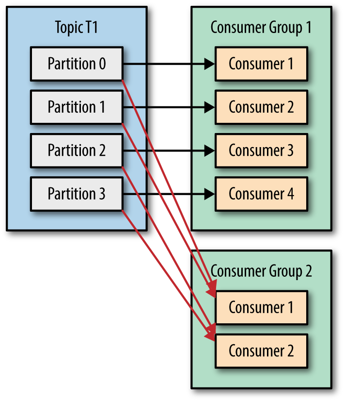
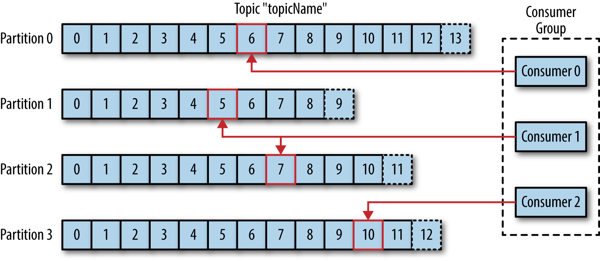

## 컨슈머(Consumer)와 컨슈머 그룹(Consumer Group)

### 토픽과 파티션

카프카에서 **토픽(Topic)**은 데이터를 구분하기 위한 단위이다. 일종의 데이터 카테고리이며, 굳이 비유하자면 관계형 데이터베이스의 테이블과 비슷한 개념이라고 생각해도 좋다.

이 토픽에는 **1개 이상의 파티션(Partition)**이 존재하는데, 이 파티션에 카프카 **레코드(Record)**가 쌓이게 된다. 파티션은 자료구조 큐와 유사한 구조를 가지고 있다. 다만 큐와 다른점은, 데이터를 제거(Pop)하지 않는다는 점이다. 큐는 가져간 요소를 삭제하지만, 파티션에서 레코드를 읽었다고 제거하지 않는다. 대신 어디까지 레코드를 읽었는지 나타내는 후술할 **오프셋(Offset)** 이라는 값을 사용한다.

### 컨슈머가 데이터를 가져오는 방법

**컨슈머(Consumer)**는 상술한 파티션을 구독하고, 파티션의 데이터를 컨슘(Consume)하여 처리한다. 그리고 이런 **컨슈머들이 1개 이상이 모여 논리적인 멤버십인 컨슈머 그룹(Consumer Group)을 구성**한다. 컨슈머 그룹은 다른 컨슈머 그룹과 격리되어 서로 영향을 주고 받지 않는다. 토픽 T1을 컨슘하고 있는 컨슈머 그룹 G1이 존재하고 있는 상황에서, 컨슈머 그룹 G2가 새로 추가되는 상황에도, **G2는 G1의 작업과 전혀 관계 없이 T1의 모든 메시지를 받게된다**. 예를 들어 회원가입 이벤트를 카프카로 발행했을 때, 포인트 서버와 알림 서버가 각각 데이터를 읽어갈 수 있는 것이다.

카프카가 아닌 일반적인 메시지 브로커는 메시지를 컨슈머에 푸시(Push) 하는 방식으로 동작한다. 이 방식의 단점은 컨슈머가 자기 자신의 가용량을 염두할 수 없다는 점이다. 반면, **카프카의 컨슈머는 다른 메시지 브로커와 다르게, 직접 폴링(Polling)** 하여 레코드를 읽어온다. 따라서 컨슈머 각자의 가용량에 따라 유연하게 메시지를 처리할 수 있다. 컨슈머 애플리케이션이 데이터를 폴링하기 위해서는 poll() 메서드를 실행한다.

**파티션은 최대 1개의 컨슈머에만 할당** 가능하다. 반면, 컨슈머는 여러개의 파티션을 구독할 수 있다. 컨슈머는 파티션의 개수와 같거나 적어야 가장 효율적이다. 파티션이 1개의 컨슈머에만 할당될 수 있는 특징 때문에, 컨슈머 개수가 파티션의 개수보다 많다면, 유휴 컨슈머가 발생하고 이는 곧 쓰레드 낭비로 이어진다.

이런 구조로 **파티션이 카프카 병렬처리의 핵심**이라는 것을 알 수 있다. 컨슈머의 처리량이 한정되어 있는 상태에서, 처리량을 더 늘리고 싶다면, **파티션과 컨슈머의 개수를 늘리는 것이 하나의 방법**이 될 수 있다. 단, **한번 늘린 파티션은 다시 개수를 줄이기 어려**운데 이에 대한 내용도 나중에 다뤄보겠다.

### 쓰레드 안전성

쓰레드 안전 측면에서 주의할 점은, **동일한 컨슈머 그룹이라면 하나의 쓰레드에서 여러개의 컨슈머를 실행해서는 안된다**는 점이다. 한 애플리케이션에서 동일한 컨슈머 그룹의 여러 컨슈머를 실행하려면, 별도의 쓰레드에서 실행해야한다.

## 커밋(Commit)과 오프셋(Offset)

컨슈머는 **커밋(Commit)**을 통해 자신이 레코드를 어디까지 가져갔는지 카프카 브로커에 기록한다. 이를 기록하기 위해 오프셋이라는 개념이 사용된다.

파티션에 쌓이는 레코드는 **타임스탬프, 메시지 키, 메시지 값, 오프셋, 헤더** 이렇게 5가지 정보를 가지고 있다. 여기서 **오프셋은 0 이상의 숫자**로 이루어져 있다. 오프셋은 직접 지정이 불가능하며, **브로커에 저장된 마지막 레코드의 오프셋에 +1 한 값으로 저장**된다. 이 오프셋을 사용하여 각 카프카 컨슈머들이 파티션의 데이터를 어디까지 가져갔는지 판단할 수 있다.

오프셋은 컨슈머 그룹 단위로 관리된다. 그리고 컨슈머 그룹의 오프셋은 카프카 브로커의 `__consumer_offsets` 라는 특별한 토픽에 저장된다. 이런 특징 덕분에 토픽의 레코드는 여러 목적을 가진 서로 다른 컨슈머 그룹들이 여러번 데이터를 읽어갈 수 있다.

어떠한 문제로 **커밋이 제대로 이루어지지 않은 경우, 컨슈머는 데이터를 중복 컨슘**할 가능성도 있다. 따라서 중복이 발생하지 않게 하려면 오프셋 커밋이 제대로 이뤄졌는지 검증해야한다. (다만, 실제로는 데드 레터 재처리 등 동일한 내용의 데이터를 재처리 할 일은 많기 때문에, **컨슈머 로직을 멱등하게 구성하는 것이 마음이 편할 것**이다)

오프셋 커밋 방식은 크게 명시적 방식과 비명시적 방식으로 나뉜다.

### 비명시적 오프셋 커밋

`enable.auto.commit` 옵션의 기본값은 `true` 인데, 이 상태에서 컨슈머 어플리케이션은 **비명시적 오프셋 커밋을 수행**한다. 비명시적 오프셋 커밋은 **poll() 메서드가 실행된 이후 일정 시간이 지나면 그 시점까지 읽은 오프셋을 커밋**하는 방식이다. 이때 일정 시간은 `auto.commit.interval.ms` 옵션을 통해 설정한다. 이 방식은 poll() 호출 이후에 **리밸런싱이 발생하거나, 컨슈머가 비정상적으로 종료되었을 때 메시지가 중복처리되거나 유실될 가능성**이 있으므로, 이를 허용하지 않는 서비스에서는 사용하면 안된다.

### 명시적 오프셋 커밋

명시적 방식을 사용하려면, `enable.auto.commit` 을 `false` 로 설정하여 자동으로 커밋하지 않도록하고, **poll() 메서드 호출 이후에 commitSync() 메서드를 호출**한다. commitSync() 메서드는 **poll() 메서드를 통해 반환된 레코드의 가장 마지막 오프셋을 기준으로 커밋**한다.

단, commitSync() 는 **동기적으로 커밋**을 하는 방식이라서 비명시적 방식에 비해 단위 시간당 처리량이 낮다. 처리량을 높이고 싶으면, **비동기적으로 커밋을 하는 commitAsync() 메서드**를 사용하면 된다. commitAsync() 를 사용하면 커밋 요청 후 응답이 올 때 까지 데이터를 처리할 수 있다. 다만, 커밋이 실패한 경우 순서 보장이 불가능하며, 중복 처리가 될 수도 있다. 또 commitSync() 는 실패시 성공하거나 재시도할 수 없는 오류가 발생할 때 까지 재시도하지만, commitAsync() 는 그렇지 않다.

### 초기 오프셋 전략

컨슈머 그룹이 파티션의 레코드를 읽으려고 하는데, 오프셋이 지정되어 있지 않다면 어떻게 처리할까? `auto.offset.reset` 옵션을 통해 `latest` , `earliest` , `none` 중 하나를 선택할 수 있다.

- `latest` : **가장 최근의 (오프셋이 가장 높은) 레코드**부터 처리한다. 이 옵션이 기본값이다.
- `earliest` : **가장 오래된 (오프셋이 가장 낮은) 레코드**부터 처리한다.
- `none` : **커밋 기록이 없다면 오류를 반환**하고, 커밋 기록이 있다면 **마지막 커밋 이후 오프셋부터 읽기 시작**한다.

## 리밸런싱(Rebalancing)

카프카 브로커 중 한 대는 **컨슈머 그룹 코디네이터(Consumer Group Coordinator)**라는 역할을 수행한다. 코디네이터는 특정 컨슈머 그룹을 관리한다.

컨슈머는 **폴링 혹은 커밋을 수행할 때, 코디네이터에게 하트비트(Heartbeat) 메시지를 전송**한다. 코디네이터는 특정 컨슈머가 하트비트를 일정시간 동안 전송하지 않는다면 해당 컨슈머가 비정상이라고 판단한다. 이 비정상으로 판단하는 시간 간격은 `session.timeout.ms` 옵션을 통해 설정하며, 기본값은 10000(10초)이다. 보통 하트비트 시간 간격의 3배로 설정한다.

리밸런싱이 발동하는 다른 조건도 존재한다. **poll() 메서드를 호출하는 간격이 일정 수치 이상이라면 비정상으로 판단하여 리밸런싱을 수행**한다. 이 수치는 `max.poll.interval.ms` 옵션으로 설정이 가능하며, 기본값은 300000(5분)이다.

이슈가 발생한 컨슈머는 파티션에 쌓인 레코드를 제대로 처리하지 못할 것이므로 이를 그대로 두고 있다면 데이터 처리 가용성이 현저히 떨어질 것이다. 이를 막기 위해 코디네이터는 **해당 컨슈머가 소유하고 있던 파티션에 대한 소유권을 다른 컨슈머에게 이관**한다. 이 과정을 **리밸런싱(Rebalancing)**이라고 한다.

단, 리밸런싱은 자주 발생해서는 안된다. **리밸런싱 중에는 컨슈머 그룹의 컨슈머들이 토픽의 데이터를 읽을 수 없기 때문**이다. 리밸런싱은 데이터 처리의 가용성을 지키기 위해 수행되지만, 너무 자주 발생해도 가용성이 떨어질 수 있으므로 이를 잘 핸들링 해야한다.

## 참고

- 아파치 카프카 애플리케이션 프로그래밍 - 최원영
- https://www.oreilly.com/library/view/kafka-the-definitive/9781491936153/ch04.html
- https://always-kimkim.tistory.com/entry/kafka101-consumer-rebalance
