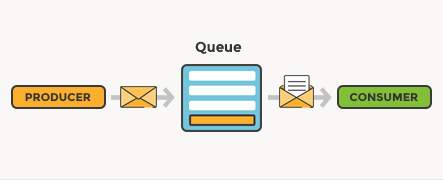
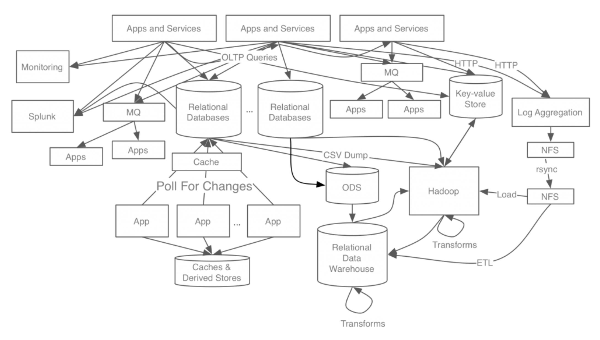
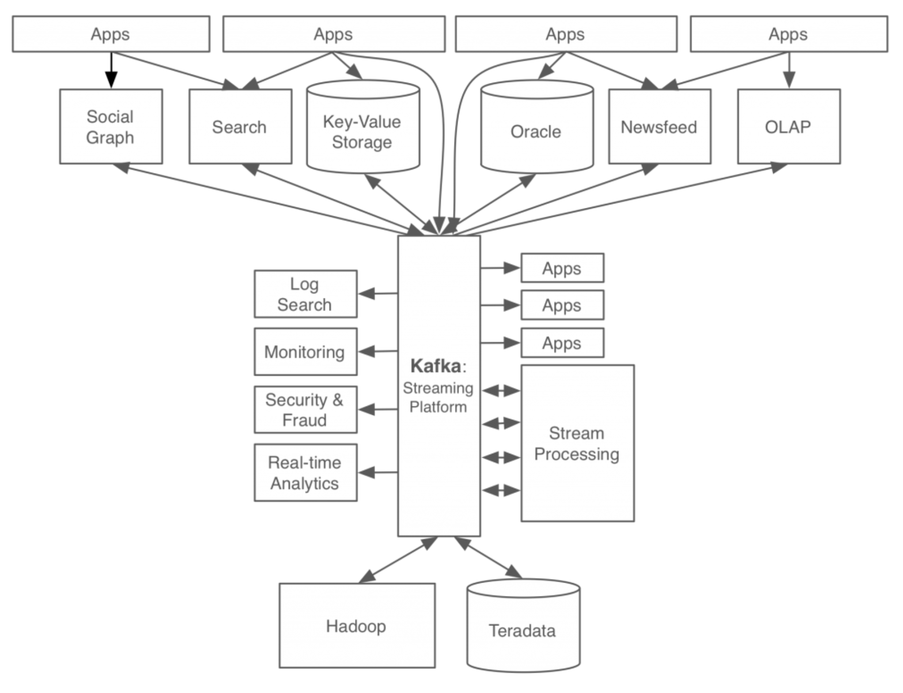
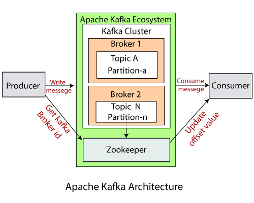

## 메시지 큐와 MOM

카프카를 이해하기 위해서는 메시지 큐와 MOM을 먼저 알아야한다. 메시지 큐는 분산화된 환경에서 발신자와 수신자 사이에서 메시지를 전송하고, 수신하는 기술을 의미한다. MOM(message oriented middleware)를 통해서 구현된다.

### 메시지큐를 왜 사용할까?

메시지 큐를 사용하면 발신자와 수신자가 서로를 직접 알 필요 없으므로 **느슨한 결합(decoupling)**을 만들어낼 수 있다. 발신자, 수신자 서로가 서로에게 의존하지 않으므로, 각자는 **독립적으로 확장(scalable)**될 수 있다. N:1:M 의 형태로 발신자, 수신자 사이에 메시지 큐가 메시지를 중개하기 때문이다.

또한 수신자 서비스가 당장 장애 상황이더라도 발행된 메시지는 모두 메시지 큐에 남아있으므로 결국 발신자가 발생한 모든 메시지는 소비자 서비스에게 전달된다는 **보장성(guarantees)**를 갖는다. 이러한 여러 특성으로 메시지 큐는 여러 마이크로 서비스가 서로 협력하는 MSA 환경에서 빛을 발한다.

메시지 큐를 사용하면 **비동기 통신(asynchronous)**을 구현할 수 있다. A 서비스와 B 서비스가 통신을 한다고 가정해보자. A가 B를 HTTP 통신을 통해 request 한다면, A는 B로부터 동기적으로 response를 기다릴 것이다. 반면 A가 메시지를 메시지 큐에 발행하고, B가 그 메시지를 가져가는 방식으로 통신한다면 비동기적으로 통신이 이루어질 수 있다. 이런 특성으로 메시지 큐는 이미지 프로세싱과 같이 **굉장히 무거운 작업을 요청**하거나, 혹은 이벤트 드리븐 아키텍처에서 **이벤트가 발생했음을 알리기 위한 용도**로 사용하기 적합하다.

### Point to Point 와 Pub/Sub

메시지 큐는 크게 **Point to Point와 Pub/Sub 모델**로 구분할 수 있다. Point to Point (이하 P2P) 모델은 한 대의 발신자가 한 대의 수신자에게 메시지를 보내는 방식이다. 즉, **메시지 전송 대상이 한 대로 고정**되어 있다. 반면, Pub/Sub 모델은 발신자가 토픽이라고 불리는 공간에 메시지를 전송하면, 그 토픽을 구독하고 있는 수신자 모두 메시지를 수신하는 방식이다. 즉, **전송 대상이 다수**이다.

MOM이라고 하면 흔히 RabbitMQ, ActiveMQ, Kafka를 이야기한다 (Redis는 Pub/Sub을 지원하지만, 일반적으로 MOM이라고 부르지는 않는 것 같다). RabbitMQ와 ActiveMQ는 P2P와 Pub/Sub 모델을 함께 지원하지만, 이번에 알아볼 **카프카는 Pub/Sub 모델만을 지원**한다.

## 카프카

카프카는 RabbitMQ, ActiveMQ와 비교했을 때, **높은 확장성과 내결함성, 대용량 데이터 처리, 실시간 데이터 처리**에 특화되어 있는 오픈소스 메시징 시스템이다. 카프카는 링크드인에서 최초로 개발되었으며, 현재는 아파치 재단에서 오픈소스로 관리하고 있다. 링크드인은 어떤 문제를 해결하고자 카프카를 만들게 되었을까?

위 그림은 카프카가 등장하기 이전의 링크드인의 아키텍처이다. 각 서비스 혹은 데이터 저장소가 **End-To-End** 로 연결되어 아주 복잡한 구조를 가지고 있다. 이런 구조는 시스템을 **확장하기 어려운 구조**이다.

### After Kafka

카프카가 등장한 이후의 아키텍처이다. 모든 이벤트와 데이터의 흐름이 **카프카를 중심으로 모이고 퍼진다**. 이벤트/데이터가 발생했다면 발생 주체가 카프카로 해당 이벤트/데이터를 전달한다. 그리고 해당 이벤트/데이터가 필요한 곳에서 직접 가져다 사용한다.

예를 들어 회원 서비스에서 새로운 회원이 가입되었다는 메시지를 카프카로 전달한다. 이 메시지를 멤버십 서비스가 컨슘하여 새로운 회원에게 가입 축하 멤버십 포인트를 생성해 부여한다. 동시에 하둡은 이 메시지를 컨슘하여 해당 유저에 대한 데이터를 빅데이터에 저장해 분석한다. 또한 동시에 로그 스태시(로그 수집 시스템)는 이 메시지를 컨슘하여 개발자가 디버깅할 때 사용할 수 있도록 로그를 생성한다.

카프카가 없었다면 회원 서비스가 멤버십 서비스, 하둡, 로그 스태시로 각각 다른 데이터 파이프라인을 통해 데이터를 전송해야 했을 것이다. 이에 반해 카프카를 사용하여 **데이터 흐름을 중앙화**한다면, **복잡도가 드라마틱하게 낮아지는** 것을 확인할  수 있다.

## 카프카 특징

다른 MOM, 특히 RabbitMQ, ActiveMQ와 비교하여 카프카가 갖는 특징은 무엇이 있을까?

- **높은 처리량과 낮은 지연시간**: 카프카는 대용량 데이터를 실시간으로 처리할 수 있도록 설계되었다. 따라서 높은 TPS를 가지며, 실시간 데이터 스트림, 로그 집계, 이벤트 드리븐 아키텍처 구현에 적합하다.
- **메시지 내구성**: 카프카의 메시지는 메모리가 아닌 디스크에 영구적으로 저장된다. 예로 Redis Pub/Sub과 같은 경우 메시지가 디스크에 저장되지 않으며, 장애 발생 시 메시지는 유실된다. 또 ActiveMQ, RabbitMQ 모두 디스크에 메시지를 영구 저장하는 옵션도 지원하지만, 기본적으로는 컨슘된 메시지는 소실된다. 반면 카프카는 기본적으로 모든 메시지를 디스크에 영구 저장한다.
- **분산 아키텍처**: 후술하겠지만 카프카는 카프카 클러스터 내부에 여러대의 브로커 서버를 구성하여 높은 확장성(scalability)과 내결함성(fault tolerance)을 갖는다. 이는 RabbitMQ, ActiveMQ와 비교했을 때 카프카만이 가지고 있는 차별점이다.
- **Pull 기반 메시지 소비**: RabbitMQ와 ActiveMQ는 브로커가 컨슈머로 메시지를 Push 하는 방식인데 반해, 카프카는 컨슈머가 능동적으로 브로커로부터 메시지를 가져오는 Pull 방식을 취했다. 이로 인해 컨슈머는 처리 능력에 따라 메시지를 컨슘할 수 있기 때문에, 브로커로부터 압도당하지 않고 최적의 성능을 낼 수 있다.

## 카프카 아키텍처

- **카프카 클러스터 (kafka cluster)**: 하나 이상의 카프카 브로커들의 집합이다. 특징에서 알아보았듯 카프카는 확장성과 내결함성을 위해 브로커들을 클러스터로 구성한다.
- **브로커 (broker)**: 브로커는 개별 카프카 서버로 보면 된다. 브로커는 프로듀서로부터 메시지를 전달받아, 토픽에 저장하고, 컨슈머에 전달하는 역할을 한다. 브로커는 여러개의 토픽을 가질 수 있다.
- **토픽 (topic)**: 토픽을 데이터가 저장되는 단위라고 할 수 있다. 토픽은 이름으로 식별된다. 토픽에 한번 추가된 데이터는 수정될 수 없다.
- **파티션 (partition)**: 카프카의 확장성을 위해 토픽은 1개 이상의 파티션으로 나뉠 수 있다. 레코드에 키가 없다면 라운드 로빈으로 파티션에 나뉘어 저장되고, 같은 키를 가진 레코드는 같은 파티션에 저장된다.
- **오프셋 (offset)**: 파티션에 저장된 레코드는 증가하는 정수 ID를 갖고, 이를 오프셋이라고 부른다. 오프셋은 0부터 시작하며, 파티션에 레코드가 저장될 때 마다 시퀀셜하게 증가한다. 특정 파티션의 각 레코드는 고유한 오프셋을 갖지만, 서로 다른 파티션 간에는 고유하지 않다. 파티션에서 데이터를 읽을 때 작은 것부터 큰 순서대로 읽는다.
- **레코드 (record)**: 파티션에 저장되는 데이터이다. Key, Value, Timestamp, Compression Type, Optional Headers, Partition and Offset id 로 구성된다.
- **프로듀서 (producer)**: 카프카에 요청하여 토픽에 레코드를 추가하는 클라이언트이다. 카프카의 구성 요소가 아니며, 카프카 외부에서 카프카에 요청하는 애플리케이션이다.
- **컨슈머 (consumer)**: 하나 이상의 파티션과 토픽으로부터 레코드를 읽어오는 클라이언트이다. 기본적으로 사용 가능한 가장 낮은 오프셋부터 높은 오프셋까지 순서대로 레코드를 읽어온다. 하나의 토픽의 여러 파티션으로부터 레코드를 읽어올 때는 순서가 보장되지 않는다. 파티션 0, 1, 2 로부터 레코드를 읽어올 때 파티션 0의 레코드만 바라봤을 때는 순서가 보장되지만, 읽어온 전체 레코드를 바라볼대는 파티션 0 ~ 2의 레코드가 순서와 상관없이 섞여있을 수 있다.
- **컨슈머 그룹 (consumer group)**: 동일한 컨슈머 인스턴스를 여러개 생성하여 컨슈머 그룹을 구성할 수 있다. 컨슈머 그룹을 구성하는 여러 컨슈머는 동일한 토픽의 각자 다른 파티션을 도맡아 메시지를 컨슘할 수 있다. 예를 들어 토픽 A에 파티션이 0, 1, 2 가 생성되어 있고, 컨슈머 그룹 A에 컨슈머 a, b, c가 있다고 가정하자. 이 경우 컨슈머 a는 파티션 0을, 컨슈머 b는 파티션 1을, 컨슈머 c는 파티션 2를 컨슘한다.

## 참고

- [https://www.youtube.com/watch?v=catN_YhV6To](https://www.youtube.com/watch?v=catN_YhV6To&t=29s)
- [https://dev.to/tranthanhdeveloper/point-to-point-and-publish-subscribe-messaging-model-41j0](https://dev.to/tranthanhdeveloper/point-to-point-and-publish-subscribe-messaging-model-41j0)
- [https://www.freecodecamp.org/news/apache-kafka-handbook/](https://www.freecodecamp.org/news/apache-kafka-handbook/)
- [https://www.conduktor.io/blog/comparing-apache-kafka-activemq-and-rabbitmq](https://www.conduktor.io/blog/comparing-apache-kafka-activemq-and-rabbitmq)
- [https://tecoble.techcourse.co.kr/post/2021-09-19-message-queue/](https://tecoble.techcourse.co.kr/post/2021-09-19-message-queue/)
- [https://velog.io/@shlee7131/Kafka-TopicsPartitions-and-Offsets](https://velog.io/@shlee7131/Kafka-TopicsPartitions-and-Offsets)
- ChatGPT (다른 자료와 크로스 체크를 항상 해야겠지만, 앞으로 학습에 ChatGPT를 적극 사용할 예정이다)