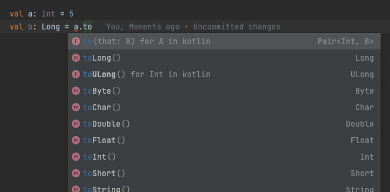

> 우아한테크코스에서 약 10개월간 자바를 사용하여 프로그래밍을 해왔다. 그런데 내년 1월 초에 재직 예정인 회사에서는 100% 코틀린을 사용한다고 한다. 따라서 자바와 다른 부분을 중심으로 코틀린 문법을 간단하게 학습해보려고 한다. 이 포스팅의 목표는 코틀린의 대략적인 문법 체계를 익히는데 있다. 각각의 주제에 대한 깊은 내용은 나중에 기회가 된다면 별도의 포스팅으로 다뤄보겠다.

## 변수

### 변경 가능한 변수와 변경 불가능한 변수

코틀린은 자바와 다르게 변수 선언 시 키워드를 앞에 붙어야한다. 이 키워드에는 `val` 과 `var` 이 있다. 각각의 차이점을 알아보자.

#### val

value에서 따온 키워드로, 변경 불가능한(immutable) 참조를 저장하는 변수이다. 자바의 `final` 과 동일하다. 자바 `final` 키워드와 마찬가지로, 참조가 변경이 불가능한 것이지 객체의 불변을 보장하지 않으므로 참고하자.


#### var

variable에서 따온 키워드로, 변경 가능한(mutable) 참조이다. 자바의 일반적인 변수와 동일하다.

### 코틀린에서 타입 명시하기

코틀린은 자바와 달리 `변수명: 타입` 의 형태로 변수의 타입을 명시한다. 그리고 코틀린은 타입 명시를 생략할 수 있는데, 그런 상황에서는 컴파일러가 초기화 식을 분석하여 초기화 식의 타입을 변수의 타입으로 지정한다. 이를 타입 추론 (Type Inference) 라고 한다.

```kotlin
val a:Int = 3
val b:Int

val c = 3 // Int로 타입 추론
val d = 3L // Long으로 타입 추론
```

단, 타입을 명시하지 않은 상태로 초기화 식을 작성하지 않을 수 없다. 또는  아래의 경우에는 `This variable must either have a type annotation or be initialized` 라는 에러가 발생한다.

```kotlin
val e
```

또한 위 코드에서 타입을 잘 지정했다고 하더라도 문제가 발생할 수 있다.

```kotlin
val f: Int
```

위 코드는 `Variable 'f' must be initialized` 라는 에러가 발생한다. 코틀린은 초기화 되지 않은 변수를 일반적인 방법으로는 사용할 수 없다. 즉, 변수를 사용하기 위해서는 반드시 초기화 해줘야한다. 

### 원시 타입

자바에서는 `int` 와 `Integer` 로 원시 타입과 래퍼 타입을 구분한다. 하지만, **코틀린은 이 둘을 구분하지 않는다**. 원시 타입과 래퍼 타입이 같다고, 코틀린 내부에서도 항상 객체로 표현하는 것은 아니다. 실제로 그렇다면 매우 비효율적일 것이다. 코틀린은 대부분의 경우에서는 코틀린의 `Int` 타입은 자바의 `int` 타입으로 컴파일된다. 즉, 코틀린을 사용할 때에는 개발자가 Boxing, Unboxing을 고려하지 않아도 된다.

```kotlin
val a: Int = 10
val result = a.plus(10)
println("result = ${result}") // 20
```

위와 같이 자바의 원시 타입이면 불가능했을 메소드의 사용도 가능하다.

### 사라진 new 키워드

자바에서는 클래스의 인스턴스를 생성할 때 `new` 키워드를 사용하여 새로운 인스턴스를 생성한다는 것을 명시했다. 하지만 코틀린은 `new` 키워드를 사용하지 않는다.

```kotlin
val member = Member()
```

단순히 위와 같이 사용하면 된다.

## Nullable

### 널 가능성

위에서 코틀린에서는 초기화 되지 않은 변수를 사용할 수 없다고 이야기했다. 그 이유는 코틀린은 기본적으로 변수에 null이 저장되는 것을 허용하지 않기 때문이다. null을 저장하고 싶다면, 해당 변수를 Nullable로 만들어 줘야하는데, 이때 `?` 문자를 사용한다.

```kotlin
val a: Int? = null
println(a) // null
```

그렇다면 코틀린에서 아래 코드가 정상적으로 실행될 수 있을까? 정답은 ‘아니다’ 이다. 위 코드를 컴파일해보면, 아래와 같은 에러가 발생한다.

```kotlin
fun getLength(text: String?): Int? {
    return text.length
}
```

> Only safe (?.) or non-null asserted (!!.) calls are allowed on a nullable receiver of type Int?
> 

왜 그럴까? 코틀린의 타입 시스템은 널 참조 위험을 제거하는 것을 목표로 설계되었다. 위 코드에서 `text` 는 null이 될 가능성을 가지고 있다. `?` 를 사용하여 Nullable로 만들었기 때문이다.

```java
public int getLength(String text) {
    return text.length();
}
```

위 코드가 자바코드라면 위와 같을 것이다. 이때, 파라미터 `text` 에 null이 들어와 NullPointerException이 발생할수도 있다. 코틀린은 이 위험성 없애기 위해 컴파일 단계에서 에러를 발생시킨다. 

### 안전한 호출 연산자 (Safe Call)

위 코드를 실행 가능하게 하는 방법 중 하나는 안전한 호출 연산자를 사용하는 것이다. Safe Call을 사용하기 위해서는 `.` 대신 `?.` 을 사용한다. `?.` 앞의 대상이 null이 아니라면 그대로 프로퍼티에 접근하거나 메소드를 실행한다. 반면, 대상이 null 이라면 호출이 무시되고 null 이 결과값이 된다. 아래 코드를 보자.

```kotlin
fun getLength(text: String?): Int? {
    return text?.length
}

fun main() {
    println(getLength("Hello, world!")) // 13
    println(getLength(null)) // null
}
```

첫번째 호출에서는 파라미터에 null을 넣어주지 않았으므로 13이 반환되는 반면, 두번째 호출에서는 파라미터에 null을 넣어줬으므로 null이 반환되는 모습을 볼 수 있다. (자바스크립트의 옵셔널 체이닝과 비슷하다)

### 엘비스 연산자 (Elvis)

위 예제처럼 Safe Call을 사용하여 널 참조 위험을 제거하였다. 엘비스 연산자를 사용하면 이를 좀 더 개선해볼 수 있다. 엘비스 연산자는 `?:` 문자로 사용한다. 엘비스 연산자를 사용하면, 연산자 좌항의 결과가 null 이라면 우항의 식을 사용하도록 할 수 있다. (자바스크립트의 `||` 연산자와 비슷하다)

```kotlin
fun getLength(text: String?): Int? { 
    return text?.length ?: 0
}

fun main() {
	println(getLength("Hello, world!")) // 13
    println(getLength(null)) // 0
}
```

엘비스 연산자를 사용하여 null을 파라미터로 전달했을 때의 반환값을 0으로 지정해주었다.

코틀린에서는 `return` 이나 `throw` 도 식이다. 따라서 엘비스 연산자 우측에도 위치시킬 수 있다. 위 `getLength` 함수에서 `null` 이 들어오면 예외를 던지게 하고 싶은 경우 아래와 같이 코드를 작성할 수도 있다.

```kotlin
fun getLength(text: String?): Int? { 
    return text?.length
        ?: throw IllegalArgumentException("null은 올 수 없습니다.")
}
```

혹은 아래와 같이 Early Return도 엘비스 연산자를 사용하여 처리할 수 있다.

```kotlin
fun foo(number: Integer?): Int {
    number ?: return 0
    // ...
}
```

위 코드를 자바로 표현하면 아래와 같을 것이다.

```java
public int foo(int number) {
    if (number == null) {
        return 0
    }
    
    // ...
}
```

간결함을 추구하는 코틀린의 철학이 잘 보이는 부분이다.

### 널 아님 단언 (Not-Null Assertion)

널 아님 단언을 사용하여, 특정 변수를 강제로 널이 될 수 없는 타입으로 변경할 수 있다. 이 변수는 어떤 경우에서든 널이 절대로 될 수 없다고 컴파일러에게 아주 강하게 이야기하는 연산자이다. 널 아님 단언을 사용했음에도 해당 변수에 null이 들어갔다면, NullPointerException이 발생할 수 있으므로 아주 신중하게 사용해야한다. 널 아님 단언을 사용하려면 `!!` 문자를 변수 우측에 붙이면 된다.

```java
fun getLength1(text: String?): Int? {
    return text!!.length
}

fun getLength2(text: String?): Int? {
    val notNullText = text!!
    return notNullText.length
}
```

위와 같이 사용할 수 있다.

> 참고로 코틀린 컴파일러 개발자는 일부러 컴파일러에게 무례하게 소리치는 것 처럼 보이도록 느낌표 두개로 널 아님 단언 연산자를 만들었다고 한다. 개발자에게 **널 아님 단언을 하는 것 보다 더 좋은 방법을 찾아보라는 의도**라고 한다.
> 

### 플랫폼 타입

플랫폼 타입은 코틀린이 널 관련 정보를 알 수 없는 타입을 말한다. 코틀린과 자바 코드는 100% 호환되므로, 자바로 작성된 클래스를 코틀린에서 가져와 사용할 수 있다. 그런데 자바는 모든 변수가 Nullable 이다. 아래와 자바 클래스를 코틀린에서 사용한다고 해보자.

```java
public class User {
    private final String name;

    public User(final String name) {
        this.name = name;
    }

    public String getName() {
        return name;
    }
}
```

아래 코드 실행 결과는 어떨까?

```kotlin
fun main() {
    val user = User(null)
    val uppercaseName = user.name.uppercase()
    println(uppercaseName)
}
```

`user.name` 은 플랫폼 타입이므로 코틀린은 이 변수가 Nullable인지 Non-Nullable인지 알 수 없다. 위 코드는 컴파일 시점에는 오류가 발생하지 않는다. 하지만, 현재 `user.name` 은 null이다. 따라서 런타임에 NullPointerException이 발생한다.

플랫폼 타입에 대해 수행하는 모든 연산에 대한 책임은 개발자에게 있다. 코틀린 컴파일러는 모든 연산을 허용한다. 이러한 특성 때문에 책 이펙티브 코틀린에서는 플랫폼 타입을 가능한한 사용하지 말라고 권장한다. 이를 대응하기 위해서는 자바 코드에서 `@Nullable` 혹은 `@NotNull` 과 같은 어노테이션을 사용하거나, 코틀린 코드로 한번 Wrapping 해주는 방법이 있다.

코드에서 플랫폼 타입을 직접 선언하는 방법은 없다. 또한, 내부적으로는 `변수명!` 로 플랫폼 타입이 표현되므로 참고하자.

## 타입 캐스팅

### 기본 타입간의 형 변환

자바에서는 기본 타입간의 변환이 암시적으로 이뤄질 수 있지만, 코틀린에서는 명시적으로 이뤄져야한다. 예를 들어 아래의 코드는 컴파일 타임에 예외가 발생한다.

```kotlin
val a: Int = 5
val b: Long = a // Type mismatch.
```

코틀린은 기본 타입을 다른 여러 타입으로 변환할 수 있는 메소드를 지원한다. 



위 같은 경우에는 `toLong()` 을 사용하여 Int형을 Long형으로 변경해주면 문제를 해결할 수 있다.

### 일반 타입간의 형 변환

#### 타입 캐스트 `as`

자바에서는 예를 들어 `Object` 타입으로 `Member` 타입으로 캐스팅 하기 위해서 `(Member)` 와 같은 형식을 사용하여 타입을 캐스팅하였다. 코틀린에서는 괄호 대신 `as` 를 사용한다.

```kotlin
fun printName(obj: Any) {
    if (obj is Member) {
        val member = obj as Member
        println(member.name)
    }
}
```

위 처럼 `as` 를 사용하여 타입을 캐스팅한 모습을 확인할 수 있다.

> `Any` 라는 타입을 사용했는데, 이는 자바의 `Object` 와 비슷하게 모든 코틀린 클래스의 Superclass이다.
> 

> `is` 는 자바의 `instanceof` 와 동일한 기능을 수행하며, 특정 인스턴스의 타입을 비교할 때 사용한다. `is` 를 반대로 사용하고 싶다면 `!is` 로 사용한다.
> 

또한 위 코드에서는 굳이 타입 캐스팅을 명시해주지 않아도 된다. 코틀린에서는 스마트 캐스트라는 것을 지원한다. 스마트 캐스트는 코틀린 컴파일러가 코드의 문맥을 파악하고, 앞서 타입이 체크되었다면 굳이 캐스트를 하지 않아도 되게끔 만들어준다. 따라서 아래와 같이 만들 수 있을 것이다.

```kotlin
fun printName(obj: Any) {
    if (obj is Member) {
        println(obj.name)
    }
}
```

#### 안전한 타입 캐스트 `as?`

```kotlin
fun printName(obj: Any?) {
    val member = obj as Member
    println(member.name)
}
```

위와 같이 `as` 를 사용하여 타입 캐스트를 하려 하는데, 만약 캐스팅 대상이 null이라면 어떻게 될까? 위 함수 파라미터에 null을 넣는다면, NullPointerException이 발생할 것이다.

이 문제를 해결하기 위해 안전한 타입 캐스트를 사용한다. 안전한 타입 캐스트는 캐스팅 대상이 null이 아니라면 기존처럼 캐스팅을 하되, **null 이라면 Safe Call 처럼 전체 식의 결과가 null**이 된다. 안전한 타입 캐스트는 `as?` 로 일반 타입 캐스트 연산자 뒤에 ?를 붙인 형태로 사용한다. 아래 코드는 안전한 타입 캐스트와 Safe Call, Elvis 연산자를 사용하여 위 코드를 개선한 것이다.

```kotlin
fun printName(obj: Any?) {
    val member = obj as? Member
    println(member?.name ?: "")
}
```

## 연산자 오버로딩

### 이항 산술 연산 오버로딩

코틀린에서는 연산자 오버로딩이라는 기능을 사용하여 `+` , `-` , `*` , `/` 등의 연산자를 객체간 사용할 수 있다. 아래 예제는 `Money` 클래스간 덧셈을 `+` 연산자를 통해 구현한 예시이다.

```kotlin
class Money(val value: Int) {
    operator fun plus(other: Money): Money {
        return Money(this.value + other.value)
    }
}
```

연산자 오버로딩을 사용하기 위해서는 해당 클래스에서 `operator` 라는 키워드를 통해 메소드를 정의해주면 된다. 위 코드는 아래와 같이 사용할 수 있다.

```kotlin
val money1 = Money(4_000)
val money2 = Money(5_000)

val newMoney = money1 + money2 // Money(9000)
```

`plus` 는 `+` 와 대응하고, `minus` 는 `-` 에 대응하는 등 각 연산자에 따라 대응하는 메소드명이 있다. 추가로 `+=` , `-=` 등을 오버로딩하는 **복합 대입 연산자 오버로딩**, `-` , `+` 등을 오버로딩하는 **단항 연산자 오버로딩** 등이 있다. 더 자세히 알고 싶다면, **[코틀린 공식 문서](https://kotlinlang.org/docs/operator-overloading.html)**를 참고하자.

### 비교 연산자 오버로딩

아래와 같이 동일성, 동등성 연산도 연산자 오버로딩을 통해 가능하다. 자바에서 동일성을 비교할 때에는 `==` 을, 동등성을 비교할 때에는 `equals()` 를 사용하였다. 코틀린에서는 조금 다르다. 코틀린에서는 동일성을 비교할 때 `===` 을, 동등성을 비교할 때 `==` 을 사용한다. `==` 을 사용하면, 자동으로 `equals()` 를 호출해준다.

아래와 같이 `equals()` , `hashCode()` 가 재정의된 `Money` 클래스가 있다.

```kotlin
class Money(private val value: Int) {
    override fun equals(other: Any?): Boolean {
        if (this === other) return true
        if (javaClass != other?.javaClass) return false

        other as Money

        if (value != other.value) return false

        return true
    }

    override fun hashCode(): Int {
        return value
    }
}
```

아래 코드를 실행해보자.

```kotlin
val money1 = Money(1_000)
val money2 = money1
val money3 = Money(1_000)
val money4 = Money(2_000)

println(money1 === money2) // (1) -> true
println(money1 == money3) // (2) -> true
println(money1 === money3) // (3) -> false
println(money1 == money4) // (4) -> false
```

1번 코드는 `money1` 과 `money2` 의 주소가 같으므로 동일성 비교 결과가 true가 된다. 2번 코드는 `money1` 과 `money2` 가 동일하지는 않지만, 동등하므로 true이다. 3번 코드는 동등하지만, 동일하지 않으므로 false이다. 4번 코드는 동등하지 않으므로 false이다.

또한, 코틀린에서 크기를 비교하는 연산자로 `>` , `<` , `>=` , `<=` 가 있는데, 자바와 다르게 코틀린에서는 객체와 객체를 비교시 비교 연산자를 사용하면 자동으로 `compareTo()` 를 호출해준다.

```kotlin
class Car(private val position: Int) : Comparable<Car> {
    override fun compareTo(other: Car): Int {
        return this.position - other.position
    }
}
```

위와 같이 `Comparable` 인터페이스를 구현한 `Car` 클래스가 있다. 이 둘을 비교하는 기준은 `position` 필드이다. 자바의 경우에는 오버라이드된 `compareTo()` 를 직접 호출하여 비교해야했지만, 코틀린은 아래와 같이 간단하게 사용이 가능하다.

```kotlin
val car1 = Car(1)
val car2 = Car(2)
println(car1 < car2) // true
```

### 이항 산술 연산 오버로딩

코틀린에서는 연산자 오버로딩이라는 기능을 사용하여 `+` , `-` , `*` , `/` 등의 연산자를 객체간 사용할 수 있다. 아래 예제는 `Money` 클래스간 덧셈을 `+` 연산자를 통해 구현한 예시이다.

```kotlin
class Money(val value: Int) {
    operator fun plus(other: Money): Money {
        return Money(this.value + other.value)
    }
}
```

연산자 오버로딩을 사용하기 위해서는 해당 클래스에서 `operator` 라는 키워드를 통해 메소드를 정의해주면 된다. 위 코드는 아래와 같이 사용할 수 있다.

```kotlin
val money1 = Money(4_000)
val money2 = Money(5_000)

val newMoney = money1 + money2 // Money(9000)
```

`plus` 는 `+` 와 대응하고, `minus` 는 `-` 에 대응하는 등 각 연산자에 따라 대응하는 메소드명이 있다. 추가로 `+=` , `-=` 등을 오버로딩하는 **복합 대입 연산자 오버로딩**, `-` , `+` 등을 오버로딩하는 **단항 연산자 오버로딩** 등이 있다. 더 자세히 알고 싶다면, **[코틀린 공식 문서](https://kotlinlang.org/docs/operator-overloading.html)**를 참고하자.

### 비교 연산자 오버로딩

아래와 같이 동일성, 동등성 연산도 연산자 오버로딩을 통해 가능하다. 자바에서 동일성을 비교할 때에는 `==` 을, 동등성을 비교할 때에는 `equals()` 를 사용하였다. 코틀린에서는 조금 다르다. 코틀린에서는 동일성을 비교할 때 `===` 을, 동등성을 비교할 때 `==` 을 사용한다. `==` 을 사용하면, 자동으로 `equals()` 를 호출해준다.

아래와 같이 `equals()` , `hashCode()` 가 재정의된 `Money` 클래스가 있다.

```kotlin
class Money(private val value: Int) {
    override fun equals(other: Any?): Boolean {
        if (this === other) return true
        if (javaClass != other?.javaClass) return false

        other as Money

        if (value != other.value) return false

        return true
    }

    override fun hashCode(): Int {
        return value
    }
}
```

아래 코드를 실행해보자.

```kotlin
val money1 = Money(1_000)
val money2 = money1
val money3 = Money(1_000)
val money4 = Money(2_000)

println(money1 === money2) // (1) -> true
println(money1 == money3) // (2) -> true
println(money1 === money3) // (3) -> false
println(money1 == money4) // (4) -> false
```

1번 코드는 `money1` 과 `money2` 의 주소가 같으므로 동일성 비교 결과가 true가 된다. 2번 코드는 `money1` 과 `money2` 가 동일하지는 않지만, 동등하므로 true이다. 3번 코드는 동등하지만, 동일하지 않으므로 false이다. 4번 코드는 동등하지 않으므로 false이다.

또한, 코틀린에서 크기를 비교하는 연산자로 `>` , `<` , `>=` , `<=` 가 있는데, 자바와 다르게 코틀린에서는 객체와 객체를 비교시 비교 연산자를 사용하면 자동으로 `compareTo()` 를 호출해준다.

```kotlin
class Car(private val position: Int) : Comparable<Car> {
    override fun compareTo(other: Car): Int {
        return this.position - other.position
    }
}
```

위와 같이 `Comparable` 인터페이스를 구현한 `Car` 클래스가 있다. 이 둘을 비교하는 기준은 `position` 필드이다. 자바의 경우에는 오버라이드된 `compareTo()` 를 직접 호출하여 비교해야했지만, 코틀린은 아래와 같이 간단하게 사용이 가능하다.

```kotlin
val car1 = Car(1)
val car2 = Car(2)
println(car1 < car2) // true
```