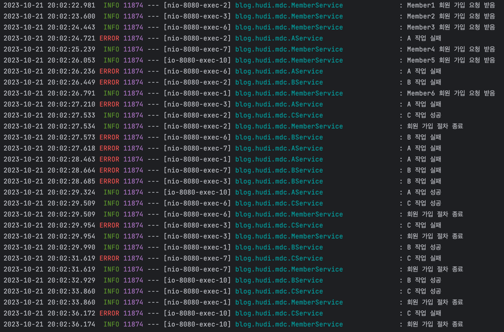
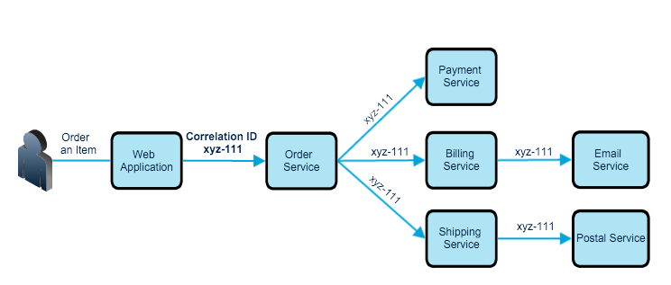
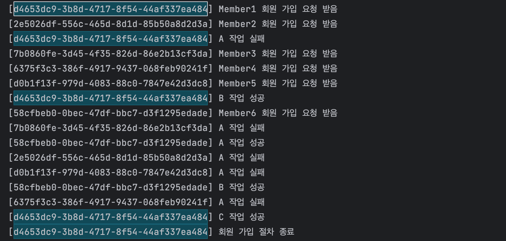
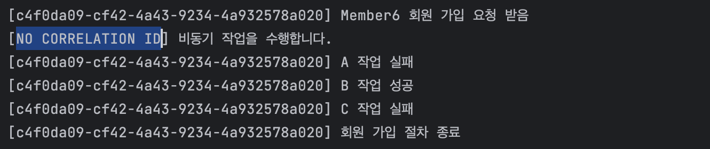

## 뒤섞여 추적이 어려운 로그

우리가 회원가입 기능을 구현한다고 가정해보자. 유저가 회원가입을 마치기 위해서는 A, B, C 작업의 수행이 필요하다. 우리는 작업별 성공/실패 여부를 추적하기 위해 Logback을 사용해 로깅을 하기로 결정했다. 이를 `MemberService` 에 구현해보자.

```kotlin
@Service
class MemberService {
    // ...
    private val logger = LoggerFactory.getLogger(MemberService::class.java)

    fun register(name: String) {
        logger.info("$name 회원 가입 요청 받음")

        aService.execute()
        bService.execute()
        cService.execute()

        logger.info("회원 가입 절차 종료")
    }
}
```

`AService`, `BService`, `CService` 는 아래와 같이 작업의 성공, 실패 여부에 따라 다르게 로그를 남긴다.

```kotlin
@Service
class AService {
    private val logger = LoggerFactory.getLogger(AService::class.java)

    fun execute() {
        // do something ...
        if (jobSucceeded) {
            logger.info("A 작업 성공")
        } else {
            logger.error("A 작업 실패")
        }
    }
}
```

이 서비스에 한번에 여러 사람이 접속하여 로그가 쌓이게 되면 아래와 같은 모습일 것이다.



여러분은 위 로그를 보고 특정 멤버의 회원가입 요청 과정 중 실패한 작업이 어떤 것들이 있는지 파악할 수 있는가? 위 로그만 보고서는 전혀 알 수 없을 것이다. 로그에 맥락이 없기 때문이다.

### 맥락의 부재

일반적으로 웹 서버는 멀티 쓰레드 환경에서 동작하며 하나의 클라이언트 요청을 하나의 쓰레드가 처리한다. 이런 상황에서 로거를 사용해 로그를 남기게 되면, 위 예시에서 살펴본것과 같이 로그가 뒤죽박죽 섞이게 되어, 문제가 발생했을 때 **원인을 추적하고 진단하기가 어렵다**. 이런 문제를 해결하려면 위해 로그와 함께 특정 요청에 대한 로그들을 하나로 묶을 수 있는 **맥락(Context)**을 남길 필요가 있다.



맥락에는 요청한 사용자 정보, HTTP 요청 헤더 등 다양한 데이터가 있겠지만, 이 포스팅에서는 **Correlation ID** 라는 정보를 남길 것이다. Correlation ID 란, **단일 요청에 대해 무작위하게 생성된 고유의 ID**를 의미한다. 로그와 함께 Correlation ID를 남기게 되면, 문제가 있는 요청에 대한 로그들을 식별하여 그룹화할 수 있으므로 문제를 진단하는 데 큰 도움이 될 수 있다.

우리는 서버로 인입된 HTTP Request에 대해 임의의 UUID를 생성하여 부여하고, MDC를 사용해 해당 Correlation ID를 로그와 함께 남겨보는 것을 해볼것이다. (용어가 다소 혼용되어 쓰이는 감이 있지만, MSA등의 **분산환경에서 요청을 추적하기 위해 사용하는 ID는 Trace ID** 라고도 한다.)

그런데 어떻게 하면 이 Correlation ID을 로그와 함께 쌓을 수 있을까? 가장 간단하고 무식한 방법은 **메소드를 호출할 때 마다 파라미터를 통해 Correlation ID를 넘겨주는 방식**이다. 하지만 이 방법은 당연히 매우 번거로워 현실성이 없다.

좀 더 생각을 해보자면 **ThreadLocal**을 활용하는 방법이 있을 수 있다. Correlation ID를 ThreadLocal에 저장하고, 로깅할 때 마다 꺼내 함께 로깅하는 것이다. 하지만 이 방법도 썩 간단한 방법은 아니다.

MDC를 사용하면 이런 문제를 간단히 해결할 수 있다.

## MDC (Mapped Diagnostics Context)

### MDC란

slf4j에서는 **MDC(Mapped Diagnostics Context)**라는 기능을 제공한다. MDC는 내부적으로 **Thread Local**을 사용하여 구현되어 있으며, 이름에서 알 수 있듯 **Map** 형태로 context를 관리한다. 사용 방법은 아래와 같다.

```kotlin
MDC.put("key", "value") // 컨텍스트 추가
MDC.get("key") // 컨텍스트 조회
MDC.clear() // 컨텍스트 초기화
```

참고로 MDC는 slf4j의 구현체 중 log4j와 Logback 두가지만 지원하고 있다 ([참고](https://www.slf4j.org/api/org/slf4j/MDC.html)). 이 포스팅에서는 Logback을 사용한다.

### Servlet Filter 작성

```kotlin
@Component
class MDCFilter: Filter {

    override fun init(filterConfig: FilterConfig?) {
        super.init(filterConfig)
    }

    override fun doFilter(request: ServletRequest, response: ServletResponse, chain: FilterChain) {
        MDC.put("CORRELATION_ID", UUID.randomUUID().toString())
        chain.doFilter(request, response)
    }
}
```

방법은 간단하다. `Filter` 인터페이스를 구현한 `MDCFilter` 라는 구현체를 만들어주고 빈으로 등록한 뒤, `doFilter()` 에서 `MDC.put()` 을 사용해 랜덤으로 생성된 UUID를 넣어줄 것이다.

이렇게 되면 서블릿이 요청을 받을 때 마다, 요청이 서블릿 `MDCFilter` 필터를 거치게 되고, MDC의 `CORRELATION_ID` 라는 Key에는 항상 UUID가 저장될 것이다.

### 로그에 Correlation ID 출력하기

```kotlin
val correlationId = MDC.get("CORRELATON_ID")
logger.info("[${correlationId}] $name 회원 가입 요청 받음")
```

물론 위와 같이 로그 메시지에 Correlation ID를 포함하는 것도 가능하겠지만, 번거롭고 누락하기 쉽다. 따라서 Logback 설정을 통해 모든 로그에 globally 하게 적용되도록 해보자. `logback.xml` 을 아래와 같이 작성하자.

```xml
<?xml version="1.0" encoding="UTF-8" ?>
<configuration>
    <!--...-->

    <appender name="STDOUT" class="ch.qos.logback.core.ConsoleAppender">
        <encoder>
            <pattern>[%X{CORRELATION_ID:-NO CORRELATION ID}] %msg%n</pattern>
        </encoder>
    </appender>

    <root>
        <level value="INFO" />
        <appender-ref ref="STDOUT" />
    </root>

    <!--...-->
</configuration>
```

Logback pattern 설정에서 `%X{MDC_KEY}` 를 사용하여 MDC에 저장된 값을 꺼내올 수 있다. 또한 `%X{MDC_KEY:-TEXT}` 의 형태로 MDC 값을 찾을 수 없었을 때 대체할 텍스트를 설정할 수도 있다. 따라서 위 pattern 의 경우 MDC 에서 `CORRELATION_ID` 값을 찾으면 그대로 출력하고, 없다면 NO CORRELATION ID 라는 텍스트를 출력한다.

### 결과



위와 같이 로그 Prefix로 UUID가 함께 출력되어, 로그를 요청별로 그룹화 하여 확인할 수 있게 개선되었다. 위 로그를 살펴보면, Member1의 회원가입 과정은 A 작업이 실패하고, B와 C 작업은 성공한 것으로 확인된다. Correlation ID와 같은 맥락이 없었을 때에는 Member3의 회원가입 과정에서 어떤 작업이 실패했는지 추적하기 굉장히 어려웠을 것이다.

MDC는 slf4j에서 지원하는 것이므로, 콘솔에서만 출력되고 휘발되는 것이 아니라 Appender에 따라 **파일, 데이터베이스, Elastic Search 등 다양한 소스에 로그 메시지와 함께 맥락을 남길 수 있으므로** Kibana 등을 외부 모니터링 시스템을 활용하여 로그를 분석할 때에도 큰 도움이 될 것이다.

## MDC 전파가 안되는 케이스

아래의 두 케이스는 별도 조치를 하지 않으면 MDC가 전파되지 않는다. 따라서 주의가 필요하다.

### @Async

스프링에서는 `@Async` 라는 어노테이션을 제공하는데, 해당 어노테이션이 붙어있는 메소드는 요청 쓰레드와는 다른 별도의 쓰레드에서 작업이 수행돼 비동기적으로 작업을 실행할 수 있다.

그런데 아까 이야기했듯 MDC는 내부적으로 ThreadLocal을 사용하기 때문에 `@Async` 어노테이션이 붙은 메소드에는 아래와 같이 MDC가 전파되지 않을 것이다.



따라서 비동기 작업을 실행하는 쓰레드에 MDC를 전달하는 방법이 필요하다.

스프링은 비동기 작업이 시작되기 전/후의 작업을 데코레이트하기 위해 `TaskDecorator` 라는 인터페이스를 제공한다. 이 TaskDecorator를 구현해, 비동기 작업이 수행되는 쓰레드에 MDC를 복제할 것이다. 아래와 같이 `MDCTaskDecorator` 를 정의한다.

```kotlin
class MDCTaskDecorator: TaskDecorator {
    override fun decorate(runnable: Runnable): Runnable {
        // 요청 쓰레드의 MDC Context Map을 복제한다.
        val copyOfContextMap = MDC.getCopyOfContextMap()

        // 복제한 MDC Context Map을 비동기 작업 쓰레드의 MDC에 전달한다.
        return Runnable {
            MDC.setContextMap(copyOfContextMap)
            runnable.run()
        }
    }
}
```

스프링은 비동기 작업을(Runnable) 관리하고 실행하는 인터페이스인 `TaskExecutor` 가 사용되는데, 이 `TaskExecutor` 가 방금 우리가 만든 `MDCTaskDecorator` 를 사용하도록 할 것이다. 아래와 같이 Configuration 클래스를 정의하고, `TaskExecutor` 타입의 빈을 정의하여 스프링이 비동기 작업을 수행할 때 이 쓰레드풀을 사용하도록 한다.

```kotlin
@Configuration
@EnableAsync
class AsyncConfig {

    @Bean
    fun taskExecutor(): TaskExecutor {
        val taskExecutor = ThreadPoolTaskExecutor()
        taskExecutor.setTaskDecorator(MDCTaskDecorator()) // 데코레이터 설정
        return taskExecutor
    }
}

```

그렇다면 아래와 같이 MDC가 잘 전파되어 Correlation ID가 출력되는 것을 확인할 수 있을 것이다.

### 코루틴

위 `@Async` 사례와 동일하게 코틀린의 코루틴을 사용할 때에도 MDC가 제대로 전파되지 않는다. 코루틴도 별도의 쓰레드에서 실행되기 때문이다.

단, 코틀린의 경우 `@Async` 보다 더 쉽게 MDC를 전파할 수 있다. 코틀린 진영에서는 `MDCContext` 라는 도구를 지원하기 때문이다. 이를 사용하기 위해서는 우선 아래의 의존성 추가가 필요하다.

```
implementation("org.jetbrains.kotlinx:kotlinx-coroutines-slf4j:1.6.0")
```

`launch` 나 `runBlocking` 등의 메소드는 첫번째 파라미터로 `CoroutineContext` 타입을 받는다. 여기에 `MDCContext()` 를 넣어주면, 현재 쓰레드의 MDC 가 잘 전달되는 것을 확인할 수 있다.

```kotlin
runBlocking(MDCContext()) {
    sleepRandomMilliSeconds()
    logger.info("코루틴 비동기 작업을 수행합니다.")
}
```

## 참고

- https://logback.qos.ch/manual/mdc.html
- https://www.slf4j.org/api/org/slf4j/MDC.html
- https://dev-jwblog.tistory.com/126
- https://mangkyu.tistory.com/266
- https://bcho.tistory.com/1316
- https://kwonnam.pe.kr/wiki/springframework/async
- https://jaeyeong951.medium.com/%EC%BD%94%EB%A3%A8%ED%8B%B4-%EB%82%B4%EB%B6%80-tracing-context-%EA%B3%B5%EC%9C%A0-afc2f4bd422c
