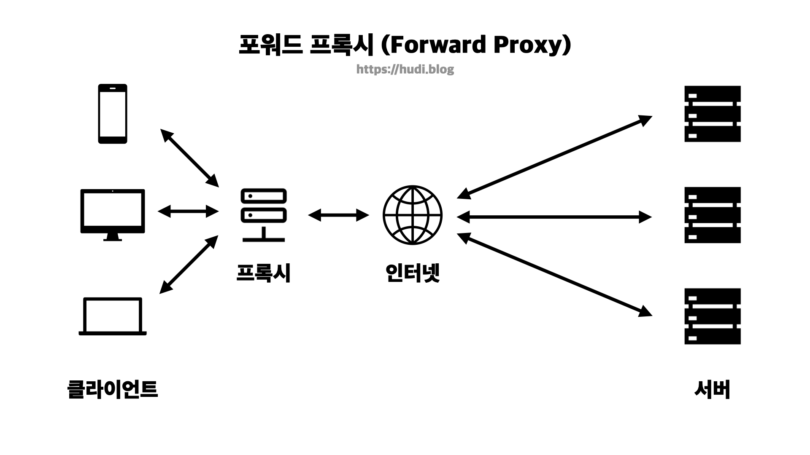
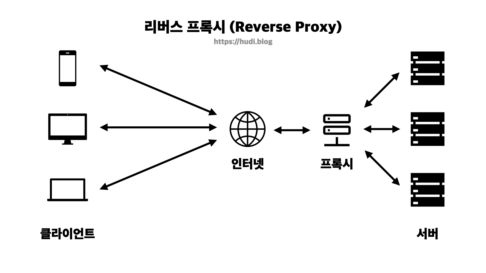

## 프록시 (Proxy)

### 프록시란?

프록시는 클라이언트와 서버 사이에 위치한 중계 서버로 통신을 대신 수행하는 대리자 역할을 한다. 프록시가 없다면 클라이언트는 서버와 직접 통신한다. 반면, 클라이언트와 서버 사이에 프록시 서버가 있다면, 클라이언트와 서버는 프록시를 한번 거쳐 통신하게된다.

## 왜 프록시를 사용할까?

프록시를 사용하면 보안을 강화할 수 있고, 통신 성능을 높여주고, 통신 비용을 절약할 수 있다. 프록시는 프록시 서버의 위치에 따라 유형이 나뉜다. 유형에 따라 각각의 용도도 조금씩 다른데, 이 포스팅에서는 프록시의 유형을 크게 포워드 **프록시 (Forward Proxy)** 와 **리버스 프록시 (Reverse Proxy)** 2가지로 나누어 설명한다.

## 포워드 프록시 (Forward Proxy)

포워드 프록시는 일반적으로 사람들이 떠올리는 프록시의 유형이다. 포워드 프록시는 클라이언트와 인터넷 사이에 위치해있다. 이로 인해 클라이언트의 정보가 서버측에 노출되지 않는다.

포워드 프록시는 어떤 용도로 사용될까?

### 캐싱

프록시를 사용하면 자주 사용되는 HTML, JS, CSS, 이미지와 같은 정적 파일들을 원 서버로부터 캐싱하고, 클라이언트가 요청할 때 원 서버로 요청하는 대신 가지고 있는 캐시로 응답할 수 있다.

캐싱된 데이터에 대한 요청이 발생하면, 원 서버에 대한 부하가 감소하고, 네트워크의 병목 현상도 감소할 것 이다. 또한 클라이언트 입장에서 원 서버에 비해 프록시 서버가 물리적으로 더 가까운 위치에 있다면 전송 시간도 절약될 것 이다.

### 특정 컨텐츠 액세스 제한

학교 혹은 사내의 내부망에 프록시 서버를 두어 특정 컨텐츠에 대한 액세스를 제한할 수 있다. 학교에서는 학생들에게 유해한 웹사이트를 프록시 서버를 통해 차단할 수 있다. 클라이언트의 모든 요청은 프록시를 거쳐 인터넷으로 연결되기 때문이다. 또한 사내망에서도 보안을 위해서 특정 웹사이트에 대한 접속을 차단할 수 있다.

### 익명성 확보

모든 요청이 프록시 서버를 통해 발생하므로 클라이언트는 인터넷에서 자신을 숨길 수 있다. 클라이언트의 진짜 IP 주소가 노출되는 것을 원치 않을 경우 프록시 서버를 경유할 수 있다.

## 리버스 프록시 (Reverse Proxy)

리버스 프록시는 조금 생소하다. 리버스 프록시는 서버와 인터넷 사이에 위치한 프록시 서버이다. 클라이언트의 요청을 서버 대신 받게된다. 이런 구조에서는 클라이언트는 프록시 뒤의 서버의 존재를 모르게 되며, 웹 서버에 요청하듯이 프록시 서버에 요청하게 될 것이다.

리버스 프록시는 어떤 용도로 사용될까?

### 로드 밸런싱

인기 있는 서비스는 하루에도 매일 수백만명의 트래픽이 들어올 것 이다. 이를 하나의 서버를 두어 처리하는 것은 무리가 있을 것 이다. 따라서 수평 확장(scale out)을 하여 다중 서버 환경을 구축하게 될 것이다. 이때 프록시는 여러 서버에 각각 부하를 분산하여 한 서버에 집중적으로 부하가 몰리는 상황을 방지하는 역할을 할 수 있다. 혹은 몇 서버가 장애가 발생했을 때 해당 서버로 요청을 보내지 않도록 설정할수도 있을 것 이다.

### DDoS 등의 공격으로부터 보호

앞서 말했듯 서버 앞단에 프록시를 두게 되면 서버는 인터넷으로부터 숨겨진다. 외부에서는 서버의 IP를 알 수 없을 것 이다. 이렇게 되면 공격자는 DDoS 등의 공격 대상으로 실제 서버를 두기 어려울 것 이다. 즉, 공격자는 리버스 프록시 서버만 공격 대상으로 설정할 수 있을 것 이다. 이로 인해 실제 서버를 여러 공격으로부터 보호할 수 있다.

클라우드 플레어와 같은 서비스가 이런 원리로 우리의 서버를 DDoS 공격으로부터 보호할 수 있는 것 이다.

### SSL 암호화

리버스 프록시에만 SSL을 적용하면, 실제 서버는 SSL 통신에서 오는 추가적인 계산 비용을 없앨 수 있다.

### 캐싱

포워드 프록시과 동일하게 리버스 프록시도 캐싱 기능을 수행할 수 있다.

## 참고

- 데이빗 고울리 외 4명, HTTP 완벽 가이드
- [https://www.youtube.com/watch?v=YxwYhenZ3BE](https://www.youtube.com/watch?v=YxwYhenZ3BE&t=77s)
- [https://www.cloudflare.com/ko-kr/learning/cdn/glossary/reverse-proxy/](https://www.cloudflare.com/ko-kr/learning/cdn/glossary/reverse-proxy/)
