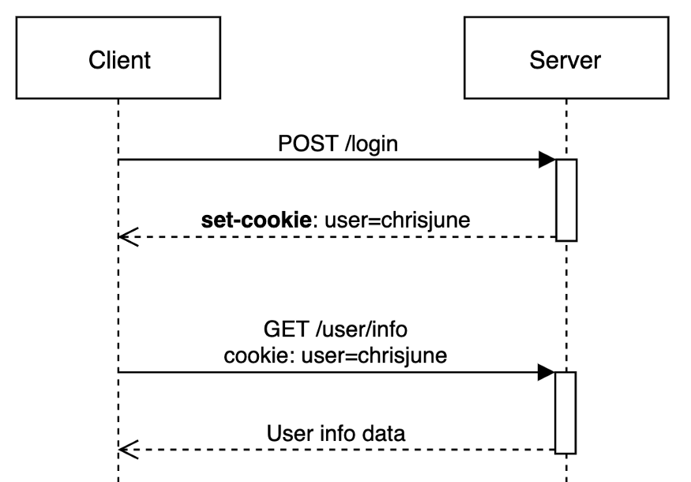
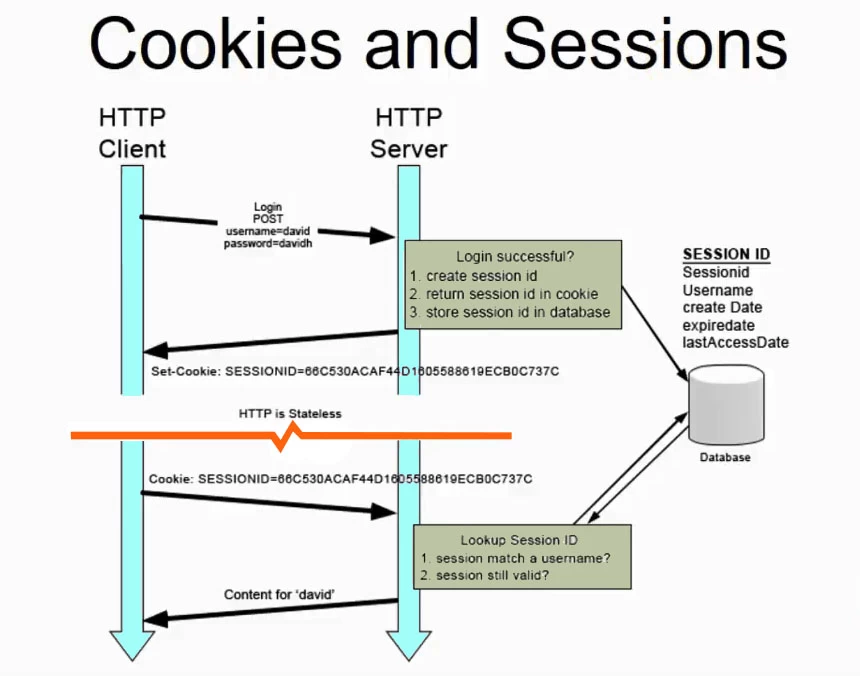

## HTTP의 비연결성과 비상태성

HTTP는 요청과 응답을 한번 주고받으면 바로 연결을 끊어버리는 특성을 가지고 있다. 그리고 다음 요청을 하기 위해 다시 연결을 맺어야한다. 이를 HTTP의 **비연결성(Connectionless)** 이라고 한다.

또한 HTTP 프로토콜은 요청과 응답을 교환하는 동안 상태(Status)를 저장하지 않는다. 따라서 HTTP 레벨에서는 이전에 보냈던 리퀘스트나 리스폰스를 기억하지 못한다. 즉, HTTP 요청은 직전의 요청과 전혀 관련이 없다. 이를 HTTP의 **비상태성(Stateless)** 이라고 한다.

HTTP가 상태를 갖지 않음으로서 연결을 맺을 때 발생하는 오버헤드가 줄어들고, 데이터를 빠르고 확실하게 처리할 수 있다고 한다. 또한 요청간의 상태를 공유하지 않으므로 확장성을 갖는다고 한다. 왜 이런 특징을 갖을까? 처음 HTTP가 등장할 때에는 단순히 HTML 문서만을 주고 받는것이 목적의 전부였기 때문에, 최대한 단순하게 설계되었기 때문이다.

하지만 웹이 발전하면서 요청과 요청간의 상태가 유지되어야 할 필요가 있어졌다. 상태가 유지가 되지 않으면, 사용자는 페이지를 이동할 때 마다 새롭게 로그인을 해줘야할 것 이다. 그런데 이상하다. 우리는 그런 경험을 해본적이 없다. 어떻게 상태가 유지되는 것 일까?

## 쿠키 (Cookie)



이런 HTTP의 비상태성을 보완하기 위해 등장한 것이 쿠키이다. 쿠키는 HTTP 요청과 응답에 함께 실려 전송된다. 쿠키는 클라이언트 즉, 브라우저에 저장된다. 웹 서버가 클라이언트로 보내는 응답의 헤더 중 `Set-Cookie` 라는 헤더에 키와 값을 함께 실어 보내면 그 응답을 받은 브라우저는 해당 쿠키를 저장하고, 그 다음 요청부터 자동으로 쿠키를 헤더에 넣어 송신한다.

### Set-Cookie 헤더

[MDN](https://developer.mozilla.org/ko/docs/Web/HTTP/Headers/Set-Cookie)에 따르면 `Set-Cookie` 헤더는 아래와 같이 전송될 수 있다고 한다.

```
Set-Cookie: <cookie-name>=<cookie-value>
Set-Cookie: <cookie-name>=<cookie-value>; Expires=<date>
Set-Cookie: <cookie-name>=<cookie-value>; Max-Age=<non-zero-digit>
Set-Cookie: <cookie-name>=<cookie-value>; Domain=<domain-value>
Set-Cookie: <cookie-name>=<cookie-value>; Path=<path-value>
Set-Cookie: <cookie-name>=<cookie-value>; Secure
Set-Cookie: <cookie-name>=<cookie-value>; HttpOnly

Set-Cookie: <cookie-name>=<cookie-value>; SameSite=Strict
Set-Cookie: <cookie-name>=<cookie-value>; SameSite=Lax
```

이때 `;` 로 구분되는 옵션을 Directive라고 하며, 여러개의 Directive를 설정하려면 아래와 같이 헤더를 설정하면 된다.

```
Set-Cookie: <cookie-name>=<cookie-value>; Domain=<domain-value>; Secure; HttpOnly
```

위와 같은 헤더를 받은 브라우저는 다음 요청부터 아래와 같이 `Cookie` 헤더에 쿠키를 실어 보낸다.

```
Cookie: cookie_name_1=value_1; cookie_name_2=value_2
```

### 쿠키의 문제점

앞서 말했듯 쿠키는 한번 생성되면 매 요청마다 헤더에 실려 서버로 전송된다. 만약 쿠키에 저장된 정보가 많다면, 매번 요청마다 큰 오버헤드가 발생할 것이다. 이런 이유로 브라우저마다 다르겠지만 일반적으로 쿠키의 데이터는 4kb로 제한이 되어있다. 또한 인터넷 익스플로러를 제외하고는 사이트당 쿠키의 갯수도 20개로 제한이 되어있다고 한다.

이런 성능이슈와 더불어 보안이슈도 존재한다. 쿠키는 위에서 이야기했듯 클라이언트 측에 저장된다. 만료시각을 명시하지 않으면 쿠키는 메모리에 저장되어 브라우저를 종료하면 휘발되지만, 만료시각을 명시하면 파일로 저장되어 브라우저가 종료되더라도 휘발되지 않는다. 만약 민감한 정보을 가지고 있는 쿠키가 파일의 형태로 있다면 해커에게 탈취되기 쉬울 것 이다.

그리고 필자가 중학생 시절 즈음에는 지금처럼 보안의식이 높지 않았다. 따라서 쿠키를 통해 유저의 권한을 체크하는 웹사이트가 종종 있었는데, 클라이언트에 저장된 쿠키의 값을 직접 수정하여 관리자 권한을 탈취하는 방식의 해킹 피해 사례를 실제로 가끔 봤었다.

## 세션 (Session)



세션은 쿠키와 다르게 정보를 서버측에 저장하는 방식이다. 세션을 사용하면 위에서 언급한 쿠키의 문제점의 다수를 해결할 수 있다.

세션이란 브라우저로 웹서버에 접속한 시점부터 브라우저를 종료하여 연결을 끝내는 시점까지의 일련의 요청을 하나의 상태로 간주하고, 그 상태를 일정하게 유지하는 기술이다. 그렇다면 이 세션은 어떻게 비상태성을 갖는 HTTP에서 어떻게 상태를 일정하게 유지할까?

### 세션 생성 과정

맨 처음, 사용자가 HTTP 요청의 Body에 인증 정보 (유저이름이나 패스워드 같은 것들) 을 실어 서버로 보낸다. 서버에서는 해당 인증정보가 유효하면 사용자와 데이터를 식별하는 **Session ID**를 생성한다. 생성된 Session ID는 응답의 `Set-Cookie` 헤더에 생성된 세션 아이디를 실어 보내진다.

클라이언트는 해당 세션 아이디를 쿠키에 저장하고, 매 요청마다 세션 아이디를 `Cookie` 헤더에 실어 전송한다. 서버는 전달받은 세션 아이디를 통해 해당 요청의 송신자가 누구인지 식별할 수 있다.

> 세션 아이디에 대한 쿠키의 Key는 세션을 관리하는 주체에 따라 다르다. 즉, 무조건 쿠키에 `SESSIONID` 라는 이름으로 저장되는 것은 아니다. 예를들어 톰캣은 `JSESSIONID` 라는 이름으로 세션 아이디를 저장하고, node.js 는 `connect.sid` 라는 이름으로 저장한다고 한다.

### 세션 정보는 어디에 저장될까?

일반적으로 생성된 세션 데이터는 서버의 메모리에 저장된다. 하지만 로드 밸런싱등의 이유로 서버를 수평 확장(Scale Out) 하는 경우가 많을 것이다. 이런 경우 최초 세션이 생성된 서버와 그 이후의 요청을 받은 서버가 다른 경우 세션이 불일치하는 문제가 발생할 것 이다.

이런 문제를 해결하기 위해 유저의 요청이 무조건 세션을 생성한 서버로 향하도록 하는 Sticky Session, 여러 웹서버가 모두 동일한 세션 정보를 가지고 있는 Session Clustering 방식이 있지만, 세션 정보를 관리하는 서버를 아예 별개로 두는 Session Storage 방식이 가장 많이 쓰인다고 한다.

이를 위해 MySQL 같은 일반적인 RDBMS를 사용할수도 있겠지만, Key-Value로 저장되는 세션 특성상 Redis나 memcached 와 같은 Key-Value 쌍으로 저장되는 인메모리 스토어를 사용하는 것이 일반적이다.

> 세션 불일치 문제를 해결하기 위한 Sticky Session, Session Clustering, Session Storage 이 세가지 방법은 별도의 포스트로 자세히 다뤄보겠다.

## 참고

- [https://docs.progress.com/bundle/pas-for-openedge-administration-117/page/Overview-of-HTTP-sessions.html](https://docs.progress.com/bundle/pas-for-openedge-administration-117/page/Overview-of-HTTP-sessions.html)
- [https://developer.mozilla.org/ko/docs/Web/HTTP/Cookies](https://developer.mozilla.org/ko/docs/Web/HTTP/Cookies)
- [https://developer.mozilla.org/ko/docs/Web/HTTP/Headers/Set-Cookie](https://developer.mozilla.org/ko/docs/Web/HTTP/Headers/Set-Cookie)
- [https://www.geeksforgeeks.org/difference-between-session-and-cookies/](https://www.geeksforgeeks.org/difference-between-session-and-cookies/)
- [https://hyuntaeknote.tistory.com/3](https://hyuntaeknote.tistory.com/3)
- [https://www.quora.com/Why-is-HTTP-stateless](https://www.quora.com/Why-is-HTTP-stateless)
