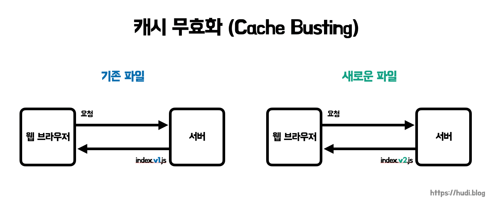

## 정적 파일의 캐싱

CSS, JS와 같은 정적 파일은 **새로운 프론트엔드 코드가 배포되기 전까지는 변경될 일이 없다**. 따라서 이런 정적 파일들은 **되도록 길게 캐시 유효 기간을 설정**해도 될 것 같다. 그런데, 사실 문제점이 존재한다.

무턱대고 정적 파일의 캐시 유효 기간을 길게 설정할 경우 정적 파일의 업데이트가 이뤄졌을 때, 정작 사용자 입장에서는 **캐시 유효 기간이 끝나지 않아 예전 버전을 계속 보고 있을 수 있다**. 기본적으로 브라우저는 캐시 유효 기간이 끝났을 때, 캐시 유효성 검증을 서버에 요청하기 때문이다.

**이런 문제를 해결하기 위해 캐시 무효화(Cache Busting) 전략을 사용한다.**

## 캐시 무효화 (Cache Busting)



**기본 캐시 키(primary cache key)는 요청 메서드와 URI**로 구성된다. 다만, 캐시는 일반적으로 GET 메소드만을 대상으로 동작하므로 URI만 사용되는 경우가 일반적이다. ([참고](https://developer.mozilla.org/ko/docs/Web/HTTP/Caching))

캐시 무효화는 이런 특성을 이용한다. 정적 파일의 이름으로 `bundle.js` , `common.css` 와 같은 이름에 추가로 고유한 파일의 버전을 식별할 수 있는 문자열을 추가하여, 브라우저가 항상 최신 버전의 정적 리소스를 바라볼 수 있도록 한다. 쉽게 말하면, **새로운 버전을 배포할때마다 URL이 달라지게끔 만드는 전략**이다.

캐시 무효화를 사용하면, **최대한 오래동안 정적 파일을 캐싱해두면서도, 새로운 버전의 정적 파일을 배포하면 사용자는 그 즉시 최신 버전을 바라볼 수 있게** 된다. `max-age` 의 최대 기간은 1년인데, 따라서 보통 캐시 무효화 전략을 사용하면 **1년으로 캐시 유효 기간을 설정**한다.

### 캐시 무효화 방법

- 파일명에 버전 포함하기 (e.g. `bundle.v2.js`)
- 경로에 버전 포함하기 (e.g. `/v2/bundle.js`)
- 쿼리 스트링에 버전 포함하기 (e.g. `bundle.js?v=2`)
- 파일명에 파일의 해시 포함하기 (e.g. `bundle.ec0405c5aef93e771cd80e0db180b88b.js`)
- 쿼리 스트링에 파일의 해시 포함하기 (e.g. `bundle.js?v=ec0405c5aef93e771cd80e0db180b88b`)

캐시 무효화 방법은 위와 같이 여러가지가 존재한다. v2, v3, … 처럼 버전을 명식적으로 파일명에 포함하는 방식은 번거로우므로, **파일의 해시를 파일명에 포함하는 방식이 상대적으로 편리**할 듯 하다.

또한 **쿼리 스트링을 사용하는 방식은 캐싱 문제를 야기하는 것으로 알려져있다** ([참고](https://www.keycdn.com/support/what-is-cache-busting)). 이 내용은 나중에 조금 더 깊게 공부해봐야 할 것 같다.

## 캐시 무효화 주의점

```
<!DOCTYPE HTML>
<html lang="ko">
<head>
	<script src="./bundle.ec0405c5aef93e771cd80e0db180b88b.js"></script>
  <meta content="text/html; charset=UTF-8" http-equiv="Content-Type"/>
</head>
<body>
	Hello, World!
</body>
</html>
```

`bundle.js` 나 `common.css` 와 같은 정적 파일을 포함하고 있는 위와 같은 `html` 파일 등을 **Main Resource** 라고 한다. 당연하지만, 이런 **Main Resource 에는 캐시 무효화 전략을 사용할 수 없다**.

Main Resource의 경우에는 `no-store` 를 사용하여 아예 캐시하지 않도록 하거나, `no-cache` 를 사용하여 캐시하되, 항상 캐시 유효성 검증을 하도록 설정해주어야 한다.

## 참고

- [https://www.youtube.com/watch?v=UxNz_08oS4E](https://www.youtube.com/watch?v=UxNz_08oS4E) 🐦
- [https://www.keycdn.com/support/what-is-cache-busting](https://www.keycdn.com/support/what-is-cache-busting)
