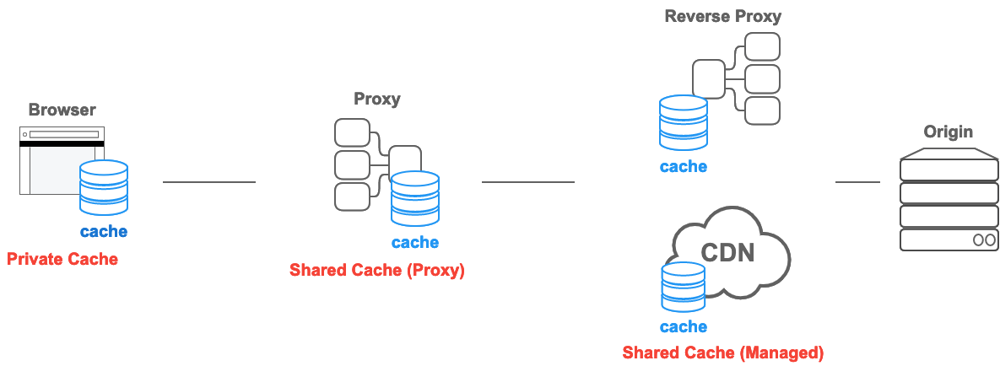

## 캐시란?

컴퓨터 공학 전반에서 이야기되는 캐시는 **자주 사용되는 데이터를 임시로 복사해두는 임의의 장소**를 의미한다. 그리고 데이터를 캐시에 저장하는 행위를 캐싱이라고 한다. 일반적으로 캐싱은 캐시에 저장된 데이터에 접근하는 시간에 비해 **원본 데이터에 접근하는 시간이 오래 걸리는 경우** 사용한다.

비유하자면 내가 자주 보는 책을 읽을 때 마다 도서관에 가는 것 보다, 책을 도서관에서 빌려 내 책상 위에 보관하는 것이 더 효율적일 것이다. 이때 도서관의 책을 원본 데이터, 내 책상위에 있는 책을 캐시 데이터라고 보면 된다.

많은 종류의 캐시가 있지만, 이번 포스팅에서는 HTTP에서의 캐시 개념과 캐시를 설정하는 방법에 대해서 알아볼 것이다.

## HTTP 캐시

앞서 설명했듯이 캐시는 자주 사용하는 데이터에 더 빠르게 접근하기 위해 사용한다. 데이터 접근을 위해 네트워크를 사용해야하는 웹 환경에서도 캐시는 유용하게 사용할 수 있다. HTTP 캐싱을 활용하면 웹 사이트의 로딩 시간을 개선할 수 있다.

특히 이미지 혹은 JS, CSS와 같은 파일들은 자주 변하지 않는다. 캐시를 사용하지 않으면 자주 변하지 않는 데이터라도 요청마다 새롭게 다운로드 해야한다. 이는 불필요한 네트워크 비용 발생을 야기하고, 서버에 추가적인 부담을 준다. 이는 곧 느린 웹페이지 로딩 속도로 직결되고, 좋지 않은 사용자 경험을 낳을 것 이다.

## HTTP 캐시 종류



> HTTP 캐시 종류는 MDN 문서를 기준으로 구분하였다.

### Private Cache

웹 브라우저에 저장되는 캐시이며, 다른 사람이 접근할 수 없다. 단, 서버 응답에 `Authorization` 헤더가 포함되어 있다면 Private Cache에 저장되지 않는다.

### Shared Cache

Shared Cache 는 웹 브라우저와 서버 사이에서 동작하는 캐시를 의미하며, 다시 Proxy Cache와 Managed Cache 2가지로 나뉜다.

#### Proxy Cache

(포워드) 프록시에서 동작하는 캐시이다.

#### Managed Cache

AWS Cloudfront 혹은 Cloudflare 와 같은 CDN 서비스 그리고 리버스 프록시에서 동작하는 캐시이다. 이런 서비스들의 관리자 패널에서 직접 캐시에 대한 설정을 관리하거나 리버스 프록시 설정으로 관리할 수 있으므로 Managed Cache라고 불린다.

> 포워드 프록시와 리버스 프록시에 대한 자세한 내용은 **[포워드 프록시와 리버스 프록시](https://hudi.blog/forward-proxy-reverse-proxy/)** 포스트를 참고하자.

## 캐시 유효기간

**Cache-Control** 은 HTTP 에서 캐시 메커니즘을 지정하기 위해 사용되는 헤더이다. 많은 디렉티브(directive)가 있지만, **max-age** 라는 디렉티브를 사용하면 캐시의 최대 수명을 설정할 수 있다. 이때, max-age의 단위는 초 이다.

```
HTTP/1.1 200 OK
Content-Type: text/html
Cache-Control: max-age=3600
Content-Length: 157

<!DOCTYPE HTML>
<html lang="ko">
<head>
    <meta content="text/html; charset=UTF-8" http-equiv="Content-Type"/>
</head>
<body>
Hello, World!
</body>
</html>
```

웹 브라우저가 특정 리소스에 최초로 요청했을 경우 서버는 아래와 같이 Cache-Control 헤더가 포함된 응답을 보낸다. 위 응답을 받은 웹 브라우저는 응답 결과를 3600초 즉, 1시간 동안 캐시에 저장한다.

이후 웹 브라우저가 같은 리소스에 요청을 보내면, 실제 웹 서버에 요청을 보내는 것이 아니라 **캐시에 저장한 사본 데이터를 사용자에게 제공**한다.

max-age 디렉티브에 명시한 캐시 유효 시간이 지난 이후 동일한 리소스를 요청하면, 그때는 실제로 웹 서버에 리소스를 요청한다. 이때, 캐시된 데이터가 지정된 캐시 시간을 지나지 않아 유효한 경우 **신선하다(fresh)**라고 표현하며, 캐시 시간이 초과된 경우는 **신선하지 않다(stale)**라고 표현한다.

## 캐시 유효성 검증 및 조건부 요청

캐시의 유효 기간이 지난 다음 다시 서버에 리소스를 요청하면 둘 중 하나일 것 이다. 이전과 다르지 않은 데이터를 그대로 받거나, 새롭게 갱신된 데이터를 받거나. 이때, 전자의 경우에는 **의미 없는 트래픽을 낭비**한 것이 된다.

이런 트래픽 낭비를 줄이기 위해, 실제 원본 데이터가 수정 되었을 때만 리소스를 내려 받는것이 바람직하다. 이런 과정을 **캐시 유효성 검증(validation) 및 조건부 요청(conditional request)**이라고 한다.

이 방식은 크게 2가지로 나뉜다. 첫번째로는 리소스의 마지막 갱신 시각으로 검증하는 `Last-Modified` 와 `If-Modified-Since` 를 사용하는 방법, 두번째로는 리소스의 식별자를 기준으로 검증하는 `ETag` 와 `If-None-Match` 를 사용하는 방법이다.

### Last-Modified / If-Modified-Since

#### 최초 요청 시 응답

```
HTTP/1.1 200 OK
Content-Type: text/html
Cache-Control: max-age=3600
Last-Modified: Sat, 03 Sep 2022 00:00:00 GMT
Content-Length: 157

<!DOCTYPE HTML>
<html>
...
```

아까와 동일한 응답이다. 단, 여기에 `Last-Modified` 라는 헤더가 추가되었다. 이 헤더에는 요청한 리소스가 마지막으로 수정된 일자를 나타낸다. 브라우저는 이 `Last-Modified` 를 저장해둔다.

#### 두번째 요청

```
GET /index.html HTTP/1.1
Host: example.com
Accept: text/html
If-Modified-Since: Sat, 03 Sep 2022 00:00:00 GMT
```

이후 캐시 기간이 초과되어 두번째 요청 시 브라우저는 저장해둔 `Last-Modified` 값을 `If-Modified-Since` 라는 요청 헤더에 넣어 서버로 요청을 보낸다.

#### 리소스가 변경되지 않았을 경우

```
HTTP/1.1 304 Not Modified
Content-Type: text/html
Cache-Control: max-age=3600
Last-Modified: Sat, 03 Sep 2022 00:00:00 GMT

```

만약 위와 같이 조건부 요청을 보냈는데, 원본 리소스에 아무런 변경이 없었다면, 서버는 위와 같이 `304 Not Modified` 라는 상태 코드로 응답한다. 또한 이 응답에는 Response Body가 없기 때문에 트래픽을 아낄 수 있다.

### ETag / If-None-Match

앞서 소개한 방법은 밀리 세컨드 단위로 시각을 설정할 수 없다는 한계점이 존재한다. ETag란 특정 버전의 리소스를 식별하기 위해 사용하는 식별자이다. 이를 통해 Last-Modified / If-Modified-Since 의 단점을 극복할 수 있다.

#### 최초 요청 시 응답

```
HTTP/1.1 200 OK
Content-Type: text/html
Cache-Control: max-age=3600
ETag: "abcdefg"
Content-Length: 157

<!DOCTYPE HTML>
<html>
...
```

리소스에 대한 최초 요청 시 `ETag` 라는 응답 헤더가 돌아온다. 요청한 리소스의 현재 버전에 대한 식별자이다. 브라우저는 이 `ETag` 값을 저장한다.

#### 두번째 요청

```
GET /index.html HTTP/1.1
Host: example.com
Accept: text/html
If-None-Match: "abcdefg"
```

이후 캐시 기간이 초과되어 리소스에 대해 재요청시 `If-None-Match` 라는 헤더에 저장해둔 `ETag` 값을 넣어서 보낸다.

#### 리소스가 변경되지 않았을 경우

```
HTTP/1.1 304 Not Modified
Content-Type: text/html
Cache-Control: max-age=3600
Last-Modified: "abcdefg"

```

마찬가지로 리소스가 변경되지 않은 경우 서버는 Response Body를 제외하고, `304 Not Modified` 로 응답한다.

## no-cache, no-store

유저에게 항상 최신 버전의 리소스만을 제공하고 싶을 경우가 있을 것이다. 이때, 항상 최신 버전의 리소스를 캐시하거나, 혹은 아예 캐시 자체를 하지 않는 방법이 있다.

이런 옵션을 위해서 웹 브라우저가 요청을 보낼 때 `Cache-Control` 헤더에 `no-cache` 혹은 `no-store` 디렉티브를 포함할 수 있다.

> 눈치 챘겠지만, Cache-Control 은 요청과 응답 양쪽에서 사용되는 헤더이다.

### no-cache

이름 때문에 헷갈리지 말자. `no-cache` 는 캐시를 아예 생성하지 않는 옵션이 **아니다**. **리소스에 대한 캐시를 생성하지만, 리소스를 요청할 때 원 서버에 항상 캐시 유효성 검증**을 하는 옵션이다.

### no-store

`no-store` 는 리소스에 대한 캐시를 생성하지 말라는 가장 강력한 `Cache-Control` 디렉티브이다. 저장하면 안되는 민감한 정보일 때 사용한다.

## private vs public

앞서 Private Cache와 Shared Cache에 대해서 이야기했다. `Cache-Control` 헤더의 `private` 또는 `public` 디렉티브를 사용하여 캐시 허용 범위를 지정할 수 있다.

`public` 디렉티브를 사용하면 Shared Cache 에서도 캐싱을 허용하고, `private` 디렉티브를 사용하면 사용자 브라우저에게만 캐싱을 허용한다.

```
Cache-Control: max-age=3600, private;
```

기존 디렉티브와 함께 사용하려면 위와 같이 `,` 로 구분한다.

## 참고

- [https://www.youtube.com/watch?v=UxNz_08oS4E](https://www.youtube.com/watch?v=UxNz_08oS4E) 🕊🐦
- [https://developer.mozilla.org/en-US/docs/Web/HTTP/Caching](https://developer.mozilla.org/en-US/docs/Web/HTTP/Caching)
- [https://developer.mozilla.org/ko/docs/Web/HTTP/Caching](https://developer.mozilla.org/ko/docs/Web/HTTP/Caching)
- [https://toss.tech/article/smart-web-service-cache](https://toss.tech/article/smart-web-service-cache)
- HTTP 완벽 가이드
