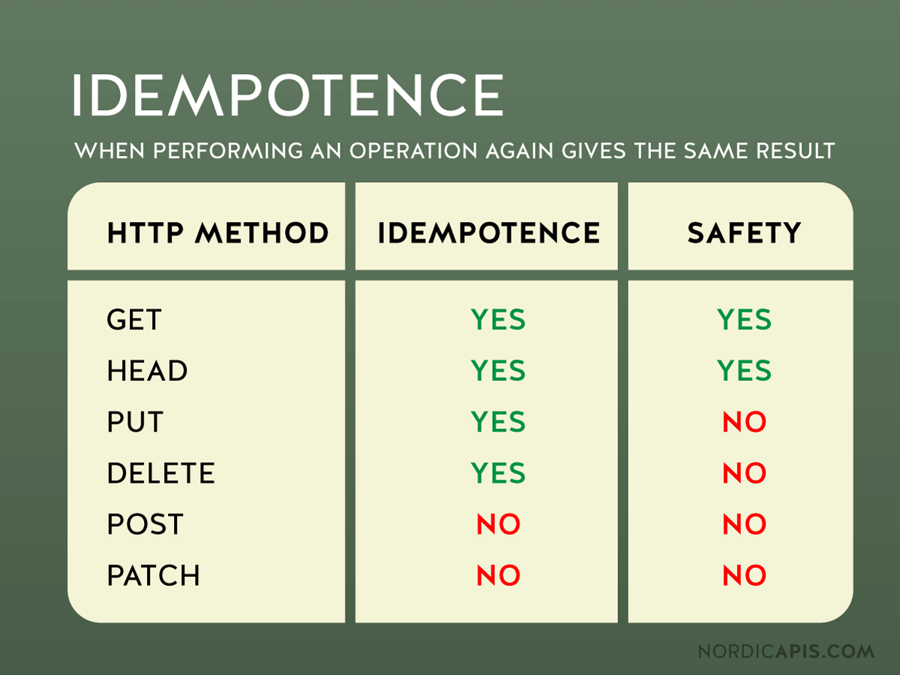

## 멱등성 (Idempotent)

수학이나 전산학에서의 멱등성의 의미는 같은 연산을 여러번 실행한다고 해도 그 결과가 달라지지 않는 성질을 의미한다. 이를테면 아래의 함수는 멱등성을 갖는다고 할 수 있겠다.

```java
public int abs(int number) {
    return Math.abs(number);
}
```

위 함수는 아무리 임의의 값에 연산을 여러번 적용하더라도 같은 결과값을 반환한다. 즉, `abs()` 함수의 반환값을 다시 `abs()` 함수의 파라미터로 전달하더라도 그 결과값이 변화하지 않는다는 이야기이다. 즉, 멱등성의 핵심은 어떠한 값에 대해 여러번 동일한 연산을 수행하였을 때, 호출 횟수에 구애받지 않고 동일한 결과값을 내어주는 성질이라고 이해하면 될 것 같다.

## HTTP Method 의 멱등성

앞서 멱등성의 개념은 HTTP 에서도 동일하게 적용될 수 있다. 동일한 요청을 한번 보내는 것과, 여러번 보내는 것이 서로 동일한 효과를 지니고, 서버의 상태도 동일하게 남을 때 해당 HTTP Method 가 멱등성을 갖는다고 이야기한다. 멱등성을 따질 때에는 서버의 상태만 바라보면 되며, HTTP 응답 Status는 신경쓰지 않아도 된다.

올바르게 구현된 REST API 의 `GET`, `HEAD`, `OPTIONS`, `PUT`, `DELETE` 메소드는 통계 기록(e.g. 게시물 조회수의 증가 등)을 제외하였을 경우 멱등성이 보장된다. 어떤 이유로 `GET`, `HEAD`, `OPTIONS`, `PUT`, `DELETE` 메소드는 멱등성이 보장되어야 할까?

- `GET` : 서버에 존재하는 리소스를 단순히 읽어오기만 하는 메소드이기 때문에 당연히 여러번 수행되어도 결과값은 변하지 않는다. 마찬가지로 `HEAD`, `OPTIONS` 메소드도 조회에 대한 메소드이기 때문에 멱등하다고 할 수 있다.
- `PUT` : 서버에 존재하는 리소스를 요청에 담긴 내용대로 통째로 대체해버리므로 올바르게 구현하였다면 여러번 수행되어도 결과 값은 변하지 않을 것 이다.
- `DELETE` : 존재하는 데이터를 삭제한 결과와 이미 존재하지 않은 결과를 삭제하려는 시도에 대한 응답 코드는 서로 다르겠지만, (200 OK 또는 404 NOT FOUND) 서버의 상태 자체는 변하지 않으므로 올바르게 구현되었다면 여러번 수행되어도 멱등성이 보장될 것 이다.

하지만, `POST`는 이야기가 다르다. `POST` 메소드가 호출될 때 마다 데이터베이스 등에 요청된 데이터가 추가될 것 이고, 이는 곧 멱등성을 위배함을 알 수 있다. 호출시 마다 서버의 상태가 달라지기 때문이다.

그렇다면 `PATCH` 메소드는 어떨까? 결론부터 말하자면 `PATCH` 메소드는 항상 멱등성을 보장한다고 이야기할 수 없다. 정확히는 `PATCH`는 멱등성을 보장하도록 설계할 수 있지만, 멱등성을 보장하지 않도록 설계할 수도 있다. `PUT`은 요청에 대하여 리소스를 통째로 바꿔버리기 때문에 멱등성이 보장되지만, `PATCH`는 리소스의 일부에 대하여 변화를 명령할 수 있기 때문이다.

```json
{
  "operation": "add",
  "age": 10
}
```

위 요청을 `PATCH` 메소드로 실어 보낸다면, 해당하는 리소스의 `age` 라는 필드는 요청마다 10씩 증가하게 될 것 이다. 따라서 단일 호출에 대한 응답과 다중 호출에 대한 응답에 대한 서버의 상태가 다를 것이고, 곧 이는 멱등하지 않음을 의미한다.

## 안전한 메소드 (Safe Methods)

안전한 메소드란, 서버의 상태를 변경시키지 않는 HTTP 메소드를 의미한다. `GET`, `OPTIONS`, `HEAD` 와 같이 조회에 사용되는 메소드를 안전하다고 이야기할 수 있다. 모든 안전한 메소드는 멱등성을 갖지만, 그 역은 성립하지 않는다.

앞서 이야기한 `PUT`과 `DELET` 메소드는 멱등성을 갖는다고 이야기 했다. 하지만 `PUT`은 리소스를 수정하고, DELETE는 메소드를 제거하므로 안전한 메소드라고는 이야기할 수 없다.

즉, 멱등성을 갖는 메소드가 서버의 상태를 변경하지 않는다고 오해하면 안된다. 멱등성을 갖는 메소드도 서버의 상태를 변경시킬 수 있다. 멱등성의 핵심은 **"요청에 대한 서버의 상태가 항상 같은가?"** 이다.

## 참고

- [https://developer.mozilla.org/ko/docs/Glossary/Idempotent](https://developer.mozilla.org/ko/docs/Glossary/Idempotent)
- [https://meetup.toast.com/posts/218](https://meetup.toast.com/posts/218)
- [https://developer.mozilla.org/ko/docs/Glossary/Safe/HTTP](https://developer.mozilla.org/ko/docs/Glossary/Safe/HTTP)
- [https://www.inflearn.com/questions/110644](https://www.inflearn.com/questions/110644)
- [https://honor-driven.dev/get으로-조회수가-올라가면-멱등성을-위반하는게-아닐까-fd2895466a73](https://honor-driven.dev/get%EC%9C%BC%EB%A1%9C-%EC%A1%B0%ED%9A%8C%EC%88%98%EA%B0%80-%EC%98%AC%EB%9D%BC%EA%B0%80%EB%A9%B4-%EB%A9%B1%EB%93%B1%EC%84%B1%EC%9D%84-%EC%9C%84%EB%B0%98%ED%95%98%EB%8A%94%EA%B2%8C-%EC%95%84%EB%8B%90%EA%B9%8C-fd2895466a73)
