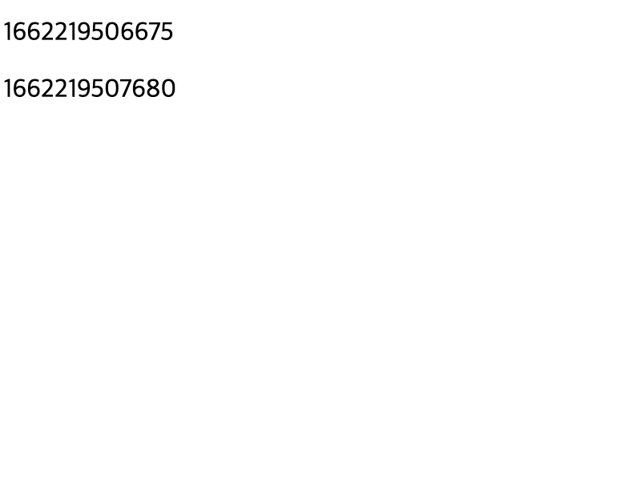

## 비연결성 프로토콜, HTTP

모두가 알다시피 HTTP는 **비연결성(connectionless) 프로토콜**이다. 한번 연결되고, 요청과 응답을 주고 받으면 곧바로 연결을 끊어버린다는 뜻이다.

> Keep alive를 사용하여 한번의 TCP 커넥션으로 여러번의 요청, 응답을 주고받을 수 있다지만, 이렇다고 HTTP가 연결 지향 프로토콜이라고 부르기에는 무리가 있다.

또한 HTTP는 **클라이언트-서버 아키텍처**를 따른다. 서버는 클라이언트의 수동적으로 기다리며, 클라이언트가 서버에 요청을 보내면 서버는 클라이언트의 요청에 대한 응답을 해준다. 즉, HTTP 에서는 **서버가 먼저 능동적으로 클라이언트에게 메시지를 보내는 일은 없다**.

이러한 특성으로 일반적인 방식으로는 **HTTP에서 실시간 서비스를 제공하기에는 어려웠다**.

## Polling과 Long-Polling

하지만 웹 기술이 발전하면서, 점점 유저에게 실시간으로 데이터를 제공해야하는 니즈가 많아졌다. 이에 **폴링(polling)이나 롱-폴링(long-polling) 기법**이 등장하였으나, 일정 주기를 두고 HTTP 요청을 반복하는 특성상 **완전한 실시간성을 보장하긴 어려웠다.** 또한 폴링 기법은 의미없는 패킷을 서버에게 보내게 된다는 한계점이 존재한다.

## Server-Sent Events (SSE)

Server-Sent Events 줄여서 SSE는 HTTP 프로토콜에서 **클라이언트가 서버로부터 데이터를 실시간으로 스트리밍 받을 수 있는 HTML5 표준 기술**이다. SSE에서는 **서버 → 클라이언트 단방향**으로만 데이터가 흐른다.

현재 SSE는 IE를 제외하고 모든 브라우저에서 지원한다만, IE도 Polyfill을 통해 지원할 수 있다. 근데 장례식까지 치뤄준 IE는 그만 보내주는게 좋지 않을까…

HTTP/1.1 프로토콜에서는 브라우저에서 1개 도메인 당 최대 6개 EventStream을 생성할 수 있고, HTTP/2.0 을 사용하면 최대 100개까지 가능하다고 한다.

## SSE 구현 - 자바스크립트

```html
<!DOCTYPE html>
<html>
  <head>
    <meta charset="utf-8" />
    <script>
      const eventSource = new EventSource("/sse")
      eventSource.onmessage = event => {
        const p = document.createElement("p")
        p.innerText = event.data

        document.getElementById("messages").appendChild(p)
      }
    </script>
  </head>

  <body>
    <div id="messages"></div>
  </body>
</html>
```

굉장히 간단하다. `EventSource` 라는 Javascript API를 사용하여 SSE 이벤트를 어디서 받아올지 경로를 지정하고, 이벤트 리스너만 설정해주면 끝이다.

> 위 HTML 파일은 스프링 서버에서 직접 서빙한다.

## SSE 구현 - 스프링

### HttpServletResponse을 사용한 구현

Spring에서는 SseEmitter 라는 SSE 통신을 위한 구현체를 제공한다. 하지만 SSE의 스펙을 공부하는 것이 더 큰 목적이므로, 우선은 `HttpServletResponse` 만을 사용하여 SSE를 구현해보자.

```java
@RestController
@RequestMapping("/sse")
public class SseController {

    @GetMapping
    public void sse(final HttpServletResponse response) throws IOException, InterruptedException {
        response.setContentType("text/event-stream");
        response.setCharacterEncoding("UTF-8");

        Writer writer = response.getWriter();

        for (int i = 0; i < 20; i++) {
            writer.write("data: " + System.currentTimeMillis() + "\n\n");
            writer.flush(); // 꼭 flush 해주어야 한다.
            Thread.sleep(1000);
        }

        writer.close();
    }
}
```

`HttpServletResponse` 의 `getWriter()` 를 사용하여, `Writer` 라는 문자 기반 출력 스트림을 가져온다. `Writer` 의 `write()` 메소드를 사용하여 클라이언트에게 데이터를 전송할 수 있다.

단, 이때 반드시 `flush()` 를 해주어야 한다. 클라이언트 입장에서는 HTTP 헤더를 먼저 수신하여 `Content-Type` 이 `text/event-stream` 인지 확인한 다음 SSE로 수신할 준비를 해야하는데, flush 하지 않으면 클라이언트는 20초 내내 일반적인 HTTP 메시지를 수신하는 줄 알고 기다리게 된다.

데이터는 `data: {보낼 데이터}\n\n` 형식으로 전송하면 된다. 또한 데이터는 UTF-8로 인코딩 되어야 한다.



잘 구현했다면, 위와 같이 실시간으로 데이터를 수신하는 것을 확인할 수 있다.

### SseEmitter를 사용한 구현

```java
@GetMapping
public SseEmitter streamSseMvc() {
    SseEmitter emitter = new SseEmitter();
    ExecutorService sseMvcExecutor = Executors.newSingleThreadExecutor();
    sseMvcExecutor.execute(() -> {
        try {
            for (int i = 0; i < 20; i++) {
                SseEventBuilder event = SseEmitter.event()
                        .data(System.currentTimeMillis());
                emitter.send(event);
                Thread.sleep(1000);
            }
        } catch (Exception ex) {
            emitter.completeWithError(ex);
        }
    });
    return emitter;
}
```

[Bealdung의 예제](https://www.baeldung.com/spring-mvc-sse-streams)를 기반으로 작성한 코드이다. `SseEmitter` 를 사용하면 직접 `HttpServletResponse` 를 통해 HTTP Response를 조작할 필요 없이 위와 같이 편리하게 SSE를 사용할 수 있다.

사실 아직 위 코드가 완벽히 이해되지는 않는다. 왜 별도의 쓰레드를 만들어 동작 시키는지, 컨트롤러인데 왜 반환타입이 `SseEmitter` 인지 등등… 하지만, 이 포스팅의 목표는 server-sent events를 이해하는 것에 있으므로, `SseEmitter` 라는 구현체를 사용하여 SSE를 편리하게 사용할 수 있다는 사실 정도만 알아두려한다. 필요하면 추후에 깊게 공부할 예정이다.

## Websocket으로 구현하면 안될까?

다들 알겠지만, 사실 실시간 통신 애플리케이션을 위한 Websocket 이라는 훌륭한 기술이 존재한다. Websocket은 최초 연결시에만 HTTP를 사용하고, 그 이후의 통신은 별도의 프로토콜을 사용한다. 이 프로토콜은 TCP 에서 동작하며, **양방향 통신**이 가능하다. Websocket은 채팅이나 온라인 게임과 같이 클라이언트와 서버 양방향에서 데이터를 전송해야할 때 적합하다.

하지만, **클라이언트가 서버로 데이터를 보낼 필요가 없는 경우 Websocket은 다소 과할**수도 있다. 예를 들어 **상태 업데이트, 실시간 알림** 등의 기능은 서버에서 클라이언트로 단방향으로만 데이터가 흐른다. 이럴때 SSE를 사용하면 적합하다. Websocket은 SSE 대비 부하가 크기 때문이다. 그리고 SSE는 HTTP로 동작하므로 별도의 프로토콜을 공부하지 않아도 된다는 장점도 있다.

## 참고

- [https://blog.logrocket.com/server-sent-events-vs-websockets/](https://blog.logrocket.com/server-sent-events-vs-websockets/)
- [https://do-study.tistory.com/132](https://do-study.tistory.com/132)
- [https://www.youtube.com/watch?v=-iJJANMLzbw](https://www.youtube.com/watch?v=-iJJANMLzbw)
- [https://gist.github.com/viralpatel/7007662](https://gist.github.com/viralpatel/7007662)
- [https://www.baeldung.com/spring-server-sent-events](https://www.baeldung.com/spring-server-sent-events)
