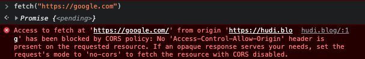
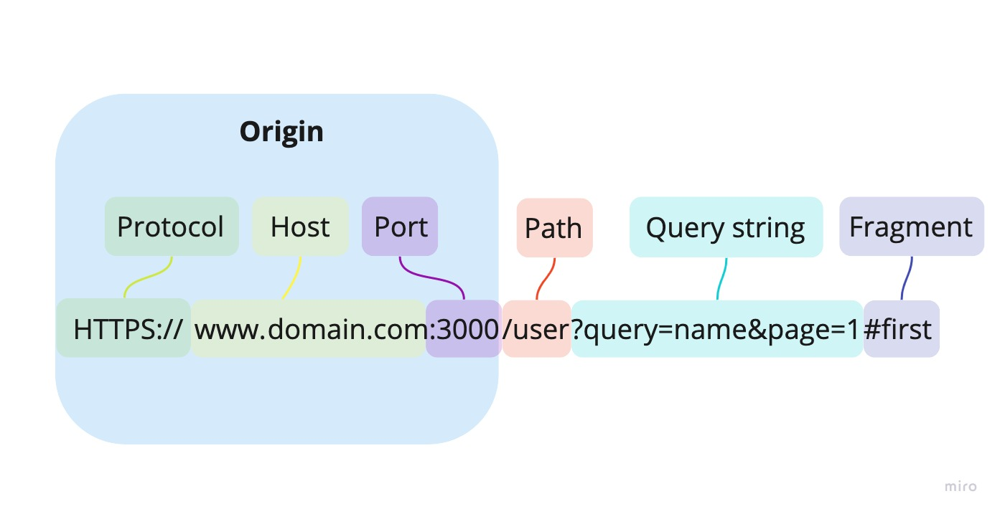
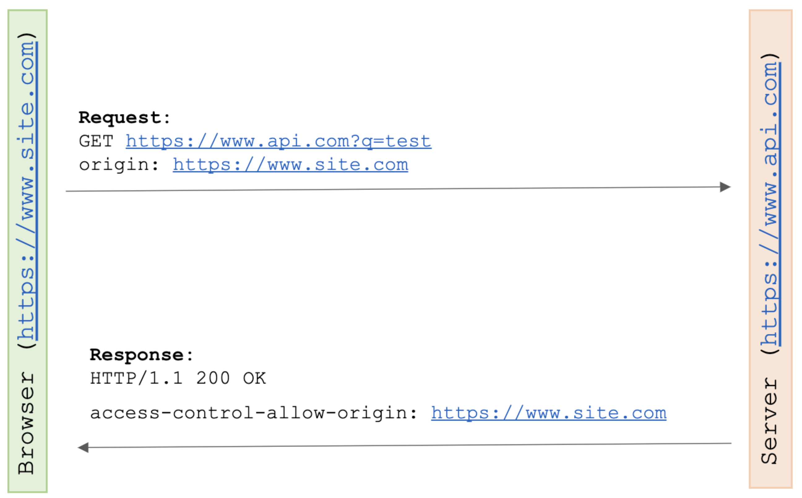
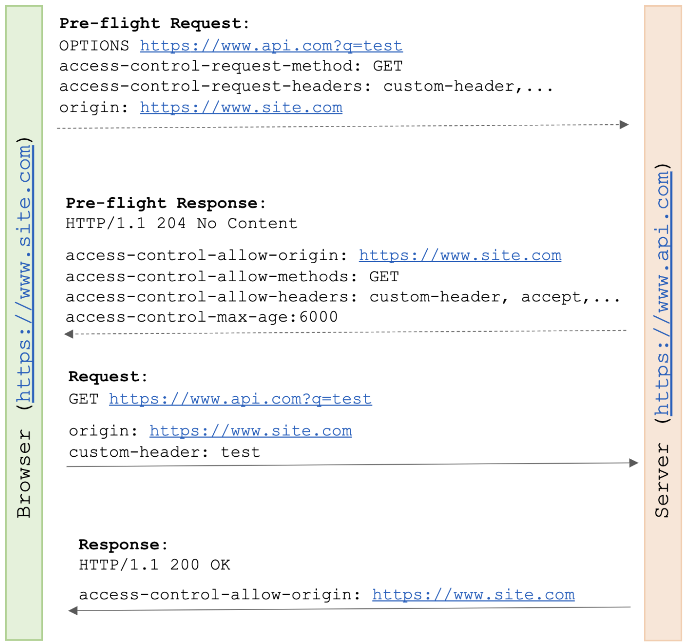

웹 어플리케이션을 개발하다보면 거의 항상 CORS 이슈를 마주하게 된다. 그때마다 항상 이리저리 헤매며 해결방법만을 찾아 다녔는데, 이번 기회에 CORS가 무엇인지 조금 깊게 공부해보았다.

## 출처 (Origin)



CORS와 SOP는 모두 출처(Origin)와 관련된 개념이다. 따라서 이 두가지에 대하여 이야기를 하기 전에 Origin이 무엇인지 알고 넘어가야한다.

출처는 URL의 **스킴(프로토콜), 호스트(도메인), 포트** 이 3가지로 정의된다. 즉, 어떤 URL이 같은 출처인지를 판단하려면 URL의 프로토콜, 도메인, 포트가 모두 같은지 확인하면 된다.

### 동일 출처 예시

- `http://example.com/hello` 와 `http://example.com/bye` 는 다른 URL이지만, 프로토콜, 도메인, 포트가 모두 같으므로 동일 출처이다.
- `http://example.com` 와 `https://example.com` 은 같은 리소스를 가리키고 있지만, 프로토콜이 다르므로 동일 출처가 아니다.
- `http://example.com` 와 `http://example.com:80` 은 얼핏보면 다른 출처같지만, 전자의 경우 http 의 기본 포트인 80이 생략된 형태이므로 이는 같은 출처라고 할 수 있다.

## 동일 출처 정책 (Same-Origin Policy, SOP)

CORS를 알아보기 전에 그 배경이 되는 SOP에 대해 먼저 알아볼 필요가 있다. SOP는 2011년 RFC 6454 문서에서 처음 등장한 보안 정책으로, 동일한 출처 사이에서만 리소스를 공유할 수 있다는 규칙을 가지고 있다. 이 정책은 사용자를 CSRF등의 공격으로부터 보호하기 위해 1차적인 방어선으로 시행되었다.

예전의 웹은 프론트엔드 레이어와 백엔드 레이어를 별도로 구성하지 않는 경우가 많았다. 그 대신 서버가 직접 요청 처리의 결과를 HTML 문서로 만들어 클라이언트에게 보내주었다. 아래의 PHP 코드는 완성된 HTML로 빌드되어 클라이언트로 전송된다.

```php
<html>
  <head>
    <title> PHP example </title>
  </head>
  <body>
    <?php
      $i = 1;

      while($i<=10)
      {
        echo $i."번째<br />";
        $i++;
      }
    ?>
  </body>
</html>
```

이것이 무엇을 의미하냐면, 모든 처리가 같은 도메인 내에서 일어난다는 것 이다. 따라서 애초에 브라우저에서 다른 오리진으로 요청을 보낼 필요가 없었던 것 이었다. Ajax 를 통해 제한적으로 보낸다 하더라도, 같은 도메인 내에서 호출하므로 큰 문제가 없었다.

오히려 그 당시에는 다른 출처로 요청을 보내는 것을 악의적인 행위(CSRF, XSS 등)로 간주하는 것이 자연스러웠고, 따라서 출처가 다른 곳으로 요청하는 것 자체를 브라우저 차원에서 막았던 것 이었다. 하지만 시대의 흐름에 따라 웹 기술로 할 수 있는 것들이 많아졌고, 자연스럽게 다른 출처로 요청을 하고 응답을 받아오는 수요가 증가했다.

## 교차 출처 리소스 공유 (Cross-Origin Resource Sharing, CORS)

서비스중인 어플리케이션의 프론트단에서 제 3자가 제공하는 API를 호출하는 등 점점 웹 서비스에서 요구되는 기능들이 늘어났다. 하지만 SOP라는 브라우저의 정책 때문에 일반적인 방법으로는 불가능했다. 따라서 호출하고 싶은 API를 우리의 백엔드 서버를 한번 거쳐서 호출하거나, JSONP 라는 꼼수도 등장했지만 결국 근본적인 방법이 필요했다.

이런 배경으로 CORS가 등장하게 되었다. 리소스 호출이 허용된 출처를 서버가 명시해놓으면, 출처가 다르더라도 요청과 응답을 주고 받을 수 있도록 만들어놓은 정책이 바로 CORS이다. 조금 더 자세히 알아보자.

## CORS 접근 제어 시나리오

### 단순 요청 (Simple Requests)



브라우저는 다른 출처로의 요청을 보낼 때 자동으로 HTTP 헤더에 Origin 을 추가하여 보낸다.

```http
Origin: https://foo.example
```

이 응답을 받은 서버는 응답 헤더에 `Access-Control-Allow-Origin` 을 실어 보낸다. 이 헤더에는 허가된 출처 정보가 담겨있다.

```http
Access-Control-Allow-Origin: *
```

브라우저는 요청의 Origin 헤더에 담긴 출처 정보가 응답의 `Access-Control-Allow-Origin` 헤더에 담겨있으면 해당 요청을 안전하다고 간주하고 응답을 가져온다.

#### 단순 요청의 조건

단순 요청을 만족하려면 아래의 조건을 만족해야한다.

- `GET`, `POST`, `HEAD` 메서드만 허용된다.
- `Accept`, `Accept-Language`, `Content-Language`, `Content-Type` 헤더만 허용된다.
- `Content-Type` 는 `application/x-www-form-urlencoded`, `multipart/form-data`, `text/plain` 이 세가지 값만 허용된다.

하지만, `Content-Type` 이 `application/json` 인 경우가 굉장히 많으며, 사용자 인증을 위해서 `Cookie` 혹은 `Autorization` 와 같은 추가 헤더를 사용하기 때문에 단순 요청의 조건을 맞추기는 쉽지 않다.

### 프리플라이트 요청 (Preflight Requests)



실제 요청을 보내기 전에 사전 요청을 보내서 해당 리소스에 접근이 가능한지 먼저 확인하는 방식을 Preflight 방식이라고 한다. Preflight는 OPTIONS 메소드를 통해 요청된다.

Preflight 요청은 단순 요청과 마찬가지로 요청에 Origin 헤더를 추가해야한다. Preflight 요청은 여기에 더하여 실제 요청의 메서드를 `Access-Control-Request-Method` 헤더에, 실제 요청의 추가 헤더 목록을 `Access-Control-Request-Headers` 헤더에 담아 보내야한다.

```http
Origin: http://foo.example
Access-Control-Request-Method: POST
Access-Control-Request-Headers: X-PINGOTHER, Content-Type
```

응답 역시 단순 요청과 마찬가지로 `Access-Control-Allow-Origin` 헤더가 전송되어야 한다. 여기에 더해 서버 측의 허가 메서드인 `Access-Control-Allow-Methods` 헤더와 허가 헤더인 `Access-Control-Allow-Headers` 헤더, 마지막으로 Preflight의 캐시 기간인 `Access-Control-Max-Age` 을 보내줘야 한다.

```http
Access-Control-Allow-Origin: https://foo.example
Access-Control-Allow-Methods: POST, GET, OPTIONS
Access-Control-Allow-Headers: X-PINGOTHER, Content-Type
Access-Control-Max-Age: 86400
```

> Preflight 요청 때문에 실제 요청은 한번이지만 두번의 요청을 보내야하는 일이 발생한다. Preflight 캐시 기간을 보내는 이유는 Preflight로 발생하는 이런 오버헤드를 줄이기 위함이다.

그런데 Preflight 요청이 필요한 이유는 무엇일까?

위에서 이야기한 것 처럼 CORS는 서버가 아닌 브라우저 구현 스펙에 포함된 정책이다. 따라서 서버는 CORS 위반 여부와 상관없이 일단 요청이 들어오면 처리를 하고 응답을 보낸다. 그 응답을 받은 브라우저가 응답 헤더를 확인하고 응답의 파기 여부를 결정하게 된다.

`GET`과 `HEAD`와 같은 요청은 단순 조회를 하기 때문에 상관없지만, `POST`, `PUT`, `DELETE` 와 같은 메서드는 서버에 부작용 (Side Effect) 을 야기할 수 있다. 이는 응답이 유효하지 않아 파기한 브라우저의 의사와 상관없이 발생한다.

Preflight는 실제 요청이 CORS를 위반하지 않았는지를 미리 확인하고, 부작용으로부터 서버를 보호하기 위해 전송한다. 하지만 POST와 같은 경우 조건만 만족하면 Preflight 요청 대신 단순 요청으로 전송될 수 있으므로 백엔드에서도 이에 대한 처리가 필요하다.

> 참고로 Preflight 요청은 브라우저에서 자동으로 전송되므로 프론트엔드 개발자가 직접보낼 필요는 없다. 개발을 하면서 Postman 을 사용하면 정상적으로 요청이 되는데, 웹브라우저에서 호출 하기만 하면 CORS가 발생하는 경우를 겪어봤을 것 이다. 브라우저와 다르게 Postman 과 같은 API 테스팅 도구에서는 기본적으로 Preflight 를 보내지 않기 때문이다.

### 인증정보를 포함한 요청 (Credentialed Requests)

쿠키, 토큰과 같이 사용자 식별 정보가 담긴 요청에 대해서는 조금 더 엄격하게 처리한다. 클라이언트는 요청을 보낼 때 credentials 옵션을 별도로 설정해줘야한다. fetch API의 경우 아래와 같은 3가지 옵션이 존재한다.

1. `same-origin` : 같은 출처 간 요청에만 인증 정보를 담을 수 있다.
2. `include` : 모든 요청에 인증 정보를 담을 수 있다.
3. `omit` : 모든 요청에 인증 정보를 담지 않는다.

```javascript
fetch("http://example.com/", {
  method: "PUT",
  credentials: "include",
})
```

> 참고로 XMLHttpRequest 혹은 Axios 를 사용할 경우 `withCredentials` 옵션을 true 로 설정해주면 된다.

서버는 응답할 때 `Access-Control-Allow-Credentials` 라는 헤더를 true 로 설정해줘야한다. 이때, `Access-Control-Allow-Origin` 은 와일드카드가 될 수 없으며, 명확한 출처를 명시해줘야한다.

## 참고

- [https://developer.mozilla.org/ko/docs/Web/HTTP/CORS](https://developer.mozilla.org/ko/docs/Web/HTTP/CORS)
- [https://developer.mozilla.org/ko/docs/Web/Security/Same-origin_policy](https://developer.mozilla.org/ko/docs/Web/Security/Same-origin_policy)
- [https://www.baeldung.com/cs/cors-preflight-requests](https://www.baeldung.com/cs/cors-preflight-requests)
- [https://www.youtube.com/watch?v=yTzAjidyyqs](https://www.youtube.com/watch?v=yTzAjidyyqs)
- [https://www.youtube.com/watch?v=-2TgkKYmJt4](https://www.youtube.com/watch?v=-2TgkKYmJt4)
- [https://www.youtube.com/watch?v=6QV_JpabO7g](https://www.youtube.com/watch?v=6QV_JpabO7g)
- [https://evan-moon.github.io/2020/05/21/about-cors/](https://evan-moon.github.io/2020/05/21/about-cors/)
