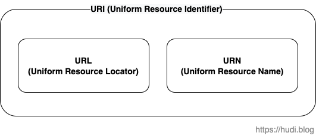

## 학습 배경

학습을 하며 여기저기 혼용되어 사용되는 URI와 URL의 개념이 항상 헷갈렸다. 이 기회에 둘의 개념을 확실히 짚고자 글을 쓴다. 여기에 더해 항상 같이 언급되는 생소한 URN의 개념도 간단하게 짚어보려한다.

## URI

URI는 **Uniform Resource Identifier** 의 약자이며, 한국어로는 통합 자원 식별자라고 한다. URI는 인터넷 상에서의 리소스를 고유하게 식별하고, 위치를 지정하는 문자열이다. 이를 테면 [hudi.blog](http://hudi.blog) 웹서버에 있는 파비콘 리소스에 대한 URI는 아래와 같을 것 이다.

```
https://hudi.blog/favicon-32x32.png
```

URI는 크게 URL과 URN 두가지 종류로 나뉜다. 즉, URI와 URL은 서로 대립되는 개념이 아니라 포함관계이다.



> 리소스라 함은 텍스트, 이미지, 동영상을 포함해서 정보(일기예보, 주가 등), 서비스와 같이 웹에서 사용되는 모든 자원을 의미한다.

## URL

URL은 **Uniform Resource Locator** 의 약자이며, 한국어로는 통합 자원 지시자라고 한다. URL은 특정 서버의 하나의 리소스의 위치를 구체적으로 서술하는 문자열이다. URL이 있기에 리소스를 일관된 방식으로 지칭할 수 있게 되었다.

만약 URL이 없었다면 어떻게 되었을까? HTTP 완벽가이드의 표현을 빌리자면 FTP 서버에 올린 파일을 친구에게 전달하기 위해 우선 FTP 서버 주소를 알려주고, 사용자 이름과 패스워드를 입력하라고 한 뒤, 이동할 디렉토리를 알려주고, 파일명을 알려준 뒤 다운로드하라고 해야할 것 이다. 하지만 URL을 사용하면 해당 파일을 가리키고 있는 FTP URL을 친구에게 전송하고, 브라우저로 접속하라고 이야기하면 끝이다.

즉, URL은 **애플리케이션에게 특정 리소스에 접근하는 방법과 위치를 알려주는 수단**이다.

### URL 스킴의 문법

URL 스킴의 문법은 일반적으로 아래와 같이 총 9개 컴포넌트로 나뉜다.

```
<scheme>://<user>:<password>@<host>:<port>/<path>;<parameter>?<query>#<fragment>
```

#### **스킴(Scheme)**

리소스에 접근하기 위해 사용되는 프로토콜을 나타낸다. 즉, 리소스에 어떻게 접근하는지 기술하는 부분이다. 스킴은 알파벳으로 시작해야하고, 다른 부분과 `:` 문자로 구분된다. 또한 대소문자를 가리지 않는다.

#### **유저(User)와 비밀번호(Password)**

일부 스킴은 리소스 접근을 위해 사용자 이름과 비밀번호를 요구한다. 유저 이름과 비밀번호는 `:` 로 구분하여 기술한다. 뒤에 `@` 문자를 붙여 다른 컴포넌트와 구분한다.

#### **호스트(Host)**

서버의 인터넷 주소를 나타낸다. (e.g., [hudi.blog](http://hudi.blog)) 리소스가 어디에 호스팅되어 있는지 알려준다.

#### **포트(Port)**

서버가 열어놓은 포트를 의미한다. 일반적으로 스킴은 기본 포트를 가지고 있으며, HTTP의 경우 80이다.

#### **경로(Path)**

웹 서버의 특정한 리소스를 가리킨다. 찾고자 하는 리소스가 서버의 어디에 있는지 알려준다. 경로는 `/` 문자로 다시 작은 경로 조각으로 나뉜다.

#### **파라미터(Parameter)**

사용자, 비밀번호, 호스트, 포트, 경로 만으로도 리소스를 찾지 못하는 경우가 있다. 리소스에 접근하기 위해 더 많은 정보를 요구해야할 때 파라미터를 사용한다. URL의 끝에서 `;` 뒤에 `key=value` 형태로 기술한다. 파라미터는 각 경로 조각마다 존재할 수 있다.

```
http://www.joes-hardware.com/hammers;sale=false/index.html;graphics=true
```

> 위 예시는 HTTP 완벽 가이드에서 발췌하였다.

#### **질의(Query)**

요청받을 리소스의 범위를 좁히기 위해서 사용된다. URL의 끝에서 `?` 뒤에 이어 기술한다. 질의를 작성하는 공통 포맷은 존재하지 않는다. HTTP의 경우 `?key1=value1&key2=value2` 형식으로 기술한다.

#### 프래그먼트(Fragment)

리소스의 일부분을 가리키는 이름이며, 서버에는 전달되지 않고 클라이언트에서만 사용된다. URL의 끝에서 `#` 뒤에 이어서 기술한다.

## URN

URN은 **Uniform Resource Name** 의 약자이며, 한국어로는 통합 자원이라고 한다. URL은 리소스의 위치를 가리키는 문자열이기 때문에 리소스의 위치가 변경되면 URL도 변경되어야한다.

하지만 URN은 한 리소스에 대해 위치와 상관없이 유일하게 해당 리소스를 식별하는 이름 역할을 한다. 아래의 URN은 RFC 2648을 가리키는 URN이다.

```
urn:ietf:rfc:2648
```

URN은 아직 실험중이고, 널리 채택되어 사용되고 있지 않다. 따라서 지금까지는 통상적인 관례로 URI와 URL은 같은 의미로 사용된다고 한다.

## 참고

- 데이빗 고울리 외 4명, HTTP 완벽 가이드
- [https://datatracker.ietf.org/doc/html/rfc3986](https://datatracker.ietf.org/doc/html/rfc3986)
