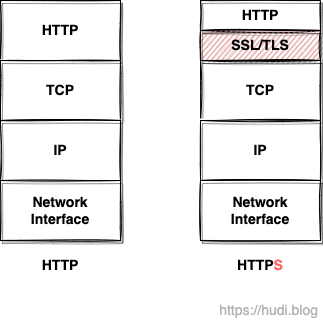
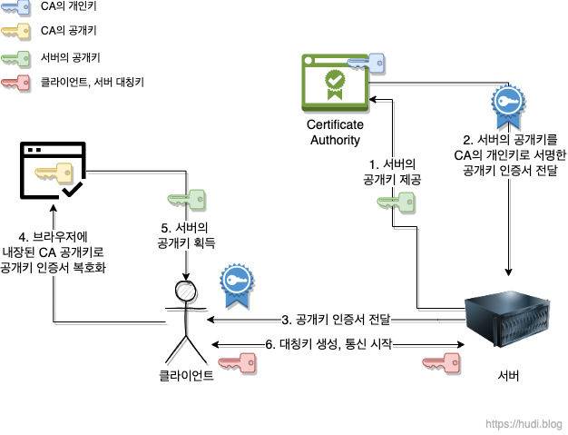
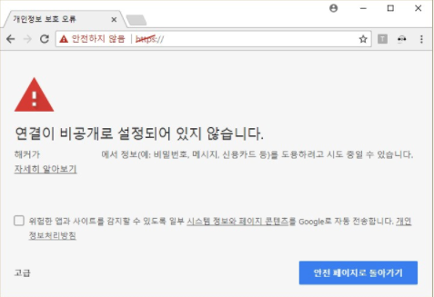

## HTTP의 문제점

### 도청 가능한 HTTP

HTTP는 암호화되지 않은 평문의 통신이기 때문에 도청이 가능하다. HTTP는 TCP/IP 위에서 돌아가는 프로토콜이기 때문이다. TCP/IP를 사용한 통신에서 전송되는 데이터는 때 **전 세계의 수 많은 중간 노드**들을 거쳐간다. 이 모든 통신 경로에서 HTTP 메시지를 도청할 수 있다. 내가 네이버에 로그인하는데, ID와 PW가 중간 노드에서 도난당하면 큰일이 날 것이다.

### 통신상대를 확인하지 않는 HTTP

HTTP를 사용한 요청, 응답에서는 통신 상대를 확인하지 않는다. 또한 IP주소, 포트 제한이 있는 것이 아니라면 요청이 들어오면 상대가 누구든 응답을 반환해준다.

클라이언트가 보낸 요청에 대한 응답의 출처가 클라이언트가 의도한 웹서버로부터 전송된 것 인지 알 수 없다. 몇 년전 한창 시끄러웠던 **피싱 사이트**가 그 예시이다. 반대로 서버도 보낸 응답이 의도한 클라이언트에게 전송된 것인지 알 방법이 없다. 즉, 요청을 받은 웹서버가 위장한 웹 서버일수도 있고, 응답을 받은 클라이언트가 위장한 클라이언트일수도 있다.

## 대칭키 방식과 공개키(비대칭키) 방식

HTTPS를 알아보기 전에 우선 대칭키 방식과 공개키 방식에 대해서 이해하고 넘어갈 필요가 있다.

### 대칭키 방식

데이터의 **암호화, 복호화 둘다 동일한 키**가 사용되는 방식이다. 후술할 비대칭키 방식에 비해 암복호화 **속도가 빠르다**.

하지만, 대칭키 방식을 사용하기 위해서 한쪽에서 다른 한쪽으로 대칭키를 전송하는 과정이 필요하다. 이 과정에서 대칭키 자체가 제 3자에게 도난당할 위험성이 존재한다. 아무리 메시지를 암호화한들 대칭키를 도난당하게 된다면, 해커는 손쉽게 메시지를 복호화할 수 있으므로 암호화가 무용지물이 될 것 이다.

### 공개키(비대칭키) 방식

대칭키 방식과 다르게, **서로 다른 키**로 암호화와 복호화를 수행하는 암호화 기법이다. 서로 다른 키를 각각 A키와 B키라고 하자. **A키로 암호화한 데이터는 B키로만 복호화할 수 있고, B키로 암호화한 데이터는 A키로만 복호화**할 수 있다.

웹 서버는 이 두 키중 하나를 비밀로 보관하고, 나머지 하나를 대중에 공개한다. 이때 비밀로 보관한 키를 **개인키(비밀키)**, 공개된 키를 **공개키**라고 부른다.

## HTTP + SSL = HTTPS

### SSL (Secure Sockets Layer)

사실 HTTPS는 새로운 어플리케이션 계층의 프로토콜은 아니다. HTTP는 직접 TCP 레이어와 통신하지만, **SSL을 사용하면 HTTP와 SSL이 통신하고, SSL과 TCP 가 통신**하게 된다. 이렇게 통신하는 방식을 HTTPS 라고 부르는 것 이다.

이때, SSL은 Secure Sockets Layer 의 약자로, Netscape에서 만든 서버와 클라이언트 사이의 통신을 암호화할 수 있도록 만들어준다. SSL은 HTTP와는 독립적인 계층으로, SMTP 등 다른 프로토콜에서도 사용할 수 있다.

> 참고로 SSL 3.0버전은 IETF에서 표준으로 제정되어 [TLS](https://datatracker.ietf.org/doc/html/rfc5246)라는 이름을 갖게 되었다. 하지만 아직은 뭉뚱그려 SSL로 통용되어 불리고 있는 것 같다.

### SSL의 암호 시스템

위에서 보았듯 대칭키 방식과 비대칭키 방식은 각각 장단점을 가지고 있다. 모든 통신에 공개키 암호화 방식을 사용하면 통신이 굉장히 느려질 것 이다. 따라서 SSL은 **대칭키 방식과 비대칭키 방식을 적절히 혼합한 하이브리드 암호 시스템**을 사용한다.

SSL은 **대칭키를 공개키 방식으로 안전하게 전달**하며, **이후 통신은 주고 받은 대칭키를 통해 진행**한다. 이렇게 됨으로써 대칭키를 중간에서 탈취당하지 않고, 공개키 방식보다 빠르게 통신할 수 있게된다.

> SSL이 공개키 방식을 통해 대칭키를 주고 받는 등 통신을 준비하는 과정을 **SSL Handshake** 라고 한다. 찾아보니 내용이 좀 깊어질 것 같아 관련 내용은 나중에 이어 학습하도록 하겠다.

### CA (Certificate Authority)

그런데, 앞서 이야기한 것 처럼 HTTP는 통신상대를 확인하지 않는다. 클라이언트가 피싱사이트로 접속한 것 일수도 있다. 위 과정에서 클라이언트는 서버로부터 받은 공개키가 진짜인지 가짜인지 어떻게 판별할 수 있을까? 바로 **CA (Certicifate Authority)**라는 제 3자를 통해 가능하다.

CA는 이런 공개키가 진짜인지 인증해주는 **공인된 민간 기업**이다. 정말 엄격한 인증 과정을 거쳐야 CA가 될 수 있다고 한다. 이 과정을 조금 더 자세히 알아보자.

먼저, 서버는 CA에게 자신의 공개키를 건낸다. 그러면 CA는 서버의 공개키를 CA의 개인키로 암호화하여 서명한다. 이렇게 암호화된 것을 **공개키 인증서 (Public key Certificate)** 라고 한다. 서버는 이 공개키 인증서를 클라이언트에게 보낸다.

클라이언트의 웹 브라우저에는 기본적으로 **CA의 공개키 정보**가 담겨있다. 앞서 공개키 인증서는 서버의 공개키를 CA의 개인키로 암호화한 것이라고 이야기했다. 그렇다면, CA의 공개키로 복호화가 가능할 것 이다. 만약 CA에서 인증받지 않은 인증서는 복호화가 불가능하게 될 것이고 브라우저는 사용자에게 신뢰할 수 없는 보안 인증서라는 메시지가 표시될 것 이다.

이렇게 서버의 공개키를 안전하게 전달받은 클라이언트는 드디어 이 공개키 암호화 방식을 통해 서버와 대칭키를 주고받을 수 있게 되고, 그 대칭키를 통해 암호화된 메시지를 주고받을 수 있게 된다.

## 마치며

한창 달록 프로젝트에서도 백엔드와 프론트엔드 서버에 HTTPS를 붙이는 작업을 하고 있다. HTTPS의 가장 큰 목적은 보안이지만, 구글 검색 엔진등에서는 HTTPS를 지원하는 웹 사이트에 가산점을 준다고 한다. SEO(Search Engine Optimizatino)를 위해서라도 HTTPS는 꼭 서비스에 붙이자.

## 참고

- [https://www.youtube.com/watch?v=H6lpFRpyl14](https://www.youtube.com/watch?v=H6lpFRpyl14&t=2s)
- [https://www.youtube.com/watch?v=wPdH7lJ8jf0](https://www.youtube.com/watch?v=wPdH7lJ8jf0)
- 우에노 센, 그림으로 배우는 HTTP & Network Basic
