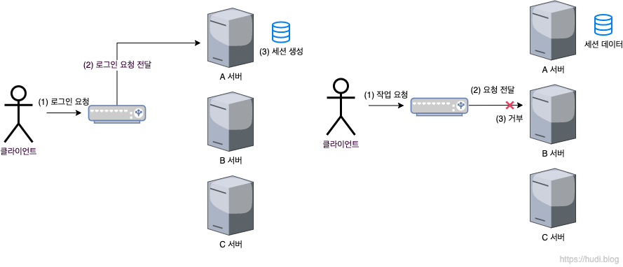
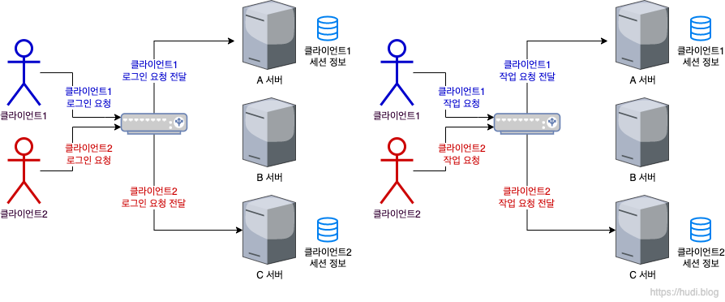
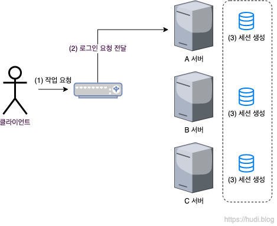
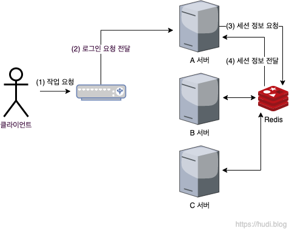

세션 불일치 문제는 단일 서버 환경에서는 발생하지 않으므로 따로 걱정하지 않아도 된다. 하지만, 최근 웹 서비스는 대부분 수직 확장(Scale Up)이 아닌 수평 확장(Scale Out)으로 서버를 확장하기 때문에 일반적으로 다중 서버 환경일 것 이다. 이런 다중 서버 환경에서는 세션 불일치 문제가 발생할 수 있다. 기본적으로 세션은 서버의 메모리(RAM)에 저장되기 때문이다.

예를 들어, 우리가 서버를 수평적으로 확장하기 위해 A, B, C 총 3대의 서버를 설치했다고 가정하자. 이때, 로드 밸런서는 유저의 요청이 들어올 때 마다 A → B → C → A … 순서대로 요청을 분산한다고 가정하자. (이를 라운드로빈 방식이라고 한다.)

> 가운데 위치한 그림은 로드밸런서이다.

이런 환경에서 위와 같이 특정 유저의 로그인 요청이 A 서버로 전달되었다고 하자. 유저의 세션 정보는 A서버에 생성된다. 그리고 직후에 해당 유저의 글 작성 요청이 B 서버로 전달되었다고 하자. 하지만 B 서버에는 유저의 세션 정보가 존재하지 않는다. 따라서 유저의 요청이 제대로 처리되지 않을 것 이다. 이런 문제를 세션 불일치(정합성) 문제라고 한다.

세션 불일치 문제를 해결하기 위해서는 3가지 해결 방법이 존재한다.

## Sticky Session

첫번째로 Sticky Session 방식이다. 클라이언트의 요청이 항상 해당 클라이언트의 세션이 저장된 서버로 향하는 방식을 말한다. 세션 정보가 없는 유저가 요청을 한 경우 로드밸런서의 기본 알고리즘대로 요청을 전달한다. 이때 이 요청으로 인해 세션이 생성된 경우 해당 유저의 요청은 해당 서버로 고정된다. 요청을 특정 서버로 고정시키는 방법은 쿠키를 통해 판단하거나, 클라이언트의 IP를 확인하여 판단하는 방법이 있다.

이 방식은 단순하나 크게 두가지 문제점을 가지고 있다.

첫번째는 특정 서버에 트래픽이 집중될 위험성을 가지고 있다. 로드밸런서는 여러 서버에 요청을 적절히 분산해서 부하가 특정 서버에 몰리지 않기 위해 사용한다. 하지만 Sticky Session으로 인해 한 서버에 부하가 몰리면 로드밸런싱의 원래 목적을 달성할 수 없다.

두번째는 하나의 서버에 장애가 발생하면, 해당 서버가 들고 있던 세션 정보는 모두 유실되어 해당 서버에 고정된 유저는 다시 로그인해야하는 문제점을 가지고 있다. 즉, 가용성 문제를 가지고 있다.

## Session Clustering

Session Clustering 방식은 특정 서버에서 세션이 생성될 때 다른 서버로 세션을 전파하여 복제하는 방식으로 세션 불일치 이슈를 해결한다. 이런 방식으로 Sticky Session 방식에서 발생한 한 서버에 부하가 몰리는 문제와, 가용성 문제를 해결할 수 있다. 하지만, 대규모 클러스터에서는 Session Clustering 방식도 많은 문제점을 가지고 있다.

첫번째로 비효율적인 메모리 관리 문제이다. 세션을 모든 서버가 복제하여 들고있기 때문에 효율적인 메모리 관리를 할 수 없어진다.

두번째로 세션을 생성할 때 마다 데이터를 전파하고 복제하는 과정에서 Sticky Session 방식에 비해 많은 네트워크 트래픽을 사용한다는 문제점이다.

세번째로 세션을 전파하고 복제하는 과정에서 시간차로 인하여 세션 불일치 이슈가 발생할 위험성이 존재한다. 예를 들어 A서버에서 생성된 세션이 B서버로는 전파가 되었지만, 아직 C서버로 전파가 되지 않았을 찰나에 클라이언트가 C서버로 요청할 수도 있는 것 이다.

## 세션 스토리지 분리

마지막 방식은 세션 스토리지를 외부 서버로 분리하는 방식이다. 이때 외부 세션 스토리지 서버는 일반적인 Disk-Based DB (Mysql, PostgreSQL, MongoDB 등) 를 사용할수도 있지만, 입출력이 잦은 세션 특성 상 I/O 성능이 느린 데이터베이스는 사용하기 적절하지 않다.

따라서 세션을 저장하는 저장소로는 In-Memory DB 를 사용하는 것이 일반적이다. Disk-Based DB는 데이터의 영속성을 위해 사용하지만, 세션 정보는 영속성을 보장할 필요가 없다. 세션은 개발자가 설정해놓은 기간이 지나면 소멸된다. 또한 세션은 데이터가 유실된다 하더라도 그 피해가 다른 유형의 데이터에 비해 적다.

그렇다면 In-Memory DB 중 어떤 DBMS를 사용하는 것이 좋을까? 세션 데이터는 Key-Value 로 구성되어 있다. 따라서 세션을 저장할때는 대표적인 Key-Value DB 인 Redis 와 Memcached 를 사용한다.

세션 스토리지를 분리하면 Sticky Session 의 문제인 부하 몰림 문제와 가용성 문제를 해결할 수 있다. 또한 Session Clustering 의 비효율적인 메모리 관리 문제, 네트워크 트래픽 증가 문제, 시간차로 인한 세션 불일치 문제도 모두 해결된다.

하지만 이런 세션 스토리지 분리 방식도 단점이 존재한다. 하나뿐인 세션 스토리지에 장애가 발생하면, 모든 서버가 세션 데이터를 정상적으로 사용할 수 없게 된다. 이 문제는 세션 스토리지를 여러개로 구성하는 방식으로 해결한다고 한다.
