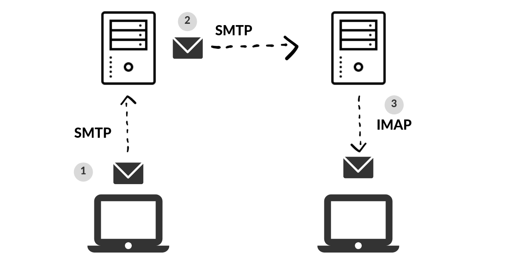

> 본 포스팅에서는 SMTP 프로토콜의 개략적인 소개와 Telnet 을 사용한 메일 전송 실습, Python 을 사용한 간단한 메일 전송 클라이언트 작성에 대해 다룬다.

SMTP은 메일 서버 간 메일을 전송할 때 사용되는 프로토콜로 **OSI 모델의 7계층**에 해당한다. TCP 위에서 구현되었으며, 25번 포트를 사용한다. 본래 1982년 IETF의 **[RFC 821](https://datatracker.ietf.org/doc/html/rfc821)** 로 공개되었으나, 이후 2001년에 **[RFC 2821](https://datatracker.ietf.org/doc/html/rfc2821)** 로 개정되었다.

아마 이 글을 읽는 독자라면, 메일과 관련된 다른 두 프로토콜 POP3 와 IMAP 또한 알고 있을 것이라 생각한다. 하지만, SMTP와 POP3, IMAP 은 사용 용도가 다른 프로토콜이다. 이 이야기부터 잠깐 짚고 넘어가고자 한다.

## 1. SMTP vs POP3, IMAP

이메일 시스템에서 메일을 전달하기 위해 존재하는 두개의 주체가 존재하는데, 각각 **UA (User Agent)**, **MTA (Mail Transfer Agent)** 가 존재한다. UA 는 흔히 사용하는 아웃룩, 썬더버드 혹은 OS에서 기본 제공하는 메일 앱 등 이메일을 수발신 하기 위해 사용하는 어플리케이션이다. MTA 는 흔히 말하는 메일서버를 의미한다.

이런 구조 하에서 POP3와 IMAP은 UA가 MTA로부터 이메일을 수신하고, 수신한 이메일을 관리하기 위해 사용된다. SMTP 는 UA가 MTA 로 메일 전송을 요청할 때와 MTA와 MTA간의 통신을 담당한다.

POP3와 IMAP 프로토콜도 큰 차이가 존재하는데, 글 주제와 맞지 않아 기회가 되면 다른 글에서 다뤄보도록 하겠다.

## 2. SMTP 시나리오

> 아래 시나리오는 위키백과의 [간이 우편 전송 프로토콜](https://ko.wikipedia.org/wiki/%EA%B0%84%EC%9D%B4_%EC%9A%B0%ED%8E%B8_%EC%A0%84%EC%86%A1_%ED%94%84%EB%A1%9C%ED%86%A0%EC%BD%9C)의 내용을 발췌하였다.

`S` 가 서버측 메세지, `C` 가 클라이언트 측 메세지이다. 메일서버에 연결하고, 메일을 전송한 다음 연결을 끊을 때 까지 아래와 같이 TCP 통신으로 메일을 주고 받는다.

```
S: 220 smtp.example.com ESMTP Postfix
C: HELO relay.example.com
S: 250 smtp.example.com, I am glad to meet you
C: MAIL FROM:<bob@example.com>
S: 250 Ok
C: RCPT TO:<alice@example.com>
S: 250 Ok
C: RCPT TO:<theboss@example.com>
S: 250 Ok
C: DATA
S: 354 End data with <CR><LF>.<CR><LF>
C: From: "Bob Example" <bob@example.com>
C: To: Alice Example <alice@example.com>
C: Cc: theboss@example.com
C: Date: Tue, 15 January 2008 16:02:43 -0500
C: Subject: Test message
C: 
C: Hello Alice.
C: This is a test message with 5 header fields and 4 lines in the message body.
C: Your friend,
C: Bob
C: .
S: 250 Ok: queued as 12345
C: QUIT
S: 221 Bye
{The server closes the connection}
```

### 2-1. 시나리오 요약

1. **HELO** : 메일 개시를 상대방에게 알린다. 일반적으로 메일서버 주소를 함께 명시한다.
2. **MAIL FROM** : 보내는 사람의 메일 주소를 입력한다.
3. **RCPT TO** : 받는 사람의 메일 주소를 입력한다. 여러번 입력하여 여러명에게 보낼 수 있다.
4. **DATA** : 메일 내용 전송을 시작한다. 이 후 문자열은 메일 헤더와 본문에 해당된다.
   1. **From** : 메일에 표시되는 보낸이 정보
   2. **To** : 메일에 표시되는 받는이 정보
   3. **Cc** : 메일 참조 정보
   4. **Subject** : 메일 제목

이후 입력되는 모든 문자열은 메일 본문 내용에 해당되며, 마지막줄에 단독점 ( `.` ) 을 입력하면, 메일 전송이 시작된다. 이때, 헤더와 본문 구분을 위해 사이에 개행을 하나 삽입 해야하며, Data 의 헤더는 생략이 가능하다.

## 3. MX 레코드 알아내기 

DNS 에는 여러 레코드가 존재하며, 그 중 메일서버의 주소를 나타내는 **MX 레코드**가 존재한다. 임의 도메인으로 메일을 전송하기 위해서는 도메인의 DNS 레코드를 조회하여, MX 레코드를 알아내야 한다. Windows, Linux, Mac OS 에서 지원하는 `nslookup` 이라는 명령이 존재한다. 이 명령으로 특정 도메인의 DNS 레코드를 조회할 수 있다. 터미널을 열어 아래와 같이 명령을 입력해서 `naver.com` 의 DNS 레코드를 조회해보자.

```shell
$ nslookup
> set type=mx
> naver.com
Server:		211.219.86.1
Address:	211.219.86.1#53

Non-authoritative answer:
naver.com	mail exchanger = 10 mx2.naver.com.
naver.com	mail exchanger = 10 mx1.naver.com.
naver.com	mail exchanger = 10 mx3.naver.com.

Authoritative answers can be found from:
naver.com	nameserver = ns2.naver.com.
naver.com	nameserver = ns1.naver.com.
naver.com	nameserver = e-ns.naver.com.
ns1.naver.com	internet address = 125.209.248.6
ns2.naver.com	internet address = 125.209.249.6
e-ns.naver.com	internet address = 175.158.6.250
```

많은 DNS 레코드를 볼 수 있는데, 이 중 mail exchanger 라고 보이는 부분이 `naver.com` 의 MX 레코드이다.

## 4. Telnet 으로 시도해보기

> Telnet 은 최근 보안 문제 때문에 ssh 로 대체되어 최신 버전의 OS에는 기본 설치 되어있지 않을 확률이 높다. 이 경우 따로 telnet 을 설치해줄 필요가 있다.

Telnet 을 통해 TCP/IP로 접속하여 위 같은 시나리오처럼 메일 서버와 메세지를 주고 받을 수 있다. 아래의 명령을 입력해서 메일을 직접 보내보자.

사실, Gmail 혹은 네이버 메일로 메일을 발신하는 작업은 스팸 필터링으로 인해 IP가 차단될 수 있어 실습이 까다롭다. 따라서 임시 메일 서비스에서 일회용 메일을 생성해 테스트 하는 것을 추천한다. 참고로 필자는 구글 검색결과 상단에 위치한 [temp-mail.org](https://temp-mail.org/) 라는 서비스를 통해 테스트했다.

```shell
$ telnet mail.nefacility.com 25
```

각자 테스트할 메일 서버 주소를 MX 레코드를 통해 가져왔다면, 위와 같은 명령을 통해 메일서버와 통신을 시작해보자.

```shell
Trying 174.138.124.157...
Connected to mail.nefacility.com.
Escape character is '^]'.
220 003d5d40acd9 ESMTP Haraka/2.8.27 ready
```

성공적으로 연결되면, 응답코드 `220` 을 받을 수 있다.

```shell
HELO mail.nefacility.com
250 003d5d40acd9 Hello Unknown [127.0.0.1]Haraka is at your service.
MAIL FROM:<devhudi@gmail.com>
250 sender <devhudi@gmail.com> OK
RCPT TO:<rocexen287@nefacility.com>
250 recipient <rocexen287@nefacility.com> OK
```

**HELO** 로 메일 작성 시작을 알리고, **MAIL FROM** 과 **RCPT TO** 를 입력해 수/발신자 정보를 입력한다. 각 명령이 성공되면 응답코드 `250` 을 반환한다.

```shell
DATA
354 go ahead, make my day
From: "devHudi" <devhudi@gmail.com>
To: "temp" <rocexen287@nefacility.com>

Subject: Hello, world!
This is test mail.
.
250 Message Queued (C4748E58-86F8-4D01-8ABA-079E64A93EF1.1)
421 timeout
Connection closed by foreign host.
```

**DATA** 를 입력해 메일 헤더와 본문 입력을 시작한다. 응답코드 `354` 가 수신되었으면 계속 입력하면 된다. 마지막으로 단독점을 입력해 메일 작성을 마무리 하고 메일을 전송했다. 


 위와 같이 성공적으로 메일이 전송된 모습을 확인할 수 있다. 이제 직접 Python 으로 구현해보자.

## 5. 소켓으로 구현하기

> 본 포스팅은 SMTP 프로토콜을 중점으로 다루기 때문에 소켓 사용법에 대해서는 자세히 다루지 않는다.

소켓은 TCP 통신을 사용하기 위해 OS 에서 제공하는 API 이다. 물론 파이썬에서도 기본으로 `socket` 이라는 라이브러리를 제공하며, 이 라이브러리를 통해 TCP 통신을 구현할 수 있다. 물론 파이썬 답게 고수준으로 구현된 `smtplib` 라는 SMTP 프로토콜 라이브러리가 존재하지만, 본 글에서는 SMTP 프로토콜 원리를 배우는 것이 목적이니 사용하지 않는다.

```python
from socket import *

HOST = 'mail.nefacility.com'
PORT = 25
BUF_SIZE = 1024
ADDR = (HOST,PORT)

client_socket = socket(AF_INET, SOCK_STREAM)

client_socket.connect(ADDR) # 메일서버 연결

# 연결 직후
msg = client_socket.recv(BUF_SIZE).decode()
print(msg)

# HELO 전송
client_socket.sendall('HELO mail.nefacility.com\r\n'.encode()) 
msg = client_socket.recv(BUF_SIZE).decode() # 데이터 수신 
print(msg)

# MAIL FROM 전송
client_socket.sendall('MAIL FROM:<devhudi@gmail.com>\r\n'.encode()) 
msg = client_socket.recv(BUF_SIZE).decode()
print(msg)

# RCPT TO 전송
client_socket.sendall('RCPT TO:<rocexen287@nefacility.com>\r\n'.encode())
msg = client_socket.recv(BUF_SIZE).decode()
print(msg)

# DATA 전송
client_socket.sendall('DATA\r\n'.encode())
msg = client_socket.recv(BUF_SIZE).decode()
print(msg)

# 헤더 및 본문 전송
client_socket.sendall('From: "devHudi" <devhudi@gmail.com>\r\n'.encode())
client_socket.sendall('To: "temp" <rocexen287@nefacility.com>\r\n'.encode())
client_socket.sendall('Subject: Hello, SMTP!\r\n'.encode())
client_socket.sendall('\r\nThis is test mail from python.\r\n.\r\n'.encode())
msg = client_socket.recv(BUF_SIZE).decode()
print(msg)

# 연결 종료
client_socket.close()
```

위와 같이 간단하게 파이썬을 통해 메일 전송 클라이언트를 작성할 수 있다. Telnet 을 통해 직접 통신하는 것과는 그 구현을 파이썬으로 했다는 것 외에는 차이점이 없다. 주의할 점은 개행을 `\n` 이 아닌 `\r\n` 로 해야 정상적으로 통신이 가능하다. 위 코드를 적절히 자신의 이메일로 변경하여 실행하면 아래와 같이 정상적으로 메일이 수신되는 모습을 확인할 수 있을 것 이다.


이렇게 Telnet 과 Python 을 이용하여 SMTP의 명세와 그 구현을 간단하게 알아보았다.
