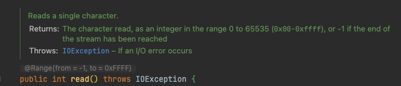
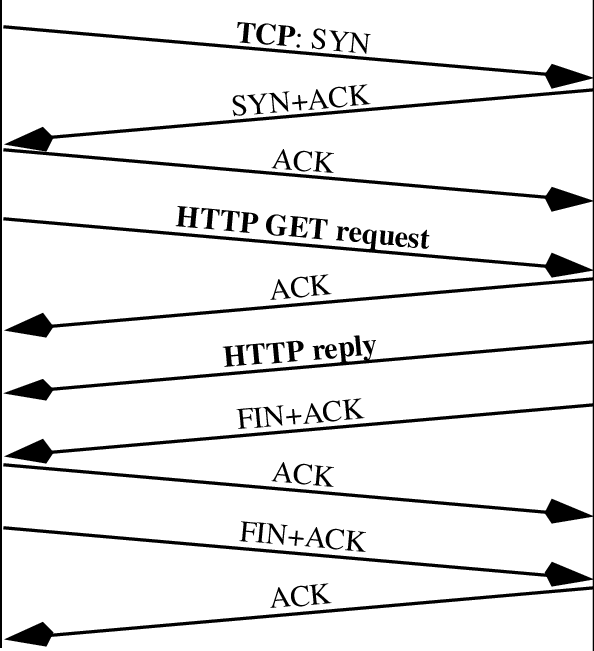

## 배경

직전 포스팅인 **[HTTP 서버 구현 미션 트러블 슈팅 (1) - BufferedReader의 무한 대기 이슈](https://hudi.blog/woowacourse-level4-tcp-troubleshooting/)** 포스팅에서 BufferedReader의 `readLine()` 메소드를 사용할 때 Body 데이터를 읽어오지 않는 이슈와 원인에 대해 다루어보았다.

저번 글에서는 BufferedReader의 `readLine()` 메소드가 끝까지 데이터를 반환하지 않았던 이슈를 다뤘다면, 이번 포스팅에서는 **데이터를 끝까지 받았음에도 불구하고 루프를 탈출하지 못해 서버가 응답하지 못했던 이슈**와 해결 방법을 정리해보려고 한다.

## 문제 상황

우리는 지난 포스팅을 통해서 BufferedReader의 `readLine()` 을 사용하면, 정상적으로 Body를 읽어올 수 없다는 것을 알게 되었다. 그리고 라인과 상관 없이 글자 단위로 데이터를 읽어오는 `read()` 메소드를 사용하면 메시지의 끝까지 모든 데이터를 받아올 수 있는 것도 알게되었다.



위 주석처럼 BufferedReader의 `read()` 메소드는 스트림의 끝에 도달하면 -1을 반환한다. 따라서 아래와 같이 코드를 작성하면, 스트림의 끝까지 글자를 받아올 수 있다.

```java
private String readHttpRequest(final BufferedReader bufferedReader) throws IOException {
    StringBuilder httpRequest = new StringBuilder();
    while (true) {
        int read = bufferedReader.read();
        if (read < 0) {
            break;
        }
        System.out.print((char) read);
        httpRequest.append((char) read);
    }

    // 무한 루프에 빠져 도달할 수 없다.
    System.out.println("unreachable");

    return httpRequest.toString();
}
```

그런데, 내 생각처럼 동작하지 않았다. 위 코드에서 `System.out.println("unreachable")` 은 실행되지 않는다. 대기중인 브라우저를 종료해야만 비로소 `"unreachable"` 이 출력되었다.

## 웹 브라우저는 메시지가 끝났다고 알려주지 않는다

내가 작성한 코드는 InputStream 으로부터 **EOF를 무한정 기다리고**, EOF를 받아오면 응답을 보낸다. 가만 생각해보면, **웹 브라우저가 데이터를 보낸 후 InputStream이 EOF를 반환할리가 없다. EOF가 수신되었다는 것은 TCP 소켓의 연결이 끊어졌다는 것을 의미**한다.



위 사진처럼 HTTP는 **단일 TCP 커넥션에서 요청과 응답**을 주고 받는다. 클라이언트 입장에서는 서버와 TCP 커넥션이 맺어지고, 요청을 보낸 이후 응답이 들어오는 것을 대기해야지 **연결을 끊어서는 안된다**.

즉, 서버는 클라이언트가 보낸 **HTTP의 메세지의 끝을 스트림이 반환하는 EOF로 판단해서는 안되**고, 다른 방법으로 판단해야한다. 내가 지금껏 잘못 생각해왔다.

## Content-Length

HTTP에는 **Content-Length**라는 헤더가 있다. 이 헤더에는 **HTTP Entity Body의 데이터 사이즈를 바이트 단위**로 나타낸다. 웹 브라우저는 메시지가 끝났다고 알려주지 않는다. 다만, Body의 길이를 알려준다.

그냥 프레임워크를 사용할 때에는 대체 왜 존재하는 헤더인지 알지 못했는데, 서버 입장에서 HTTP Message Body를 모두 얻어오기 위해 데이터를 몇 바이트 읽어와야 하는지 명확히 알 필요가 있었다.

```java
private String generateHttpBody(final BufferedReader bs, final HttpHeaders httpHeaders) throws IOException {
    String rawContentLength = httpHeaders.getHeader(CONTENT_LENGTH).orElse("0");
    int contentLength = Integer.parseInt(rawContentLength);

    char[] body = new char[contentLength];
    bs.read(body);

    return new String(body);
}
```

리팩토링을 하지 않아 깔끔하지는 않은 코드이지만, 나와 같은 경우에는 위와 같이 먼저 BufferedReader의 `readLine()` 메소드를 사용하여 헤더까지의 값을 가져왔다. 그 값을 통해서 HttpHeaders 객체를 생성하였고, 그 이후 Content-Length 헤더의 값을 가져와 그 숫자 만큼의 바이트를 추가로 BufferedREader 에서 읽어들였다.

## 마치며

TCP 소켓으로 직접 HTTP 통신을 해보면서, 어딘가에서 스트림이 무한정 대기하는 이슈를 두번이나 겪게 되었다. 며칠간 삽질했는데, 막상 글로 풀어쓰니 생각보다 짧은 것 같다. 그래도 자료도 많이 없는데, 스스로 막막했던 이슈를 해결하고 나니 뿌듯하다.

특히, TCP, HTTP, IO 스트림 등에 대해 직접 만들어보며, 깊게 공부해보니 이론으로만 듣던 Keep-Alive와 같은 개념도 조금 더 와닿게 된 것 같다. 이래서 학습할때엔 바퀴를 재발명 하라는 것인 것 같다.
