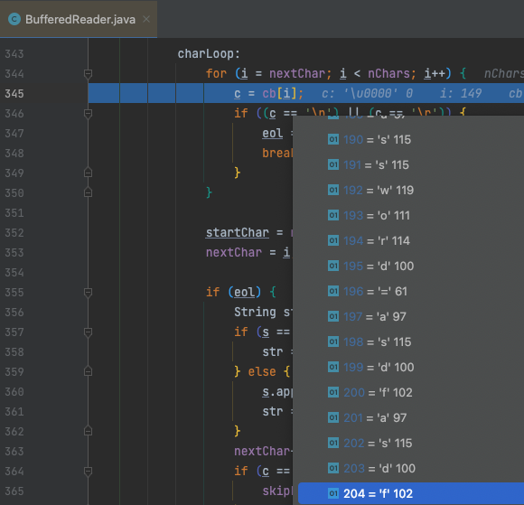
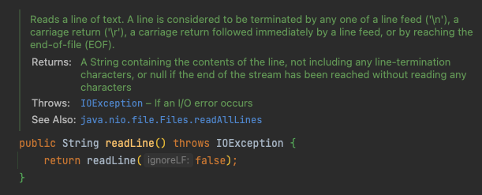
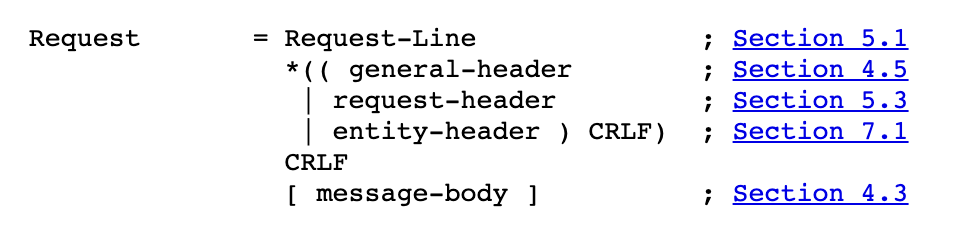
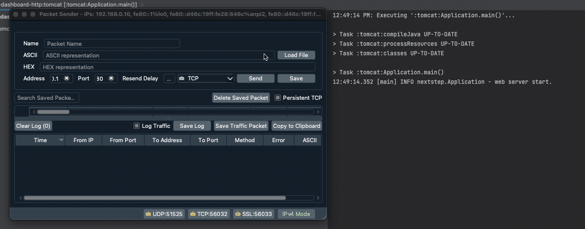

## 배경

우아한테크코스 레벨4 첫번째 미션은 **TCP 소켓을 사용하여 라이브러리나 프레임워크 없이 HTTP 요청을 받고 응답을 할 수 있는 서버를 구현**하는 것이다. 이 과정에서 TCP 소켓을 사용하였고, 데이터 입력과 출력을 위해 소켓에서 InputStream과 OutputStream을 가져와 사용하였다.

한줄 단위로 데이터를 읽기 위해서 InputStream의 필터 버퍼로 BufferedReader를 연결한 후 사용하였다. 그런데, BufferedReader의 `readLine()` 메소드로 데이터를 가져올 때 **HTTP Request Message를 끝까지 읽지 않고, 어딘가에서 무한정 대기가 걸리는 이상한 현상**이 발생하였다.

이 포스팅에서 위 현상의 원인을 찾아낸 과정과 결과를 정리한다. 사용한 코드와 전송한 HTTP 데이터는 아래와 같다.

### BufferedReader를 사용한 HTTP Request Message 수신

아래 `readHttpRequest()` 메서드는 외부의 소켓에서 얻어온 InputStream을 BufferedReader로 변환하여 파라미터로 받아오고, 이를 사용하여 TCP 데이터를 수신한다.

```java
private String readHttpRequest(final BufferedReader bufferedReader) throws IOException {
    StringBuilder httpRequest = new StringBuilder();
    while (true) {
        String line = bufferedReader.readLine();
        if (line == null) {
            break;
        }
        httpRequest.append(line).append(NEW_LINE);
    }

    return httpRequest.toString();
}
```

`readLine()` 은 스트림에서 더이상 읽어올 데이터가 없으면 문자열 대신 null을 반환한다. 이를 이용하여 위와 같이 while문에 탈출 조건을 걸어두었다.

### 전송한 HTTP 메세지

전송한 HTTP 메시지는 아래와 같다.

```http
POST /register HTTP/1.1
Content-Type: application/x-www-form-urlencoded
Content-Length: 56

account=hudi&email=devhudi%40gmail.com&password=asdfasdf
```

## 문제 상세 내용

본격적인 문제는 2단계 미션을 구현하면서 발생하였다. 미션 2단계부터는 HTTP Request의 Body 값을 가져와서 사용자가 로그인, 회원가입 할 수 있도록 구현해야한다.

그런데, BufferedReader를 사용하여 Body의 값이 `readLine()` 으로는 가져와지지 않았다. 정확히는 **Header와 Body 사이의 CRLF를 받아온 뒤로 스트림이 Body를 받아오지 않고 어딘가에서 끝없이 대기**하는 현상이 발생했다. 이상한 점은 무한 대기상태에 빠진 브라우저를 종료하면, 그제서야 HTTP Message의 Body를 BufferedReader가 가져왔다.

BufferedReader 내부에 라인 브레이크를 수 없이 찍어가며 많은 삽질을 했다. 곧, 이상한 점을 발견하였다.



위 사진은 Body 부분이 `readLine()` 으로 읽어와지지 않는 상황에서 BufferedReader 내부의 버퍼이다. 내가 가져오고 싶었던 Body 부분까지 모두 이미 소켓으로부터 받아온 것을 확인할 수 있다.

보내줄 데이터를 가지고 있으면서, BufferedReader는 도대체 왜 `readLine()` 으로 데이터를 반환해주지 않을까?

## 원인 분석

### BufferdReader의 readLine() 메소드

소켓에서 데이터를 가져오기 위해 BufferedReader의 `readLine()` 메소드를 사용한다고 이야기했다. `readLine()` 의 내부 코드를 살펴보자. 아래와 같은 주석이 달려있다.



> Reads a line of text. A line is considered to be terminated by any one of a line feed ('\n'), a carriage return ('\r'), a carriage return followed immediately by a line feed, or by reaching the end-of-file (EOF).

간단히 이야기하자면, `readLine()` 이 줄을 구분하는 기준은 **(1) 라인 피드(\n)**나 **(2) 캐리지 리턴 (\r)** 혹은 **(3) 캐리지 리턴 다음에 바로 라인피드가 있을 때 (\r\n)** 이 3가지 경우이다. 아니면, EOF에 도달하거나.

### HTTP Request Message 구조



위 그림은 **[RFC 2616](https://www.rfc-editor.org/rfc/rfc2616#section-5)**에 나와있는 HTTP Request Message의 구조이다. 보이는 것 처럼 **Header와 Body가 CRLF(Carriage Return / Line Feed)**로 구분되어있다. 따라서 `readLine()` 메소드를 통해서 HTTP 메시지를 한줄씩 전달받을 수 있다.

### 원인 파악

앞서 BufferedReader의 `readLine()` 메소드는 `\r`, `\n`, `\r\n` 셋 중 하나를 만나야 줄의 끝이라고 판단한다고 이야기했다. 반대로, 저 셋을 만나지 않으면 줄이 끝나지 않았다고 판단하는 이야기이다.

그리고 HTTP 스펙상 **HTTP Request Message의 끝에는 캐리지 리턴이나 라인 피드가 없다**. BufferedReader 입장에서는 **줄이 끝나지 않았으므로** `readLine()` 으로 돌려줄 데이터가 없는 것이었다. 따라서 BufferedReader는 **줄이 끝날때까지 무한정 데이터를 기다리고** 있던 것이었다.

서버의 응답을 대기하고 있던 브라우저에서 연결을 끊었을 때 비로소 서버에서 Body 데이터를 수신했던 이유는 연결이 끊기면서 EOF가 전송되었기 때문이다.

따라서 라인 단위로 데이터를 읽어오는 `readLine()` 을 사용하지 않고, 글자 단위로 데이터를 읽어오는 `read()` 를 사용하면 Body 까지 모든 데이터를 읽어올 수 있다.

## TCP 클라이언트로 직접 확인해보기

이슈의 원인을 직접 TCP 클라이언트로 데이터를 전송해보기 전까지는 알아차리지 못했다. 인터넷에 검색해서 바로 나오는 Packet Sender 라는 TCP 클라이언트를 사용하여 HTTP 메시지를 직접 전송해보았다.

처음에는 클라이언트의 기본 옵션이 데이터를 전송하고 그 즉시 TCP 커넥션을 끊도록 되어 있었다. 따라서 서버에서 정상적으로 Body를 수신하였다. 이 때문에 _'웹 브라우저가 데이터를 절약하기 위해 헤더 먼저 보내고, 대기하는 건가...?'_ 라는 이상한 방향으로 헤매다가, TCP 클라이언트에서 데이터를 전송하고 TCP 커넥션을 끊지 않고 유지하도록 만드는 옵션을 발견해서 활성화하였다.



위 영상 처럼 HTTP 요청 메시지 데이터가 전송된 다음에 캐리지 리턴과 라인 피드를 추가로 보내면 BufferedReader가 라인의 끝을 잘 찾고 `readLine()` 가 HTTP Request Body를 반환하는 것을 확인할 수 있다.

## 마치며

원인을 알아냈지만, 결국 클라이언트가 Body를 보내고 난뒤, 캐리지 리턴이나 라인 피드를 전송하지 않으면 `readLine()` 으로 Body 데이터를 수신할 수 없다.

이에 관련된 문제는 다음 포스팅에서 다뤄보도록 하겠다.
