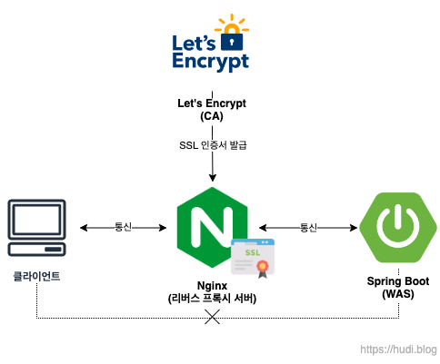
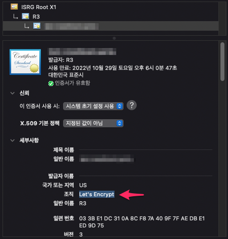

## 목표



우리의 목표는 위 그림과 같다. **클라이언트와 WAS 사이에 리버스 프록시 서버**를 둔다. 클라이언트는 웹서버처럼 리버스 프록시 서버에 요청하고, WAS는 리버스 프록시로부터 사용자의 요청을 대신 받는다. 클라이언트는 리버스 프록시 서버 뒷단의 WAS의 존재를 알지 못한다. 이로인해 보안이 한층 강화되었다.

이때, **리버스 프록시 서버에 SSL 인증서를 발급**해두어 HTTPS를 적용한다. WAS 서버가 여러대로 늘어나도 SSL 인증서 발급을 추가로 하지 않아도 되니 확장성이 좋을 것 이다. 또한 WAS 서버가 SSL 요청을 처리하는데 드는 비용도 들지 않는다.

이때, **리버스 프록시 서버는 Nginx**를 사용한다. WAS는 Spring Boot를 예시로 이미지를 만들기는 했는데 사실 node.js, django, fast api 뭐든 상관없다. CA로는 무료 SSL 인증서 발급 기관인 **Let's Encrypt**를 사용한다. 또한 간단한 SSL 인증서 발급 및 Nginx 환경 설정을 위해 Certbot을 사용한다.

## 준비물

이 포스팅에서는 총 두대의 서버가 사용된다. AWS의 EC2 또는 Lightsail, 혹은 타사 VPS 뭐든 괜찮다. 서버 하나는 WAS가 돌아갈 서버이고, 나머지 하나는 리버스 프록시로 사용될 Nginx 이다.

또한 SSL을 적용하기 위해 도메인을 하나 준비해야한다. 구매해도 좋지만 실습용으로는 [https://freenorm.com](https://freenorm.com) 과 같은 웹사이트에서 제공하는 무료 도메인을 받아 사용하는 것도 좋다.

## WAS 서버 세팅

준비된 서버에 스프링 부트와 같은 WAS 혹은 node.js, django 등의 애플리케이션 서버를 띄우자. 이 포스팅에서는 `8080` 포트로 애플리케이션 서버를 실행한다. 여기서 어플리케이션 서버 준비는 끝이다. 더 중요한 Nginx 서버 세팅으로 넘어가자.

## 리버스 프록시 서버 세팅

### Nginx 설치

이번엔 Nginx 서버이다. 아래 명령을 입력하여 nginx 패키지를 설치하자.

```bash
$ sudo apt update
$ sudo apt install nginx
```

### Nginx 리버스 프록시 설정

이제 리버스 프록시를 위한 Nginx 설정을 해줄 것 이다. `/etc/nginx/conf.d` 디렉토리로 이동해서 nginx를 위한 설정 파일을 생성해보자.

> sites-available/sites-enabled 는 더이상 사용되지 않는 Nginx 설정 방법이라고 한다. 이 포스팅에서는 conf.d 에 Nginx 설정 파일을 만들고 관리한다.

> 만약 sites-available과 sites-enabled에 기본 설정 파일이 있다면 제거하자. 또한 conf.d에 기본으로 `default.conf` 파일이 존재하면, 그 파일을 수정해서 설정하자.

```bash
$ cd /etc/nginx/conf.d
$ vim default.conf
```

위 명령을 실행해서 `default.conf` 파일을 생성하고 아래의 내용으로 채워주자.

```
server {
    listen 80;
    server_name your.domain.com;

    location / {
        proxy_pass http://192.168.XXX.XXX;
        proxy_set_header X-Real-IP $remote_addr;
        proxy_set_header X-Forwarded-For $proxy_add_x_forwarded_for;
        proxy_set_header Host $http_host;
    }
}
```

`server_name` 은 SSL을 적용할 여러분의 도메인을 입력해준다. 후술할 Certbot은 이 `server_name` 을 기준으로 Nginx 설정 파일을 찾고 여기에 HTTPS에 대한 설정을 자동으로 추가해준다.

`proxy_pass` 에는 프록시 서버가 클라이언트 요청을 전달할 리얼 서버의 주소를 적는다. 리버스 프록시의 큰 목적 중 하나는 실제 서버의 IP 주소를 클라이언트에게 노출하지 않기 위함이므로 여기서는 **프라이빗 IP**를 입력하였다. 퍼블릭 IP로 입력해도 큰 차이는 없다.

### Certbot 설치 및 Let's Encrypt에서 SSL 인증서 발급

Certbot은 손쉽게 SSL 인증서를 자동 발급할 수 있도록 도와주는 도구이다. Certbot은 우분투의 snap 이라는 패키지 매니저를 사용하여 설치하는 것이 권장된다. 따라서 apt가 아닌 snap을 사용하여 설치하자.

```bash
$ sudo snap install certbot --classic
```

그리고 아래 명령을 실행해서 SSL 인증서를 발급받자.

```bash
$ sudo certbot --nginx
```

이메일을 입력하고, 이용약관에 동의 후 사용할 도메인을 입력한다. 이때, 적용할 도메인에 대한 A 레코드가 반드시 적용되어 있어야 한다.

이 과정을 거치면 Certbot은 Let's Encrypt를 통해 자동으로 SSL 인증서를 발급해온다. 또한 우리가 작성한 Nginx의 `default.conf` 를 확인해보면 HTTPS를 위한 여러 설정이 자동으로 추가된 것을 볼 수 있다.

```
server {
    server_name your.domain.com;

    location / {
        proxy_pass http://192.168.XXX.XXX:8080;
	proxy_set_header X-Real-IP $remote_addr;
	proxy_set_header X-Forwarded-For $proxy_add_x_forwarded_for;
	proxy_set_header Host $http_host;
    }

    listen 443 ssl; # managed by Certbot
    ssl_certificate /etc/letsencrypt/live/your.domain.com/fullchain.pem; # managed by Certbot
    ssl_certificate_key /etc/letsencrypt/live/your.domain.com/privkey.pem; # managed by Certbot
    include /etc/letsencrypt/options-ssl-nginx.conf; # managed by Certbot
    ssl_dhparam /etc/letsencrypt/ssl-dhparams.pem; # managed by Certbot

}
server {
    if ($host = your.domain.com) {
        return 301 https://$host$request_uri;
    } # managed by Certbot

    listen 80;
    server_name your.domain.com;
    return 404; # managed by Certbot
}
```

기존에 작성한 리버스 프록시 관련 세팅을 유지한 채 `80` 포트 즉, HTTP로 들어온 요청중 `HOST` 헤더가 `your.domain.com` 이라면 `443` 즉, HTTPS로 `301 Moved Permanently` Status를 사용해서 리디렉션 해주는 것을 확인할 수 있다. `HOST` 가 일치 하지 않으면 `404` 를 반환한다.

한번 설정한 도메인으로 웹브라우저에서 접속해보자. HTTPS가 제대로 적용된 것을 확인할 수 있다. SSL 인증서를 자세히 보면 아래 그림과 같이 발급자로 Let's Encrypt 가 제대로 찍혀 있는 모습을 확인할 수 있다.



### Crontab으로 SSL 인증서 자동 갱신 설정

아쉽지만 Let's Encrypt에서 발급해주는 SSL 인증서는 **90일짜리 단기 인증서**이다. 우리는 90일 마다 서버에 접속하여 SSL 인증서를 수동으로 다시 발급해야한다. 하지만 우리는 자동화를 좋아하는 개발자 아니겠는가. 리눅스 **Crontab**을 사용하여 이를 자동화 해보자.

Crontab이란 리눅스에서 제공하는 기능으로 특정한 시간 혹은 특정한 주기로 명령을 수행하고 싶을 때 사용한다. 즉, Crontab은 스케줄링 도구이다. 아래 명령을 이용해서 cron job 하나를 생성하자.

```bash
$ crontab -e
```

간혹 기본 에디터를 무엇을 사용할 것 이냐는 질문이 나오는데, 자신이 가장 잘 쓰는 에디터를 선택하자. 필자는 vim을 선택했다. 그리고 주석 가장 아래에 아래 내용을 추가하고 파일을 저장하자.

```
0 0 * * * certbot renew --post-hook "sudo service nginx reload"
```

매월, 매일 0시 0분에 certbot을 실행하여 SSL 인증서를 갱신하고, 갱신 이후 nginx의 설정파일을 reload 해주는 작업이다. Crontab의 사용은 별도로 공부를 해서 익히거나, [https://crontab-generator.org/](https://crontab-generator.org/) 와 같이 제너레이터를 사용하는 방법도 있다.
