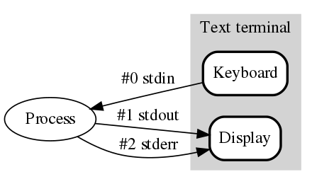

## 표준 스트림 (Standard Stream)



유닉스 이전의 운영체제는 장치에 대한 입출력을 구현하기 위해 장치에 대한 환경설정을 일일히 해야하는 등 프로그래밍이 까다로웠다. 이를 해결하기 위해 유닉스는 운영체제에 연결된 입출력 장치도 파일로 추상화하고, 장치를 다루는 것이 파일을 다루는 것과 같도록 만들었다. 다양한 하드웨어 장치를 제어하는 것이 입출력을 위한 환경설정을 하는 지루한 작업이 아니라, 파일을 읽고 쓰는 과정으로 바뀐것이다. (관련된 내용으로는 유닉스의 [Everything is a file](https://en.wikipedia.org/wiki/Everything_is_a_file) 철학이 있다.)

그리고 이때 입력되고 출력되는 데이터는 스트림의 형태로 오고 간다. 데이터 스트림이란 무엇일까? 말 그대로 데이터의 흐름이다. 더 정확히는 미리 정해진 크기의 데이터가 오고가는 것이 아닌, 연속적으로 흐르는 것을 의미한다. 데이터 크기가 정해져 있지 않으므로, 별도로 스트림의 끝을 표현하는 방법이 필요한데 유닉스 계열에서는 EOF(End of File)을 사용한다.

표준 스트림은 유닉스와 유닉스 계열 운영체제에서 프로세스와 주변 장치와 연결된 입출력 통로이다. 보통 입출력은 물리적으로 연결된 키보드와 모니터를 통해 일어나는데, 표준 스트림이란 이 키보드로부터의 입력과 모니터로의 출력을 추상화한 것 이다. 운영체제가 기동 되면 대화형 셸 (bash, zsh 같은) 은 3개의 표준 스트림이 상속된다. 상속되는 3개의 표준 스트림은 표준 입력(stdin), 표준 출력(stdout), 표준 에러(stderr)이다. 그리고 자식 프로세스는 부모 프로세스의 표준 스트림을 상속받는다. 따라서 쉘에서 실행된 여러 프로세스가 별도의 설정 없이 표준 스트림을 사용할 수 있던 것 이다.

### 표준 입력 (stdin)

표준 입력은 프로세스로 입력되는 데이터 스트림 (보통은 문자열) 이다. 별도의 리다이렉션 없이 프로세스가 실행된 경우 표준 입력 스트림은 키보드로부터 받아온다.

### 표준 출력 (stdout)

표준 출력은 프로세스의 출력 데이터를 기록하는 스트림이다. 리다이렉션 없이 프로세스가 실행된 경우 표준 출력은 텍스트 터미널이 된다.

### 표준 오류 (stderr)

표준 오류는 프로세스의 오류 데이터를 기록하는 또 다른 출력 스트림이다. 표준 출력과는 별개의 스트림으로 별도로 리다이렉션 될 수 있다.

## 리다이렉션 (Redirection)

위에서 리다이렉션이라는 용어가 등장했다. 리다이렉션은 표준 스트림의 입력과 출력의 방향을 다른 곳으로 바꿔버리는 것 이다. 리다이렉션을 사용하면 표준 입력을 키보드가 아닌 파일로부터 받을 수 있고, 표준 출력을 디스플레이가 아닌 파일로 할 수 있다.

### 파일을 표준 출력으로 (>, >>)

`명령어 > 파일` , `명령어 >> 파일` 형태로 사용한다. 아래의 명령을 실행해보자.

```bash
$ ls > result.txt
```

ls 명령은 디렉토리의 내용을 화면에 출력하는 기능을 수행한다. 하지만 위와 같이 리다이렉션을 사용하면 그 출력이 화면이 아닌 `result.txt` 라는 파일로 향하게 된다. 표준 출력의 방향이 바뀐 것 이다.

```bash
$ ls >> result.txt
```

`>` 를 사용하면 기존에 존재하는 파일의 내용을 지우고 처음부터 새롭게 내용을 쓰지만, 위와 같이 `>>` 를 사용하면 기존에 존재하는 파일의 맨 뒤부터 이어서 내용이 추가된다.

### 파일을 표준 입력으로 (<)

`명령어 < 파일` 형태로 사용한다. 아래와 같이 `numbers.txt` 라는 파일을 생성해보자.

```bash
5
4
3
2
1
1
2
3
4
5
```

그리고 sort 명령을 통해 이 숫자들을 순서대로 정렬해볼 것 이다. 아래 명령을 실행하자.

```bash
$ sort -d < numbers.txt
1
1
2
2
3
3
4
4
5
5
```

원래 sort 명령은 키보드로부터 입력받지만, 리다이렉션을 사용하여 표준 입력의 방향을 파일로 변경하였다.

## 파이프 (Pipe)

리다이렉션이 표준 스트림의 대상을 파일로 변경하는 것 이었다면, 파이프를 사용하면 표준 입출력의 방향을 프로세스로 바꿀 수 있다.

ps 명령은 현재 실행중인 프로세스를 출력하는 명령이고, grep 명령은 파일에서 특정 단어나 패턴을 포함하고 있는 명령이다. 파이프를 사용하여 ‘java’ 라는 단어가 포함된 프로세를 확인해볼 수 있다.

```bash
ps -ef | grep java
```

ps 명령의 표준 출력이 grep 명령의 표준 입력으로 들어갔기 때문에 가능한 작업이다.

## 참고

- [https://hongsii.github.io/2018/06/25/linux-standard-streams/](https://hongsii.github.io/2018/06/25/linux-standard-streams/)
- [https://ko.wikipedia.org/wiki/표준\_스트림](https://ko.wikipedia.org/wiki/%ED%91%9C%EC%A4%80_%EC%8A%A4%ED%8A%B8%EB%A6%BC)
- [https://www.putorius.net/linux-io-file-descriptors-and-redirection.html#standard-streams](https://www.putorius.net/linux-io-file-descriptors-and-redirection.html#standard-streams)
