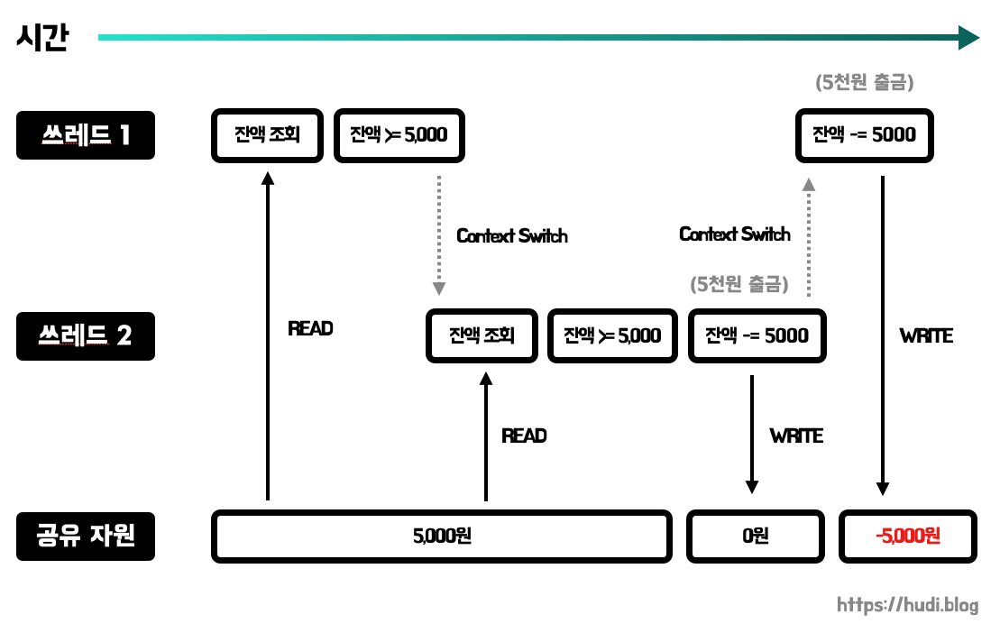
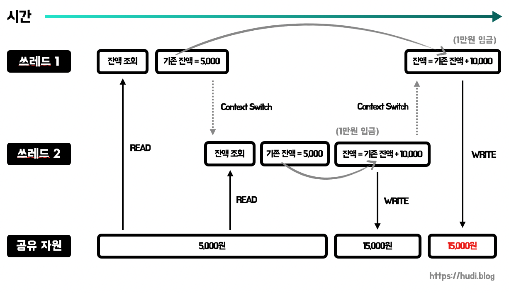
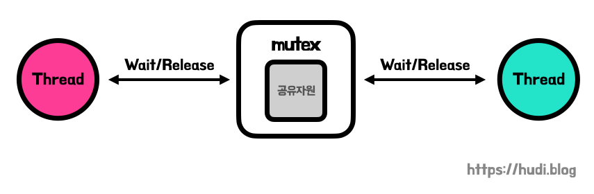
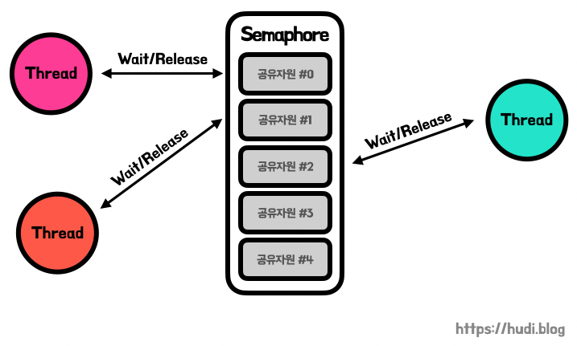
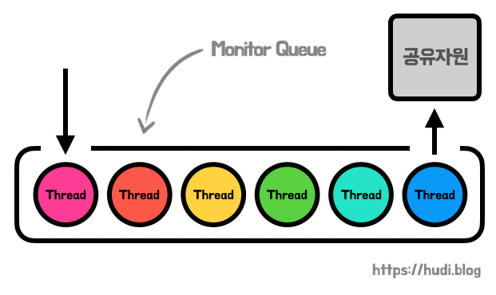

## 경쟁 상태 (race condition)

경쟁 상태란 둘 이상의 입력, 조작의 타이밍에 따라 결과가 달라질 수 있는 상태를 의미한다. 경쟁 상태의 프로그램은 비결정적(nondeterministic)으로 동작할 수 있으므로, 우리의 예상과 다른 결과를 낼 수 있다.

일반적으로 컴퓨터 과학에서 경쟁 상태는 멀티 태스킹 혹은 멀티 쓰레딩 환경에서 공유 자원을 사용할 때 발생한다. 또는 데이터베이스에서 여러 트랜잭션이 동일한 레코드에 접근할 때에도 경쟁상태가 발생한다.

경쟁 상태가 발생하면, 어떤 문제들이 발생할 수 있을까?

### 경쟁 상태 문제 Case 1 - 무결성 위반

통장 잔고를 예시로 들어보자. 위 그림 처럼 2개의 쓰레드와 잔고라는 공유 자원이 존재한다. 각 쓰레드는 출금 작업을 동시에 실행하고 있다. 단, 잔고가 출금 금액보다 적을때에는 출금할 수 없다.

쓰레드1이 5000원 출금 작업을 수행하기 위해 잔액을 먼저 조회한뒤, 조건문으로 잔액이 5000원 이상인지 판단했다. 그리고 출금을 해야하는데, Context Switch가 발생하여, 프로그램의 실행 흐름이 쓰레드2로 교체되었다.

쓰레드2도 마찬가지로 쓰레드1과 동일한 작업을 한다. 다행히 쓰레드2에서는 출금 전에 Context Switch가 발생하지 않아 출금 작업을 마쳤다. 잔액은 0원이 되었다.

이후 Context Switch가 발생하여, 실행 흐름이 쓰레드1로 교체되었다. 쓰레드1은 방금 전 끊긴 작업을 이어서 수행해야한다. 쓰레드1 입장에서는 방금 전 잔액이 출금 금액 이상이라는 것을 확인했으므로 잔액에서 5000원을 빼면 된다.

이때 문제가 발생한다. 잔액은 아까 쓰레드2의 작업으로 이미 0원이 되었다. 이 상태에서 쓰레드1이 5000원을 잔액에서 뺀다면, 잔액은 0보다 작은 수가 된다. 무결성이 깨진 것이다.

### 경쟁 상태 문제 Case 2 - 정합성 위반

이번에는 쓰레드1과 쓰레드2가 같은 잔고에 입금 작업을 수행하려 한다. 쓰레드1은 입금을 위해 기존의 잔액을 조회하고, 지역 변수에 저장해둔다. 이후 Context Switch가 발생하여, 쓰레드2로 실행 흐름이 넘어간다.

쓰레드2에서도 마찬가지로 잔액을 조회하고, 기존 잔액이라는 지역변수에 저장한다. 이후에 잔액을 `기존 잔액 + 10000` 로 대입한다. 잔액은 10,000만원이 늘어난 15,000원이 되었다. 이후 쓰레드1로 Context Switch된다.

쓰레드1은 아까 기존 잔액이라는 지역 변수에 저장해둔 5,000원이라는 값을 꺼내 10,000을 더한 15,000이라는 값을 대입하게 된다. 분명 10,000원을 2번 입금해서 잔액은 25,000원이 되어야 하는데 결과적으로 15,000인 것을 확인할 수 있다. 입금 내역을 확인하면 10,000원이 2번 입금되었을 텐데 잔액은 그렇지 않다. 정합성이 깨진것이다.

## 임계 영역 (critical section)

임계 영역이란, 공유 자원에 접근하는 코드 영역이며, 따라서 여러 프로세스 혹은 쓰레드 등이 한번에 접근하면 문제가 생길 수 있다.

## 동기화 (synchronization)를 위한 상호 배제(mutual exclusion)

위에서 이야기 했듯 공유 자원에 대하여 다수의 프로세스 혹은 쓰레드가 접근할 때 경쟁 조건이 발생하여 의도하지 않은 동작이 발생할 수 있다. 따라서 프로세스나 쓰레드를 동기화 (synchronization) 해야한다. 이때, 동기화란 공유 자원에 동시에 접근하지 못하도록 접근 순서를 제어하는 방법을 의미한다.

프로세스/쓰레드간 동기화는 일반적으로 상호 배제 (mutual exclusion)을 통해 구현할 수 있다. 아래의 방법은 모두 잠금(lock) 매커니즘을 기반으로 동작한다. 자원에 접근하고나서 해당 자원을 잠그고, 자원을 다 사용하고 난뒤 잠금을 해제하는 방식이다.

### 뮤텍스 (mutex)

뮤텍스는 **Mut**ual **Ex**clusion 의 줄임말로, 말 그대로 상호 배제를 위한 방법이다. 공유 자원을 사용하기 전에 잠그고, 사용한 후에 잠금 해제하는 간단한 방식이다. 이때, 잠금이 설정되면 다른 프로세스나 쓰레드는 해당 공유 자원에 접근할 수 없다. 뮤텍스는 **(1) 잠김 (2) 잠기지 않음 이 두가지 상태만** 갖는다.

탈의실이 하나밖에 없는 작은 옷가게의 탈의실은 뮤텍스와 닮아있다.

### 세마포어 (semaphore)

세마포어는 정수값 하나를 가지고 있는데, 이는 공유자원에 접근할 수 있는 프로세스 혹은 쓰레드의 최대 허용치이다. 만약 이 정수값이 3이라면, 최대 3개의 프로세스가 공유 자원에 접근할 수 있는 것이다.

프로세스는 이 공유 자원에 접근하면, 정수값 하나를 줄인다. 공유 자원을 모두 사용하고 임계 구역에서 나온 프로세스는 다시 정수값을 하나 늘린다. 각각의 과정을 `wait()` (또는 P), `signal()` (또는 V) 라고 한다. 더 자세히 알아보자.

프로세스가 공유 자원에 접근할 때는 `wait()` 함수를 실행한다. `wait()` 함수는 세마포어 정수의 값을 1 감소시킨다. 만약 감소된 세마포어 정수가 음수라면, 해당 프로세스는 세마포어 대기열에서 기다려야 한다.

프로세스가 공유 자원을 모두 사용하고 임계 구역에서 벗어날 때 `signal()` 함수를 실행한다. `signal()` 함수를 실행하면 세마포어 정수를 1 증가시키고, 세마포어 대기열에서 기다리고 있는 맨 앞의 프로세스 하나를 깨워 공유 자원을 허용케한다.

이 세마포어 정수의 크기에 따라 **바이너리 세마포어(binary semaphore**)와 **계수 세마포어(counting semaphore)**로 구분된다. 바이너리 세마포어는 세마포어 정수를 0과 1로만 가질 수 있다. 바이너리 세마포어는 뮤텍스와 비슷하게 동작한다. 단, 뮤텍스는 잠금 메커니즘이고, 세마포어는 신호 기반의 상호 배제 방법이다. 계수 세마포어는 1보다 큰 세마포어 정수를 가질 수 있는 방식을 의미한다.

### 모니터 (monitor)

세마포어를 사용하기 위해서는 임계 구역에 **명시적으로 상호 배제 로직을 구현**해야한다. 모니터는 이 **상호 배제 로직을 추상화하고, 공유 자원 접근에 대한 인터페이스만을 제공**한다. 또한 **공유 자원도 외부로부터 캡슐화하여 숨긴다**. **세마포어에 비해 좀 더 고수준**이라고 할 수 있다. 따라서 모니터를 사용하면 상호 배제를 세마포어에 비해 **구현하기 쉬우며 실수가 줄어든다**. 모니터는 주로 고급 프로그래밍 언어에서 제공하는 방식이다. 자바의 `synchronized` 키워드도 모니터를 사용하여 구현되었다.

공유 자원에 접근하고자 하는 프로세스/쓰레드는 **모니터안으로 들어가야한다**. 모니터는 **모니터큐**에 작업을 순차적으로 쌓아두고, 한번에 한 프로세스/쓰레드만 임계 영역에 접근할 수 있도록 한다. 즉, **한번에 하나의 프로세스만 모니터에서 활동**할 수 있도록 보장한다. 개념적으로는 이진 세마포어의 기능을 제공하는 것이다.

## 참고

- 면접을 위한 CS 전공지식 노트, 주홍철
- [https://ko.wikipedia.org/wiki/경쟁\_상태](https://ko.wikipedia.org/wiki/%EA%B2%BD%EC%9F%81_%EC%83%81%ED%83%9C)
- [https://www.baeldung.com/cs/race-conditions](https://www.baeldung.com/cs/race-conditions)
- [https://www.geeksforgeeks.org/mutual-exclusion-in-synchronization/](https://www.geeksforgeeks.org/mutual-exclusion-in-synchronization/)
- [https://ko.wikipedia.org/wiki/세마포어](https://ko.wikipedia.org/wiki/%EC%84%B8%EB%A7%88%ED%8F%AC%EC%96%B4)
- [https://www.baeldung.com/cs/binary-counting-semaphores](https://www.baeldung.com/cs/binary-counting-semaphores)
- [https://www.geeksforgeeks.org/difference-between-binary-semaphore-and-mutex/](https://www.geeksforgeeks.org/difference-between-binary-semaphore-and-mutex/)
- [https://ko.wikipedia.org/wiki/모니터\_(동기화)](<https://ko.wikipedia.org/wiki/%EB%AA%A8%EB%8B%88%ED%84%B0_(%EB%8F%99%EA%B8%B0%ED%99%94)>)
