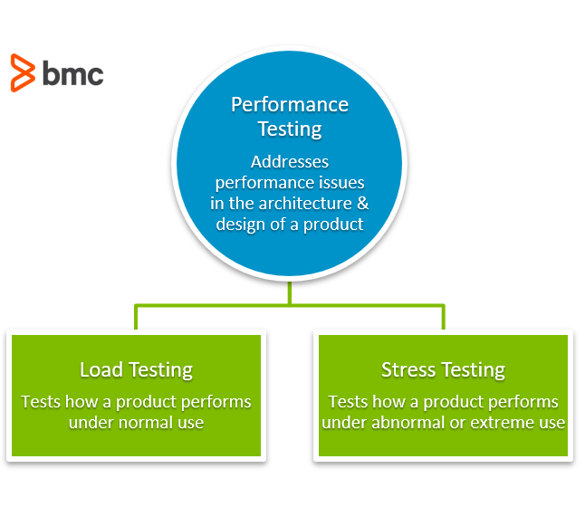
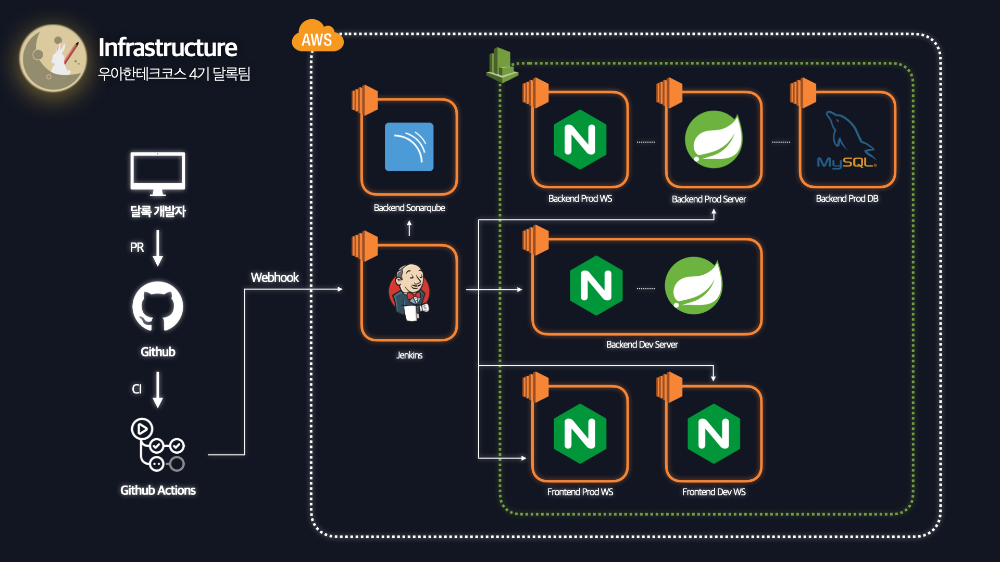
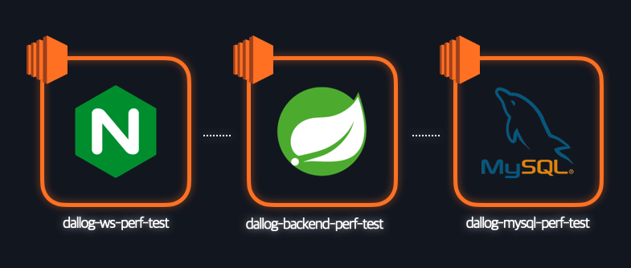
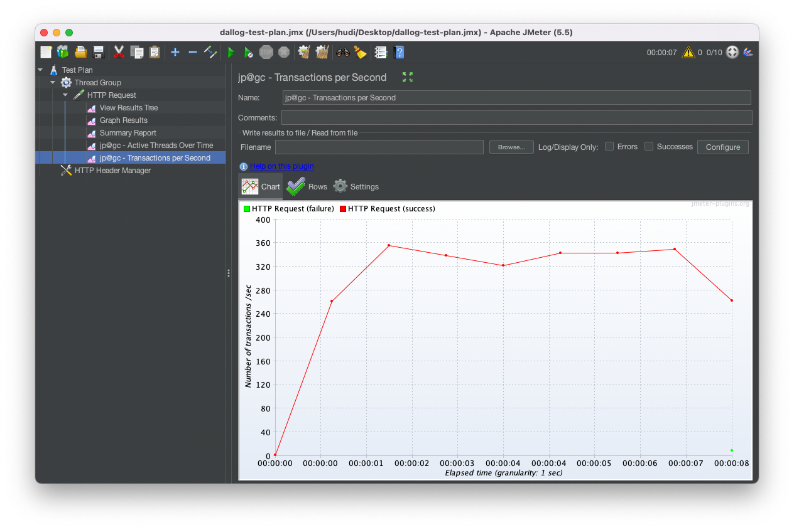

> 이 글은 우아한테크코스 4기 [달록팀의 기술 블로그](https://dallog.github.io/preparing-for-performance-test)에 게시된 글 입니다.

## 배경

우아한테크코스 5번째 데모데이의 필수 요구사항중 하나는 톰캣의 설정 중 `maxConnections`, `maxThreads`, `acceptCounts` 를 적절한 값으로 설정하고 그 이유를 공유하는 것 입니다. 이 3가지 설정은 톰캣이 한번에 얼마나 많은 요청을 처리하고, 얼마나 많은 커넥션을 생성하고, 운영체제로 하여금 얼마나 많은 TCP 커넥션을 대기시킬지를 결정합니다.

이런 설정은 서비스마다 최적의 값이 다를 것 입니다. 따라서 성능 테스트를 통해 적절한 설정 값을 찾아낼 필요가 있습니다. 따라서 달록팀은 성능 테스트에 대해서 학습하고, 독립된 성능 테스트 환경을 구축하였습니다. 그 과정을 공유합니다.

## 성능, 부하, 스트레스 테스트



### 성능 테스트 (Performance Test)

성능 테스트는 특정 상황에서 시스템이 어느 수준의 퍼포먼스를 내는지 측정하기 위한 테스트 방식입니다. 가상의 유저를 시뮬레이션하여 실제와 비슷한 환경을 만들고, 서버에 일정 규모의 부하를 주는 방식으로 테스트합니다. 일반적으로 애플리케이션의 성능을 측정하고, 최적화를 하기 위해 사용합니다.

사실 성능 테스트는 후술할 부하 테스트와 스트레스 테스트를 포함하는 포괄적인 의미입니다.

### 부하 테스트 (Load Test)

부하 테스트는 서비스에 부하를 점진적으로 한계치까지 증가시키는 방식의 성능 테스트입니다. 부하 테스트를 통해 애플리케이션, 데이터베이스 등의 최대 성능을 파악할 수 있습니다. 간단히 말해, 부하 테스트를 수행하면 우리 서비스가 견딜 수 있는 최대치의 요청을 테스트할 수 있습니다.

### 스트레스 테스트 (Stress Test)

스트레스 테스트는 극단적인 상황을 상정하고, 서비스가 극도의 부하 상황에서 어떻게 동작하고 어떻게 복구되는지 확인하기 위해 사용하는 성능 테스트입니다. 정상적인 상황에서 발생할 수 없는 버퍼 오버플로우, 메모리 누수 등의 문제를 발견하고 해결하기 위해 사용합니다. 스트레스 테스트를 통해 애플리케이션이 예기치 않은 트래픽 급증에 다운되지 않도록 대비할 수 있습니다.

현재 달록의 목표는 애플리케이션의 성능을 측정하고, 그 측정 결과를 통해 최적의 톰캣 세팅을 얻는 것 입니다. 따라서 이 경우 부하 테스트, 스트레스 테스트라기 보단 성능 테스트에 해당한다고 볼 수 있겠죠?

## 성능 테스트 도구

선정 기준은 인지도, 도큐먼트, 초기 학습 비용, 생태계, 최근까지 유지보수가 이어지는지? 입니다.

### 📏 JMeter (Star 6.5k)

**[JMeter](https://jmeter.apache.org/)** 는 아파치 재단에서 개발한 성능 테스트를 위한 도구입니다. 순수 100% Java로 개발된 어플리케이션 입니다. 웹 애플리케이션 서버 성능 테스트를 위해 개발되었지만, 현재는 FTP, 데이터베이스, TCP 등 여러 프로토콜의 성능을 테스트할 수 있도록 발전하였습니다.

GUI가 Java의 Swing으로 개발되어 그다지 수려하다고 이야기하기는 어렵습니다. 다만, 예전 버전에 비해서는 그 투박한 정도가 많이 개선된 것 같습니다. 개인적으로 디자인을 많이 따지는데 사용하는데 큰 거부감은 없었습니다 😓. non-GUI 환경에서도 실행될 수 있지만, 찾아보니 그닥 많이 사용되는 방법은 아닌 것 같군요.

JMeter는 거의 20년전에 첫 출시하여 지금까지 쭉 릴리즈되고, 많은 사람들에게 사랑받는 입증된 성능 테스트 도구입니다. 거기에 가장 [최근 릴리즈](https://github.com/apache/jmeter/releases/tag/rel%2Fv5.5)가 2022년 6월인것을 보면 안정성과 유지보수는 믿고 가도 되겠죠 😄

### 🪨 nGrinder (Star 1.6k)

[nGrinder](https://github.com/naver/ngrinder)는 서버 성능 테스트를 위해 Naver가 'The Grinder'를 기반으로 개발한 오픈소스 성능 테스트 도구입니다.

nGrinder는 한국 기업 네이버가 개발하고 유지보수하는 만큼 도구 자체에서 한국어를 지원합니다. 다만, (제가 찾지 못한 것 일수도 있지만) 한국어로 작성된 문서는 없습니다. **[nabble](http://ngrinder.373.s1.nabble.com/ngrinder-user-kr-f113.html)** 이라는 한국어 포럼이 존재는 합니다만, 유의미하게 활성화된 것은 아닌 것 같습니다.

nGrinder는 Controller, Agent, Target으로 구성됩니다. Controller는 WAS 기반으로 웹 브라우저로 접속하여 GUI로 사용할 수 있습니다. Agent는 직접 부하를 발생시키는 머신입니다. Controller의 지휘하에 동작합니다. Target은 부하가 발생할 대상 서버를 의미합니다.

WAS 기반으로 동작하기 때문에 젠킨스나 소나큐브 대시보드와 같이 개발자 각각의 계정을 가질 수 있고, 계정 별 부하 테스트 히스토리를 관리할수도 있는 점이 장점입니다.

### 🦗 Locust (19.8k)

Locust는 파이썬으로 개발된 성능 테스트 도구입니다. JMeter나 nGrinder와는 다르게 기본으로 파이썬 코드를 작성하여 성능 테스트를 수행하도록 만들어져있습니다.

### 🤔 달록의 선택

nGrinder는 한국 기업이 만든 점에서 우선 친근감이 드네요 😄. 다만, 낮은 인지도와 커뮤니티가 아쉽다는 생각이 듭니다. 무엇보다 WAS 기반으로 동작하기 때문에 EC2 인스턴스에 설치해야 하는데, 이것이 하나의 허들로 작용하였습니다. 또한 보안그룹 문제로 Agent를 제대로 사용하지 못하는 문제가 존재했습니다. 그렇다고 로컬에서 직접 돌리기엔 JMeter와 차이점이 없게 됩니다.

Locust는 스크립트 기반으로 성능 테스트가 진행됩니다. 스크립트를 작성해서 성능 테스트를 구성하는 것은 개발자 입장에서 꽤 매력적인 부분입니다. 명시적인 코드로 테스트 시나리오를 확인할 수 있고, 시나리오를 형상관리하기도 용이할 것입니다. 다만, 저희 달록팀 백엔드 인원 모두 자바 개발자이다 보니 파이썬 코드로 스크립트를 작성한다는 점이 아쉬웠습니다. 물론, 파이썬은 비교적 언어 학습 비용이 낮지만, 여러 현실적인 여건을 고려하였을 때 크게 적절하다는 판단은 들지 않았습니다.

JMeter는 기본적으로 GUI로 제공되기 때문에 학습 비용이 낮고, 빠르게 배워 테스트 시나리오를 작성할 수 있다는 것이 장점입니다. 특히, 지금과 같이 미션과 프로젝트를 병행하고 있는 지금 학습 비용이 높은 테스트 도구를 사용하는 것이 현실적으로는 좋은 선택은 아니라고 생각됩니다.

또한 JMeter가 가진 깊은 역사로 인한 넓고 단단한 생태계를 누릴 수 있습니다. 비교적 많은 레퍼런스를 찾을 수 있습니다. 또한, 플러그인 생태계도 무시할 수 없습니다. JMeter가 직접 제공하지 않는 기능은 플러그인을 설치하여 사용하면 됩니다. 자체적으로 Plugin Manager 내장하고 있어, 별도의 설정 없이 플러그인을 설치할 수 있습니다.

따라서 저희 달록 팀은 **안정성이 입증되어 있고, 높은 점유율로 트러블 슈팅과 확장성이 용이하고, 초기 학습 비용이 낮아 바로 배워 사용할 수 있는 JMeter를 사용**하였습니다.

> 더 깊이 찾아보지는 못했지만, Gatling(Star 5.7k)나, Vegeta(Star 20.2.k)도 위와 비슷한 이유로 선택되지 못했습니다.

## JMeter 설치

JMeter는 **[Apache JMeter 공식 웹사이트](https://jmeter.apache.org/download_jmeter.cgi)** 에서 바이너리를 다운로드 받을 수 있습니다. 다운로드 받고, `bin` 디렉토리에 있는 파일을 운영체제 환경에 맞게 실행해주시면 됩니다.

맥의 경우 Brew를 사용하여 손쉽게 설치할 수 있습니다. Brew가 설치되어 있는 맥 컴퓨터에서 아래 명령을 실행하여 설치합니다.

```shell
$ brew install jmeter
```

아래 명령으로 실행합니다.

```shell
$ brew install jmeter
```

## 성능 테스트 환경 설정



부하 테스트는 어디서 수행해야 할까요? 당연히 실제 유저가 존재하는 프로덕션 환경은 안됩니다. 그렇다고 개발용 서버에서 테스트는 할 수 있을까요?

개발전용 서버는 `develop` 브랜치에 병합된 버전의 애플리케이션이 실행되고 있는 환경입니다. 병합된 프론트엔드의 변경사항과 백엔드의 변경사항이 서로 문제를 일으키지 않고 잘 동작하는데 확인하는데 사용됩니다. 이 환경에서 성능 테스트를 수행하기도 곤란합니다.

또한 현재 개발 서버에는 NGINX와 스프링 애플리케이션이 한 인스턴스에서 실행되고 있으며 데이터베이스는 H2를 사용하고 있어 실제 프로덕션과 유사한 성능 테스트 리포트를 얻지 못할수도 있습니다. 즉, 테스트의 신뢰도가 떨어집니다.



따라서 달록은 현재 잘 사용중인 프로덕션과 개발서버에 영향을 끼치지 않으면서, 프로덕션과 동일한 환경을 별도로 구축하여 성능 테스트를 수행하기로 하였습니다.

## TPS (Transaction Per Seconds)

자, 이렇게 성능 테스트할 환경이 모두 세팅되었습니다. 그런데 우리는 어떤 지표를 보고 '성능이 개선되었다' 라고 판단할 수 있을까요? 찾아보니 많은 지표가 있었습니다. 그 중 가장 많이 사용되는 지표가 TPS(Transaction Per Seconds) 입니다.

TPS가 무엇일까요? 말 그대로 초당 처리된 트랜잭션 수를 의미합니다. 웹 애플리케이션 맥락에서 트랜잭션은 Request와 Response의 한 쌍이 처리됨을 말합니다. TPS는 정확히 어떻게 계산할까요?

$$
TPS = VirtualUser/Average Response Time
$$

Virtual User는 가상 유저, response time은 요청 이후 응답이 되돌아오는 시간을 의미합니다. 만약, 100명의 유저가 접속하고, 평균 repsonse time이 10이라면, 이 서비스의 TPS는 10이 됩니다.

앞으로 달록은 이 TPS라는 지표를 토대로 서비스의 성능이 개선되었음을 판단할 예정입니다.

## JMeter 사용



달록은 일단 간단하게 위와 같이 성능 테스트 환경을 설정하였습니다. `jpgc-graphs-basic` 플러그인을 설치하면 핵심 지표인 TPS를 편하게 그래프로 확인할 수 있습니다. JMeter 사용에 대한 자세한 내용과 이를 사용한 톰캣 튜닝 과정은 다음 포스트에서 다뤄보도록 하겠습니다.

## 참고

- https://www.blazemeter.com/blog/performance-testing-vs-load-testing-vs-stress-testing
- https://www.guru99.com/performance-vs-load-vs-stress-testing.html
- https://loadium.com/blog/jmeter-vs-locust-part1
- https://wiki.loadium.com/test-settings/what-is-tps
