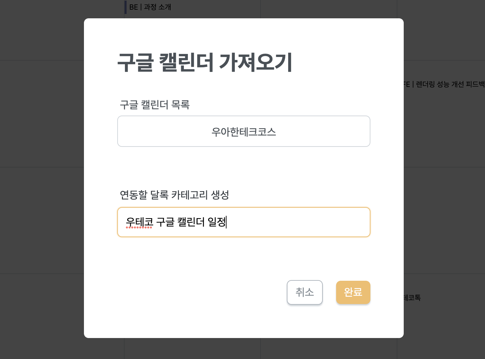
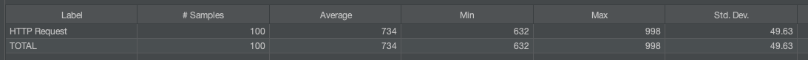
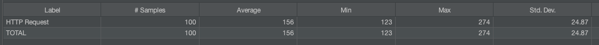

> 이 글은 우아한테크코스 4기 [달록팀의 기술 블로그](https://dallog.github.io/optimizing-external-calendar-api-calling-with-spring-local-cache)에 게시된 글 입니다.

## 구글 캘린더 연동 기능의 성능 저하



저희 달록은 유저의 구글 캘린더를 가져와 달록의 일정과 함께 볼 수 있는 기능을 제공합니다. 그리고 유저가 일정을 요청하면, 달록 서버가 직접 구글 캘린더의 API를 호출하여 달록 일정과 구글 캘린더 일정을 함께 응답하는 구죠이죠.

편리한 기능이지만, 말만 들어도 성능상의 이슈가 발생할 것 같습니다. 로컬에서 테스트한 결과 구글 캘린더에 한번 API 요청을 보내고, 응답을 받기까지 대략 **700ms 정도의 시간이 소요**됩니다. 그런데 달록에서는 하나가 아닌 **여러개의 구글 캘린더**를 연동할 수 있습니다. 3개의 구글 캘린더를 연동했다면, 일정을 불러오는데만 2000ms 이상이 걸리는 것이죠. **사용자 경험 측면에서 굉장히 좋지 않은 상황**입니다.

이런 문제를 해결하기 위해 프론트엔드에서는 React Query를 사용하여 백엔드 서버의 응답을 캐싱해두고 있습니다. 어느정도의 성능 저하는 해소되었지만, 문제는 **재방문 시점**입니다. 새로고침을 하면 React Query의 캐시가 비워지고, 다시 백엔드 서버로 요청을 하게 됩니다. 그러면 백엔드 서버도 구글 캘린더 서버로 요청을 보내게 되겠죠. 프론트엔드에서의 캐싱은 완벽한 해결책은 아닙니다.

그렇다면 서버에서 캐싱하는 것은 어떨까요? 구글 캘린더 API 요청에 대한 응답을 서버가 일정 시간 동안 보관하면서, 클라이언트에는 **캐싱된 구글 캘린더 데이터를 보내준다면 성능이 많이 개선**되겠죠? 이를 위해 달록은 **스프링 캐시 추상화**를 이용했습니다.

## 스프링 캐시 추상화와 ConcurrentMapCache의 문제점

스프링은 빈 메소드에 캐시 서비스를 적용할 수 있는 기능을 어노테이션과 AOP를 통해 제공합니다. AOP를 사용하기 때문에 내부 구현에 영향을 주지 않고, 특정 캐시 기술에 종속되지 않도록 구현할 수 있습니다.

스프링에서 기본으로 사용되는 캐시는 `ConcurrentMapCache` 입니다. 자바의 `ConcurrentHashMap` 을 사용한 간단한 캐시 구현체이죠. 덕분에 별도의 설정 없이 간단히 세팅할 수 있습니다. 다만 캐시 용량 제한, 다양한 저장방식, 다중 서버 분산과 같은 고급 설정을 할 수 없습니다. 특히 캐시 데이터에 대해 **TTL(time-to-live)**를 설정할수도 없습니다. 캐시된 데이터의 만료 기한을 설정할 수 없고, 한번 캐시된 데이터를 지우려면 스케줄링을 돌려서 일괄 삭제해야합니다.

모든 유저에게 동일하게 보이는 데이터에 대해서는 이렇게 일정 주기로 전체 캐시를 지우는 만료 정책을 설정해도 괜찮습니다. 그런데 저희가 캐시하려고 하는 데이터는 각 유저별 고유한 데이터입니다. 일정 주기로 일괄삭제할 수 없어요. 따라서 캐시가 개별적인 만료 기한을 가져야합니다.

이런 기능을 하려면 `EhCache` 나 `CaffeinCache` 같은 서드파티 로컬 캐시 구현체를 사용하거나 `Redis` 같은 캐시를 별도로 사용해야합니다. 그런데, 겨우 TTL 기능 하나 때문에 라이브러리를 사용하고 싶지는 않았습니다.

## ExpiringConcurrentMapCache 구현

이런 문제를 해결하기 위해 `ConcurrentMapCache` 를 상속받은 `ExpiringConcurrentMapCache` 라는 구현체를 직접 만들었습니다. `ExpiringConcurrentMapCache` 는 데이터가 캐시에 등록되면 캐시 키와 `LocalDateTime.now()` 쌍을 별도의 해시맵에 저장합니다. 그리고 해당 캐시 데이터가 조회될 때 마다 저장된 LocalDateTime과 현재 시각을 비교하여 만료 여부를 판단합니다. 코드를 한번 살펴볼까요?

```java
public class ExpiringConcurrentMapCache extends ConcurrentMapCache {

    private final Map<Object, LocalDateTime> expires = new HashMap<>();
    private final long expireAfter;

    public ExpiringConcurrentMapCache(final String name, final long expireAfter) {
        super(name);

        this.expireAfter = expireAfter;
    }

    @Override
    protected Object lookup(final Object key) {
        LocalDateTime expiredDate = expires.get(key);
        if (Objects.isNull(expiredDate) || LocalDateTime.now().isBefore(expiredDate)) {
            return super.lookup(key);
        }

        expires.remove(key);
        super.evict(key);
        return null;
    }

    @Override
    public void put(final Object key, final Object value) {
        LocalDateTime expiredAt = LocalDateTime.now().plusSeconds(expireAfter);
        expires.put(key, expiredAt);

        super.put(key, value);
    }
}
```

사실 이야기에 비해 굉장히 간단합니다. 필드로 캐시 키와 만료 시점을 관리하는 `expires` 라는 `HashMap` 을 가지고 있습니다. 그리고 캐시 데이터의 만료 기한을 초 단위로 `expireAfter` 라는 변수로 관리합니다.

`put()` 은 캐시에 데이터를 저장하는 시점에 `expires` 에 캐시 키와 만료 시점을 저장합니다. 만료 시점은 현재 시간 + `expireAfter` 입니다.

`lookup()` 은 캐시 키로 캐시된 데이터를 조회할 때 사용합니다. **캐시 히트(cache hit)라면 캐시된 데이터를, 캐시 미스(cache miss)라면 `null` 을 반환**합니다. 이 메소드를 오버라이드하여 요청한 데이터가 만료되었다면 `null` 을 반환하고 해당 데이터의 캐시 키를 `expires` 에서 제거합니다.

이렇게 간단히 만료되는 `ConcurrentMapCache` 를 사용할 수 있었습니다.

## 캐시 만료 정책

캐시 만료 정책에 대해 고민끝에 일단 달록은 **3시간으로 설정**하였습니다. 구글 캘린더는 저희가 통제하고 있는 데이터베이스와 같은 리소스가 아닙니다. 따라서 실제 구글 캘린더 일정이 변경되었는지, 변경되지 않았는지는 실제 요청을 하지 않는 이상 알 수가 없습니다 (만약 캘린더가 Webhook을 지원하면 가능할수도 있죠).

따라서 만료 기한을 너무 길게 잡아두면 유저가 최신 구글 캘린더 정보를 볼 수 없습니다. 그렇다고 너무 짧게 만료 기한을 잡아버리면 너무 자주 캐시 미스가 발생해서 성능이 저하될 수 있습니다. 적절한 만료 기한이 필요했습니다.

캘린더 특성상 추가/변경/삭제 작업 대비 읽기 작업이 훨씬 자주 발생한다고 생각했습니다. 이런 특성상 캐시 만료 기한을 작게 설정하면, 캐시 미스가 많이 발생하고 성능이 저하된다고 생각했습니다. 따라서 3시간 정도로의 길이가 가장 적합하다고 생각했습니다. 이 부분은 추측이므로 앞으로 계속 보강해야한다고 생각합니다.

## 한번 캐싱된 이후 재요청 되지 않는 캐시

아직 문제가 존재합니다. 바로 한번 캐싱이 된 이후 재요청되지 않은 캐시에 대한 처리입니다. 현재 구조에서는 만료 캐시를 지우는 시점이 해당 캐시에 대한 요청이 전달된 시점입니다.

그런데 만약 한번 캐싱된 데이터에 대해서 사용자가 영원히 다시 요청하지 않으면 어떻게 될까요? 서버가 재시작되지 않는 이상 해당 캐시는 영원히 서버 메모리를 점유하고 있을 것 입니다. 이런 경우가 쌓이면 상당한 리소스낭비가 될 것이라고 판단했습니다. 따라서 스프링이 제공하는 Scheduler를 활용하여 이 문제를 해결했습니다.

일단 `ExpiringConcurrentMapCache` 에 아래와 같이 만료된 캐시를 필터링하여 제거하는 메소드를 작성합니다.

```java
public void evictAllExpired() {
    ConcurrentMap<Object, Object> nativeCache = getNativeCache();

    nativeCache.keySet()
            .stream()
            .filter(cacheKey -> !isCacheValid(expires.get(cacheKey)))
            .forEach(super::evict);
}
```

그리고 `CacheConfig` 에서 아래와 같이 매일 자정에 실행되는 작업을 정의합니다. 스케줄링은 스프링이 제공하는 `@Scheduled` 어노테이션을 통해 쉽게 구현할 수 있습니다.

```java
@Scheduled(cron = "0 0 0 * * *")
private void evict() {
    ExpiringConcurrentMapCache cache = (ExpiringConcurrentMapCache) cacheManager().getCache(GOOGLE_CALENDAR);
    cache.evictAllExpired();
}
```

이렇게 스케줄링을 설정하여 재요청이 오지 않아 제거되지 않는 캐시 문제도 해결하였습니다.

## 성능 개선

성능 개선 정도를 확인하기 위해 Jmeter를 사용하여 실제 API의 평균 응답 시간을 분석했습니다. 실제 구글 캘린더 API를 호출해야 의미가 있으므로 요청과 요청간 간격은 1초정도로 설정해서 서드 파티 쪽에 부하가 없게끔 설정했습니다. 1초 간격으로 100번의 요청을 보내 평균 응답 시간을 냈습니다.

성능 테스트는 구글 캘린더 1개를 연동해 둔 상태로 진행했습니다.

### 캐시 적용 전



캐시를 적용하지 않은 상태에서는 `734ms` 의 응답 시간을 보였습니다. 꽤나 느립니다. 구글 캘린더가 1개만 연동되어 있는 상황이므로 2개 연동하면 약 2배, 3개 연동하면 약 3배로 늘어날 것입니다. 사용자 경험이 굉장히 안좋을 겁니다.

### 캐시 적용 후



최초에 캐시 미스가 발생해서 실제 API를 호출하는 요청에 대한 응답 시간은 제외하고, 캐시된 이후의 평균 응답시간만 측정했습니다. `156ms` 정도가 나오네요. 캘린더 1개 연동 기준 **약 4.7배 성능이 개선**되었습니다.

## 마치며

외부 API 요청에 대한 캐싱은 성능 개선 말고도 다른 이점이 존재합니다. 현재 상황은 아니지만, 만약에 외부 API 서비스가 호출 건당 요금을 지불해야하는 유료 서비스라면, 캐싱은 이때 발생하는 비용을 많이 절약할 수 있게 해줍니다.

다만 지금의 캐싱 구조가 완벽한 구조는 아닙니다. 지금 달록의 서버는 스케일 아웃하지 않아 단일 서버입니다. 만약 서버를 다중화 하고, 그대로 로컬 캐시를 사용한다면 서버간 데이터의 불일치가 발생합니다. 따라서 만약 스케일 아웃해야하는 상황이 온다면 **Redis나 Memcached 같은 도구를 사용하여 별도의 캐시 서버를 성하여 다중 환경에 대응**해야할 것입니다.