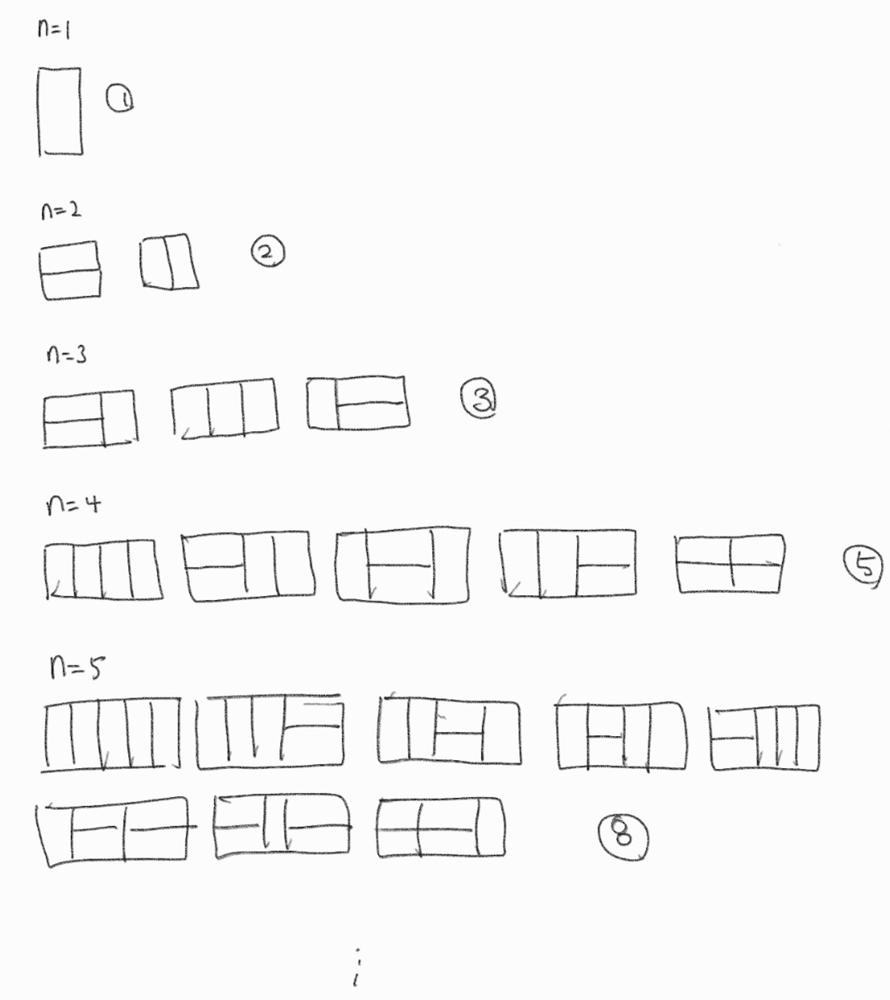

## 1. 문제 개요

- **문제 링크** : https://www.acmicpc.net/problem/11726
- **난이도** : 실버 III
- **주제** : 다이나믹 프로그래밍
- **풀이 일자** : `2021/09/04`

## 2. 문제 접근

내가 지금까지 DP에 대해 잘못 이해한 것 같다. DP 문제는 재귀를 이용하여 풀이할 수 있지만, 이는 DP 와 같은 접근방식이 아닌 분할 정복 알고리즘 (Divide and conquer algorithm) 이라고 한다.

DP 는 이전 계산 값을 Memoization 하고 그 다음 결과값에서 '재사용' 하여 중복되는 계산을 방지한다.

나동빈님의 '실전 알고리즘 강좌' 를 보고 DP 에 대해 그나마 조금 감을 잡은 것 같다. DP는 각 케이스마다 도출되는 값 으로부터 '귀납적으로 추론' 하여 규칙을 찾고, 점화식을 세우는 것이 핵심이다.



위와 같이 n 의 경우의 수는 n - 1 의 경우의 수와 n - 2 의 경우의 수를 합친 것과 같다는 규칙을 발견할 수 있다. 피보나치 수열과 같다.

## 3. 소스코드

```python
n = int(input())
dp = [1, 2]

if n == 1 or n == 2: print(n)
else:
    for _ in range(n - 2):
        dp.append(dp[-1] + dp[-2])

    print(dp[-1] % 10007)
```

## 4. 배운점

여태껏 문제를 (어차피 몇문제 안되지만) 풀면서 DP로 접근했다고 생각한 방법이 전부 분할정복법이었다.

또한 DP는 꾸준한 문제풀이로 감을 잡는 것이 중요하다고 한다.
