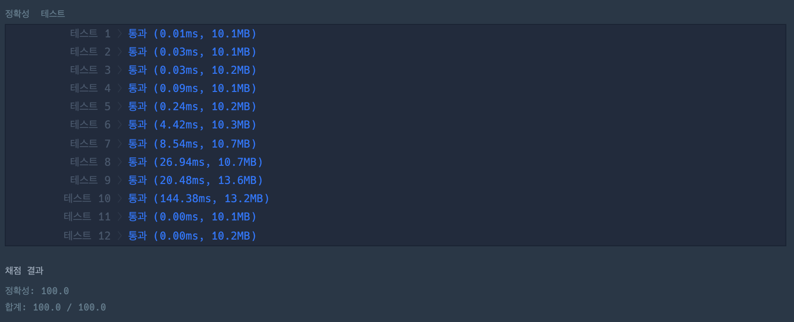

## 1. 문제 개요

- **문제 링크** : https://programmers.co.kr/learn/courses/30/lessons/42883
- **난이도** : Level 2
- **주제** : 그리디 알고리즘
- **풀이 일자** : `2021/08/29`

## 2. 문제 접근

정말.. 너무 어려웠다. 일단 '큰 수를 만드는 방법' 을 생각해 내는 것 부터 쉽지 않았다. 무식하게 조합을 돌리는 방법은 당연히 처음부터 배제를 했다. 제한조건을 확인해보면 최대 100만 자리까지 숫자가 주어질 수 있어, 시간 복잡도를 줄이는 것이 가장 큰 문제라고 생각했다.

이 문제는 정말 며칠에 걸쳐 고민 했던 것 같다. 수 많은 시행착오를 통해, 문자열로 반복을 돌리고 현재 가리키고 있는 문자가 그 다음 문자보다 작으면 지금 가리키고 있는 문자를 제거하는 방식으로 접근할 수 있었다. 문자를 한번 제거하면, 커서를 다시 문자열 맨 앞으로 옮겨 다시 앞 과정을 반복한다. 이를 문제에서 주어진 `k` 번 만큼 시행해 지운다.

이 과정을 진행하면서 처음부터 끝까지 반복을 돌았는데 문자를 제거하지 못했다고 하면, 지울 수 있는 앞자리 숫자는 모두 지운것으로 판단해 `k - 지운 문자 개수` 만큼 뒷자리에서 숫자를 지운다. `99999999`, `99999991` 같은 경우를 처리하기 위한 로직이다.

이 과정 중 최적화를 위해 현재 가리키고 있는 문자열이 `9` 라면 비교할 필요가 없으니 비교 로직을 건너 뛰었다. 이 로직을 추가하여 나름 실행속도는 줄었다.

하지만, **테스트 케이스 10번**에서 발생하는 시간초과는 도저히 고민해도 풀 수 없었다. 문자열 중간에 문자를 하나 빼는 작업이 $O(N)$ 이 걸림은 그 전부터 짐작하고 있었으나, 아무리 고민을 해도 뾰족한 최적화 방법이 생각나지 않았다.

그래서 생각했던게, **'문자열은 그대로 두고, 지운 문자열의 인덱스만 따로 기록을 하는 방법'** 이다. 하지만 이 접근 방식도 문제가 있었다.

첫번째로는 리스트에 인덱스를 기록하다보니, 리스트 길이가 길어질 수록 `in` 키워드를 사용하는 것 자체가 더 큰 시간 복잡도를 유발하는 것. (이는 해시를 이용해 해결할 수 있긴 했다)

두번째로는 현재 문자의 다음 문자를 비교하는데, 다음 문자열이 이미 지워진 문자인 경우에는 다음 문자열의 커서를 그 다음으로 옮겨야하고, 지워지지 않은 문자열이 발견될 때 까지 반복을 해야한다. 영 깔끔한 방법이라고 생각되지 않아서 금방 접게되었다.

이 문제는 오기가 생겨 절대 해설을 보고 싶지는 않았지만, 며칠에 걸쳐 고민했고 더 이상 해설을 보지 않고 버티는 건 비효율이라고 생각했고 다른 사람의 접근방법을 인터넷에서 검색해서 풀었다.

일단 풀이와 나의 접근 방법 자체는 동일했다. 그나마 좀 뿌듯한 부분이었다. 접근 방식 자체는 틀린 것이 아니었다. 하지만, 풀이에서는 문자열을 비교하고 저장하는데, 전체 문자열을 대상으로 진행하지 않고, **'스택'** 을 이용했다.

> 1. 문자열의 각 문자를 순차적으로 스택에 추가한다.
> 2. 추가된 문자가 직전에 추가된 문자보다 클 경우, 그 둘 끼리 Swap.
> 3. 스택을 Pop 하여 작은 문자를 제거한다.
> 4. 2-3 을 반복한다.
> 5. `k` 만큼 문자를 제거했다면, 나머지 문자열을 스택에 추가한다.
> 6. 스택을 문자열로 만든다.

이 풀이를 보고 정말 감탄했다. 내가 겪고 있는 문제 **'문자열을 제거할 때 발생하는 $O(N)$ 의 시간복잡도'** 와 **'이미 제거한 문자를 검사하지 않도록 하는 방법'** 두가지를 모두 스택으로 우아하게 풀어냈다.

내가 계속 접근하고 구현해내려고 하는 방법의 방향성은 일치했지만, 아쉽게도 그 방법을 스택으로 풀어내려는 아이디어까지는 접근하지 못했던 것이 아쉽다.

## 3. 소스코드

### 3-1. 직접 작성한 코드

```python
def remove_at(s, i):
    result = s[:i] + s[i + 1:]
    return result

def solution(number, k):
    remove_count = 0

    while remove_count < k:
        removed = False
        for i, c in enumerate(number):
            if c == "9": continue

            if i < len(number) - 1:
                if number[i] < number[i + 1]:
                    number = remove_at(number, i)
                    remove_count += 1
                    removed = True
                    break

        if not removed:
            number = number[:len(number) - k - remove_count]
            break

    return number
```


### 3-2. 스택을 이용한 풀이

```python
def solution(number, k):
    stack = []
    remove_count = 0

    for c in number:
        stack.append(c)

        if remove_count >= k: continue

        while (len(stack) > 1) and (stack[-2] < stack[-1]) and (remove_count < k):
            stack[-2], stack[-1] = stack[-1], stack[-2]
            stack.pop()
            remove_count += 1

    if remove_count < k:
        stack = stack[:-(k - remove_count)]

    return ''.join(stack)
```



## 4. 배운점

자료구조를 왜 배우는 것인지 정말 뼈 아프게 알려준 문제이다. 스택/큐는 개념과 구현 자체는 매우 쉽고 간단하다. 그래서 나와 같이 등한시 하기 쉬운 것 같다. 하지만 그런 **'자료구조를 문제 해결에 응용하여 푸는 아이디어'**는 아무에게서나 나오는 것은 아닌 것 같다. 잘 하고 있지만, 조금 더 정진할 필요가 있다. 지치지 말고 열심히하자.
