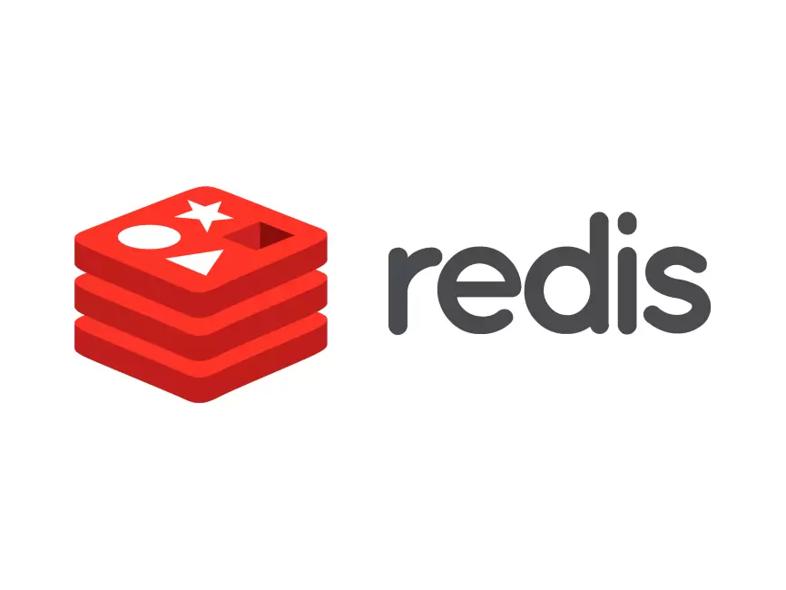
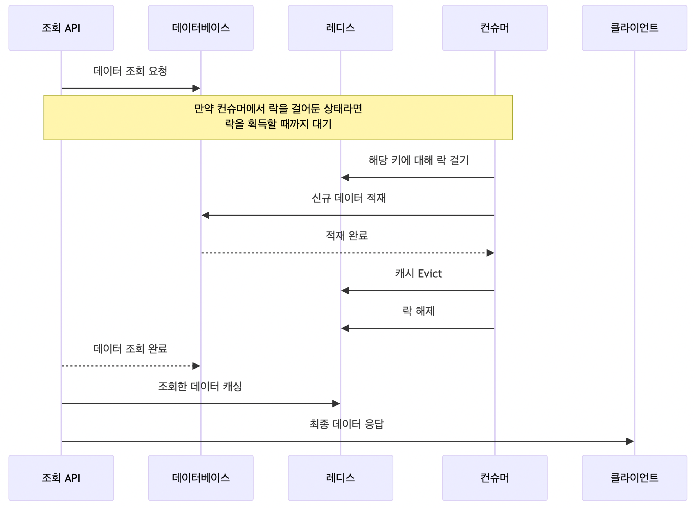
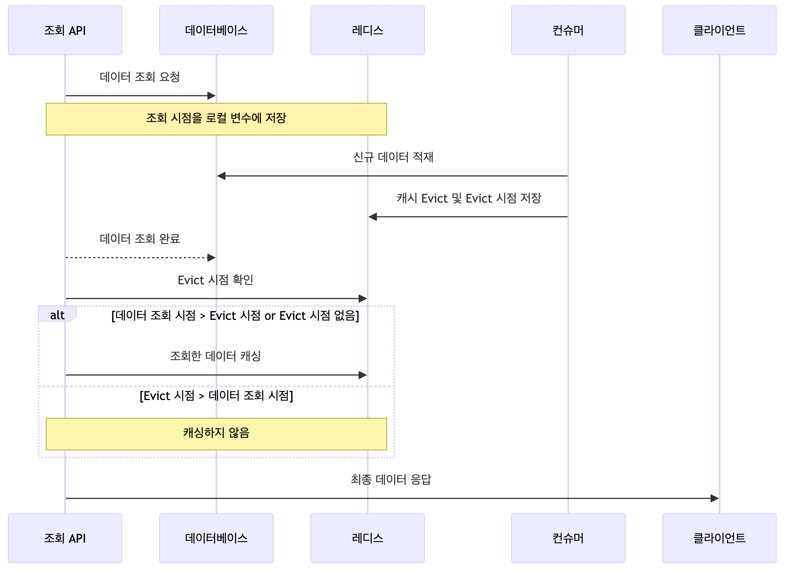

## 문제 상황

최근 회사에서 레디스를 사용하여 캐싱을 했는데, 정합성 이슈가 발생해서 이를 해결하게 된 과정을 적어보려고 한다. 일단 캐싱 구조에 대해 간략히 설명해본다.

### 캐시 구조

1. 조회 API 호출 시, **이미 레디스에 캐시되어 있다면 캐시 데이터를 서빙**하고, 그렇지 않다면 **데이터베이스를 조회한 결과를 서빙한 뒤 레디스에 캐싱**한다. (TTL은 2시간)
2. **특정 이벤트가 발생하면 카프카 컨슈머가 이벤트를 컨슘하여 데이터를 적재**하는 상황 말고는, 신규 데이터가 발생하지 않는다.

### 동시성 이슈로 깨진 정합성

여기서 데이터 정합성 이슈가 발생했던 지점은, 1번과 2번이 아주 작은 시차를 가지고 동시에 실행되었을 때 발생했다. 이를 단계별로 설명해보자면, 아래와 같다. 캐시는 되어 있지 않은 상황이다.

1. (조회 API) API가 호출되어, 데이터베이스로부터 데이터를 조회한다.
2. (컨슈머) 이벤트가 발생하여, 데이터베이스에 신규 데이터를 적재한다. 캐시를 Evict 한다.
3. (조회 API) 1에서 조회한 데이터를 캐시에 저장한 이후 응답한다.

1번과 3번 사이에서 신규 데이터가 발생했으므로, **3번에서 캐시에 저장되는 데이터는 Outdated 된 데이터**이다. 따라서 항상 최신의 데이터를 서빙하는 신뢰성 있는 API를 만들기 위해, **과거의 데이터가 캐시에 저장되지 않도록 보장**해야했다.

2번에서 신규 데이터를 캐시에 저장하는게 아니라, 그냥 캐시를 Evict 하는 이유가 궁금할 수 있다. **조회 API를 사용하여 Hit 되지 않는 이상 무의미하게 레디스 메모리 위에 떠있는 데이터가 될 수 있으므로 선제적으로 캐싱하지 않았다**.

## 해결방법 후보

### 1. 레디스 WATCH (Optimistic Lock)

레디스에서도 **트랜잭션 기능**을 사용할 수 있다. `MULTI` 명령어를 입력하면, 이후 입력하는 **모든 명령이 즉시 실행되지 않고 Queued** 된다. 일련의 명령을 수행한 뒤 `EXEC` 명령어를 입력하면, 큐에 쌓인 모든 명령어가 한번에 실행되는 구조이다.

재밌는 점은 레디스는 `WATCH` 라는 명령을 통해 **일종의 낙관적 락(Optimistic Lock)**을 제공한다는 점이다. `WATCH` 는 내부적으로 CAS(compare-and-swap) 알고리즘을 사용한다.

한번 직접 `WATCH` 를 사용해보자. 동시성 이슈를 다루므로 2개의 터미널에서 동시에 레디스 서버에 접속한 상태이다. 아래는 첫번째 터미널이다. `foo` 키에 데이터를 세팅해주고, `WATCH` 한 뒤, `MULTI` 로 트랜잭션을 시작한다음, `foo` 의 값을 바꾼 상태이다. 아직 `EXEC` 하지 않았기에 명령들은 큐에서 대기한다.

```
127.0.0.1:6379> SET foo bar
OK
127.0.0.1:6379> WATCH foo
OK
127.0.0.1:6379> MULTI
OK
127.0.0.1:6379(TX)> SET foo new-data
QUEUED
```

아래는 두번째 터미널이다. `DEL` 명령으로 `foo` 키의 데이터를 제거(evict) 했다. 여기선 트랜잭션을 사용하지 않았으므로 명령은 즉시 반영된다.

```
127.0.0.1:6379> DEL foo
(integer) 1
```

다시 첫번째 터미널이다. `EXEC` 명령으로 트랜잭션을 실행한다. 트랜잭션에서는 분명 `foo` 의 값을 `new-data` 로 설정했는데, nil 을 반환하는 것을 볼 수 있다. 다시 `GET` 해봐도 동일하다.

```
127.0.0.1:6379(TX)> EXEC
(nil)
127.0.0.1:6379> GET foo
(nil)
```

레디스에서 직접 지원하는 기능을 사용하여, 가장 이상적인 방법으로 보이는데, 사실은 이 방법은 적용하지 못했다. 회사는 레디스 클러스터가 구성되어 있는데, **레디스 클러스터 환경에서는 트랜잭션을 제한적**으로 사용할 수 있다고 한다 ([참고](https://stackoverflow.com/questions/42088324/is-there-any-redis-client-java-prefered-which-supports-transactions-on-redis-c)). 레디스 클라이언트로 Lettuce를 사용하고 있는데, 이러한 문제 때문에 **레디스 클러스터 연결 상태에서는 트랜잭션을 사용할 수 없다**고 한다 ([참고](https://github.com/lettuce-io/lettuce-core/wiki/Transactions#transactions-on-clustered-connections)).

> Clustered connections perform a routing by default. **This means, that you can’t be really sure, on which host your command is executed. So if you are working in a clustered environment, use rather a regular connection to your node**, since then you’ll bound to that node knowing which hash slots are handled by it. (Lettuce 공식문서)

### 2. 락을 건다

아래 방법대로 락을 활용하여, 정합을 맞추는 방법이 있을 것이다.



1. (조회 API) API가 호출되어, 데이터베이스로부터 데이터를 조회하는데, **만일 컨슈머에서 해당 데이터에 락을 걸어둔 상태라면, 락을 획득할 때 까지 기다린다**.
2. (컨슈머) 이벤트가 발생하면, **해당하는 레디스 키에 대해 락을 건다. 이후 데이터베이스에 신규 데이터를 적재하고, 캐시를 Evict 한뒤에 락을 해제**한다.
3. (조회 API) 1에서 조회한 데이터를 캐시에 저장한다.

이 방법은 락을 획득하는데 시간이 만일 오래걸린다면, 조회 API의 응답속도도 덩달아 늦어질 수 있는 문제가 있다. 또한 락 메커니즘을 만드는 것이 다소 번거롭다는 점도 있다. 하지만 확실하게 최신 데이터를 캐시해둔다는게 보장된다는게 장점이다. 하지만 두가지 단점때문에 이 방법을 채택하지는 않았다.

### 3. 시간 기반



아래 방법대로 Evict 시점을 레디스의 별도 키에 저장하는 방법으로 항상 최신 데이터만 캐시되도록 보장하는 방법이 있다.

1. (조회 API) API가 호출되어, 데이터베이스로부터 데이터를 조회한다. **이 조회 시점을 로컬 변수에 저장**해놓는다.
2. (컨슈머) 이벤트가 발생하여, 데이터베이스에 신규 데이터를 적재한다. **캐시를 Evict 하고, 그 시점을 레디스에 따로 저장**한다.
3. (조회 API) 1에서 **조회한 시점이 캐시를 Evict 한 시점보다 나중이거나, Evict 한 시점이 저장되어 있지 않았을 때만, 조회한 데이터를 캐싱**한다.

2번에서 저장하는 데이터는 TTL을 10초정도로 짧게 설정했다. 일반적인 상황에서 조회(1번)과 캐시(3번) 사이의 간격이 아무리 길어도 10초보다 작을 것이기 때문이다.

이 방법은 별도로 Evict 시점을 관리할 키가 추가된다는 점이 아쉽고, 데이터 조회 시점이 Evict 시점보다 이른 경우 캐시되지 않아 Hit ratio 가 미미하게나마 적어질 것이다. 다만, 락에 비해 구현 방식이 매우 간단하므로 결론적으로 이 방법을 선택하게 되었다.
