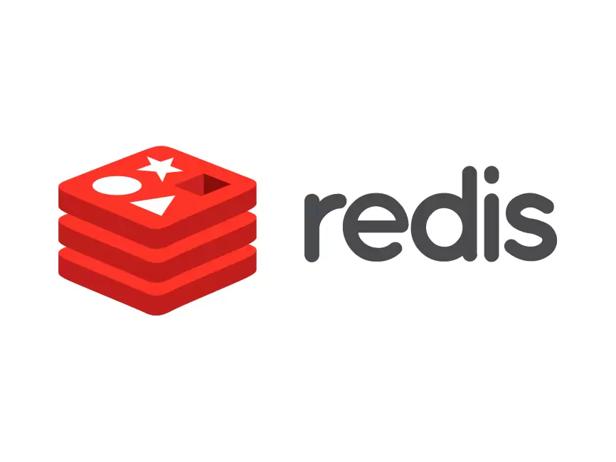

레디스는 싱글 쓰레드로 동작하므로, 단일 명령의 처리는 원자적으로 동작하여 경합이 발생하지 않는다. 하지만 여러 명령을 한번에 수행하게 되면 이야기는 달라진다. 서로 다른 레디스 클라이언트에서 기능을 수행하기 위해, **한번에 여러 명령을 보낸다면, 각 클라이언트의 여러 명령이 뒤섞여 실행되며, 이로 인해 경합이 발생하고, 예상치 못한 문제가 발생할 수 있다**.

이를 방지하기 위해 크게 **Redis Transaction**과 **Lua Script** 이렇게 2가지 기능을 사용할 수 있다.

## Redis Transaction

레디스는 트랜잭션을 지원한다. 트랜잭션을 사용하여 다수의 커맨드를 원자적으로 실행할 수 있다.

### 레디스 트랜잭션을 구성하는 커맨드

레디스 트랜잭션은 다수의 레디스 커맨드를 한번에 수행될 수 있도록 해준다. 레디스 트랜잭션에서 주요하게 사용되는 커맨드는 아래 5가지이다. 이를 간단히 알아보자.

- `MULTI` : 호출하게 되면 레디스 커맨드를 실행하게 된다. 이 커맨드는 항상 OK로 응답하며, 이 커맨드가 호출된 시점부터 유저는 다수의 커맨드를 입력할 수 있다. **MULTI가 호출된 이후에 입력된 커맨드는 즉시 실행되는 대신, 큐에 쌓이게 된다**.
- `EXEC` : MULTI가 호출된 이후 입력된 커맨드를 **한번에 실행하고 트랜잭션을 끝낸다**. EXEC이 호출되면 큐에 쌓인 모든 개별 커맨드가 반환한 요소들을 순서대로 묶어 배열로 반환한다.
- `DISCARD` : EXEC 대신 DISCARD를 호출하면, **큐에 쌓인 모든 명령을 버리고(flush) 트랜잭션을 끝낸다**.
- `WATCH` : 후술할 **낙관적 락(optimistic lock)**을 구현하기 위해 사용하는 커맨드이다. 자세한 설명은 아래 낙관적 락에 해두었다.
- `UNWATCH` : WATCH 해둔 키들의 WATCH를 취소할 때 사용된다.

> `MULTI` 커맨드 이후로 실행된 명령은 모두 QUEUED 라는 상태 응답을 반환한다.

### 레디스 트랜잭션이 보장하는 것

레디스 트랜잭션은 아래 2가지를 보장한다.

1. **레디스 트랜잭션이 실행되는 중에는 다른 클라이언트가 보낸 레디스 커맨드는 실행되지 않음을 보장**한다. 즉, 레디스 트랜잭션 사이에는 다른 클라이언트가 보낸 요청이 개입할 수 없다는 의미이다. 이는 곧 트랜잭션이 격리된 명령으로 직렬화되어 실행됨을 보장한다는 뜻이다.
2. **`EXEC` 커맨드가 실행되지 않으면, 트랜잭션의 모든 명령은 수행되지 않는다**. 만일 트랜잭션 도중 `EXEC` 이 호출되기 전에 네트워크 문제로 연결이 유실되었다면, 어떤 작업도 수행되지 않는다.

### 트랜잭션에서 에러가 발생하는 경우

아래와 같은 두가지 문제상황에서는 에러가 발생할 수 있다.

1. `EXEC` 을 실행하기 전에, 즉 커맨드를 큐에 적재하기 전에 문제가 발생한 경우: 커맨드가 문법적으로 잘못된 경우, 메모리 부족과 같이 심각한 상황인 경우
2. `EXEC` 을 실행한 이후 문제가 발생한 경우: 잘못된 커맨드를 실행한 경우 (List에만 수행할 수 있는 커맨드를 String에 수행하는 등)

(2.6.5 버전 이후 부터는) 트랜잭션 중 에러가 발생하면, 큐에 명령이 쌓이는 동안 에러가 발생했다면, `EXEC` 시점에 해당 트랜잭션을 실행하지 않는다.

```kotlin
127.0.0.1:6379> MULTI
OK
127.0.0.1:6379(TX)> SET a
(error) ERR wrong number of arguments for 'set' command
127.0.0.1:6379(TX)> SET b 1
QUEUED
127.0.0.1:6379(TX)> SET c
(error) ERR wrong number of arguments for 'set' command
127.0.0.1:6379(TX)> SET d 1
QUEUED
127.0.0.1:6379(TX)> EXEC
(error) EXECABORT Transaction discarded because of previous errors.
127.0.0.1:6379> GET b
(nil)
```

### CAS 알고리즘을 사용한 낙관적 락

우선 **CAS(Check-And-Set 혹은 Compare-And-Swap)** 알고리즘에 대해서 간단히 알아보자. CAS 알고리즘은 아래의 3가지 단계를 통해 락을 사용하지 않고도, 멀티쓰레드 환경에서 쓰레드간 동기화를 달성할 수 있다.

1. **데이터 조회**: 변경할 대상의 데이터를 조회한다.
2. **데이터 비교**: 대상 데이터가 예상 데이터와 동일한지 비교한다.
3. **데이터 변경**: 예상 데이터와 동일하다면 새로운 값으로 데이터를 변경하고, 그렇지 않다면 데이터를 변경하지 않는다.

레디스에서는 `WATCH` 커맨드를 사용해서 트랜잭션 내에서 **CAS 알고리즘을 사용한 낙관적 락**을 구현할 수 있다. 레디스는 `WATCH` 커맨드로 지정한 키의 변경사항을 감지한다. 만일 `EXEC` 하기 전에 `WATCH` 된 키가 하나 이상 변경된 것이 감지되었다면, 트랜잭션은 중단되고 `EXEC` 은 Null 응답을 반환하여 트랜잭션이 실패했음을 알린다.

`WATCH` 는 여러번 호출될 수 있으며, `UNWATCH` 커맨드를 통해 이미 `WATCH` 된 키를 변경감지 대상에서 제외할 수 있다.

> 6.0.9 버전 이전에는, WATCH한 키가 만료되어 트랜잭션이 중단되는 경우가 있었나본데, 6.0.9 버전 이후에는 그렇지 않도록 변경되었다고 한다.

### 레디스는 롤백을 지원하지 않는다

레디스는 성능상의 문제로 롤백을 지원하지 않는다. 일단 EXEC 명령을 사용해 트랜잭션을 실행하면, 그 안에 있는 명령들이 실행되거나 실패하는 중에 이를 중단하거나 되돌릴 수 없다. **‘트랜잭션 중 에러가 발생하면, 큐에 쌓인 명령들을 실행하지 않고 트랜잭션을 취소한다고 했는데, 이게 롤백 아닌가?’** 하는 의문이 들 수 있다.

전통적인 RDBMS는 트랜잭션 격리수준에 따라 다르겠지만, 예를 들어 READ UNCOMMITTED 일 경우, 커밋되지 않은 트랜잭션이 변경한 데이터를 실제 다른 트랜잭션에서 읽을 수 있다. 실제 INSERT, UPDATE 와 같은 쿼리문이 실행되어 데이터베이스에 반영되었다는 것이다. 그리고 이 상황에서 트랜잭션 중 에러가 발생한 경우 복잡한 롤백 메커니즘을 통해, 명령이 실행되기 전의 상태로 데이터베이스를 되돌린다.

반면 레디스 트랜잭션은 `EXEC` 이 실행되기전 까지 명령을 수행하지 않는다. 따라서 트랜잭션 중 에러가 발생했을 때, 이 내용이 반영되지 않는다는 것은 **롤백보다는 실행 거부 내지 실행 취소에 가깝다**. 이는 실행 이전의 상태로 되돌리는, 즉 롤백 메커니즘이 아니다.

## Scripting with Lua

레디스 서버에서는 Lua 라는 스크립트 언어를 실행할 수 있다. 내가 알기로는 Lua는 게임 개발이나 모딩(modding) 쪽에서 많이 사용되는 것으로 알고 있었는데 ([메이플스토리에서도 공식 지원한다](https://maplestoryworlds-creators.nexon.com/ko/docs/?postId=822)), 레디스에서도 여러 레디스 명령을 원자적으로 실행하기 위해 Lua가 사용된다. 즉, 레디스는 Lua 스크립트의 원자적 실행을 보장한다.

레디스에서 Lua 스크립트는 아래의 3개의 목적을 달성하기 위해 사용된다.

1. **지역성 (Locality)**: Lua 스크립트는 클라이언트가 아닌 레디스 서버에서 실행된다. 클라이언트가 데이터를 조회하여 연산하고 다시 서버에 반영하는 과정에는 여러번의 통신이 발생한다. 반면 Lua 스크립트를 사용하면, 연산이 데이터가 저장된 위치(레디스 서버)에서 실행되므로 더 효율적이다.
2. **원자성 (Atomicity)**: 레디스에서 Lua 스크립트가 실행되면, 모든 서버 활동이 블로킹된다. 즉, 스크립트의 실행이 완료될 때까지 다른 명령이 중간에 개입하는 것이 불가능하다.
3. **간단한 기능 구성 (Composition of simple capabilities)**: 레디스가 지원하지 않는 아주 간단한 기능을 직접 스크립트로 만들어서 실행할 수 있다.

이 방법은 사실 복잡할 것 없이, **‘Lua 스크립트로 작성된 명령을 실행할 때에는 레디스 서버 활동을 블로킹 하는’** 방식으로 원자성을 보장하는 원리이다. 그 외의 레디스에서 Lua 스크립트를 사용하는 것 자체에 대해 더 자세히 알고 싶다면 [**Redis 공식 문서**](https://redis.io/docs/interact/programmability/eval-intro/)를 참고하는 것이 좋을 것 같다.

## Redis Pipelining은 원자성을 보장하지 않는다

레디스엔 트랜잭션과 비슷해보이는 파이프라인이란 개념이 존재한다. 파이프라인은 여러 명령을 일괄적으로 레디스 서버에 전송할 수 있게 해주고, 모든 응답을 한번에 수신할 수 있도록 해주는 기능이다. 1000개의 커맨드를 요청해야한다고 가정했을 때, 파이프라인을 사용하지 않았다면 1000번의 네트워크 요청이 발생하지만, 파이프라인을 사용했다면 1번의 네트워크 요청으로 명령을 수행할 수 있다. 즉, 파이프라인을 사용하여 **RTT(round-trip time)**을 최적화할 수 있다는 것이다 (이는 트랜잭션이나 Lua 스크립트도 마찬가지다).

Spring Data Redis 등을 사용하면 더 멋지게 사용할 수 있겠지만, 실제로는 아래와 같이 단순히 여러 명령을 묶어서 레디스 서버로 전송하는 것 뿐이다.

```bash
$ (printf "PING\r\nPING\r\nPING\r\n"; sleep 1) | nc localhost 6379
```

이는 트랜잭션이나 Lua 스크립트를 사용하는 방식과는 다르게 원자성을 보장하지 않는다. 파이프라인은 트랜잭션 보다는 단순히 Bulk 혹은 Batch 와 비슷한 성격이라고 생각하는게 옳다.

## 참고

- https://redis.io/docs/interact/transactions/
- https://redis.io/docs/interact/programmability/eval-intro/
- https://www.slideshare.net/RedisLabs/atomicity-in-redis-thomas-hunter
