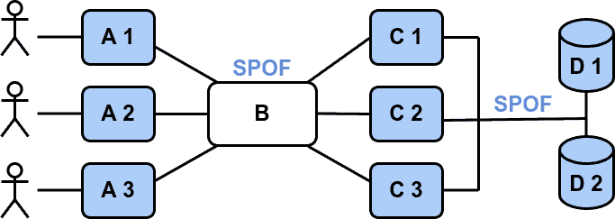
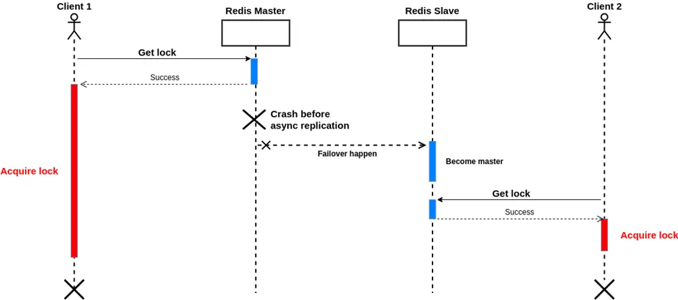
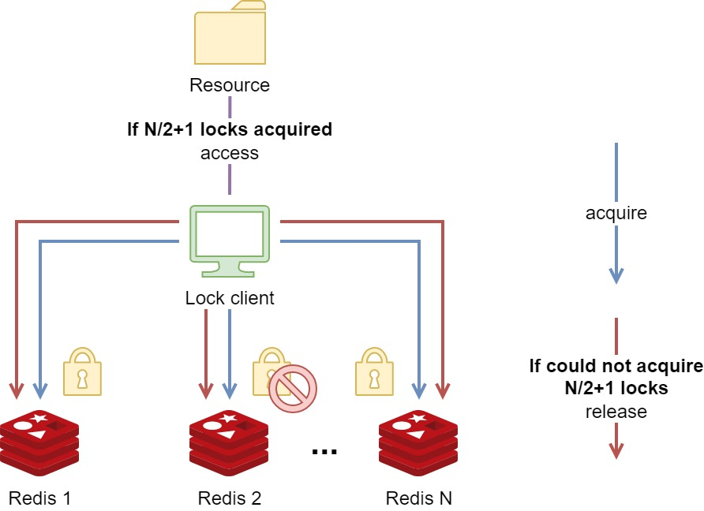

블로그에 글을 오랜만에 쓴다. 요즘 공부한 대부분의 내용은 개인 옵시디언에 작성하고 있어서, 블로그 같이 공개적인 공간에 글을 발행할 일이 없었는데, 의식적으로 블로그에도 글을 써보려 해야겠다.

최근에 Redlock 알고리즘에 대해서 가볍게 공부했는데, 이 내용을 정리해본다.

## 분산 락이 보장해야하는 속성

레디스 공식 문서에서는 아래와 같이 분산락이 보장해야하는 3가지 속성에 대해 제시한다.

1. **상호 배제 (Mutual Exclusion)** : 특정 시점에 하나의 클라이언트만 락을 획득할 수 있어야 함
2. **교착 상태 없음 (Deadlock Free)** : 먼저 락을 획득한 클라이언트가 장애(다운, 네트워크 단절 등)가 발생하더라도 락을 획득할 수 있어야 함
3. **내결함성 (Fault Tolerance)** : Redis 노드의 과반수가 동작중이라면 클라이언트는 락을 획득/해제가 가능해야함

Redlock 알고리즘은 어떻게 위 3가지 요건을 만족했는지 알아보자.

## Redlock 등장 배경

Redlock 알고리즘이 어떤 문제를 해결하기 위해 등장했는지, Redlock 등장 이전의 분산락 구현 방식과 그 문제점을 알아보자.

### 1. 단일 Redis 인스턴스의 문제



Redis 를 사용해서 락을 구현하는 가장 간단한 방법은 **단일 Redis 인스턴스**를 구성하는 방법이다. 락을 획득하고자 하는 클라이언트는 단일 Redis 인스턴스에서 키를 생성하고 TTL을 설정한다. 이 상태에서 다른 클라이언트가 락을 획득하려하면, 이미 해당 키가 설정되어 있으므로 실패한다. 이후 임계 영역 (Critical Section) 에서 작업을 마친 클라이언트는, 자신이 Redis 에 설정했던 키를 제거하여 락을 해제한다.

Redis는 기본적으로 **싱글 쓰레드로 동작** 하기 때문에, **분산 환경에서의 경합을 크게 고려하지 않고도** 간단하게 분산락을 구현할 수 있다.

하지만, 문제는 단일 Redis 인스턴스는 **단일 장애점(Single Point of Failure)** 이라는 점이다. Redis 인스턴스에서 장애가 발생해 죽어버리면, 어떤 클라이언트도 임계 영역에서 작업을 수행할 수 없게 된다. 곤란한 일이다.

### 2. Master-Slave 복제 아키텍처의 문제

단일 Redis 인스턴스는 앞서 알아보았듯, **단일 장애점으로 인한 가용성 문제**가 존재한다. 그렇다면, Master-Slave 복제 아키텍처를 사용하여 가용성을 높이는 방법을 사용하면 어떨까? 좋은 아이디어 같아 보인다. 적용해보자.

Master-Slave 로 Redis 를 구성했는데, 어느날 Master 노드에 장애가 발생했다. 다행히 Failover 메커니즘에 의해 Slave 가 Master 로 승격되면서, 장애는 빠르게 회복되었다. 그런데, 이상한 현상이 발생하였다. 장애가 발생한 당시, 2개의 클라이언트가 동시에 리소스에 접근하여 **동시성 이슈가 발생**한 것이었다. 왜 이런일이 발생했을까?



이 문제는 Redis 의 복제 방식으로 인해 발생한다. Redis 는 비동기 복제 방식을 사용한다. 아래와 같은 시나리오를 생각해보자.

1. Client A가 마스터에서 락을 획득함
2. Master에서 키에 대한 쓰기가 발생했지만, **Slave로 복제되기 전에 마스터 노드가 다운**됨
3. Slave 노드가 새로운 Master로 승격됨
4. Client B가 새로운 마스터로부터 락을 획득함

이와 같은 상황을 **복제 지연으로 인한 쓰기 유실 (Write Loss)** 이라고 부른다. 이런 쓰기 유실이 발생한다면, 서로 다른 두 클라이언트가 동시에 임계 영역에 진입해 상호 배제 원칙이 위배될 수 있다.

Redis 의 `WAIT` 명령을 사용하면 해결할 수 있을 것 같지만, **`WAIT` 을 사용하다고 하더라도 동기 복제를 완전히 보장하지 않는다**. `WAIT` 은 쓰기 명령이 Replica 로 도달하여 ACK 응답을 받은 시점 까지만 보장하며, 실제로 Replica 에 정상적으로 데이터가 쓰여지는 것 까지 보장하지 않는다. 또한 `WAIT` 에 timeout 을 설정하면, 일정 시간동안 ACK 응답을 받지 못했을 때, ACK 응답을 기다리는 것을 포기하고 다음 명령을 실행한다.

즉, `WAIT` 을 사용하더라도 여전히 쓰기 유실이 발생할 가능성은 존재한다.

## Redlock 의 등장

앞서 알아본 것 처럼, 단일 인스턴스를 사용하던 Master-Slave 복제 아키텍처 방식을 사용하던 Redis 는 높은 수준의 신뢰성을 제공하지 않는다. Redlock 을 사용하면, **SPOF로 인한 가용성 문제**와 **복제 지연으로 인한 쓰기 유실 문제**를 해결하면서, 안전하게 락을 제공할 수 있다.



Redlock 의 핵심 아이디어는 **정족수(Quorum)**이다. 정족수란, 회의나 투표가 유효하게 진행되기 위해 필요한 최소한의 참석 인원을 말한다. Redlock 에서도 이 의미는 동일하게 사용된다.

Redlock 을 사용하기 위해서는 **다수(일반적으로 5개)의 독립적인 (Standalone) Redis 인스턴스**가 필요하다. 클라이언트는 이 Redis 노드 모두에게 순차적으로 락을 요청한다. 그리고 **정족수(N/2 + 1) 이상의 노드들로부터 락을 획득**했다면, **클라이언트는 자신이 락을 획득했다고 간주하고 임계 영역에 진입**해 작업을 수행한다.

일정 수 이상의 노드들로부터 락을 획득하면, 리소스의 락을 획득한 것으로 인정되므로, **일부 노드가 다운된 상태여도 문제 없다**. 따라서 **가용성 문제와 쓰기 유실 문제**를 모두 해결할 수 있다.

> Redlock 을 위해 구성된 Redis 노드들은 같은 클러스터에 참여하거나, 복제를 하는 등 서로 연관되어 있어서는 안되며, 완전히 독립되어야 한다.

이제 Redlock 알고리즘에 대해서 더 자세히 알아보자.

## Redlock 알고리즘

### 1. 현재 시각을 ms 단위로 가져옴

이 시간은 락 획득에 걸린 시간을 계산하기 위해 사용된다.

### 2. 클라이언트는 모든 N개의 마스터 노드로부터 순차적으로 락 획득을 시도

이떄, 클라이언트는 해당 키에 **랜덤한 값**을 저장한다. 아래에서 자세히 설명하겠지만, 이 랜덤 값은 **락을 획득한 클라이언트만이 해당 락을 해제할 수** 있도록 보장한다.

특정 Redis 노드에 락이 이미 걸려있다면, 즉시 다음 노드로 넘어간다. 이런 상황이 발생했다면, 해당 클라이언트는 다른 클라이언트와 락 획득 경쟁이 발생한 상황일 것이다.

### 3. 락 설정시 타임아웃을 적용

클라이언트는 각 Redis 인스턴스에 락을 설정할 때, **한 노드를 너무 오래기다리지 않도록 타임아웃을 설정**한다. 예를 들어, TTL이 10초 정도라면, 타임아웃은 5~50ms 정도로 작게 설정한다. 이렇게 하면, Redis 노드가 설령 다운된 상황이라도 오래 기다리지 않고 바로 다음 노드로 넘어갈 수 있다.

### 4. 락 획득 성공 여부 판단

클라이언트는 모든 Redis 노드로부터 락 설정 시도를 마치고, **과반수(N/2 + 1) 이상의 인스턴스에서 락을 획득 했는지 확인**한다. **과반수 이상의 Redis 노드로부터 락을 설정하는데 성공했다면, 클라이언트는 자신이 락 획득에 성공했다고 판단**한다.

### 5. 락 유효 시간 계산

클라이언트는 **락 유효 시간(Lock Validity Time)**을 계산한다. 락 유효 시간은 이름 그대로 **락이 유효한 시간**을 나타내며, **클라이언트는 락 유효 시간 만큼 임계영역에서 작업을 할 수 있다**. 락 유효 시간은 아래와 같이 계산한다.

$$
Lock Validity Time = TTL - (T2 - T1)
$$

각 변수의 의미는 아래와 같다.

- `TTL` : Redis 키에 설정된 TTL. 이는 락의 초기 유효 시간을 나타낸다.
- `T1` : 최초 노드에서 Key가 SET 된 최악의 시각 (첫번째 노드에 통신하기 전에 얻어온 시각)
- `T2` : 마지막 노드에서 Key가 SET 된 최악의 시각 (마지막 노드로부터 응답을 받은 시각)

$(T2 - T1)$ 은 클라이언트가 락을 획득하는 데 소요된 총 시간으로, 이 시간이 길어질수록 실제로 락을 보유할 수 있는 시간이 줄어든다.

### 6. 락 획득 실패 시 처리

만약 클라이언트가 락 획득에 실패한 경우, 모든 Redis 인스턴스에서 락을 해제한다.

## Redlock 의 실제 구현

레디스 공식 문서에서는 Redlock 구현 방식을 아래와 같이 제시한다.

### 1. Redis 명령으로 락 획득

클라이언트는 아래와 같은 `SET` 명령을 수행하여 락을 획득한다.

```bash
SET resource_name my_random_value NX PX 30000
```

- `NX` : 키가 존재하지 않을 때만 값을 설정한다.
- `PX` : 키의 TTL을 밀리세컨드 단위로 설정한다.

### 2. Lua Script 를 사용하여 락 해제

락 해제 작업을 Atomic 하게 수행하기 위해, 클라이언트는 아래와 같은 Lua Script 를 실행하여 락을 해제한다.

```lua
if redis.call("get", KEYS[1]) == ARGV[1] then
	return redis.call("del", KEYS[1])
else
	return 0
end
```

- `KEYS[1]` : 해제하려는 락의 Key 를 지정. 여기서는 `resource_name` 에 해당하는 값을 전달한다.
- `ARGV[1]` : Lua Script 에서 사용할 인자의 값. 여기서는 `my_random_value` 에 해당하는 값을 전달한다.

### `my_random_value` 가 무엇인가?

여기에서 `my_random_value` 라는 랜덤한 값이 등장한다. 이 값은 락을 획득한 클라이언트만이 락을 해제할 수 있도록 보장하는데 사용된다.

만약 레디스 키에 대한 `DEL` 명령을 누구나 실행할 수 있다면, **락을 획득하지 않은 클라이언트가 임의로 락을 해제하고 자신이 락을 획득할 수 있게** 되고, 이는 상호 배제의 위반이다.

이를 방지 하기 위해서, 락을 설정할 때 클라이언트가 랜덤 값을 생성하고, 락 Key의 Value 로 사용한다. 그리고 락을 해제할 때, 자신이 생성한 랜덤 값을 제시해서, 일치하는 경우에만 락을 해제한다 (Lua Script 의 로직). 이는 클라이언트가 락의 소유권을 증명하는 일종의 비밀번호라고 할 수 있다.

## Redlock 주의점

### Clock Drift 문제

Redlock 알고리즘에서 Redis 노드들 그리고 클라이언트 간에 **동기화된 시계 (Synchronized Clock)**가 존재하지 않는다. 그리고 Redlock 알고리즘은 **참여자간의 로컬 시간이 거의 동일한 속도로 갱신된다는 가정에 의존**한다.

하지만 현실에서는 로컬 시계가 정확한 속도로 동작하지 않는 **Clock Drift 현상**으로, **시스템 내부 시계가 실제 시간과 불일치하는 현상**이 발생할 수 있다. 이런 현상은 하드웨어 문제, 운영체제 스케줄링 문제 등 다양한 원인으로 인해 발생할 수 있다.

#### Clock Drift 발생 시나리오

Clock Drift 현상이 발생하면, **한 Redis 노드에서는 락이 유효하다고 판단하는 반면, 다른 노드에서는 해당 락이 이미 만료되었다고 판단**할 수 있다. 예를 들자면, 아래와 같은 시나리오이다.

1. 5개의 레디스 노드가 존재하고, 3개의 노드에서 락을 획득하면, 락이 유효한 상황
2. 클라이언트 1은 A, B, C 노드에서 락을 획득했으나, 네트워크 에러로 D와 E 노드에서 실패
3. **노드 C의 시계가 클럭 드리프트로 인해, 시간이 미래로 점프했고, 조기에 TTL이 만료**됨
4. 이 시점에 클라이언트 2가 C, D, E 에서 락을 획득함

#### MIN_VALIDITY

따라서, 클라이언트는 락 유효 시간에서 클럭 드리프트를 보정한 값인 `MIN_VALIDITY` 를 계산하고, 자신이 획득한 **락의 안정성**을 판단해야한다.

`MIN_VALIDITY` 는 아래와 같이 계산한다.

$$
MIN\_VALIDITY = TTL - (T2 - T1) - CLOCK\_DRIFT
$$

클라이언트는 이와 같이 `MIN_VALIDITY` 를 계산하고, 아래와 같이 락 안정성에 대해 판단한다.

- **`MIN_VALIDITY` 가 음수거나 너무 짧다면** : 락이 불안정하다고 판단하고, 사용을 중단하거나 락을 해제한다.
- **`MIN_VALIDITY` 가 충분히 크다면** : 락이 안정적이라고 판단하고 작업을 진행한다.

#### CLOCK_DRIFT 계산

그렇다면, `CLOCK_DRIFT` 는 어떻게 계산할까? 일반적으로 `CLOCK_DRIFT_FACTOR` 라는 값을 활용하여 `CLOCK_DRIFT` 값을 계산한다. 산식은 아래와 같다.

$$$
CLOCK\_DRIFT = TTL * CLOCK\_DRIFT\_FACTOR + δ
$$$

일반적으로 `CLOCK_DRIFT_FACTOR` 의 값은 1%로 설정하는데, 이는 네트워크 시간 프로토콜(NTP)을 통한 시계 동기화의 정확도에 기반한다고 한다.

NTP의 정확도에 대한 연구에 따르면, NTP를 통해 동기화된 시스템 간의 시계 오차는 일반적으로 수 밀리초에서 수십 밀리초 수준으로, **전체 시간의 약 0.01%에서 0.1%에 해당**한다고 한다. 따라서, 보수적인 접근으로 **1%**를 `CLOCK_DRIFT_FACTOR` 로 설정하여 시계 드리프트를 고려하는 것이 일반적이다.

### Split-brain Condition

클라이언트가 락을 획득하는데 실패한 경우, 재시도 정책에 따라 **락 획득을 재시도**할 수 있다. 그런데 만약 재시도 하려는 클라이언트가 많다면, **동시에 재시도 요청이 쇄도**하는 Retry Storm 이 발생할 것이다. 이렇게 **리소스에 대해 경쟁하면, 계속해서 충돌이 발생하고, 그 어떤 클라이언트도 과반수 이상의 인스턴스에서 락을 획득할 수 없다**. 이런 상황을 **Split-brain 상태**라고 부른다.

이를 해결하기 위해서, 레디스 공식 문서는 아래의 3가지 방법을 제시한다.

1. **랜덤 딜레이** : 클라이언트들이 동일한 시간에 동시에 시도하지 않도록, 재시도 간격을 무작위로 적용하여 타이밍을 분산시킨다.
2. **멀티 플렉싱** : 클라이언트는 모든 Redis 인스턴스에 병렬로 동시에 락 요청을 보낸다. 락 요청 속도가 빨라지면, 여러 클라이언트가 동시에 요청하는 Time Window 가 줄어들어, Split-brain 가능성이 감소한다.
3. **빠른 락 해제** : 클라이언트가 과반수 락 획득에 실패했다면, 즉시 부분적으로 획득한 락을 해제해야한다. 다른 클라이언트가 락을 요청할 때 키 만료를 기다리지 않도록 해, 락 충돌 가능성을 줄이고 가용성을 높인다.

### 애플리케이션 중단 및 네트워크 지연으로 인한 문제

만약 락을 획득한 클라이언트가 Full GC로 인한 Stop-the-world 가 발생하는 등 **긴 지연에 걸리거나, 네트워크 지연이 발생**한 경우, **지연이 해소되는 동안 TTL이 먼저 만료되는 상황이 발생**할 수 있다. 이 경우 기존 클라이언트의 지연이 해소되기 전에, 다른 클라이언트가 락을 획득하고 임계 영역에 진입할 수 있다.

이런 상황에서 지연된 애플리케이션이 다시 복구되었을 때, 자신의 락이 만료됨을 인지 못한다면, 그대로 임계 영역에서 다시 작업을 이어나갈 수 있고, 이는 상호 배제의 위반이다.
