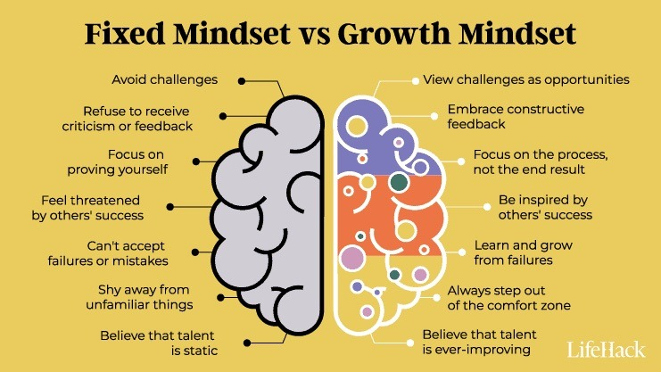
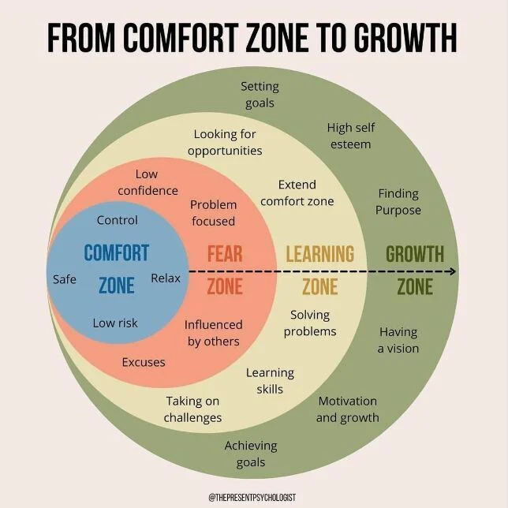

커리어와 성장에 대해 고민이 많은 요즘[^참고], [**드림코딩**](https://www.youtube.com/@dream-coding)이라는 유튜브 채널에서 관련된 좋은 영상을 보게 되어 이를 내 생각과 함께 정리해본다. 학습한 내용들을 글로 작성하여 인출하며 장기기억화에 큰 도움이 되므로, 앞으로 이런 좋은 영상을 보았을 때도 블로그에 내 생각과 함께 정리해보려고 한다.

## 첫번째 영상 - 개발 공부 제대로 하는 법 🤓 (정체기에서 성장기로 가보자, 함 해보자!)

<iframe width="100%" height="400" src="https://www.youtube.com/embed/DmK7d0xB2j0" title="개발 공부 제대로 하는 법 🤓 (정체기에서 성장기로 가보자,  함 해보자!)" frameborder="0" allow="accelerometer; autoplay; clipboard-write; encrypted-media; gyroscope; picture-in-picture" allowfullscreen></iframe>

무언가 배우고 있기는 한데, 실력이 계속 제자리인 느낌이 든다면, **내가 '깨어있지 않은' 상태인지 점검**해볼 필요가 있다. 깨어있지 않다는 말은 **'사고' 하지 않고 있다는 뜻**이다. 생각 없이 그냥 바쁘고, 조급하다. 그래서 일단 우선 동작하는거만 만들고 본다. '이것만!', '이번만!' 이라고 말하며, 그때 그때 필요한 지식들만 대충 가져다 사용하고, 더 깊이있게 생각하고 공부하려고 하지 않는다. **이렇게되면 하는 일만 기계적으로 하게 되고, 남는게 없게 된다.**

드림코딩 엘리는 이런 사람들에게 '깨어있기 이론' 이라는 5가지 팁을 이야기한다. 단, 이 방법론을 적용한다고 하더라도 당장 가시적인 성장이 눈에 보이지 않을 수 있으므로, 조급해 하지 않고 꾸준히 해나가는게 중요하다고 한다.

### 팁1. 다음은 오지 않는다. '이번만, 다음에!' 하지 않기

**지금 이 프로젝트가 정말 바쁘고 중요하니까, 문제에 부딪혔더라도 깊이있는 사고, 고민, 공부를 하지 않고 대충 문제를 떼우고 넘어가기 쉽다**. 하지만 이런 태도로는 1주일뒤, 1개월뒤, 1년뒤에도 동일하게 똑같은 핑계로 다음으로 미루게 될 것이다. 나도 스스로를 증명하고 싶다는 조급함에, 그리고 이슈 티켓 쳐내는 속도가 개발자의 실력이라고 오해했기 때문에 이런 일들을 반복해왔다.

하지만 **직면한 문제에 대해 고민하고, 공부하기에 가장 최적의 시기는, '지금 직면했을 때'** 이다. 내가 그 문제를 직면했다는 것은, 가까운 미래에 동일한 문제를 또 다시 겪게 될 확률이 높다. 또 개인적인 생각인데, 문제에 대한 맥락을 가장 잘 기억하고 있을 당시에 고민과 학습을 하는 것이 유리하기도 할 것이다.

그런데 개발자는 마감기한과 코드 품질 사이의 절묘한 균형을 맞추는 것이 중요하다. 엘리는 합리적인 절충안을 제시한다. 마틴 파울러의 책 **'리팩토링'에서는 3의 법칙이라는 것을 제시**하는데, '**비슷한 일을 세번째 하게 되면 리팩토링 한다'** 라는 간단한 규칙이다. 이와 비슷하게, **3번째 동일한 문제를 맞닥뜨렸을 때 깊이 있는 고민과 학습**을 하라는 것이다.

5가지 팁 중 현재 나에게 가장 중요한 팁이라고 생각한다.

### 팁2. 깨어있기 (사고하기)

**실제 우리가 하루 열심히 일한다고 하더라도, 내가 스스로 깊이 있게 사고한 시간은 얼마 되지 않는다**. 실제로 나도 문제를 해결하기 위해 다른 사람이 짜놓은 코드를 참고하여, 별다른 고민 없이 반영한 경우가 많다. 또 '원래 이렇게 해왔으니까' 라며 큰 고민과 의심 없이 기존 코드와 구조, 설계를 반복했던 일도 잦았다 (Question Every Assumption 하지 않은 나 🥲). 이 모든걸 마법의 말 '바쁘니까'로 합리화 했다.

그래서 우리는 의식을 깨울 필요가 있다. 고민하고, 사고하고, 공부하면서 일을 해야한다.

1. 목표가 무엇인지, **왜 이렇게 해야하는지** 고민한다.
2. **왜 이렇게 동작하는지 고민**한다. 개인적인 생각인데, 당연하게 사용해온 기존 코드베이스, 공용 라이브러리들도 호기심을 갖고 동작 과정을 고민하고 학습하는게 중요해보인다.
3. 의식적으로 **불편한 점, 비효율 적인 점을 찾으려 노력**하고, 이를 **개선**하려 한다.
4. **스스로의 부족한 점을 의식적으로 찾아보려하고, 개선점을 고민**한다.

### 팁3. 메모하기: 내가 필요한 지식들 정리하기

현실적으로 내가 모르는 것이 등장할 때 마다 매번 지금 하던 일을 잠깐 멈추고 공부할 수는 없다. 잠깐 **책 '인스타 브레인'**에서 보았던 내용을 이야기해보고 싶다. 컴퓨터의 프로세스나 쓰레드가 Context Switching 할 때 오버헤드가 발생하는 것 처럼, **사람의 뇌도 '작업 전환 비용'이 발생**한다고 한다. 이런 작업 전환이 잦을수록 우리는 집중하고 몰입하기 어려워진다. 책 '원씽' (아직 읽진 않음) 에서는 **'멀티태스킹은 동시에 많은 일을 망치는 능력이다'** 라고 까지 이야기 한다.

그래서 나는 노션에 **'학습 부채 (Learning Dept)'** (내가 만든 말이다 😏) 라는 페이지를 만들고, 업무하는 도중 마주쳤지만 아직 내가 잘 알지 못하는 키워드들을 그때그때 기록하고, 여유가 날 때마다 학습 부채에서 키워드를 꺼내 학습하고 있다. 영상에서도 똑같은 이야기를 하길래 조금 놀랐다. 여기에 3에 법칙만 더하여 학습할 키워드의 우선순위까지 정리하게 되면, 영상에서 엘리가 이야기한 '메모하기' 방법이다.

### 팁4. 우선 순위 정하기 (T자로 공략해 나가기)

T자형 인재로 성장해나가라는 이야기다. 그닥 새롭게 알게된 내용은 없어서 정리는 굳이 패스.

### 팁5. 일정관리: 균형 있게 공부하기

공부할게 너무 많아도, 하나씩 게임처럼 레벨업 하듯이 즐겁게 성장할 필요가 있다. **책 '슈퍼노멀'** 에서는 **'성장의 해상도 높이기'** 라는 개념이 나온다. 포기하고 싶을때, **자신의 성장의 해상도를 높여, 더 미세한 단위로 스스로가 성장하고 있음을 인지**하라는 이야기이다. 흔히 사람들이 말하는 '어제의 자신과 경쟁하라' 라는 내용이다. '성장의 해상도' 이야기는 성장을 위해 달려오다 지친 사람들에게 굉장히 좋은 메시지라고 생각한다.

여기서 엘리의 개인적인 학습 루틴이 나오는데, 사실 **루틴이라는 것은 개인차가 굉장히 커 스스로에게 맞는 루틴을 찾아가는 것이 중요하다고 생각**한다. 나도 아직 실험적으로 이런저런 루틴을 시도해 보고 있는 단계라서, 그럴듯한 루틴은 아직 형성되지 않았다. **중요한것은 '현재 내게 가장 중요한 것을 학습하는 것'**이라고 생각한다. 확실히 워킹하는 루틴을 만들게 된다면 블로그에 한번 정리해보고 싶다.

엘리의 개인적인 루틴보다 더 중요한건, **'일주일에 하루는 확실히 쉬어라' 라는 메시지**라고 생각한다 (글을 쓰는 지금이 일요일인데, 그래서 이 글만 쓰고 오늘은 쉬려고 한다). 단순히 휴식을 취함으로써 번아웃을 방지하라는 의미도 크겠지만, 나는 **'무의식의 힘'** 또한 강조하고 싶다. 어느정도 성공을 달성한 사람들이 공통적으로 하는 이야기가 '멍을 때리라'는 이야기다. 풀리지 않는 문제의 해답이, 끝까지 문제를 고통스럽게 붙잡고 있을때가 아니라, 멍하니 길을 걷거나, 샤워를 하거나, 잠자리에 들기 전에 '번뜩'하며 떠올랐던 경험이 있을 것이다.

최근 책을 읽으면서 디폴트 모드 네트워크라는 것에 대해 알게 되었다. 뇌에는 **'디폴트 모드 네트워크(DMN)'** 이라는 것이 존재하는데, 이 영역은 사람이 아무것도 생각하지 않을 때, 즉 **'멍을 때릴때' 활성화되는 뇌의 영역**이다. 뇌가 디폴트 모드 네트워크에 진입했을 때, 그간 학습한 여러 생각이 정리되어 **'창의성'이 발현되고, 단기기억이 장기기억으로 '응고화'**된다. 그러니 **더 성장하고 싶다면, 의도적으로 쉼이 필요**하다.

주의할 점은 디폴트 네트워크 모드는 명상, 멍 때리기, 산책 등을 할 때 활성화되는 것이지, 게임 등과 같은 다른 적극적 사고 활동은 DMN 진입에 별다른 도움이 안될것이다. 참고로 DMN은 유사과학이 아니라 심리학/뇌과학적으로 증명된 사실이다. 더 자세히 알고싶다면 [**이 글**](https://brunch.co.kr/@kissfmdj/1)을 참고하면 도움이 될 듯 하다.

## 두번째 영상 - 개발자로 성공할 수 있는 딱 하나의 기술 😆

<iframe width="100%" height="400" src="https://www.youtube.com/embed/C8t7eHIQ9fU" title="개발자로 성공할 수 있는 딱 하나의 기술 😆" frameborder="0" allow="accelerometer; autoplay; clipboard-write; encrypted-media; gyroscope; picture-in-picture" allowfullscreen></iframe>

초등학교, 중학교, 고등학교, 대학교를 졸업하고, 취직을 하게 되는 사회에서 정해진 루트를 걷게되면, '그 다음은 뭐지?' 라는 고민을 하게 된다. 엘리는 그럴 때 끊임없이 **'나는 무엇을 해야하지?', '그 다음은 뭐지?', '어떤 걸 이룰까?', '내 인생의 비전은 무엇이지?'** 끊임없이 질문하며, 자신만의 인생을 디자인하며 나아가야한다고 한다. 하지만 대다수는 게임을 하면서, 현실에 안주하고, 목표를 세우더라도 자신이 할 수 있을 것 같은 범위 내에서 세운다.

엘리는 이때 필요한 것이 **'틀깨기'**라고 한다. **'어, 뭐야 저게 가능해? 그럼 나도 할 수 있는 거 아니야?'** 라는 생각이 들때, 스스로의 한계가 확장되는 경험을 해본 경험이 있을 것이다. 이것이 '틀깨기' 이다. 열등감, 질투심에 찌든 상태에서는 '틀깨기'가 불가능하다. 타인의 성취를 단순히 운이 좋았던 사람으로 깎아 내리거나, 사기꾼으로 판단하는 것은 스스로 성장할 소중한 기회를 짓밟는 행위다 (물론 비판적인 사고는 항상 수반되어야 한다).

'틀깨기'는 어떻게 해볼 수 있을까? **주변의 성공한 사람들, 선배와 멘토, 자기계발 서적, 자서전, 유튜브, 블로그 등에서 내가 관심있는 분야의 권위자들은 어떻게 그것들을 쟁취했는지 살펴보면 된다**. 나보다 틀이 작은 사람들에게서 애써 조언을 구할 필요가 없다. 부정적인 말만 할테니까. 생각의 한계가 꿈의 한계를 결정짓는다.

엘리는 아래의 과정을 따라 틀을 깨고, 성장해나갈 수 있다고 한다.

1. **원하는 목표를 설정하기**: 개발자라는 직업을 통해서 내가 무엇을 이뤄내고 싶은지 (세상에 임팩트, 연봉, 자산관리 등) 정리한다. 중요한 것은 크게 생각하는 것이다.
2. **목표를 작은 단계별로 쪼개기**
3. **미친 실행력! 노력! 최선!**
4. **점검**

내 친한 친구가 '애자일'은 기업 문화가 아니라 인생에도 적용될 수 있다는 이야기를 했었는데, 당시에는 이 이야기를 잘 이해하지 못했다. 그런데 최근에는 인생을 애자일로 사는 것이 어떤 의미인지 조금은 알 것 같다.

## 세번째 영상 - 개발자 망하게 하는 사고방식 😱 (개발팁 5가지)

<iframe width="100%" height="400" src="https://www.youtube.com/embed/hU4kULhOdNE" title="개발자 망하게 하는 사고방식 😱 (개발팁 5가지)" frameborder="0" allow="accelerometer; autoplay; clipboard-write; encrypted-media; gyroscope; picture-in-picture" allowfullscreen></iframe>

### 가면증후군이란

엘리는 **'나는 개발자가 될만큼 똑똑하지 못한가봐', '똑같이 시작했는데, 저 친구가 나보다 훨씬 뛰어난것 같아', '깊은 컴공 지식이 없다는걸 들키면 어떡하지?', '운좋게 취업 했는데, 이곳은 나에게 과분한게 아닐까?', '내 진짜 실력이 들통나면 어떡하지?'** 이런 생각이 든다면, **가면 증후군에 빠져있는 상태**라고 한다 (내 뇌를 해킹당한 기분이다 😨).

가면 증후군의 의미는 **'자신의 성공이 노력이 아니라 순전히 운으로 얻어졌다 생각하고, 지금껏 주변 사람들을 속여 왔다고 생각하면서 불안해하는 심리, 사회적으로 존경받는 지위나 신분에 이르렀으면서도 끊임없이 이것은 나의 참모습이 아니다. 언제 가면이 벗겨질지 모른다는 등의 망상으로 괴로워하는 현상'**이며, 우리의 성장을 가로막는 위험한 증후군이다.

좋은 직업을 가졌거나, 성공한 사람들의 70%가 가면 증후군을 경험한다고 한다. 엘리는 특히 개발자가 가면 증후군을 경험하기 쉽다고 한다. 그 이유는

- 방대한 기본 공부량
- 다양한 경험/백그라운드 (전공, 부트캠프 등)
- 뛰어난 사람들이 많음
- 개발자는 똑똑할거라는, 모든걸 해결 할 수 있다는 선입견
- 알고 있어야 하는 컴퓨터 공학 지식
- 다른 분야/플랫폼 전환 시 새롭게 배워야할 지식이 많음
- 빠르게 변화하는 트렌드
- 리더십 및 커뮤니케이션 능력
- 영어
- 문서화
- …

가면 증후군을 극복하기 위해서는 어떻게 해야할까? **우리는 항상 다른 사람들의 하이라이트만 본다. 우리에게는 그 뒷면에 있는 그들의 노력은 보이지 않는다.** 그렇기에 우리 눈에는 다른 사람들이 대단한 노력 없이 큰 성취를 내는 것 마냥 비춰진다. 그렇게 만들어진 **'가상의 천재'와 나를 비교**하게 된다. 이것을 인지하는 것이 가장 중요하다.

### 팁1. 가면 증후군이라는게 있다. 70%이상이 겪는다.

가면 증후군이라는 심리 현상이 존재함을 인지하고, 세상의 대부분의 사람들이 이를 겪고 있는 사실을 인지한다. 그렇게 되면 좀 더 멀리 떨어져서, '왜 내가 이런 생각을 하게 되었지?' 와 같이 현재 상황을 더 객관적으로 바라볼 수 있게 된다.

### 팁2. 나는 항상 다른 사람의 하이라이트 순간을 보고 있다.

저 사람이 높은 위치에 도달했을 때 까지, 내가 알지 못하는 수 많은 노력이 수반되었음을 인지하자. 엘리는 여기서 Fixed Mindset 과 Growth Mindset 에 대해서 소개한다.

- **Fixed Mindset**: 똑똑한 사람은 타고나는 것이라고 강하게 믿는 마인드셋. 실패를 무서워하고, 똑똑해보이려고 노력하고, 그렇기 때문에 도전을 피하며, 잘하는 것만 하려고 한다. Fixed Minset 을 강하게 가지고 있을 수록 가면 증후군에 빠지기 쉽다.
- **Growth Mindset**: 어떤 것들도 충분히 지속적으로 노력하면, 성장해나갈 수 있다고 믿는 마인드셋. 지속적으로 배우려하고, 항상 도전할 준비와 실패할 준비가 되어 있으며, 또 다시 일어나서 극복하며 (회복 탄력성), 피드백을 받으려한다.

### 팁3. 모든걸 다 아는 완벽한 전문가가 될 수 없다.

그 누구도 '모든걸 다 아는 완벽한 전문가가 될 수 없다'라는 사실을 인정하자. 특히 개발자들은 워낙 배워야할 지식의 양이 방대하다. 수 많은 공부해야할 것 중에, 내 실무에 필요한 것들을 중심으로, 혹은 내 연봉과 커리어를 더 높여줄 것들을, T자 모양을 그리며 공부해나가야 한다.

### 팁4. 내가 취약하다고 느끼는 부분을 분석해 본다.

내 강점과 약점을 분석한다. 하지만, 모든 사람이 똑같이 다 똑같은 것을 잘할 필요는 없다. 따라서 약점 중 회사에서 직무를 수행하는 데 있어서 치명적으로 작동하는 약점을 하나씩 골라 공략할 필요가 있다.

### 팁5. 성장의 길을 택하자 (Growth Mindset)

Comport Zone 에만 있다면 정체된다. 내가 한번도 해본 적이 없는 새로운 것을 할 때, 두려움을 느끼고 (Fear Zone), 더 나아가면 배운다고 느끼고 (Learning Zone), 그리고 마지막으로 성장하게 된다 (Growth Zone). 그래서 항상 가면증후군을 겪을 때 마다, '아 내가 Comport Zone 밖에 있구나. 나는 성장하고 있구나' 라는 생각을 하자.

[^참고]: 각주입니다.
