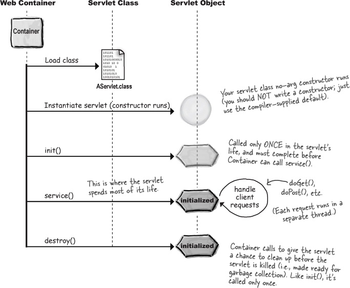
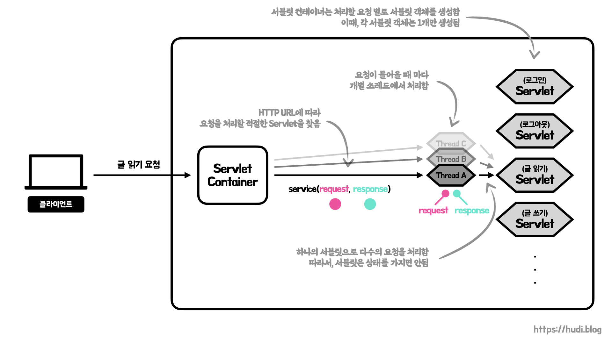
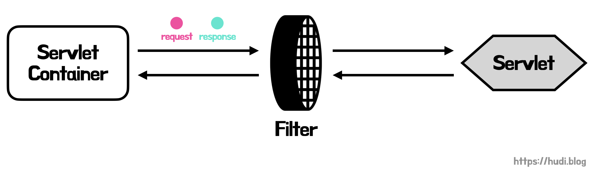

## 서블릿과 서블릿 컨테이너

서블릿은 **요청-응답 프로그래밍 모델의 서버를 구현**하기 위해 사용되는 Jakarta 프레임워크의 구성요소이다.

많은 블로그에서 서블릿은 HTTP 요청과 응답을 처리하기 위한 것이라고 설명되어 있다. 더 정확히는 **서블릿은 HTTP에 국한되어있지 않다**. 다만, **일반적**으로 웹 어플리케이션에서 HTTP 요청과 응답을 처리하는데에 많이 사용되는 것일 뿐이다. Servlet은 **단순히 요청-응답 프로그래밍 모델의 서버를 구현하기 위한 인터페이스**일 뿐이다.

> A servlet is a Java programming language class that is used to extend the capabilities of servers that host applications accessed by means of a request-response programming model. **Although servlets can respond to any type of request, they are commonly used to extend the applications hosted by web servers.** — [오라클 공식 문서](https://docs.oracle.com/javaee/5/tutorial/doc/bnafe.html)

일반적으로 우리가 서블릿을 사용하여 HTTP 요청을 처리하기 위해서는 **HttpServlet 이라는 추상 클래스**를 상속받아 우리만의 서블릿을 구현하면 된다. HttpServlet은 GenericServlet이라는 추상 클래스를 상속 받고, GenericServlet이 Servlet 인터페이스를 구현하는 형태이다.

서블릿은 그 독립적으로 동작하지 않고, **서블릿 컨테이너라는 다른 자바 응용프로그램의 제어**를 받는다. 가장 대표적인 서블릿 컨테이너는 **톰캣**이다. 서버가 요청을 받으면 **서버는 요청을 서블릿 컨테이너로 전달하고 서블릿 컨테이너는 이를 서블릿으로 전달**한다.

**스프링 MVC가 서블릿 기반(DispatcherServlet, Filter)으로 동작**하므로 우리가 서블릿을 직접 사용하여 웹 어플리케이션을 개발하지 않는다고 하더라도 어느정도 공부해둘 필요가 있다.

## 서블릿 라이프 사이클

`jakarta.servlet` 패키지에서 제공하는 `Servlet` 인터페이스의 코드를 살펴보자.

```sql
package jakarta.servlet;

import java.io.IOException;

public interface Servlet {

    public void init(ServletConfig config) throws ServletException;

    public ServletConfig getServletConfig();

    public void service(ServletRequest req, ServletResponse res)
            throws ServletException, IOException;

    public String getServletInfo();

    public void destroy();
}
```

내 생각보다 굉장히 짧다. 여기서 `init()` , `service()` , `destroy()` 메소드를 **라이프 사이클 메서드**라고 하며, **서블릿 컨테이너는 라이프 사이클 메서드를 호출하여 서블릿의 생애주기를 관리**한다.



서블릿의 생애 주기는 굉장히 간단하다. 참고로 위 그림에서 Web Container가 서블릿 컨테이너이다.

우선, `.class` 파일로 **컴파일된 서블릿 구현체를 서블릿 컨테이너가 로드**를 한다. 그 이후 로드된 서블릿 클래스의 **생성자를 호출하여 서블릿 인스턴스를 생성**한다. 서블릿 구현체를 만드는 개발자는 기본 생성자를 컴파일러가 기본으로 제공하기 때문에 기본 생성자는 작성하지 않아도 된다.

이후 `init()` 메소드가 실행된다. `init()` 메소드는 서블릿의 생애 주기 중 **단 한번만 실행**되며, 서블릿 컨테이너가 `service()` 메소드를 실행하기 전에 `init()` 작업이 완료되어야한다.

서블릿 컨테이너는 클라이언트의 요청을 받고 서블릿의 `service()` 메소드를 실행한다. 서블릿을 구현하는 개발자는 `service()` 에 **비즈니스 로직**을 작성하면 된다. `service()` 메소드는 클라이언트의 요청을 처리하고, 응답한다.

서블릿 컨테이너가 서블릿을 모두 사용하고 제거할 때 `destroy()` 메소드를 호출한다. 서블릿이 종료될 때 작업해야할 것이 있다면, 이 메소드에 작성하면 된다.

## 서블릿 컨테이너가 서블릿으로 요청을 처리하는 방법

> 아래 내용은 HTTP 기준이다.



서블릿 컨테이너는 **서블릿을 각각의 요청별로 생성**해둔다. 예를 들어 웹 서비스가 로그인, 로그아웃, 글 읽기, 글 쓰기 이 **4개의 요청을 처리**해야한다면, 서블릿 컨테이너는 **4개의 개별적인 서블릿 객체를 생성**해둔다. **각 요청별 서블릿은 단 하나만 생성**한다. 그렇다고, 서블릿 자체가 **싱글톤이라는 이야기는 아니다**.

클라이언트로부터 서블릿 컨테이너가 요청을 받으면, **Request 객체, Response 객체를 생성**한다. 그리고 **URL에 따라 요청을 처리할 적절한 서블릿을 찾는다**. 서블릿 컨테이너는 찾은 서블릿의 `service()` 메소드를 실행하는데 이때 생성해둔 Request, Response 객체를 파라미터로 함께 전달한다. 서블릿이 요청을 처리하면, Response 객체를 다시 서블릿 컨테이너에게 전달하고, 사용자에게 응답한다.

이때, `service()` 메소드는 **별개의 쓰레드**로 실행된다. 즉, **서블릿 객체는 하나이지만 여러개의 쓰레드에서 실행**된다. 이것이 웹 서버가 여러 사용자의 요청을 **동시에 처리**할 수 있는 이유이다. 서블릿 객체는 하나인데, 쓰레드가 여러개라면 동시성 이슈가 발생할 가능성이 있다. 이런 구조상 Thread-Safe를 위해 **서블릿은 상태(인스턴스 및 Static 변수 등)를 가지면 안된다**. 서블릿이 상태를 가지면, 공유 자원으로 인한 동시성 이슈가 발생해 사용자의 민감한 정보가 다른 사용자에게 노출되는 일이 발생할수도 있다.

요청을 모두 처리했다면 사용된 쓰레드와 Request, Response 객체는 JVM에게 반납한다. 이때 Servlet은 계속 살아있다.

## 서블릿 필터



서블릿 스펙에는 **필터(filter)**란 것도 존재한다. **필터는 요청과 응답에 추가적인 작업을 해야할 때 사용**된다. 필터를 적용하면, 클라이언트의 **요청이 서블릿에 도달하기 전에 필터를 먼저 거치게**된다. 필터도 `jakarta.servlet` 패키지에서 제공하는 인터페이스이다. 코드를 한번 살펴보자.

```sql
public interface Filter {

    public default void init(FilterConfig filterConfig) throws ServletException {}

    public void doFilter(ServletRequest request, ServletResponse response,
            FilterChain chain) throws IOException, ServletException;

    public default void destroy() {}
}
```

3개의 메소드가 정의되어 있는데, `init()` 과 `destroy()` 는 디폴트 메소드이므로 필수로 재정의할 필요는 없다. 중요한 것은 `doFilter()` 이다. `doFilter()` 에 파라미터로 들어오는 Request와 Response를 통해 추가적인 작업을 할 수 있으며, FilterChain을 사용하여 다음 필터에 넘겨주는 형태로 사용할 수 있다.

필터는 언제 사용할 수 있을까? 서블릿 필터 공식 Javadoc에는 아래와 같은 예시가 적혀있다.

1. **Authentication** Filters
2. **Logging** and Auditing Filters
3. **Image conversion** Filters
4. **Data compression** Filters
5. **Encryption** Filters
6. Tokenizing Filters
7. Filters that trigger resource access events
8. XSL/T filters
9. Mime-type chain Filter

위 예시에서 내가 당장 와닿는 것은 인증, 로깅, 이미지 처리, 데이터 압축, 암호화 정도이다.

## 참고

- [https://www.youtube.com/watch?v=Xx9BXrzNHn8](https://www.youtube.com/watch?v=Xx9BXrzNHn8) 🐦
- [https://docs.oracle.com/javaee/5/tutorial/doc/bnafe.html](https://docs.oracle.com/javaee/5/tutorial/doc/bnafe.html)
- [https://www.baeldung.com/intro-to-servlets](https://www.baeldung.com/intro-to-servlets)
- [https://www.baeldung.com/java-servlets-containers-intro](https://www.baeldung.com/java-servlets-containers-intro)
