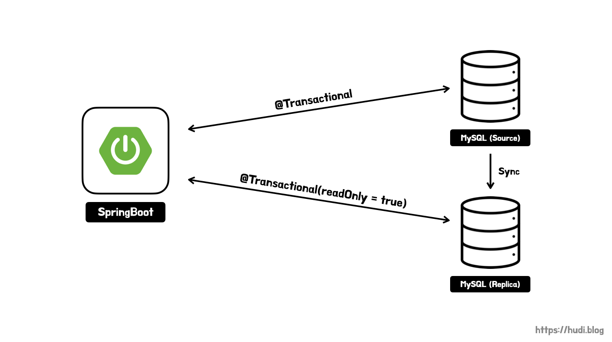

> 레플리케이션에 대한 이론적인 내용은 **[데이터베이스의 확장성과 가용성을 위한 MySQL Replication](https://hudi.blog/mysql-replication/)** 를 참고하자.

## 실습 환경

- Ubuntu 22.04 LTS
- MySQL 8.0
- Docker
- Spring Data JPA

## 레플리케이션 아키텍처



클라우드에 두개의 MySQL 서버를 구성해둔다. 스프링부트 애플리케이션은 로컬에서 돌릴 예정이며, 트랜잭션의 readOnly 설정에 따라 각각 다른 데이터베이스로 요청을 분기한다.

데이터베이스에 요청되는 **쿼리는 대부분 조회(SELECT) 쿼리**이다. SELECT 쿼리만을 수행하는 레플리카 데이터베이스 서버를 별도로 구성해놓으면, 쿼리 성능 향상을 기대해볼 수 있다.

## 우분투에 MySQL 설치

```bash
$ apt update
$ apt install mysql-server
```

위 명령을 사용하여 레플리케이션을 구성할 두 서버 모두 MySQL을 설치하자.

## MySQL 레플리케이션 적용

> 예전에는 레플리케이션의 구성요소를 Master - Slave로 부르는게 일반적이었는데, 최근엔 윤리적인 이유로 **Primary - Secondary 혹은 Source - Replica**로 부르는 추세이다. 이 포스팅에서는 Source와 Replica 라는 용어를 사용하겠다.

### 공통 사전 작업

아래 내용은 Source, Replica 두 서버 모두 적용해야하는 사전 작업이다. 우선 `root` 계정을 사용할 수 없으니 MySQL을 사용할 계정을 아래와 같이 생성하자.

```sql
CREATE USER 'hudi'@'%' IDENTIFIED BY 'password';
GRANT ALL PRIVILEGES ON *.* TO 'hudi'@'%';
FLUSH PRIVILEGES;
```

MySQL은 기본적으로 127.0.0.1 즉, 로컬 호스트에서만 접속할 수 있는데 아래와 같이 MySQL 설정을 변경하여 외부에서 접속이 가능하도록 변경하자. `bind-address` 와 `mysqlx-bind-address` 설정을 `#` 을 사용하여 주석처리 하면 된다.

```bash
vim /etc/mysql/mysql.conf.d/mysqld.cnf

#bind-address           = 127.0.0.1
#mysqlx-bind-address    = 127.0.0.1
```

### Source Server 세팅

일단 소스 서버부터 작업해보자. 아래와 같이 데이터베이스를 생성한다.

```sql
CREATE DATABASE replication;
```

간단히 `user` 테이블도 생성하자.

```sql
CREATE TABLE user(
	id BIGINT NOT NULL AUTO_INCREMENT,
	name VARCHAR(255),
	PRIMARY KEY(id)
);
```

이제 레플리케이션 전용 MySQL 계정을 생성하고, 레플리케이션 권한을 부여할 것이다. 이 계정은 레플리카 서버에서 소스 서버에 접근할 때 사용된다.

```sql
CREATE USER 'replication'@'%' IDENTIFIED WITH mysql_native_password BY 'password';
GRANT REPLICATION SLAVE ON *.* TO 'replication'@'%';
```

MySQL 5.8부터는 Password Auth방식이 `caching_sha2_password` 방식으로 변경되었다고 한다. 따라서 위와 같이 유저를 생성할 때 `IDENTIFIED WITH mysql_native_password BY` 로 생성해야한다. 그렇지 않으면 아래의 에러를 만날 수 있다.

> error connecting to master 'replication_user@mysql-primary:3306' - retry-time: 60 retries: 1 message: Authentication plugin 'caching_sha2_password' reported error: Authentication requires secure connection.

이제 `my.cnf` 파일을 수정하여, MySQL 설정을 변경해보자.

```bash
$ vim /etc/mysql/my.cnf
```

위 명령으로 `my.cnf` 파일을 열고, 아래와 같이 설정한다.

```bash
[mysqld]
max_allowed_packet=1000M
server-id = 1
log-bin = mysql-bin
binlog_format = ROW
max_binlog_size = 500M
sync_binlog = 1
expire-logs-days = 7
binlog_do_db = replication
```

- **max_allowed_packet** : 서버로 질의하거나 받게되는 패킷의 최대 길이
- **server-id** : 서버의 ID. 레플리케이션 토폴로지 내의 서버는 각각 고유한 서버 ID를 가져야한다. 즉, 이 값은 레플리카 서버와 반드시 달라야한다.
- **log-bin** : 바이너리 로그 파일 경로 (`/var/lib/mysql/mysql-bin.XXXXXX` 형식으로 저장됨)
- **binlog_format** : 바이너리 로그의 저장 형식을 지정한다. `STATEMENT` , `ROW` , `MIXED` 이 3가지 중 하나를 선택할 수 있다. 자세한 차이점은 **[공식문서](https://dev.mysql.com/doc/refman/5.7/en/binary-log-setting.html)**를 확인하자.
- **max_binlog_size** : 바이너리 로그의 최대 크기
- **sync_binlog** : N개의 트랜잭션 마다 바이너리 로그를 디스크에 동기화 시킬지 결정한다. `1` 은 가장 안정적이지만, 가장 느린 설정이다.
- **expire-logs-days** : 바이너리 로그가 만료되는 기간 설정
- **binlog_do_db** : 레플리케이션을 적용할 데이터베이스 이름 설정. 설정하지 않으면, 모든 데이터베이스 대상으로 레플리케이션이 진행된다.

설정이 끝났다면, 아래와 같이 MySQL에서 소스 서버의 상태를 조회하자. 여기서 중요한 것은 `File` 과 `Position` 이다. 레플리케이션에서는 이 `File` 과 `Position` 값으로 Source - Replica 서버가 동기화가 진행된다. 아래 값을 기억하자.

```sql
mysql> SHOW MASTER STATUS;
+------------------+----------+--------------+------------------+-------------------+
| File             | Position | Binlog_Do_DB | Binlog_Ignore_DB | Executed_Gtid_Set |
+------------------+----------+--------------+------------------+-------------------+
| mysql-bin.000001 |      157 | replication  |                  |                   |
+------------------+----------+--------------+------------------+-------------------+
```

> (참고) 이 값은 데이터베이스에서 이벤트가 발생할 때 마다 변경된다. 그리고 그 변경된 값에 따라 레플리카 서버가 바라보는 File과 Position 도 달라진다. 레플리카 서버에서 `SHOW SLAVE STATUS;` 쿼리를 실행해 이를 확인할 수 있다.

소스 서버의 설정은 끝났다. 아래 명령을 실행해 MySQL 서버를 재시작하자.

```bash
$ service mysql restart
```

### Replica Server 세팅

레플리카 서버는 설정할 것이 그리 많지 않다. MySQL의 기본 `server-id` 는 1이다. 위에서 말했듯 레플리케이션 토폴로지 내에서는 모든 서버가 유일한 `server-id` 를 가져야한다고 했다. 따라서 아래 설정을 통해 `server-id` 를 1이 아닌 값으로 변경하자.

```bash
$ vim /etc/mysql/my.cnf

[mysqld]
server-id = 2
```

설정을 변경하였으니 아래 명령으로 MySQL 서버를 재실행하자.

```bash
$ service mysql restart
```

그리고 MySQL에서 아래 쿼리를 순차적으로 실행한다. 이때, `MASTER_LOG_FILE` 과 `MASTER_LOG_POS` 값은 아까 기억해둔 값으로 설정한다.

```sql
RESET SLAVE;

CHANGE MASTER TO
MASTER_HOST='XXX.XXX.XXX.XXX', # Source Server HOST
MASTER_USER='replication', # Replication User
MASTER_PASSWORD='password',
MASTER_LOG_FILE='mysql-bin.000001',
MASTER_LOG_POS=157;

START REPLICA;
```

여기까지 설정했다면, 소스 서버에서 직접 INSERT 해보면, 바로 레플리카 서버에 반영되는 것을 확인할 수 있을 것이다. 이제 스프링부트를 설정해보자.

## SpringBoot에서 DataSource 분기

데이터베이스 서버를 Source - Replica 로 이중화 하였으므로, 스프링부트에서 사용하는 DataSource도 Source - Replica에 맞게 2개를 써야한다. `readOnly = true` 트랜잭션은 Replica DataSource를, `readOnly = false` 인 트랜잭션은 Source DataSource를 사용하도록 분기해야한다.

이런 Multi DataSource 환경에서 개발해본적은 처음이어서 하루종일 삽질 했다. 특히, 아직 스프링이 트랜잭션을 어떻게 관리하는지 내부 동작에 대한 이해도가 낮아 쉽지 않았다. 일단은 얕게 동작 구조를 익히고, 그 다음 더 깊은 내부 동작을 공부해봐야겠다.

### application.yml

일단 2개의 DataSource에 대한 설정을 `application.yml` 에 적어줄 것이다. 하나의 DataSource에 대해서는 스프링부트가 자동으로 빈으로 만들어 관리해줬지만, 2개 이상의 DataSource를 사용할 때에는 우리가 직접 빈을 만들어 사용해야한다. 일단 아래와 같이 설정하자.

```yaml
spring:
  datasource:
    source:
      username: hudi
      password: password
      driver-class-name: com.mysql.cj.jdbc.Driver
      jdbc-url: jdbc:mysql://XXX.XXX.XXX.XXX:3306/replication
    replica:
      username: hudi
      password: password
      driver-class-name: com.mysql.cj.jdbc.Driver
      jdbc-url: jdbc:mysql://OOO.OOO.OOO.OOO:3306/replication
```

### DataSource 빈 등록

```java
@Configuration
public class DataSourceConfiguration {

    private static final String SOURCE_SERVER = "SOURCE";
    private static final String REPLICA_SERVER = "REPLICA";

    @Bean
    @Qualifier(SOURCE_SERVER)
    @ConfigurationProperties(prefix = "spring.datasource.source")
    public DataSource sourceDataSource() {
        return DataSourceBuilder.create()
                .build();
    }

    @Bean
    @Qualifier(REPLICA_SERVER)
    @ConfigurationProperties(prefix = "spring.datasource.replica")
    public DataSource replicaDataSource() {
        return DataSourceBuilder.create()
                .build();
    }
}
```

위와 같이 Source와 Replica에 대응하는 두개의 `DataSource` 타입 빈을 등록해주었다.

`@ConfigurationProperties` 어노테이션을 사용하면 `application.yml` 에 명시한 여러 설정 중 특정 prefix 에 해당하는 설정 값만을 자바 빈에 매핑할 수 있다. 즉, 두개의 `DataSource` 빈에 다른 설정을 매핑할 수 있게 만든다.

`@Qualifier` 라는 어노테이션을 사용한 것을 확인할 수 있다. 일반적으로 같은 타입의 빈이 2개 이상 등록된 경우 스프링은 어떤 빈을 주입해주어야하는지 모른다. 따라서 `@Qualifier` 어노테이션을 사용하여 이름 그대로 한정자를 지정하고, 빈을 주입받는 입장에서 한정자를 명시하여 주입받을 빈을 지정할 수 있도록 만든다. 참고로 빈을 설정하는 곳에서는 `@Qualifier` 를 사용하지 않고, 아래와 같이 사용할수도 있다.

```java
@Bean(SOURCE_SERVER)
@ConfigurationProperties(prefix = "spring.datasource.source")
public DataSource sourceDataSource() {
    return DataSourceBuilder.create()
            .build();
}
```

### AbstractRoutingDataSource

스프링은 `AbstractRoutingDataSource` 라는 추상 클래스를 제공한다. 이 클래스는 Multi DataSource 환경에서 여러 DataSource를 묶고 분기해줄 때 사용한다.

조금 더 아래에서 나오겠지만, `AbstractRoutingDataSource` 의 `setTargetDataSources()` 라는 메소드를 통해 Map을 전달한다. 이때 Map의 Value로는 `DataSource` 를 전달한다. 전달된 `DataSource` 는 Map의 Key를 통해 찾을 수 있다. 여기서는 Key를 String 타입으로 사용할 것이다.

`determineTargetDataSource()` 는 실제로 사용될 `DataSource` 를 결정한다. 이때, `determineCurrentLookupKey()` 라는 메소드를 사용하여 가져올 `DataSource` 의 Key를 결정한다.

우리는 `AbstractRoutingDataSource` 를 상속받는 구체 클래스 `RoutingDataSource` 를 구현하고, `determineCurrentLookupKey()` 메소드를 오버라이드하여 트랜잭션의 readOnly 값에 따라 다른 `DataSource` Key를 반환하도록 만들것이다.

```java
public class RoutingDataSource extends AbstractRoutingDataSource {

    @Override
    protected Object determineCurrentLookupKey() {
        boolean isReadOnly = TransactionSynchronizationManager.isCurrentTransactionReadOnly();

        System.out.println("Transaction의 Read Only가 " + isReadOnly + " 입니다.");

        if (isReadOnly) {
            System.out.println("Replica 서버로 요청합니다.");
            return "replica";
        }

        System.out.println("Source 서버로 요청합니다.");
        return "source";
    }
}
```

이때, `TransactionSynchronizationManager` 이 사용되었는데, 이 클래스의 `isCurrentTransactionReadOnly()` 라는 메소드를 사용하여 현재 트랜잭션의 read-only 여부를 확인할 수 있다. 분기가 제대로 되는지 확인하기 위해 `println()` 을 사용하여 출력하였다.

### routingDataSource()

위에서 만든 `RoutingDataSource` 에 우리가 사용할 Source DataSource와 Replica DataSource 정보를 등록하고, 이를 빈으로 만들것이다. 아래 소스코드는 `sourceDataSource` 와 `replicaDataSource` 빈을 정의한 `DataSourceConfiguration` 클래스의 소스코드에 이어 작성한 내용이다.

```java
@Bean
public DataSource routingDataSource(
        @Qualifier(SOURCE_SERVER) DataSource sourceDataSource, // (1)
        @Qualifier(REPLICA_SERVER) DataSource replicaDataSource
) {
    RoutingDataSource routingDataSource = new RoutingDataSource(); // (2)

    HashMap<Object, Object> dataSourceMap = new HashMap<>(); // (3)
    dataSourceMap.put("source", sourceDataSource);
    dataSourceMap.put("replica", replicaDataSource);

    routingDataSource.setTargetDataSources(dataSourceMap); // (4)
    routingDataSource.setDefaultTargetDataSource(sourceDataSource); // (5)

    return routingDataSource;
}
```

(1)에서는 우리가 미리 정의한 `sourceDataSource` 와 `replicaDataSource` 를 주입받는다. 위에서 말했듯 `@Qualifier` 어노테이션을 사용해 어떤 빈을 주입받을 것인지 명확히 지시한다.

(2)에서 우리가 구현한 `RoutingDataSource` 의 인스턴스를 생성하고, (3) 에서 `dataSourceMap` 이라는 Map을 생성하고, `sourceDataSource` 와 `replicaDataSource` 를 각각 `"source"` , `"replica"` 라는 Key와 매핑시킨다.

(4)에서는 만든 `dataSourceMap` 을 `RoutingDataSource` 에 등록한다. (5)에서는 기본 데이터 소스를 `sourceDataSource` 로 지정했다.

### dataSource()

그대로 `DataSourceConfiguration` 클래스에 이어 적는다. 이제 실제 스프링부트 전반에서 사용될 `DataSource dataSource()` 빈을 만들어보자. 그런데, 스프링이 `DataSource` 를 통해 `Connection` 을 획득하는 과정에 대해 이해할 필요가 있다.

스프링은 트랜잭션에 진입된 순간 바로 `DataSource` 를 가져오고, 커넥션을 획득한다. 그리고 그 다음에 트랜잭션의 현재 상태가 저장된다. 즉, TransactionSynchronizationManager에 트랜잭션 정보를 동기화 하는 작업은 DataSource로부터 Connection을 얻어온 이후 동작한다.

따라서 `LazyConnectionDataSourceProxy` 라는 클래스를 사용하여 트랜잭션에 진입한 시점이 아니라, 실제 쿼리가 시작된 시점에 `DataSource` 가 선택되도록 지연(lazy) 시킬 필요가 있다.

```java
@Bean
@Primary
public DataSource dataSource() {
    DataSource determinedDataSource = routingDataSource(sourceDataSource(), replicaDataSource());
    return new LazyConnectionDataSourceProxy(determinedDataSource);
}
```

여기까지 설정해주면, 정상적으로 트랜잭션의 readOnly 설정에 따라 `DataSource` 가 분기되는 것을 확인할 수 있다. 만만하게 봤는데, 생각보다 꽤 깊은 지식이 요구되어서 힘들었다. 아직 개별 개념에 대해 더 깊게 학습해보지는 않았는데, 스프링이 DataSource와 Transaction을 관리하는 방법에 대해서 깊게 공부해봐야겠다.

## 확인 쿼리

쓰기 작업은 소스 서버로, 읽기 작업은 레플리카 서버로 요청하는 것을 어떻게 확인할 수 있을까? 아래 쿼리를 사용하여 MySQL 에서 실행된 모든 쿼리 로그를 확인할 수 있다.

```sql
SET GLOBAL log_output = 'table';
SET GLOBAL general_log = 1;
```

위 쿼리로 임시로 쿼리 로그를 활성화 하자. 그리고 스프링부트 애플리케이션에서 몇번의 트랜잭션을 실행하고, 아래 쿼리로 로그를 확인하자.

```sql
SELECT convert(argument using utf8) FROM mysql.general_log\G;
```

> (참고) `\G` 는 쿼리 결과 행들을 수직으로 보기위해 사용한다.

로그가 INSERT 쿼리는 소스 서버에, SELECT 쿼리는 레플리카 서버에 남았다면 성공이다.

## 참고

- [https://codingwave.tistory.com/11](https://codingwave.tistory.com/11)
- [https://trandent.com/article/etc/detail/320833](https://trandent.com/article/etc/detail/320833)
- [https://sup2is.github.io/2021/07/08/lazy-connection-datasource-proxy.html](https://sup2is.github.io/2021/07/08/lazy-connection-datasource-proxy.html)
- [https://chagokx2.tistory.com/100](https://chagokx2.tistory.com/100)
- https://chagokx2.tistory.com/103
- https://effectivesquid.tistory.com/entry/TransactionSynchronizationManager%EB%A5%BC-%EC%9D%B4%EC%9A%A9%ED%95%98%EC%97%AC-DataSource-%EB%9D%BC%EC%9A%B0%ED%8C%85%EC%8B%9C-%EC%A3%BC%EC%9D%98%ED%95%A0-%EC%A0%90
