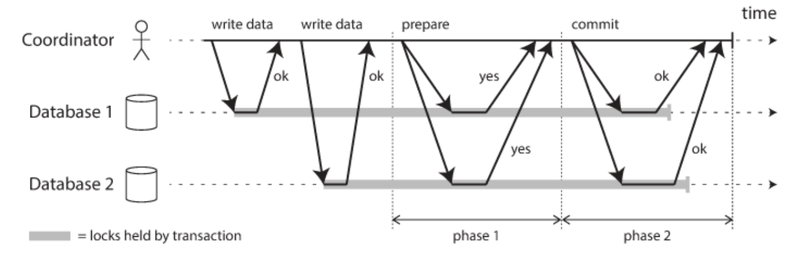

## 글로벌 트랜잭션

나는 지금까지 애플리케이션을 만들면서 단일 데이터베이스 커넥션만 사용했었다. 이렇게 하나의 DB 커넥션 안에서 만들어지는 트랜잭션을 로컬 트랜잭션이라고 한다.

그런데 하나의 트랜잭션에서 여러 개의 데이터베이스에 접근해 데이터를 추가해야 한다면 어떻게 해야할까? 또는 데이터베이스에 데이터를 추가하고, 그 이후에 메시지 큐에 메시지를 추가하는 작업을 하나의 트랜잭션으로 묶고 싶으면 어떻게 해야할까? 즉, 두 개 이상의 자원을 한 트랜잭션으로 처리하고 싶다면?

이는 로컬 트랜잭션으로 처리할 수 없다. 로컬 트랜잭션은 하나의 커넥션에 종속되기 때문이다. 따라서 다수의 자원에 대한 요청을 하나의 트랜잭션을 처리 하기 위해서는 각 DB와 종속적으로 만들어지는 Connection을 통해서가 아니라 **별도의 트랜잭션 관리자를 통해 트랜잭션을 관리하는 글로벌 트랜잭션(global transaction)방식**을 사용해야한다.

글로벌 트랜잭션을 사용하여 **여러 데이터베이스 혹은 JMS(Java Message System)와 같이 트랜잭션 기능을 지원하는 서비스를 하나의 트랜잭션**에 포함시킬 수 있다.

## JTA (Java Transaction API)

자바는 JDBC 외에 글로벌 트랜잭션을 지원하는 트랜잭션 매니저를 지원하기 위한 JTA라는 API를 제공한다. 애플리케이션에서는 기존 방법 그대로 DB는 JDBC, 메시징 서버라면 JMS라는 API를 사용하면 된다.

단, 트랜잭션은 JDBC, JMS API를 사용하지 않고 JTA를 통해 트랜잭션 매니저가 관리하도록 위임한다. **트랜잭션 매니저는 DB와 메시징 서버를 제어하고 관리하는 각각의 리소스 매니저와 XA 프로토콜**을 통해 연결된다. 이를 통해 **트랜잭션 매니저가 여러 리소스에 대해 종합적으로 트랜잭션을 제어**할 수 있게된다.

## XA와 2PC

**XA**는 **2PC(Two-Phase Commit)를 통한** 분산 트랜잭션 처리를 위한 X-Open에서 명시한 표준이다. 위에서 말했듯이 트랜잭션 매니저는 각 리소스 매니저간 XA 프로토콜을 통해 통신한다. 그렇다면 2PC는 무엇일까?

2PC는 **원자적 커밋 프로토콜(Atomic Commit Protocol)**의 일종으로, 트랜잭션을 커밋할지 롤백할지에 대한 **분산 원자적 트랜잭션(Distributed Atomic Transaction)**에 관여하는 분산 알고리즘 중 하나이다. 쉽게 말하면, **둘 이상의 리소스에 대한 트랜잭션을 원자적**(전부다 커밋되거나, 전부다 롤백되거나)**으로 처리하기 위한 알고리즘이다.**

위 다이어그램처럼 서로 다른 리소스에 대한 요청을 원자적으로 처리하기 위해 **(1) Prepare (2) Commit** 이 두가지 Phase가 추가되었다. 따라서 **Two-Phase** Commit 이라고 불린다. 이를 통해 서로 다른 DB간 정합성을 보장할 수 있다.

Phase 1에서 모든 DB에 반영할 수 있을지 물어보고, **합의가 되지 않았을 때에는 롤백**하는 방식으로 수행된다. 그림을 보면 알 수 있지만, 데이터가 쓰기 시작할 때 부터 커밋될 때 까지 락이 걸리는 것을 확인할 수 있다. 때문에 양 쪽을 함께 조회하더라도 커밋되지 않은 쪽은 **락이 잡혀있어 두 DB가 불일치된 상태로 조회되지 않는다**. 즉, **락을 이용해 정합성을 보장**한다. Phase 1에서 모든 리소스가 OK 응답을 보내면, Phase 2에서 모든 리소스 매니저에게 commit을 지시한다.

Spring에서는 트랜잭션 매니저에 2PC가 구현되어 있다. 

## 글로벌 트랜잭션의 단점

문제는 성능이다. 2PC의 다이어그램을 보면 알겠지만, DB별로 최소 **세 번의 통신이 발생**한다. 또한 **락이 걸리는 구간이 길다**. 이런 문제로 2PC는 성능이 떨어지게 된다.

마이크로서비스 아키텍처에서는 적용하기 어렵다는 단점이 있다. 애플리케이션이 모놀리식하다면 두 데이터베이스에 의존하여 글로벌 트랜잭션을 실행할 수 있지만, **마이크로 서비스 아키텍처인 경우 데이터베이스에 직접 의존이 불가능**하다. 각 마이크로 서비스 별로 별도의 데이터베이스를 가지고 있기 때문이다.

이런 문제 때문에 최범균님의 말씀을 빌리자면, 글로벌 트랜잭션은 거의 사용되지 않는다고 한다. 실제로 여러 자원에 대해 데이터 처리가 필요한 경우에는 **이벤트나 비동기 메시징**과 같은 다른 수단을 고려해보는게 좋다고 하신다.

## 더 공부해볼 키워드

- SAGA Pattern
- 이벤트
- 메시지 큐

## 참고

- 토비의 스프링 3.1, 이일민
- [https://www.youtube.com/watch?v=urpF7jwVNWs](https://www.youtube.com/watch?v=urpF7jwVNWs)
- [https://ko.wikipedia.org/wiki/X/Open_XA](https://ko.wikipedia.org/wiki/X/Open_XA)
- [https://www.samsungsds.com/kr/insights/mas_data.html](https://www.samsungsds.com/kr/insights/mas_data.html)
- [https://www.techtarget.com/searchapparchitecture/definition/two-phase-commit-2PC](https://www.techtarget.com/searchapparchitecture/definition/two-phase-commit-2PC)