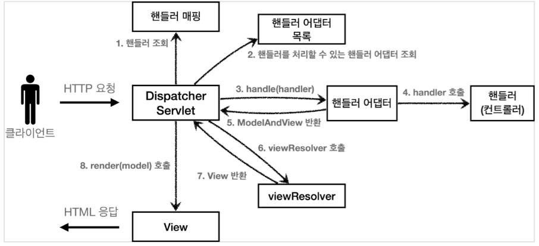
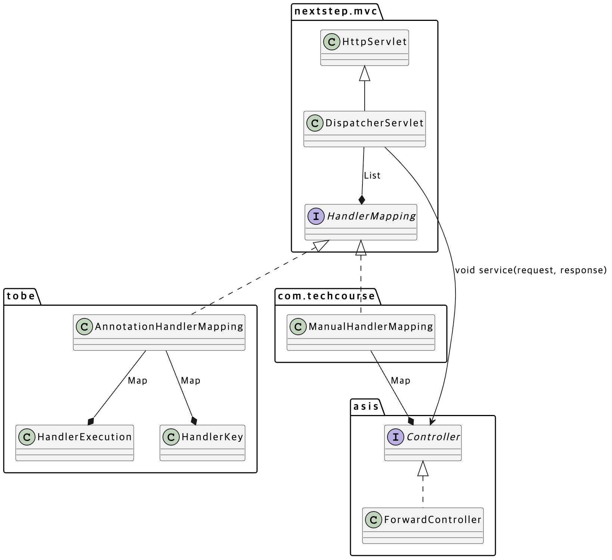
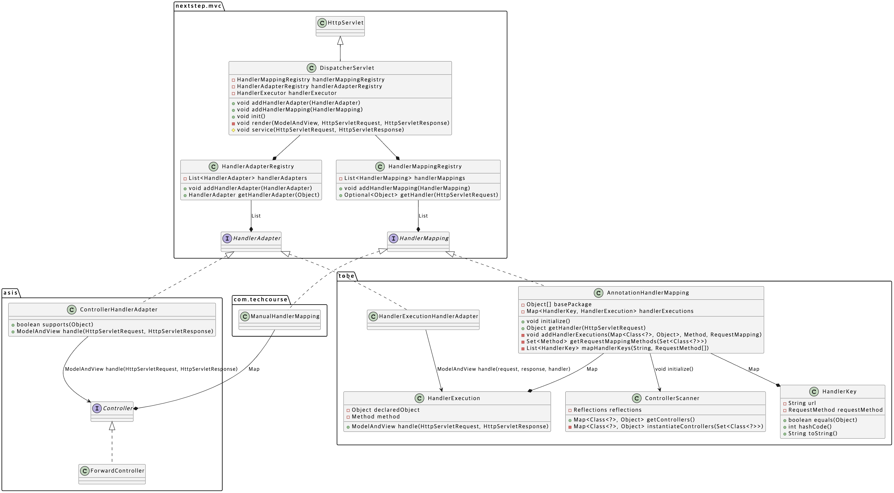

## 미션 목표

레벨4 미션인 @MVC 프레임워크 만들기 미션은 **(1) Spring MVC의 구조를 간단하게 모방하며 동작원리를 이해**하는 동시에 **(2) 레거시 코드를 점진적으로 새로운 구조로 리팩토링** 하는 경험을 해보는 것이 목표이다.

## 배경 상황

아직 블로그에 작성하지 않았지만, 직전 미션인 톰캣 구현하기 미션에서는 톰캣을 모방한 아주 간단한 HTTP 서버를 구현하였다. TCP 소켓을 사용하여 HTTP 프로토콜을 직접 구현해보는 경험을 하였다.

이 미션에서는 서버가 처리해야할 URL이 생길때마다 컨트롤러 클래스를 추가로 구현해야한다. 그리고, 이렇게 만들어진 컨트롤러 클래스를 `RequestMapping` 이라는 클래스에 수동으로 등록해줘야했다. `RequestMapping` 클래스가 수정되면, 프레임워크 영역까지 영향을 줄 수 있으므로, 개발자는 온전히 비즈니스 로직에 집중할 수 없다. 이런 불편한 구조를 어노테이션을 사용한 MVC 구조로 **점진적으로 리팩토링** 한다.



위 그림은 Spring MVC가 HTTP 요청을 처리하는 과정을 나타낸다. 이번 미션에서는 위 구조를 (ViewResolver를 제외하고) 모방한다.

## 최초 상태의 클래스 다이어그램



최초 상태의 클래스 다이어그램은 위와 같다. 구성요소를 더 자세히 알아보자.

### DispatcherServlet

HTTP 요청을 맨 앞단에서 받아 처리하는 서블릿이다. Spring MVC는 DispatchServlet 이라는 하나의 서블릿으로 HTTP 요청을 받는다.

```java
public class DispatcherServlet extends HttpServlet {

    private static final long serialVersionUID = 1L;
    private static final Logger log = LoggerFactory.getLogger(DispatcherServlet.class);

    private final List<HandlerMapping> handlerMappings;

    public DispatcherServlet() {
        this.handlerMappings = new ArrayList<>();
    }

    @Override
    public void init() {
        handlerMappings.forEach(HandlerMapping::initialize);
    }

    public void addHandlerMapping(HandlerMapping handlerMapping) {
        handlerMappings.add(handlerMapping);
    }

    @Override
    protected void service(HttpServletRequest request, HttpServletResponse response) throws ServletException {
        log.debug("Method : {}, Request URI : {}", request.getMethod(), request.getRequestURI());

        try {
            final Controller controller = getController(request);
            final String viewName = controller.execute(request, response);
            move(viewName, request, response);
        } catch (Throwable e) {
            log.error("Exception : {}", e.getMessage(), e);
            throw new ServletException(e.getMessage());
        }
    }

    private Controller getController(HttpServletRequest request) {
        return handlerMappings.stream()
                .map(handlerMapping -> handlerMapping.getHandler(request))
                .filter(Objects::nonNull)
                .map(Controller.class::cast)
                .findFirst()
                .orElseThrow();
    }

    private void move(String viewName, HttpServletRequest request, HttpServletResponse response) throws Exception {
        if (viewName.startsWith(JspView.REDIRECT_PREFIX)) {
            response.sendRedirect(viewName.substring(JspView.REDIRECT_PREFIX.length()));
            return;
        }

        final RequestDispatcher requestDispatcher = request.getRequestDispatcher(viewName);
        requestDispatcher.forward(request, response);
    }
}
```

현재 `DispatcherServlet`은 `List<HandlerMapping> handlerMappings` 을 필드로 직접 가지고 있다. 또한 아래와 같이 외부에서 `HandlerMapping` 을 추가할 수 있도록 메소드를 열어두었다. 이 메소드는 애플리케이션이 구동되는 시점에 실행되는 `AppWebApplicationInitializer` 라는 클래스에서 호출한다.

```java
public class AppWebApplicationInitializer implements WebApplicationInitializer {

		// ...

    @Override
    public void onStartup(ServletContext servletContext) {
        final DispatcherServlet dispatcherServlet = new DispatcherServlet();
        dispatcherServlet.addHandlerMapping(new ManualHandlerMapping());
				// ...
    }
}
```

`DispatcherServlet` 은 `getController()` 라는 private 메소드를 통해 `handlerMappings` 에서 요청을 처리할 적절한 Controller를 선정한다. 선정 기준은 `HandlerMapping` 의 `getHandler()` 메소드에 `HttpServletRequest` 를 전달하여 반환된 boolean 값이다.

이후 `service()` 라는 메소드를 통해 클라이언트에게 최종적으로 응답하게 된다.

### ManualHandlerMapping (as-is)

```java
public class ManualHandlerMapping implements HandlerMapping {

    private static final Logger log = LoggerFactory.getLogger(ManualHandlerMapping.class);

    private static final Map<String, Controller> controllers = new HashMap<>();

    @Override
    public void initialize() {
        controllers.put("/", new ForwardController("/index.jsp"));
        controllers.put("/login", new LoginController());
        controllers.put("/login/view", new LoginViewController());
        controllers.put("/logout", new LogoutController());
        controllers.put("/register/view", new RegisterViewController());
        controllers.put("/register", new RegisterController());

        log.info("Initialized Handler Mapping!");
        controllers.keySet().forEach(path -> log.info("Path : {}, Controller : {}", path, controllers.get(path).getClass()));
    }

    @Override
    public Controller getHandler(HttpServletRequest request) {
        final String requestURI = request.getRequestURI();
        log.debug("Request Mapping Uri : {}", requestURI);
        return controllers.get(requestURI);
    }
}
```

리팩토링 대상인 레거시 `HandlerMapping` 이다. 클래스 단위로 존재하는 Controller과 요청 URL에 대한 매핑 정보를 수동으로 `Map` 에 저장한다.

또한 `getHandler()` 메소드에 `HttpServletRequest` 를 전달하면, 그 요청을 처리하기 적합한 Controller를 반환한다.

### Controller (as-is)

```java
public interface Controller {
    String execute(HttpServletRequest req, HttpServletResponse res) throws Exception;
}
```

컨트롤러에 해당하는 인터페이스이다. 이 인터페이스에는 `execute()` 라는 단 하나의 메소드만 정의되어 있다. 이 컨트롤러 인터페이스를 구현해서 하나의 URL에 대한 요청을 처리하는 컨트롤러를 만들 수 있다.

하지만, 우리가 스프링에서 사용하는 컨트롤러는 하나의 컨트롤러에서 다수의 URL에 대한 요청을 여러 메소드로 처리할 수 있다. 즉, 우리가 리팩토링 해야하는 레거시이다. 이후에는 이 `Controller` 인터페이스를 구현하는 방식을 모두 제거하고 어노테이션 기반으로 개선해야한다.

`Controller` 인터페이스의 구현체인 레거시 컨트롤러 예시는 아래와 같다.

```java
public class RegisterController implements Controller {

    @Override
    public String execute(HttpServletRequest req, HttpServletResponse res) throws Exception {
        final User user = new User(2,
                req.getParameter("account"),
                req.getParameter("password"),
                req.getParameter("email"));
        InMemoryUserRepository.save(user);

        return "redirect:/index.jsp";
    }
}
```

### AnnotationHandlerMapping (to-be)

```java
public class AnnotationHandlerMapping implements HandlerMapping {

    private static final Logger log = LoggerFactory.getLogger(AnnotationHandlerMapping.class);

    private final Object[] basePackage;
    private final Map<HandlerKey, HandlerExecution> handlerExecutions;

    public AnnotationHandlerMapping(Object... basePackage) {
        this.basePackage = basePackage;
        this.handlerExecutions = new HashMap<>();
    }

    public void initialize() {
        log.info("Initialized AnnotationHandlerMapping!");
    }

    public Object getHandler(HttpServletRequest request) {
        return null;
    }
}
```

어노테이션 기반으로 MVC 프레임워크를 개선하기 위해 구현해야하는 클래스이다. 별다른 구현이 되어있지 않다. `ManualHandlerMapping` 과 같이 `HttpServletRequest` 를 전달하면, 그 요청을 처리할 수 있는 적합한 핸들러를 반환해야한다.

`Map<HandlerKey, HandlerExecution> handlerExecutions` 을 필드로 가지고 있다. `HandlerKey` 는 요청에 대한 정보(URL, HTTP Method)가 정의되어 있고, `HandlerExecution` 은 해당 요청에 대해 실행해야하는 행위가 정의되어 있다.

`AnnotationHandlerMapping` 을 사용하면 아래와 같이 어노테이션 기반의 컨트롤러를 사용할 수 있다.

```java
@Controller
public class TestController {

    @RequestMapping(value = "/get-test", method = RequestMethod.GET)
    public ModelAndView findUserId(HttpServletRequest request, HttpServletResponse response) {
        // ...
        return modelAndView;
    }

    @RequestMapping(value = "/post-test", method = RequestMethod.POST)
    public ModelAndView save(HttpServletRequest request, HttpServletResponse response) {
        // ...
        return modelAndView;
    }
}
```

### HandlerKey (to-be)

```java
public class HandlerKey {

    private final String url;
    private final RequestMethod requestMethod;

    public HandlerKey(String url, RequestMethod requestMethod) {
        this.url = url;
        this.requestMethod = requestMethod;
    }

    // ...
}
```

HTTP 요청 URL과 HTTP Request Method를 담고 있는 객체이다. HTTP 요청이 들어왔을 때 적절한 핸들러(`HandlerExecution`)를 찾기 위한 Key로 사용된다.

참고로 `RequestMethod` 는 아래와 같은 단순한 enum 이다.

```java
public enum RequestMethod {
    GET, HEAD, POST, PUT, PATCH, DELETE, OPTIONS, TRACE
}
```

> HandlerKey에는 equals & hashCode 가 오버라이딩 되어 있으나 생략했다.

### HandlerExecution (to-be)

```java
public class HandlerExecution {

    public ModelAndView handle(HttpServletRequest request, HttpServletResponse response) throws Exception {
        return null;
    }
}
```

각 요청에 따라 실행되어야 할 행위가 `handle()` 메소드에 정의되어 있다.

## 1단계 - **@MVC 프레임워크 구현하기**

`AnnotationHandlerMapping` 이 일단은 제대로 동작하도록 구현하는 것이 1단계의 목표이다.

### AnnotationHandlerMapping

아래 코드는 1단계 미션에서 제출한 `AnnotationHandlerMapping` 코드이다.

```java
public class AnnotationHandlerMapping implements HandlerMapping {

    private static final Logger log = LoggerFactory.getLogger(AnnotationHandlerMapping.class);

    private final Object[] basePackage;
    private final Map<HandlerKey, HandlerExecution> handlerExecutions;

    public AnnotationHandlerMapping(final Object... basePackage) {
        this.basePackage = basePackage;
        this.handlerExecutions = new HashMap<>();
    }

    public void initialize() {
        Set<Class<?>> controllerClasses = extractClasses();
        List<Method> methods = extractMethods(controllerClasses);

        for (Method method : methods) {
            addHandlerExecutions(method);
        }

        log.info("Initialized AnnotationHandlerMapping!");
    }

    private Set<Class<?>> extractClasses() {
        Reflections classReflections = new Reflections(basePackage, Scanners.TypesAnnotated);
        return classReflections.getTypesAnnotatedWith(Controller.class);
    }

    private List<Method> extractMethods(final Set<Class<?>> controllers) {
        return controllers.stream()
                .flatMap(it -> Arrays.stream(it.getMethods()))
                .filter(it -> it.isAnnotationPresent(RequestMapping.class))
                .collect(Collectors.toList());
    }

    private void addHandlerExecutions(final Method method) {
        RequestMapping requestMapping = method.getAnnotation(RequestMapping.class);
        List<HandlerKey> handlerKeys = HandlerKey.from(requestMapping);
        HandlerExecution handlerExecution = new HandlerExecution(method);

        for (HandlerKey handlerKey : handlerKeys) {
            handlerExecutions.put(handlerKey, handlerExecution);
        }
    }

		public HandlerExecution getHandler(final HttpServletRequest request) {
        HandlerKey handlerKey = new HandlerKey(request);
        return handlerExecutions.get(handlerKey);
    }
}
```

`initialize()` 메소드에서 `Map<HandlerKey, HandlerExecution> handlerExecutions` 필드를 초기화하는 작업을 수행한다. `extractClasses()` 에서는 `Reflections` 라이브러리를 사용하여, `basePackage` 에 존재하는 `@Controller` 어노테이션이 붙은 모든 클래스를 가져온다. 가져온 클래스들의 `@RequestMapping` 어노테이션이 붙은 모든 메소드를 `extractMethods()` 메소드가 추출한다.

`addHandlerExecutions()` 메소드에서는 가져온 `@RequestMapping` 의 모든 메소드에 대해 `HandlerKey` 와 `HandlerExecution` 을 생성해 `handlerExecutions` 필드에 추가한다.

`HandlerKey.from()` 이 `List<HandlerKey>` 를 반환하는 이유는, 아래와 같이 `@RequestMapping` 이 복수개의 HTTP Method 정보를 가지고 있기 때문이다.

```java
@Target({ElementType.METHOD, ElementType.TYPE})
@Retention(RetentionPolicy.RUNTIME)
public @interface RequestMapping {
    String value() default "";

    RequestMethod[] method() default {};
}
```

### HandlerKey

```java
public class HandlerKey {

    private final String url;
    private final RequestMethod requestMethod;

    public HandlerKey(final String url, final RequestMethod requestMethod) {
        this.url = url;
        this.requestMethod = requestMethod;
    }

    public HandlerKey(final HttpServletRequest request) {
        this.url = request.getRequestURI();
        this.requestMethod = RequestMethod.valueOf(request.getMethod());
    }

    public static List<HandlerKey> from(final RequestMapping requestMapping) {
        String url = requestMapping.value();
        List<RequestMethod> requestMethods = Arrays.stream(requestMapping.method())
                .collect(Collectors.toList());

        List<HandlerKey> handlerKeys = new ArrayList<>();
        for (RequestMethod requestMethod : requestMethods) {
            HandlerKey handlerKey = new HandlerKey(url, requestMethod);
            handlerKeys.add(handlerKey);
        }

        return handlerKeys;
    }
}
```

`HandlerKey` 는 단순히 요청에 대한 정보만을 가지고 있으므로 간단하다. 단순히 외부에서 `HttpServletRequest` 를 받아와 URL과 HTTP Method를 꺼내와 필드에 저장한다.

### HandlerExecution

```java
public class HandlerExecution {

    private final Class<?> controller;
    private final Method method;

    public HandlerExecution(final Method method) {
        this.controller = method.getDeclaringClass();
        this.method = method;
    }

    public ModelAndView handle(final HttpServletRequest request, final HttpServletResponse response) throws Exception {
        Constructor<?> constructor = controller.getConstructor();
        Object instance = constructor.newInstance();

        return (ModelAndView) method.invoke(instance, request, response);
    }
}
```

핵심은 `HandlerExecution` 이다. `AnnotationRequestMapping` 의 `addHandlerExecutions()` 메소드로부터 `@RequestMapping` 이 붙은 메소드를 전달받는다. 그럼 `HandlerExeuction` 은 해당 메소드를 가지고 있는 클래스의 타입과 메소드 자체를 필드에 저장한다.

클래스의 타입을 필드에 저장하는 이유는 메소드를 `invoke()` 하기 위해서는 실행할 메소드의 인스턴스를 전달해야하기 때문이다. (지금보니 클래스 타입 대신 아예 `Object` 타입으로 클래스 인스턴스를 필드에 저장하는 것이 더 좋아보인다.)

`handle()` 메소드가 실행되면, 자신이 가지고 있는 `Method` 의 `invoke()` 메소드를 실행하여, 요청을 처리한다. 즉, `HandlerExecution` 은 `@Controller` 클래스의 `@RequestMapping` 메소드 하나만 꺼내와 감싸고 있는 상태인 것이다.

레거시 `Controller` 인터페이스와 가장 큰 차이점은, `Controller` 인터페이스를 사용할때는 핸들러가 클래스 단위라면, `@Controller` 과 `@RequestMapping` 을 사용할때는 핸들러가 메소드 단위인 점이다.

### DispatcherServlet

```java
public class DispatcherServlet extends HttpServlet {

		//...

    @Override
    protected void service(final HttpServletRequest request, final HttpServletResponse response)
            throws ServletException {
        log.debug("Method : {}, Request URI : {}", request.getMethod(), request.getRequestURI());

        try {
            final Object controller = getController(request);

            if (controller instanceof HandlerExecution) {
                HandlerExecution handlerExecution = (HandlerExecution) controller;
                ModelAndView modelAndView = handlerExecution.handle(request, response);
                Map<String, Object> model = modelAndView.getModel();
                modelAndView.getView().render(model, request, response);
                return;
            }

            final var viewName = ((Controller) controller).execute(request, response);
            move(viewName, request, response);
        } catch (Throwable e) {
            log.error("Exception : {}", e.getMessage(), e);
            throw new ServletException(e.getMessage());
        }
    }

    private Object getController(final HttpServletRequest request) {
        return handlerMappings.stream()
                .map(handlerMapping -> handlerMapping.getHandler(request))
                .filter(Objects::nonNull)
                .findFirst()
                .orElseThrow();
    }

    // ...
}
```

기존의 `DispatcherServlet` 의 `service()` 메소드는 `Controller` 타입의 핸들러만 가져와서 `execute()` 메소드만 실행하면 됐다. 하지만 지금의 핸들러는 2가지 타입으로 나뉘었다. `Controller` 타입과 `HandlerExecution` 이다.

이에 대응하기 위해 우선 `getController()` 메소드부터 변경하였다. 기존에 이 메소드의 반환타입은 `Controller` 였는데, 2가지 타입을 대응하기 위해서 `Object` 로 변경하였다. stream 중간에 `Controller` 로 Cast 하는 코드도 제거하였다.

`service()` 메소드에서는 `getController()` 로 받아온 `Object` 의 타입에 따라 다른 메소드를 호출해야하기 때문에 `instanceof` 를 사용하여 분기처리한다. 이 지저분한 과정은 이후 단계에서 해결될 예정이다.

### AppWebApplicationInitializer

```java
public class AppWebApplicationInitializer implements WebApplicationInitializer {

    private static final Logger log = LoggerFactory.getLogger(AppWebApplicationInitializer.class);

    @Override
    public void onStartup(final ServletContext servletContext) {
        final var dispatcherServlet = new DispatcherServlet();
        dispatcherServlet.addHandlerMapping(new ManualHandlerMapping());
        dispatcherServlet.addHandlerMapping(new AnnotationHandlerMapping("com.techcourse.controller"));

        // ...
    }
}
```

마지막으로 `AppWebApplicationInitializer` 에서 지금 추가된 `AnnotationHandlerMapping` 을 `DispatcherServlet` 에 등록해주면 1단계는 끝이다.

## 2단계 - **점진적인 리팩터링**

`Controller` 인터페이스 기반의 구조에서 어노테이션 기반의 구조로 점진적으로 리팩토링 해본다. 지금은 미션이지만, 실무에서는 모든 코드를 한번에 새로운 구조로 리팩토링하는 것은 굉장히 어렵다. 프로덕션은 훨씬 복잡하고, 영향 범위가 크기 때문이다. 따라서 기존 코드를 유지하면서, 새로운 기능을 추가하는 방법을 사용한다. 이에 대한 내용은 교살자(strangler) 패턴에 대해 공부해보면 좋을 것 같다.

### HandlerAdapter

우리가 1단계 `DispatcherServlet` 에서 문제를 겪은 부분은 서로 다른 인터페이스를 동일한 방법으로 실행하지 못한 점이다. `Controller` 구현체는 `execute()` 메소드를, `HandlerExecution` 는 `handle()` 메소드를 실행해야한다. 각각의 반환타입도 `String` 과 `ModelAndView` 로 상이하다.

이렇게 서로 호환되지 않는 인터페이스를 함께 사용하기 위해 사용되는 디자인 패턴이 바로 어댑터 패턴이다.

```java
public interface HandlerAdapter {
    boolean supports(Object handler);

    ModelAndView handle(HttpServletRequest request, HttpServletResponse response, Object handler) throws Exception;
}

```

언급하지 않았지만, 최초 미션 코드에는 `HandlerAdapter` 라는 인터페이스도 함께 제공되었다. 이제, `HandlerAdapter` 를 구현하는 `ControllerHandlerAdapter` 와 `HandlerExecutionHandlerAdapter` 클래스를 작성할 것이다. 이렇게 되면, 클라이언트인 `DispatcherServlet` 입장에서는 `Controller` 건 `HandlerExecution` 이건 상관없이 `HandlerAdapter` 의 `handle()` 메소드만 실행하면 된다.

### HandlerExecutionHandlerAdapter

```java
public class HandlerExecutionHandlerAdapter implements HandlerAdapter {

    @Override
    public boolean supports(final Object handler) {
        return handler instanceof HandlerExecution;
    }

    @Override
    public ModelAndView handle(final HttpServletRequest request, final HttpServletResponse response,
                               final Object handler) throws Exception {
        return ((HandlerExecution) handler).handle(request, response);
    }
}
```

`handle()` 메소드로 HTTP 요청 처리에 필요한 `HttpServletRequest` , `HttpServletResponse` 를 가져오고, `HandlerExecution` 도 `Object` 타입의 `handler` 파라미터로 받아온다.

받아온 `handler` 는 `HandlerExecution` 으로 캐스팅 한 후 `handle()` 메소드를 실행하여 요청을 처리한다.

### ControllerHandlerAdapter

```java
public class ControllerHandlerAdapter implements HandlerAdapter {

    @Override
    public boolean supports(final Object handler) {
        return handler instanceof Controller;
    }

    @Override
    public ModelAndView handle(final HttpServletRequest request, final HttpServletResponse response,
                               final Object handler) throws Exception {
        String viewName = ((Controller) handler).execute(request, response);
        JspView jspView = new JspView(viewName);
        return new ModelAndView(jspView);
    }
}
```

마찬가지로 `Object handler` 파라미터에 `Controller` 인터페이스의 구현체를 전달한다. `Controller` 의 `execute()` 는 JSP View Name을 반환하였으므로, 이에 맞는 `JspView` 를 생성하고 `ModelAndView` 생성자에 넘겨 생성된 인스턴스를 반환한다.

### HandlerAdapterRegistry

이렇게 작성한 두 `HandlerExecutionHandlerAdapter` 와 `ControllerHandlerAdapter` 를 함께 가지고 있으며, 핸들러를 전달하면 적절한 어댑터를 반환할 객체가 필요하다.

```java
public class HandlerAdapterRegistry {

    private final List<HandlerAdapter> handlerAdapters;

    public HandlerAdapterRegistry() {
        this.handlerAdapters = new ArrayList<>();
    }

    public void addHandlerAdapter(final HandlerAdapter handlerAdapter) {
        handlerAdapters.add(handlerAdapter);
    }

    public HandlerAdapter getHandlerAdapter(final Object handler) {
        return handlerAdapters.stream()
                .filter(it -> it.supports(handler))
                .findFirst()
                .orElseThrow(() -> new IllegalArgumentException("지원하지 않는 핸들러입니다."));
    }
}
```

물론 `HandlerAdapterRegistry` 를 사용하지 않고도 구현할 수 있겠지만, 그렇게 된다면 `HanderAdapter` 의 구현체의 종류만큼 `if - else` 코드가 반복될 것이다. 아래 코드를 보자. 이는 OCP 위반이다.

```java
if (handler instanceof Controller) {
    ModelAndView mav = ((Controller)handler).execute(req, resp);
} else if (handler instanceof HandlerExecution) {
    ModelAndView mav = ((HandlerExecution)handler).handle(req, resp);
} else if {

// ...
```

### HandlerMappingRegistry

`HandlerAdapterRegistry` 를 구현한 김에, 여러가지 `HandlerMapping` 을 가지고, `HttpServletRequest` 에 따라 적절한 핸들러를 반환해주는 `HandlerMappingRegistry` 도 구현하자.

```java
public class HandlerMappingRegistry {

    private final List<HandlerMapping> handlerMappings;

    public HandlerMappingRegistry() {
        handlerMappings = new ArrayList<>();
    }

    public void addHandlerMapping(final HandlerMapping handlerMapping) {
        handlerMapping.initialize();
        handlerMappings.add(handlerMapping);
    }

    public Optional<Object> getHandler(final HttpServletRequest request) {
        return handlerMappings.stream()
                .map(handlerMapping -> handlerMapping.getHandler(request))
                .filter(Objects::nonNull)
                .findFirst();
    }
}
```

기존에는 이 로직을 `DispatcherServlet` 의 `getController()` 메소드에서 실행했는데, 이제 객체간 책임이 더 적절히 분리된 것 같다.

### ControllerScanner

또 적절히 책임을 분리해보자. `AnnotationHandlerMapping` 의 경우 `@Controller` 어노테이션을 가지고 있는 클래스를 가져오기 위해 리플렉션을 직접 사용하였다. 이를 `ControllerScanner` 라는 클래스를 만들어 책임을 적절히 분리해보자.

```java
public class ControllerScanner {

    public Map<Class<?>, Object> getControllers(final Object[] basePackage) {
        Reflections classReflections = new Reflections(basePackage, Scanners.TypesAnnotated);
        Set<Class<?>> classes = classReflections.getTypesAnnotatedWith(Controller.class);

        return instantiateControllers(classes);
    }

    private Map<Class<?>, Object> instantiateControllers(final Set<Class<?>> classes) {
        return classes.stream()
                .collect(Collectors.toMap(clazz -> clazz, this::instantiateClass));
    }

    private Object instantiateClass(final Class<?> clazz) {
        try {
            return clazz.getConstructor().newInstance();
        } catch (ReflectiveOperationException e) {
            throw new IllegalArgumentException("Controller를 인스턴스화 할 수 없습니다.");
        }
    }
}
```

이렇게 되면 `AnnotationHandlerMapping` 의 코드는 아래와 같이 변경된다.

```java
public class AnnotationHandlerMapping implements HandlerMapping {

    // ...

    public void initialize() {
        ControllerScanner controllerScanner = new ControllerScanner();
        Map<Class<?>, Object> controllers = controllerScanner.getControllers(basePackage);
        List<Method> methods = extractMethods(controllers);

        // ...
    }

		// extractClasses() 메소드 제거됨

    private List<Method> extractMethods(final Map<Class<?>, Object> controllers) {
        return controllers.keySet().stream()
                .flatMap(it -> Arrays.stream(it.getMethods()))
                .filter(it -> it.isAnnotationPresent(RequestMapping.class))
                .collect(Collectors.toList());
    }

    // ...
}
```

나중에 이 프레임워크에 DI 기능이 추가된다면, `ControllerScanner` 같은 경우 빈으로 등록하여 싱글톤으로 관리해도 좋아보인다. 애플리케이션이 구동된 이후에 단 한번만 실행되기 때문이다.

### DispatcherServlet

이제 `DispatcherServlet` 은 아래와 같이 개선된다.

```java
public class DispatcherServlet extends HttpServlet {

		// ...
    private final HandlerAdapterRegistry handlerAdapterRegistry;
    private final HandlerMappingRegistry handlerMappingRegistry;

    public DispatcherServlet() {
        this.handlerAdapterRegistry = new HandlerAdapterRegistry();
        this.handlerMappingRegistry = new HandlerMappingRegistry();
    }

    @Override
    public void init() {
    }

    public void addHandlerAdapter(final HandlerAdapter handlerAdapter) {
        handlerAdapterRegistry.addHandlerAdapter(handlerAdapter);
    }

    public void addHandlerMapping(final HandlerMapping handlerMapping) {
        handlerMappingRegistry.addHandlerMapping(handlerMapping);
    }

    @Override
    protected void service(final HttpServletRequest request, final HttpServletResponse response)
            throws ServletException {
        log.debug("Method : {}, Request URI : {}", request.getMethod(), request.getRequestURI());

        try {
            Object controller = handlerMappingRegistry.getHandler(request)
                    .orElseThrow(ControllerNotFoundException::new);

            HandlerAdapter handlerAdapter = handlerAdapterRegistry.getHandlerAdapter(controller);
            ModelAndView modelAndView = handlerAdapter.handle(request, response, controller);
            modelAndView.render(request, response);
        } catch (Throwable e) {
            log.error("Exception : {}", e.getMessage(), e);
            throw new ServletException(e.getMessage());
        }
    }
}
```

`HandlerMappingRegistry` 에서 요청에 따른 적절한 핸들러를 가져온 뒤, `HandlerAdapterRegistry` 에 전달하여 해당 핸들러를 처리할 수 있는 적절한 `HandlerAdapter` 를 가져온다. `DispatcherServlet` 입장에서는 핸들러가 `Controller` 인지 `HandlerExecution` 인지 전혀 신경쓰지 않고 요청을 처리할 수 있게 되었다.

최종 클래스 다이어그램은 아래와 같다.



> ControllerHandlerAdapter 등 조금 잘못된 부분이 있으니 주의하길 바란다.

## 3단계 - **JSON View 구현하기**

지금까지 구현한 MVC 프레임워크는 JSP View만 지원했다. REST API를 위해 JSON View 도 구현해보자.

### ModelAndView

```java
public class ModelAndView {

    private final View view;
    private final Map<String, Object> model;

    public ModelAndView(final View view) {
        this.view = view;
        this.model = new HashMap<>();
    }

    public static ModelAndView jspView(final String viewName) {
        JspView jspView = new JspView(viewName);
        return new ModelAndView(jspView);
    }

    public ModelAndView addObject(final String attributeName, final Object attributeValue) {
        model.put(attributeName, attributeValue);
        return this;
    }

    public Object getObject(final String attributeName) {
        return model.get(attributeName);
    }

    public Map<String, Object> getModel() {
        return Collections.unmodifiableMap(model);
    }

    public View getView() {
        return view;
    }

    public void render(final HttpServletRequest httpServletRequest, final HttpServletResponse httpServletResponse)
            throws Exception {
        view.render(model, httpServletRequest, httpServletResponse);
    }
}
```

지금까지 설명을 생략했는데, `ModelAndView` 는 클라이언트에게 응답할 `View` 와 `View` 에서 사용될 데이터인 모델 `Map<String, Object> model` 을 가지고 있다.

`View` 는 아래와 같은 간단한 인터페이스이다.

```java
public interface View {
    void render(Map<String, ?> model, HttpServletRequest request, HttpServletResponse response) throws Exception;
}
```

### JspView

```java
public class JspView implements View {

    public static final String REDIRECT_PREFIX = "redirect:";
    private static final Logger log = LoggerFactory.getLogger(JspView.class);
    private final String viewName;

    public JspView(final String viewName) {
        this.viewName = viewName;
    }

    @Override
    public void render(final Map<String, ?> model, final HttpServletRequest request, final HttpServletResponse response)
            throws Exception {
        if (viewName.startsWith(JspView.REDIRECT_PREFIX)) {
            response.sendRedirect(viewName.substring(JspView.REDIRECT_PREFIX.length()));
            return;
        }

        final var requestDispatcher = request.getRequestDispatcher(viewName);

        model.keySet().forEach(key -> {
            log.debug("attribute name : {}, value : {}", key, model.get(key));
            request.setAttribute(key, model.get(key));
        });

        requestDispatcher.forward(request, response);
    }
}
```

기존 `JspView` 의 코드는 위와 같다. `viewName` 을 전달받아 적절한 JSP 파일을 찾고 클라이언트에게 응답하는 방식이다.

### JsonView

```java
public class JsonView implements View {

    private static final ObjectMapper OBJECT_MAPPER = new ObjectMapper();

    @Override
    public void render(final Map<String, ?> model, final HttpServletRequest request, HttpServletResponse response)
            throws Exception {
        String json = getJson(model);
        writeJson(response, json);
    }

    private String getJson(final Map<String, ?> model) throws JsonProcessingException {
        return OBJECT_MAPPER.writeValueAsString(model);
    }

    private void writeJson(final HttpServletResponse response, final String json) throws IOException {
        PrintWriter writer = response.getWriter();
        writer.write(json);
    }
}
```

이번에 구현한 `JsonView` 의 코드는 위와 같다. `Map` 타입으로 `model` 을 전달 받는데, 이를 Jackson 라이브러리의 `ObjectMapper` 를 사용하여 JSON 형태의 String으로 직렬화한다.

직렬화한 데이터를 어떻게 클라이언트에게 응답할까? `HttpServletResponse` 의 `getWriter()` 메소드를 호출하면, `PrintWriter` 타입의 출력 스트림을 획득할 수 있다. `PrintWriter` 의 `wirte()` 메소드를 사용하면 클라이언트에게 해당 내용으로 응답할 수 있다.

이제 `JsonView` 를 `ModelAndView` 의 생성자에 전달해 인스턴스를 생성하면, JSON으로도 응답할 수 있게 개선되었다.

## 레거시 코드 제거

기존 `Controller` 인터페이스 기반으로 작성된 모든 구현체를 `@Controller` 어노테이션 기반으로 변경하고, `asis` 패키지의 모든 코드를 제거해보자. 이전과 동일하게 정상적으로 웹 애플리케이션이 동작하는 것을 확인할 수 있다.

## 마치며

여기까지 Spring MVC의 구조를 모방하면서 그 내부 원리를 학습했다. 또한 교살자 패턴을 사용하여 점진적으로 레거시 코드를 새로운 구조로 리팩토링 해보는 경험도 해보았다. 예전에는 Spring MVC 구조를 보기만 해도 까마득 했는데, 직접 구현해보니 더 와닿고 이해도가 높아졌다.

우테코 미션은 모두 재밌고 유익했지만, 이번 @MVC 프레임워크 구현하기 미션이 가장 어렵고, 재밌고, 유익했던 미션이 아니었나 싶다.
