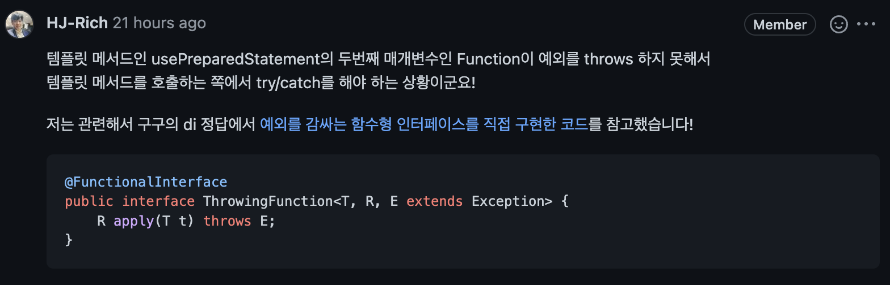

> 본 포스팅은 우아한테크코스 4기 백엔드 **[JDBC 라이브러리 구현하기](https://github.com/woowacourse/jwp-dashboard-jdbc)** 미션 과정을 정리한 내용이다.

## 1단계 - **JDBC 라이브러리 구현하기**

### 레거시 UserDao

지금의 `UserDao` 는 JDBC를 직접 사용하여, DataSource를 생성, 커넥션 획득/해제, 예외처리 작업을 모두 하고 있다.

```java
/* UserDao */

public void insert(final User user) {
    final var sql = "insert into users (account, password, email) values (?, ?, ?)";

    Connection conn = null;
    PreparedStatement pstmt = null;
    try {
        conn = dataSource.getConnection();
        pstmt = conn.prepareStatement(sql);

        log.debug("query : {}", sql);

        pstmt.setString(1, user.getAccount());
        pstmt.setString(2, user.getPassword());
        pstmt.setString(3, user.getEmail());
        pstmt.executeUpdate();
    } catch (SQLException e) {
        log.error(e.getMessage(), e);
        throw new RuntimeException(e);
    } finally {
        try {
            if (pstmt != null) {
                pstmt.close();
            }
        } catch (SQLException ignored) {}

        try {
            if (conn != null) {
                conn.close();
            }
        } catch (SQLException ignored) {}
    }
}
```

이 코드는 굉장히 생산성이 떨어진다. 웹 개발자가 **SQL 쿼리 작성, 쿼리에 전달할 인자, SELECT 구문의 경우 조회 결과를 추출하는 과정에만 집중**할 수 있도록 JDBC 라이브러리를 만들자.

스프링이 제공하는 `JdbcTemplate` 의 동작 방식을 모방할 것이므로 클래스 이름은 `JdbcTemplate` 으로 한다.

### update()

`update()` 는 쓰기 쿼리를 실행하기 위한 메소드이다.

```java
/* JdbcTemplate */

public int update(final String sql, Object... args) {
    try (Connection connection = dataSource.getConnection();
         PreparedStatement preparedStatement = connection.prepareStatement(sql)) {

        for (int i = 0; i < args.length; i++) {
            preparedStatement.setObject(i + 1, args[i]);
        }

        return preparedStatement.executeUpdate();
    } catch (final SQLException e) {
        throw new DataAccessException(e.getMessage(), e);
    }
}
```

위와 같이 작성하였다. INSERT, UPDATE, DELETE 쿼리를 사용할 수 있다. 내부에서 커넥션을 획득하고, `PreparedStatement` 를 만들어 가변인자로 받은 매개변수를 매핑하고, 쿼리를 실행한다.

### query()

`query()` 는 읽기 쿼리를 실행하기 위한 메소드이다. SELECT 쿼리를 실행하고, 특정 객체에 쿼리 결과를 매핑해준다.

```java
/* JdbcTemplate */

public <T> List<T> query(final String sql, final RowMapper<T> rowMapper, final Object... args) {
    try (Connection connection = dataSource.getConnection();
         PreparedStatement preparedStatement = connection.prepareStatement(sql)) {

        for (int i = 0; i < args.length; i++) {
            preparedStatement.setObject(i + 1, args[i]);
        }

        List<T> results = new ArrayList<>();
        ResultSet rs = preparedStatement.executeQuery();
        if (rs.next()) {
            T result = rowMapper.run(rs);
            results.add(result);
        }

        return results;
    } catch (final SQLException e) {
        throw new DataAccessException(e.getMessage(), e);
    }
}
```

위와 같이 구현했다. 실제 `JdbcTemplate`과 유사하게 쿼리 결과를 객체에 매핑하기 위한 `RowMapper` 함수형 인터페이스를 아래와 같이 만들었다.

```java
@FunctionalInterface
public interface RowMapper<T> {

    T run(final ResultSet rs);
}
```

`@FunctionalInterface` 애노테이션을 붙였다. 클라이언트 측에서는 JDBC의 `ResultSet` 을 받아 내부에서 T 타입의 객체를 생성한 다음 반환하면 된다. `UserDao` 에서는 `RowMapper` 를 아래와 같이 람다식으로 사용할 수 있다.

```java
rs -> {
    try {
        return new User(
                rs.getLong(1),
                rs.getString(2),
                rs.getString(3),
                rs.getString(4));
    } catch (SQLException e) {
        throw new DataAccessException();
    }
}
```

이렇게 하면 내부의 람다식이 반환하는 객체의 타입에 따라 제네릭 타입 `T` 가 자동으로 결정된다.

### queryForObject()

```java
public <T> T queryForObject(final String sql, final RowMapper<T> rowMapper, final Object... args) {
    List<T> results = query(sql, rowMapper, args);
    return results.get(FIRST_RESULT_INDEX);
}
```

단건을 조회하기 위한 `queryForObject()` 메소드이다. 중복코드를 제거하기 위해 `query()` 메소드를 재활용하였다. `FIRST_RESULT_INDEX` 값은 0이다.

### 고민1 - RowMapper에서 예외처리

```java
rs -> {
    try {
        return new User(
                rs.getLong(1),
                rs.getString(2),
                rs.getString(3),
                rs.getString(4));
    } catch (SQLException e) {
        throw new DataAccessException();
    }
}
```

아까 `RowMapper` 를 이렇게 사용한다고 했다. 그런데, `ResultSet` 의 `getXXX()` 메소드가 `SQLException` 을 throw 하여 위와 같이 람다식 내부에서 try - catch 를 해줘야한다. 영 별로인 코드이다.

리차드에게 리뷰를 받았는데, 단순히 아래와 같이 `RowMapper` 의 `run` 메소드가 `SQLException` 예외를 외부로 미루면 되는 것이었다. `RowMapper` 를 생성하는 것은 클라이언트지만, 전달받아 직접 실행하는 측은 `JdbcTemplate` 라이브러리 이므로, 클라이언트가 직접 예외처리를 하지 않아도 된다.

```java
@FunctionalInterface
public interface RowMapper<T> {

    T run(final ResultSet rs) throws SQLException;
}
```

### 고민2 - 중복 코드 제거

코드를 작성하다보니, `Connection` 과 `PreparedStatement` 를 얻어오는 과정에서 많은 중복이 발생하는 것을 느꼈다.

```java
public <T> List<T> query(final String sql, final RowMapper<T> rowMapper, final Object... args) {
    try (Connection connection = dataSource.getConnection();
          PreparedStatement preparedStatement = connection.prepareStatement(sql)) {

        for (int i = 0; i < args.length; i++) {
            preparedStatement.setObject(i + 1, args[i]);
        }

        // 이곳을 제외하고는 중복
    } catch (final SQLException e) {
        throw new DataAccessException(e.getMessage(), e);
    }
}
```

위 코드 전체가 중복이다. 이런 형태의 중복을 없애기 위한 패턴으로는 템플릿 메소드 패턴이 있다. 레벨1 체스미션 때 중복 코드를 없애기 위해 공부했던 패턴이다. 그런데, 일반적인 템플릿 메소드 패턴은 추상 클래스와 상속을 이용하여 중복 코드를 해결한다. `update()` , `query()` , `queryForObject()` 세 메서드를 위해 세개의 구현체를 만드는 것은 별로인 것 같다.

람다를 사용하면, 템플릿 메소드 패턴을 하나의 구현체에서 구현할 수 있을 것 같다. 찾아보니 이 방식은 정확히는 템플릿 콜백 패턴이라고 한다. 자바스크립트에서 주구장창 사용해왔던 그 콜백이 맞다. 자바스크립트와 달리 자바에서는 함수가 일급 객체가 아니므로 람다를 이용해 익명 객체를 만들고, 이를 콜백으로 전달하는 방식으로 사용한다.

```java
public <T> T usePreparedStatement(final String sql, final Function<PreparedStatement, T> function,
                                  final Object... args) {
    try (Connection connection = dataSource.getConnection();
         PreparedStatement preparedStatement = connection.prepareStatement(sql)) {

        for (int i = 0; i < args.length; i++) {
            preparedStatement.setObject(i + 1, args[i]);
        }

        return function.apply(preparedStatement);
    } catch (final SQLException e) {
        throw new DataAccessException(e.getMessage(), e);
    }
}
```

위와 같이 `usePreparedStatement()` 라는 메소드를 만들었다. 반환 타입은 제네릭 타입 `T` 이다. 특징으로는 `Function<PreparedStatement, T>` 를 파라미터로 전달 받는다. `Function` 인터페이스는 JDK8에서 제공되는 표준 함수형 인터페이스로, 기본 형태는 `Function<T, R>` 이다. 파라미터로 `T` 타입을 받아, `R` 타입으로 반환한다. 주로 파라미터를 받아, 반환값으로 매핑할 때 사용되는 함수형 인터페이스이다.

 `Function` 타입으로 파라미터를 넘겨주면, 해당 람다식 파라미터에 `PreparedStatement` 를 전달하여 핵심 로직만 처리하는 방식이다. 아래와 같이 사용한다.

```java
public int update(final String sql, final Object... args) {
    return usePreparedStatement(sql, pstmt -> {
        try {
            return pstmt.executeUpdate(sql);
        } catch (SQLException e) {
            throw new DataAccessException(e.getMessage(), e);
        }
    }, args);
}
```

중복 코드가 많이 사라진 것을 확인할 수 있다. 하지만, 고민1과 같이 아직 내부에서 `SQLException` 을 try - catch 해줘야한다. 이 부분을 해결하려면 고민이 더 필요할 것 같다.

아무튼 람다를 활용한 템플릿 메소드 패턴을 사용해 아래와 같이 중복 코드를 많이 제거하였다.

```java
public int update(final String sql, final Object... args) {
    return usePreparedStatement(sql, pstmt -> {
        try {
            return pstmt.executeUpdate(sql);
        } catch (SQLException e) {
            throw new DataAccessException(e.getMessage(), e);
        }
    }, args);
}

public <T> List<T> query(final String sql, final RowMapper<T> rowMapper, final Object... args) {
    return usePreparedStatement(sql, pstmt -> {
        try {
            List<T> results = new ArrayList<>();
            ResultSet rs = pstmt.executeQuery();
            if (rs.next()) {
                T result = rowMapper.run(rs);
                results.add(result);
            }

            return results;
        } catch (SQLException e) {
            throw new DataAccessException(e.getMessage(), e);
        }
    }, args);
}
```

`UserDao` 도 쿼리와 객체 매핑에만 신경쓸 수 있도록 개선되었다.

```java
public class UserDao {

    // ...

    public void insert(final User user) {
        String sql = "insert into users (account, password, email) values (?, ?, ?)";
        jdbcTemplate.update(sql, user.getAccount(), user.getPassword(), user.getEmail());
    }

    public void update(final User user) {
        String sql = "update users set (account, password, email) = (?, ?, ?) where id = ?";
        jdbcTemplate.update(sql, user.getAccount(), user.getPassword(), user.getEmail(), user.getId());
    }

    public List<User> findAll() {
        String sql = "select id, account, password, email from users";
        return jdbcTemplate.query(sql, rs -> {
            try {
                return new User(
                        rs.getLong(1),
                        rs.getString(2),
                        rs.getString(3),
                        rs.getString(4));
            } catch (SQLException e) {
                throw new DataAccessException();
            }
        });
    }

    public User findById(final Long id) {
        String sql = "select id, account, password, email from users where id = ?";
        return jdbcTemplate.queryForObject(sql, rs -> {
            try {
                return new User(
                        rs.getLong(1),
                        rs.getString(2),
                        rs.getString(3),
                        rs.getString(4));
            } catch (SQLException e) {
                throw new DataAccessException();
            }
        }, id);
    }

    public User findByAccount(final String account) {
        String sql = "select id, account, password, email from users where account = ?";
        return jdbcTemplate.queryForObject(sql, rs -> {
            try {
                return new User(
                        rs.getLong(1),
                        rs.getString(2),
                        rs.getString(3),
                        rs.getString(4));
            } catch (SQLException e) {
                throw new DataAccessException();
            }
        }, account);
    }
}
```

`UserDao` 의 중복되는 `User` 매핑 `RowMapper` 를 상수로 등록하였다. 그나마 중복이 더 줄었다.

```java
public class UserDao {

		// ...

    private static final RowMapper<User> USER_ROW_MAPPER = rs -> {
        try {
            return new User(
                    rs.getLong(1),
                    rs.getString(2),
                    rs.getString(3),
                    rs.getString(4));
        } catch (SQLException e) {
            throw new DataAccessException();
        }
    };
		
		// ...

    public List<User> findAll() {
        String sql = "select id, account, password, email from users";
        return jdbcTemplate.query(sql, USER_ROW_MAPPER);
    }

    public User findById(final Long id) {
        String sql = "select id, account, password, email from users where id = ?";
        return jdbcTemplate.queryForObject(sql, USER_ROW_MAPPER, id);
    }

    public User findByAccount(final String account) {
        String sql = "select id, account, password, email from users where account = ?";
        return jdbcTemplate.queryForObject(sql, USER_ROW_MAPPER, account);
    }
}
```

### 고민3 - usePreparedStatement에 전달하는 Function에서 예외처리 없애기

중복 코드를 없애기 위한 `usePreparedStatement` 메소드의 파라미터는 아래와 같다.

```java
/* JdbcTemplate */

public <T> T usePreparedStatement(final String sql, final Function<PreparedStatement, T> function,
                                  final Object... args) {
```

`Function` 을 받고 있는데, 문제는 아래와 같다.

```java
/* JdbcTemplate */

public <T> List<T> query(final String sql, final RowMapper<T> rowMapper, final Object... args) {
    return usePreparedStatement(sql, pstmt -> {
        try {
            List<T> results = new ArrayList<>();
            ResultSet rs = pstmt.executeQuery();
            if (rs.next()) {
                T result = rowMapper.run(rs);
                results.add(result);
            }

            return results;
        } catch (SQLException e) {
            throw new DataAccessException(e.getMessage(), e);
        }
    }, args);
}
```

전달하는 람다 내부에서 try - catch 를 해야하는 것이다. 꽤나 더럽다. 이 부분은 어떻게 해결해야할지 감이 잡히지 않아 리뷰어인 리차드에게 질문했다. 리차드는 아래와 같이 조언을 해주었다.



생각해보니 간단했다. 직접 예외를 외부로 미루는 함수형 인터페이스를 직접 정의해주면 되는 것 이었다.

```java
@FunctionalInterface
public interface ThrowingFunction<T, R, E extends Exception> {

    R apply(final T t) throws E;
}
```

위와 같이 `ThrowingFunction` 이라는 함수형 인터페이스를 정의했다. 표준 함수형 인터페이스 `Function` 과 비슷하나, 예외를 외부로 미루는 코드가 추가되었다. 이 예외에 대한 타입은 제네릭을 사용하였다.

이후엔 https://github.com/woowacourse/jwp-dashboard-jdbc/pull/115 여기에 있는 리뷰를 열심히 반영했다.

## 2단계 - 리팩토링

2단계 미션의 목표는 1단계에서 작성한 코드를 리팩토링 한 것이다. 힌트로 제공된 자바의 기능은 아래와 같다.

- 익명 클래스
- 함수형 인터페이스
- 제네릭
- 가변 인자
- 람다
- try-with-resources
- checked vs unchecked exception

익명 클래스와 함수형 인터페이스, 람다, 제네릭은 `RowMapper` 와 `ThrowingFunction` 을 만들때 사용하였다. 가변인자는 `JdbcTemplate` 에서 `PreparedStatement` 에 매개변수를 매핑하기 위해 사용했다. try-with-resources는 `JdbcTemplate` 의 `usePreparedStatement` 메소드에서 `Connection` 과 `PreparedStatement` 자원을 해제하기 위해 사용하였다. checked vs unchecked exception 도 `SQLException` 을 `DataAccessException` 으로 예외 번역하여 던지며 사용하였다.

힌트를 쭉 읽어보니 2단계 요구사항의 전부를 1단계에서 이미 반영하였다. 따라서 2단계 내용은 생략한다.

## 3단계 - 트랜잭션 적용

> 이 부분에 대한 개념 학습은 **[스프링 트랜잭션 동기화 및 추상화](https://hudi.blog/spring-transaction-synchronization-and-abstraction/)** 포스팅에 정리해두었다. 내용이 비슷하니 이 포스팅과 함께 읽어보자.
> 

### 1. 트랜잭션 경계 설정하기

`UserService` 의 `changePassword()` 메소드는 `UserDao` 와 `UserHistoryDao` 2가지 DAO를 사용하여 작업을 수행한다.

```java
public void changePassword(final long id, final String newPassword, final String createBy) {
    final var user = findById(id);
    user.changePassword(newPassword);
    userDao.update(user);
    userHistoryDao.log(new UserHistory(user, createBy));
}
```

이 작업은 원자성을 보장하지 않는다. 트랜잭션을 적용해보자.

```java
public void changePassword(final long id, final String newPassword, final String createBy) {
    DataSource dataSource = DataSourceConfig.getInstance();

    Connection connection = null;
    try {
        connection = dataSource.getConnection();

        connection.setAutoCommit(false);

        final var user = findById(connection, id);
        user.changePassword(newPassword);
        userDao.update(connection, user);
        userHistoryDao.log(connection, new UserHistory(user, createBy));

        connection.commit();
    } catch (SQLException e) {
        try {
            connection.rollback();
        } catch (SQLException ignored) {
        }
    } finally {
        try {
            connection.close();
        } catch (SQLException ignored) {
        }
    }
}
```

아래와 같이 DAO가 파라미터로 `Connection` 을 전달받게 되었다. 트랜잭션을 유지하기 위해서는 트랜잭션의 시작부터 끝까지 같은 커넥션을 유지해야하기 때문이다.

```java
/* UserService */

userDao.update(connection, user);
userHistoryDao.log(connection, new UserHistory(user, createBy));
```

```java
/* UserDao */

public void update(final Connection connection, final User user) {
    String sql = "update users set (account, password, email) = (?, ?, ?) where id = ?";
    jdbcTemplate.update(connection, sql, user.getAccount(), user.getPassword(), user.getEmail(), user.getId());
}
```

```java
/* JdbcTemplate */

public int update(final Connection connection, final String sql, final Object... args) {
    return usePreparedStatement(connection, sql, PreparedStatement::executeUpdate, args);
}

public <T> T usePreparedStatement(final Connection connection, final String sql,
                                  final ThrowingFunction<PreparedStatement, T, SQLException> function,
                                  final Object... args) {
   // ...
}
```

동일한 `Connection` 을 공유하기 위해 `Connection` 을 계속 파라미터로 전달해야하는 일이 발생한다. 트랜잭션 하나 적용하기 위해 코드베이스의 많은 부분에서 변경이 발생했다. 또한 단일 쿼리를 실행하기 위해서도 커넥션을 밖에서 생성해서 파라미터로 전달해야한다. 사용성이 떨어진다.

그리고 무엇보다 애써 낮은 수준의 JDBC를 사용한 데이터 접근 로직과 비즈니스 로직을 분리했는데, 트랜잭션을 적용하면서 다시 비즈니스 로직과 데이터 접근 로직이 섞이게 되었다. 즉, 관심사의 분리가 제대로 이뤄지지 않았다.

### 2. 트랜잭션 동기화 적용하기

`PlatformTransactionManager` 를 사용하여 트랜잭션을 동기화해보자. 이 클래스에 대한 자세한 내용은 **[스프링 트랜잭션 동기화 및 추상화](https://hudi.blog/spring-transaction-synchronization-and-abstraction/)** 포스팅을 참고하자.

```java
/* UserService */

public void changePassword(final long id, final String newPassword, final String createBy) {
    DataSource dataSource = DataSourceConfig.getInstance();
    DataSourceTransactionManager transactionManager = new DataSourceTransactionManager(dataSource);
    TransactionStatus transactionStatus = transactionManager.getTransaction(new DefaultTransactionDefinition());

    try {
        final var user = findById(id);
        user.changePassword(newPassword);

        userDao.update(user);
        userHistoryDao.log(new UserHistory(user, createBy));

        transactionManager.commit(transactionStatus);
    } catch (TransactionException e) {
        transactionManager.rollback(transactionStatus);
    }
}
```

`JdbcTemplate` 이 커넥션을 해제하는 코드도 수정해야한다. 쿼리를 실행하자마자 `Connection` 을 해제해버리면 다음 쿼리에서 오류가 발생하기 때문이다. 

```java
/* JdbcTemplate */

public <T> T usePreparedStatement(final String sql,
                                  final ThrowingFunction<PreparedStatement, T, SQLException> function,
                                  final Object... args) {
    Connection connection = DataSourceUtils.getConnection(dataSource);
		// 커넥션을 외부에서 전달받지 않고 DataSourceUtils에서 가져온다.

    try (PreparedStatement preparedStatement = connection.prepareStatement(sql)) {
        mapParametersToPreparedStatement(preparedStatement, args);
        return function.apply(preparedStatement);
    } catch (final SQLException e) {
// ...
```

### 3. 트랜잭션 서비스 추상화하기

하지만 여전히 `UserService` 는 데이터 액세스 로직을 가지고 있다. 서비스 레이어는 비즈니스 로직만을 관심사로 가져야하는데, 데이터 소스와 트랜잭션 경계까지 너무 많은 것을 알고있다. 적절히 추상화할 필요가 있다.

`UserService` 라는 인터페이스르 따로 만들고, `AppUserService` 와 `TxUserService` 라는 구현체를 만들것이다. `AppUserService` 는 비즈니스 로직만을 실행하고, `TxUserService` 트랜잭션 로직만을 실행한다.

아래는 `UserService` 인터페이스 코드이다.

```java
public interface UserService {

    User findById(final long id);

    void insert(final User user);

    void changePassword(final long id, final String newPassword, final String createBy);
}
```

아래는 `AppUserService` 클래스 코드이다. 트랜잭션에 대한 로직이 전혀 없는 것을 확인할 수 있다. 즉, 순수한 비즈니스 로직 코드만 존재한다.

```java
public class AppUserService implements UserService {

    private final UserDao userDao;
    private final UserHistoryDao userHistoryDao;

    public AppUserService(final UserDao userDao, final UserHistoryDao userHistoryDao) {
        this.userDao = userDao;
        this.userHistoryDao = userHistoryDao;
    }

    public User findById(final long id) {
        return userDao.findById(id);
    }

    public void insert(final User user) {
        userDao.insert(user);
    }

    public void changePassword(final long id, final String newPassword, final String createBy) {
        final var user = findById(id);
        user.changePassword(newPassword);

        userDao.update(user);
        userHistoryDao.log(new UserHistory(user, createBy));
    }
}
```

아래는 `TxUserService` 이다. 트랜잭션의 경계를 설정한다. 비즈니스 로직은 외부에서 `AppUserService` 를 주입받아 실행한다.

```java
public class TxUserService implements UserService {

    private final PlatformTransactionManager transactionManager;
    private final UserService userService;

    public TxUserService(final PlatformTransactionManager transactionManager, final UserService userService) {
        this.transactionManager = transactionManager;
        this.userService = userService;
    }

    @Override
    public User findById(final long id) {
        return userService.findById(id);
    }

    @Override
    public void insert(final User user) {
        userService.insert(user);
    }

    @Override
    public void changePassword(final long id, final String newPassword, final String createBy) {
        TransactionStatus status = transactionManager.getTransaction(new DefaultTransactionDefinition());

        try {
            userService.changePassword(id, newPassword, createBy);
            transactionManager.commit(status);
        } catch (RuntimeException e) {
            transactionManager.rollback(status);
            throw new DataAccessException(e);
        }
    }
}
```

`findById()` 와 `insert()` 와 같이 트랜잭션이 필요 없는 로직은 그냥 `AppUserService` 의 로직을 위임(delegate)한다. `changePassword()` 메소드는 트랜잭션이 필요하므로 외부에서 주입받은 `PlatformTransactionManager` 를 사용하여 트랜잭션 경계를 지정하고, 커밋과 롤백을 적절히 분기하는 것을 확인할 수 있다.

## 마치며

여기서 미션 요구사항은 끝났다. 하지만 아직 찝찝함은 남아있다. 바로 `AppUserService` 와 `TxUserService` 를 분리한 부분이다. 지금이야 서비스 객체가 하나라서 큰 문제 없겠지만, 트랜잭션이 적용되어야할 클래스가 수십가지가 된다면, 그 서비스 객체에 맞춰 `TxOOOOService` 클래스가 생길것이다.

이런 횡단 관심사를 스프링이 제공하는 AOP를 통해 개선할 수 있을것이라고 추측된다. 하지만 난 아직 AOP를 공부한적이 없다 ㅎㅎ; 이번주 금요일에 AOP 강의가 있는 것 같은데, 여기서 아마 이 구조를 개선하지 않을까 예상해본다.