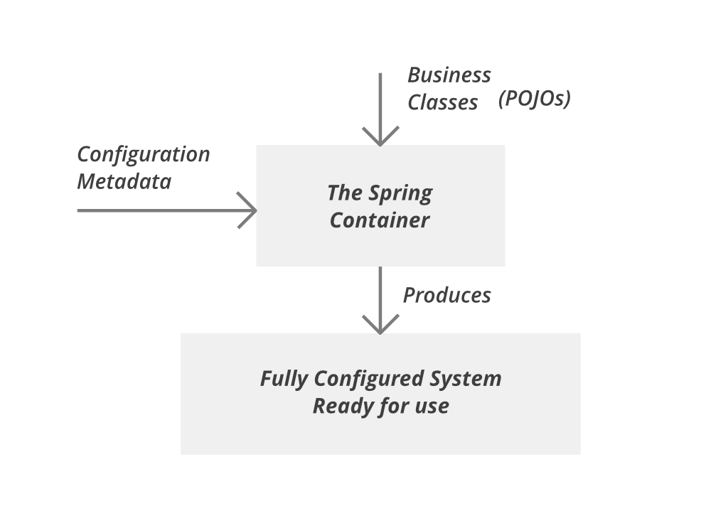
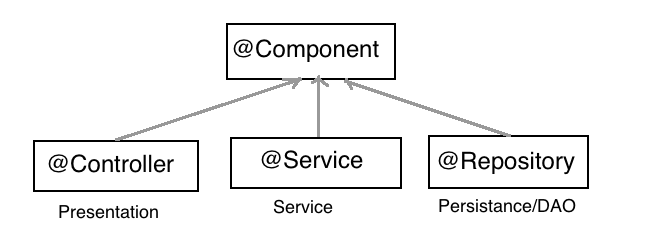

## 학습동기

우아한테크코스 레벨2에서 스프링을 처음 접해보며, 가장 신기하게 생각되었던 것은 IoC였다. 내가 직접 객체를 생성하거나, 관계를 만들어주지 않았음에도 불구하고, 애너테이션만 붙이면 스프링이 어딘가에서 객체를 생성하고 꺼내와 주입해주었다. 관련된 개념을 찾아보니 핵심 키워드로는 Spring Bean과 Spring IoC Container인 것 같다. 이에 관련하여 간단하게 개념을 짚어보려 한다.

## Spring Bean

> In Spring, the objects that form the backbone of your application and that are managed by the Spring IoC container are called beans. A bean is an object that is instantiated, assembled, and managed by a Spring IoC container.
>
> [_스프링 공식 문서 - Beans-Introduction_](<[https://docs.spring.io/spring-framework/docs/current/reference/html/core.html#beans-introduction](https://docs.spring.io/spring-framework/docs/current/reference/html/core.html#beans-introduction)>)

Spring Bean은 스프링 프레임워크의 핵심 개념 중 하나이다. 스프링은 제어의 역전(IoC)로 객체를 관리하는데, 이때 스프링이 제어 권한을 가져 직접 생성하고 관계를 부여하는 객체를 Bean 이라고 한다. 즉, Spring Bean은 후술할 Spring IoC Container가 생성, 관계설정, 사용 등을 제어해주는 제어의 역전이 적용된 객체를 의미한다.

스프링 프레임워크는 IoC가 적용되어 프로그래머가 객체를 직접 생성하지 않고, DI의 형태로 객체를 주입받아 사용할 수 있는데, 이때 DI는 Bean 끼리만 가능하다.

단, Java Bean과 Spring Bean은 서로 다른 개념이니 혼동하지 않도록 주의하자.

## Spring IoC Container



> Spring IoC Container is the core of Spring Framework. It creates the objects, configures and assembles their dependencies, manages their entire life cycle. The Container uses Dependency Injection(DI) to manage the components that make up the application. It gets the information about the objects from a configuration file(XML) or Java Code or Java Annotations and Java POJO class. These objects are called Beans. Since the Controlling of Java objects and their lifecycle is not done by the developers, hence the name Inversion Of Control.
>
> [_GeeksforGeeks_](https://www.geeksforgeeks.org/spring-ioc-container/)

Spring IoC Container는 스프링의 핵심 중 하나이며, Bean을 생성하고, 의존성과 생명주기를 관리하는 컨테이너이다. 스프링 프로그래머는 Bean으로 등록된 객체를 Spring IoC Container로부터 DI를 통해 가져와 사용할 수 있다.

Spring IoC Container 로는 Bean Factory 와 Application Context 가 사용된다. 실제로는 Bean Factory를 확장한 Application Context 을 많이 사용하는 추세라고 한다. 관련된 내용은 조금 더 공부해보고 별개의 포스트로 작성하겠다.

Spring IoC Container 에 등록되는 Bean 들은 기본적으로는 싱글턴으로 관리된다.

## 애너테이션을 활용한 Bean 등록 및 DI

### 객체를 Bean으로 등록하기

스프링 초기에는 XML로 빈을 설정하는 것이 대세였지만, 이후 애너테이션을 이용하여 빈을 등록하고, DI 할 수 있도록 개선되었다고 한다.



- `@Controller` : 해당 클래스가 Presentation Layer 에서 Controller 임을 명시한다.
- `@Service` : 해당 클래스가 Business Layer 에서 Service 임을 명시한다.
- `@Repository` : 해당 클래스가 Persistence Layer 에서 DAO임을 명시한다.
- `@Component` : 위 세가지 외로 Bean으로 등록하고 싶은 클래스에 명시한다.

위 어노테이션을 붙이면 스프링 프레임워크가 Auto Scan 이라는 과정을 거쳐 자동으로 해당 클래스를 Bean으로 등록한다.

### `@Autowired` 로 의존성 주입하기

스프링에서 Bean 인스턴스가 생성되면, `@Autowired` 를 설정한 메서드가 자동으로 호출되고, 파라미터에 명시한 Bean 인스턴스가 자동으로 주입된다.`@Autowired` 는 필드, 메서드 (특히 Setter), 그리고 생성자에 적용이 가능하다.

**필드 주입**

```java
@RestController
public class WebSpringController {

    @Autowired
    private ChessService chessService;

    // ...
}
```

**수정자(Setter) 주입**

```java
@RestController
public class WebSpringController {

    private ChessService chessService;

    @Autowired
    public void setChessService(ChessService chessService) {
        this.chessService = chessService;
    }

    // ...
}
```

**생성자 주입**

```java
@RestController
public class WebSpringController {

    private final ChessService chessService;

    @Autowired
    public WebSpringController(ChessService chessService) {
        this.chessService = chessService;
    }

    // ...
}
```

다만, 필드나 Setter 메서드에서 주입을 사용하는 것 보다 생성자 주입 방법이 권장된다고 한다. 특히, 필드 주입을 위해 `@Autowired` 를 사용하면, 인텔리제이에서 경고가 발생한다. 이에 관한 내용은 더 깊게 공부해서 별개의 포스트로 다루도록 하겠다.

## 참고

- [https://docs.spring.io/spring-framework/docs/current/reference/html/core.html#beans-introduction](https://docs.spring.io/spring-framework/docs/current/reference/html/core.html#beans-introduction)
- [https://www.geeksforgeeks.org/spring-ioc-container/](https://www.geeksforgeeks.org/spring-ioc-container/)
- [https://www.baeldung.com/spring-bean](https://www.baeldung.com/spring-bean)
- [[백기선 스프링 프레임워크 핵심기술] IOC Container and Bean
  ](https://www.youtube.com/watch?v=L-0UvbFUXrk)
- 이일민, 토비의 스프링 3.1, 에이콘(2012)
