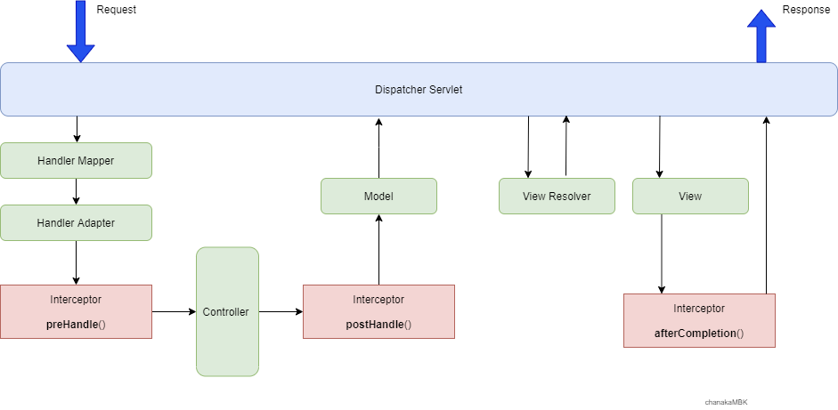

우아한테크코스 레벨2 마지막 미션인 장바구니 미션에서 인증과 인가를 구현하기 위해, Spring Interceptor 를 사용해야했다. 이를 위해 학습한 내용을 정리해보았다.

## 컨트롤러에서 발생한 중복 코드

웹 어플리케이션을 개발하다 보면, 컨트롤러에서 반복되는 로직을 실행해야할 경우가 존재한다. 가령, 해당 엔트포인트에 대한 **인증(Authentication)**과 **인가(Authorization)** 기능이 대표적일 것이다. 아래 코드는 인증을 구현하기 위해 컨트롤러의 여러 메소드에서 중복 코드가 발생한 예시이다.

```java
@GetMapping("/me")
public ResponseEntity<String> getMyInfo(@RequestHeader("Authorization") String token) {
    if (!authService.validateToken(token)) {
        throw new AuthException();
    } // 인증이 필요한 컨트롤러 메소드마다 등장하는 중복된 인증 로직

		// 유저 정보 가져오는 로직
    return ResponseEntity.ok("유저 정보");
}

@PatchMapping("/me")
public ResponseEntity<String> updateMyInfo(@RequestHeader("Authorization") String token) {
    if (!authService.validateToken(token)) {
        throw new AuthException();
    } // 인증이 필요한 컨트롤러 메소드마다 등장하는 중복된 인증 로직

		// 유저 정보 수정하는 로직
    return ResponseEntity.noContent().build();
}

@DeleteMapping("/me")
public ResponseEntity<String> deleteMyInfo(@RequestHeader("Authorization") String token) {
    if (!authService.validateToken(token)) {
        throw new AuthException();
    } // 인증이 필요한 컨트롤러 메소드마다 등장하는 중복된 인증 로직

		// 유저 정보 제거하는 로직
    return ResponseEntity.noContent().build();
}
```

위 코드는 단일 컨트롤러 클래스에서 발생한 중복이어서 당장은 큰 문제같아 보이지 않겠지만, 이런 컨트롤러 클래스가 여러개라면? 수십, 수백개라면 과연 유지보수가 가능할까? 또한, 혹여 인증이 필요한 엔드포인트에서 인증 로직을 실수로 누락해버린다면, 큰 문제가 발생할 것 이다. 코드에서 중복은 해악이다.

## Spring Interceptor

우리는 이 문제를 Spring의 **인터셉터(Interceptor)**로 해결할 수 있다. 여러 컨트롤러에서 같은 관심사를 갖고 반복되어 사용하는 코드를 제거하고, 다수의 컨트롤러에 동일한 기능을 제공하기 위해 사용하는 것이 인터셉터이다. 인터셉터는 컨트롤러 로직이 실행되기 전에 실행된다.

### 인터셉터 호출 흐름

> 아래 내용은 ‘초보 웹 개발자를 위한 스프링5 프로그래밍 입문' 의 372p 내용을 다수 참고하여 작성되었다.

스프링의 인터셉터의 동작은 크게 '컨트롤러 실행 전', '컨트롤러 실행 후, 뷰 실행 전', '뷰 실행 후' 이 세 단계로 구분된다. 스프링 인터셉터를 만들기 위해서는 `HandlerInterceptor` 인터페이스를 구현해야하는데, 해당 인터페이스는 `preHandle()`, `postHandle()`, `afterCompletion()` 이라는 세 메소드를 제공한다.



### 1. preHandle()

컨트롤러 호출 전에 호출되는 메소드이다. preHandle()의 반환타입은 `boolean` 이다. 만약 `preHandle()` 이 false 를 반환한다면, 다음 HandlerInterceptor 혹은 컨트롤러를 실행하지 않는다.

### 2. postHandle()

컨트롤러가 정상적으로 실행된 이후에 실행되는 메소드이다. 컨트롤러에서 예외가 발생한다면, `postHandle()` 메소드는 실행되지 않는다.

### 3. afterCompletion()

뷰가 클라이언트에 응답을 전송한 뒤에 실행된다. 컨트롤러 실행과정에서 예외가 발생한 경우 해당 예외가 `afterCompletion()` 메소드의 4번째 파라미터로 전달되어, 로그로 남기는 등 후처리를 위해 사용될 수 있다.

## 인터셉터 실습

### 인터셉터 작성

`HandlerInterceptor` 인터페이스를 구현하는 `SomeInterceptor` 라는 클래스를 작성하여 직접 스프링의 인터셉터를 사용해보자.

> 인터셉터를 만들기 위해 상속받을 수 있었던 추상클래스인 `HandlerInterceptorAdapter` 는 Spring 5.3 이상 버전에서는 Deprecated 되었다고 한다.

```java
public class SomeInterceptor implements HandlerInterceptor {

}
```

동작을 확인해보기 위해 `preHandle()` , `postHandle()` , `afterCompletion()` 이 세가지 메소드를 오버라이딩 해보자.

```java
@Override
public boolean preHandle(HttpServletRequest request, HttpServletResponse response, Object handler) {
    System.out.println("Pre Handle");
    return true;
}

@Override
public void postHandle(HttpServletRequest request, HttpServletResponse response, Object handler,
                       ModelAndView modelAndView) {
    System.out.println("Post Handle");
}

@Override
public void afterCompletion(HttpServletRequest request, HttpServletResponse response, Object handler,
                            Exception ex) {
    System.out.println("After Completion");
}
```

### 인터셉터 등록

`WebMvcConfigurer` 인터페이스를 구현하면 Spring MVC 의 설정을 할 수 있다고 한다. 이를 통해 스프링에 우리가 만든 Interceptor를 등록해보자.

```java
@Configuration
public class WebConfig implements WebMvcConfigurer {
    @Override
    public void addInterceptors(InterceptorRegistry registry) {
        registry.addInterceptor(new SomeInterceptor());
    }
}
```

> 스프링 레거시 프로젝트에서는 **XML 기반으로 스프링 설정 (XML Configuration)**을 하지만, 최근에는 **Java 의 어노테이션으로 설정하는 방식 (Java Configuration)** 을 사용한다고 한다.

> 아직 @Configuration 어노테이션과 XML Configuration, Java Configuration, WebMvcConfigurer 같은 키워드에는 익숙치 않아 별개의 포스트로 다뤄보는 것이 좋을 것 같다.

### 컨트롤러 작성

컨트롤러는 아래와 같이 간단히 작성했다.

```java
@RestController("/")
public class Controller {
    @GetMapping
    public ResponseEntity<String> sayHello() {
        return ResponseEntity.ok("Hello");
    }
}
```

### 인터셉터 동작 확인

이렇게 만들어진 어플리케이션의 인터셉터가 제대로 동작하는지 확인하기 위해 `localhost:8080` 에 접속하자 아래와 같은 순서대로 로그가 찍힌 것을 확인할 수 있었다.

```
Pre Handle
Post Handle
After Completion
```

## 인터셉터를 활용하여 인증 구현하기

이제 인터셉터가 대략 어떤식으로 동작하는지 파악했다. 우리는 맨 처음의 코드에서 `AuthService` 를 통해 토큰을 검증하는 로직과 유효하지 않은 토큰에 대한 응답을 반환하는 부분이 중복되었음을 확인했다. 이 코드를 인터셉터를 사용하여 개선해보자.

```java
@Component
public class AuthInterceptor implements HandlerInterceptor {

    private final AuthService authService;

    public AuthInterceptor(AuthService authService) {
        this.authService = authService;
    }

    @Override
    public boolean preHandle(HttpServletRequest request, HttpServletResponse response, Object handler) {
        String token = request.getHeader("Authorization");

        if (!authService.validateToken(token)) {
            throw new AuthException();
        }

        return true;
    }
}
```

> 인터셉터에 `@Component` 어노테이션을 달아 빈으로 만들어준 이유는, `AuthService` 를 주입받기 위함이다.

`preHandle()` 메소드에서 HTTP Header 를 통해 가져온 토큰을 `AuthService` 의 `validateToken()` 을 통해 검증하고, 유효하지 않은 토큰이 들어왔다면 예외를 발생시킨다.

```java
@Configuration
public class WebConfig implements WebMvcConfigurer {

    private final AuthInterceptor authInterceptor;

    public WebConfig(AuthInterceptor authInterceptor) {
        this.authInterceptor = authInterceptor;
    }

    @Override
    public void addInterceptors(InterceptorRegistry registry) {
        registry.addInterceptor(authInterceptor);
    }
}
```

`WebConfig` 는 빈으로 등록된 `AuthInterceptor` 를 주입받아 인터셉터로 등록한다. 이렇게 인터셉터를 추가하면 아래와 같이 코드가 중복없이 개선된다.

```java
@GetMapping("/me")
public ResponseEntity<String> getMyInfo() {
    // 유저 정보 가져오는 로직
    return ResponseEntity.ok("유저 정보");
}

@PatchMapping("/me")
public ResponseEntity<String> updateMyInfo() {
    // 유저 정보 수정하는 로직
    return ResponseEntity.noContent().build();
}

@DeleteMapping("/me")
public ResponseEntity<String> deleteMyInfo() {
    // 유저 정보 제거하는 로직
    return ResponseEntity.noContent().build();
}
```

## Interceptor 설정하기

```java
@RestController
@RequestMapping("/items")
public class ItemController {
    @GetMapping
    public ResponseEntity<List<Item>> getAllItems() {
        // 상품 목록 가져오는 로직
        return ResponseEntity.ok(items);
    }
}
```

그런데, 만약 위와 같이 접근시 인증이 필요없는 엔드포인트가 존재한다면 어떻게 될까? 인터셉터는 현재 모든 컨트롤러 메소드에 대해서 동작하고 있다. 특정 엔드포인트만 적용하거나, 제외하고 싶다면 별도의 설정이 필요하다.

`WebConfig` 클래스에서 인터셉터 등록을 위해 `InterceptorRegistry` 의 `addInterceptor()` 메소드를 실행했었다. 이 메소드는 `InterceptorRegistration` 타입의 객체를 반환하는데, 해당 객체는 `addPathPatterns()` 와 `excludePathPatterns()` 라는 메소드를 제공한다. 이 메소드는 Ant Pattern 이라는 경로 패턴을 사용하여 인터셉터를 등록할 경로를 설정해줄 수 있다.

```java
@Override
public void addInterceptors(InterceptorRegistry registry) {
        registry.addInterceptor(authInterceptor)
                .addPathPatterns("/users/*");
				// /users/** 경로에 대하여 인터셉터 추가
}
```

```java
@Override
public void addInterceptors(InterceptorRegistry registry) {
    registry.addInterceptor(authInterceptor)
            .excludePathPatterns("/items/*");
				// /items/** 경로에 대하여 인터셉터 제외
}
```

### Ant Pattern

Ant Pattern 은 `*`, `**`, `?` 이 3개의 특수문자를 이용하여 경로를 표현한다. 각 문자는 아래의 의미를 갖는다.

#### \* : 0개 이상의 글자와 매칭

`/users/*` 는 `/users/me`, `/users/342` 와는 매칭되지만, `/users/342/favorites` 와는 매칭되지 않는다.

#### \*\* : 0개 이상의 디렉토리 혹은 파일과 매칭

`/users/**` 는 `/users/me`, `/users/342`, `/users/342/favorites` 와 모두 매칭된다. 또한 `/a/**/z` 는 `/a/b/c/d/e/z` 와 매칭된다.

#### ? : 1개 글자와 매칭

`/u?ers` 는 `/users`, `/uzers` 와 매칭되지만, `/ussers` 와는 매칭되지 않는다.

## 참고

- 최범균, 초보 웹 개발자를 위한 스프링5 프로그래밍 입문, 가메출판사(2022)
- [https://baeldung-cn.com/spring-mvc-handlerinterceptor](https://baeldung-cn.com/spring-mvc-handlerinterceptor)
- [https://docs.spring.io/spring-framework/docs/current/reference/html/web.html#mvc-handlermapping-interceptor](https://docs.spring.io/spring-framework/docs/current/reference/html/web.html#mvc-handlermapping-interceptor)
- [https://popo015.tistory.com/115](https://popo015.tistory.com/115)
