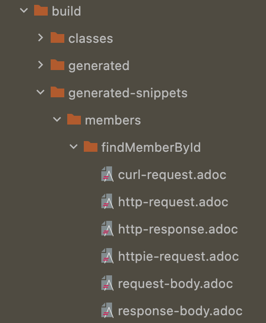
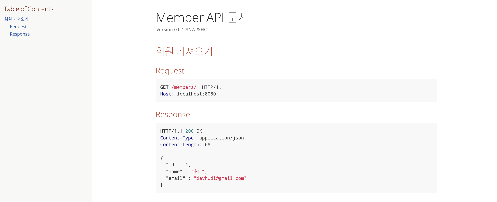

## API 문서 자동화

백엔드와 프론트엔드 개발자 사이의 원활한 협업을 위해서는 REST API 명세에 대한 문서화가 잘 되어있어야 한다. 구글 독스, 스프레드 시트, 위키, 노션 등을 사용해서 직접 API 명세를 문서화할 수 있지만, 우리는 개발자 아니겠는가. API 문서 작성을 도와주는 자동화 도구들이 많이 개발되어 있다.

Java Spring 진영에서 가장 많이 쓰이는 API 문서 자동화 도구는 크게 **Swagger**와 **Spring REST Docs** 이 두가지가 있다. 이 중 달록팀에서는 **Spring REST Docs**를 선택하게 되었다. 또한 테스트 도구로는 **MockMvc(@WebMvcTest)**, 문서는 **Asciidoc**을 선택하였다. 달록팀이 왜 이런 기술들을 선택하였는지 그 이유를 정리해본다.

그리고 마지막으로 직접 빈 스프링 프로젝트에서 Spring REST Docs 환경을 구축해보는 것을 마지막으로 글을 마무리하겠다.

## 비교1. Swagger vs Spring REST Docs

### Swagger

Spring 프로젝트에서 Swagger를 사용하기 위해서는 컨트롤러 메소드에 상단에 어노테이션을 통해 API를 기술한다. 컨트롤러 코드에 어노테이션을 붙여 문서를 생성하는 방식은 직관적이고 간단하다.

예전에 간단한 방명록 API를 만들어보며, 스웨거를 사용한 적이 있었다. 아래는 스웨거를 적용한 컨트롤러의 코드 일부이다.

```java
@Api(value = "방명록", tags = "방명록 관련 API")
@RestController
public class ArticleController {
    private final ArticleService articleService;

    public ArticleController(ArticleService articleService) {
        this.articleService = articleService;
    }

    @Operation(summary = "특정 유저에 방명록 생성", description = "특정 유저에 대한 방명록을 생성합니다.")
    @ApiImplicitParams({
            @ApiImplicitParam(name = "ownerId", value = "방명록 주인 닉네임, 영문 대소문자 및 숫자로만 구성될 수 있음."),
            @ApiImplicitParam(name = "articleRequestDto", value = "생성할 방명록 내용. 제목(title)과 내용(body)를 JSON 형태로 HTTP Body에 실어 전송 해야함.")
    })
    @PostMapping("/{ownerId}/articles")
    public ResponseEntity<ArticleResponseDto> createArticle(@PathVariable String ownerId,
                                                            @RequestBody ArticleRequestDto articleRequestDto) {
        Long id = articleService.createArticle(new OwnerId(ownerId), articleRequestDto);
        return ResponseEntity.created(URI.create("/" + ownerId + "/articles/" + id)).build();
    }

  // ...
```

어노테이션 몇개만 붙이면 자동으로 API 문서를 생성해준다니, 정말 편리한 도구이다. 심지어 생성된 문서에서는 API를 직접 실행해볼수도 있다. 하지만, 스웨거는 아래와 같은 분명한 단점이 존재했다.

1. **프로덕션 코드에 문서화에 대한 코드가 포함된다. 따라서 가독성이 떨어진다.**
2. **API 스펙이 변경되더라도 어노테이션을 변경하지 않으면 API 문서는 수정되지 않는다. 즉, 문서와 실제 API 스펙이 일치함을 보장할 수 없다.**

API 문서화의 목적은 API 스펙을 정의하는 것이다. 하지만 스웨거는 API 동작을 테스팅하는데 더 특화되어있다.

스웨거는 분명 규모가 작은 간단한 프로젝트에서는 강력한 도구이다. 프로젝트의 규모가 커질수록 **프로덕션 코드의 유지보수성이 떨어지고, 변경점이 늘어난다**. 달록팀은 이런 여러 이유를 근거로 스웨거는 API 문서화에 다소 적합하지 않다고 판단하여, 스웨거를 도입하지 않기로 결정했다.

### Spring REST Docs

Spring REST Docs는 스프링 프레임워크에서 제공하는 API 문서 자동화 도구이다. Spring REST docs는 스웨거와 다르게 프로덕션 코드에 문서화를 위한 별도의 코드를 추가하지 않아도 된다.

그렇다면, 어떤 방법으로 API를 명세할까? 바로 **테스트 코드를 작성하며 API를 명세**할 수 있다. 미리 정의한 테스트*(스프링 통합 테스트 혹은 컨트롤러 슬라이스 테스트)*가 실행되고 해당 테스트가 성공하면, 그 테스트에 대한 asciidoc 스니펫이 생성된다. _(후술 하겠지만 마크다운도 가능하다)_

이 **스니펫과 손으로 직접 작성한 문서를 결합**하여 최종적인 API 문서를 완성하면 된다.

테스트코드를 기반으로 문서가 생성되다보니 **테스트가 성공하는 올바른 프로덕션 코드에 대해서만 문서를 작성**할 수 있다. **테스트가 실패하면, 문서를 생성할 수 없다**. 그로 인해서 스웨거와는 다르게 **API 스펙과 항상 일치하는 문서**를 작성할 수 있다.

단점은 문서화를 위한 테스트를 작성해야한다는 점이다. 하지만, 테스트는 언제나 중요하므로 오히려 좋을지도?

## 비교2. MockMvc vs RestAssured

REST Docs를 위해 사용할 수 있는 것은 대표적으로 RestAssured와 MockMvc가 있다.

### RestAssured

RestAssured는 별도의 구성을 하지 않는 이상 `@SpringBootTest` **와 함께 사용**해야한다. `@SpringBootTest`는 스프링의 **전체 빈을 컨텍스트에 모두 띄워서** 테스트 환경을 구동한다. 즉, 어플리케이션이 동작하는 실제 환경과 동일한 환경에서 테스트를 진행하고 싶을 때 RestAssured 를 사용한다. 그렇기 때문에 `@SprintBootTest`를 사용하는 RestAssured는 **느리고, 비용이 많이 든다**.

### MockMvc

반면 MockMvc는 `@SpringBootTest`와 함께 사용할수도 있고, `@WebMvcTest`와 함께 사용할수도 있다. `@WebMvcTest`는 `@SpringBootTest`와 다르게 **프레젠테이션 레이어의 빈들만 로드**한다. 나머지 계층은 **Mocking**을 한다. 이렇게 독립적으로 하나의 계층만을 테스트 하는 기법을 **슬라이스 테스트**라고 한다.

일반적으로 문서화를 위한 컨트롤러 테스트를 작성할 때에는 컨트롤러 이외의 계층 (이를테면 서비스 계층) 등은 Mocking한다. 따라서 MockMvc를 일반적으로 사용한다.

### 최종 선택

최초로 Spring REST Docs를 도입했을 때에는 팀원 모두가 _(실제 객체를 테스트 해야지 완전한 테스트라는 믿음 때문에)_ Mocking에 거부감을 가지고 있어 MockMvc를 사용하였다.

하지만, **컨트롤러 테스트 작성을 거듭할수록 테스트 실행 비용이 높아지고**, 이미 **통합 테스트는 인수 테스트**를 통해 진행하고 있었으므로 이후에 MockMvc 기반으로 마이그레이션 하였다.

## 비교3. Markdown vs Asciidoc

### Markdown

마크다운은 개발자들에게 참 익숙한 문서 작성용 마크업 언어이다. Github의 README만 작성하려해도 마크다운을 사용해야한다.

마크다운은 텍스트 기반 이메일 메시지를 작성하던 규약에서 발전한 포맷이므로 단순한 표현력만을 가지고 있다. 이것은 장점이자, 단점이겠지만 API 명세를 문서화한다는 관점에서는 단점으로 작용된다고 생각한다.

특히 후술할 asciidoc에는 include 라는 강력한 기능을 제공하여, 다른 asciidoc 문서를 현재 문서로 가져와 포함시킬 수 있다. 마크다운은 이런 기능을 가지고 있지 않다.

### Asciidoc

간결한 표현력을 가지고 있는 마크다운에 비해 Asciidoc는 전문적인 문서를 작성할 수 있는 강력한 표현력을 가지고 있다. 또한 앞서 이야기한 include 기능을 제공한다.

물론 마크다운도 Slate를 사용하면 import 기능을 사용할 수 있지만, **[이동욱님 블로그](https://jojoldu.tistory.com/289)**에 따르면 굉장히 불편하다고 한다. Slate를 사용하려면, Ruby와 Gem을 설치해야하고, 생성되는 문서도 일반적인 스프링 문서와 달라 친숙하지 않다는 점, Ruby 의존성 때문에 빌드시간이 오래걸린다는 점 등이 있다고 한다.

이런 이유등으로 Asciidoc을 사용하도록 결정하였다.

## API 문서 자동화 환경 구성해보기

달록팀이 선택한 여러 기술과 그 이유에 대해서 알아보았다. 이번에는 직접 빈 스프링 프로젝트에서 문서 자동화 환경을 구축해본다.

> 대부분의 내용을 [스프링 공식문서](https://docs.spring.io/spring-restdocs/docs/current/reference/html5/)를 참고하였다.

### build.gradle 설정

```groovy
plugins { // (1)
  id "org.asciidoctor.jvm.convert" version "3.3.2"
}

configurations {
  asciidoctorExt // (2)
}

dependencies {
  asciidoctorExt 'org.springframework.restdocs:spring-restdocs-asciidoctor'
  // (3)
  testImplementation 'org.springframework.restdocs:spring-restdocs-mockmvc'
  // (4)
}

ext { // (5)
  snippetsDir = file('build/generated-snippets')
}

test { // (6)
  outputs.dir snippetsDir
}

asciidoctor { // (7)
  inputs.dir snippetsDir // (8)
  configurations 'asciidoctorExt' // (9)
  dependsOn test // (10)
}
```

1. asciidoctor 플러그인을 적용한다.

2. asciidoctor를 확장하는 `asciidoctorExt` 에 대한 종속성 구성을 선언한다.
3. `asciidoctorExt`에 `spring-restdocs-asciidoctor` 의존성을 추가한다. 이 종속성이 있어야 `build/generated-snippets` 에 있는 `.adoc` 파일을 읽어들여 `.html` 파일로 만들어낼 수 있다.
4. MockMvc를 사용하기 위한 의존성을 추가한다. MocMvc 대신에 WebTestClient를 사용하려면 `spring-restdocs-webtestclient`을, RestAssured를 사용하려면 `spring-restdocs-restassured`을 대신 사용한다.
5. 생성되는 스니펫들이 생성되는 디렉토리를 설정한다.
6. 스니펫을 `snippetsDir`로 생성하도록 `test` 태스크를 설정한다.
7. `asciidoctor` 태스크에 대한 설정을 한다.
8. 불러올 스니펫 위치를 `snippetsDir`로 설정한다.
9. Asciidoctor 확장에 대한 설정을 한다.
10. `test` 태스크 이후에 `asciidoctor`를 실행하도록 설정한다.

> asciidoctor는 `adoc` 파일을 `html` 등으로 변환해주는 도구이다.

### 테스트 코드 작성

`@WebMvcTest`와 `MockMvc`를 사용하여 컨트롤러 슬라이스 테스트를 작성한다. 아래는 예시이다.

```java
@AutoConfigureRestDocs
@WebMvcTest(MemberController.class)
class MemberControllerTest {

    @Autowired
    private MockMvc mockMvc;

    @MockBean // MemberController이 의존하는 빈을 모킹
    private MemberService memberService;

    @DisplayName("멤버를 가져온다.")
    @Test
    void findMemberById() throws Exception {
        // given
        given(memberService.findMemberById(any()))
                .willReturn(new MemberDto(1L, "후디", "devhudi@gmail.com"));

        // when & then
        mockMvc.perform(MockMvcRequestBuilders.get("/members/1"))
                .andDo(MockMvcResultHandlers.print())
                .andDo(MockMvcRestDocumentation.document("members/findMemberById",
                        Preprocessors.preprocessRequest(prettyPrint()),
                        Preprocessors.preprocessResponse(prettyPrint())))
                .andExpect(MockMvcResultMatchers.status().isOk());
    }
}
```

이때 `Preprocessors.preprocessXXX` 를 사용해주면, JSON등을 깔끔하게 포맷팅하여 문서를 생성해준다.

아래처럼 **static import**를 사용하여 조금 더 가독성 있게 코드를 작성할 수 있다.

```java
// ...

mockMvc.perform(get("/members/1"))
        .andDo(print())
        .andDo(document("members/findMemberById",
                preprocessRequest(prettyPrint()),
                preprocessResponse(prettyPrint())))
        .andExpect(status().isOk());

// ...
```

### 테스트 실행 및 adoc 스니펫 생성

방금 작성한 컨트롤러 테스트 코드를 실행해보자. 그리고 `build > generated-snippets > {document() 에서 지정한 경로}` 로 이동해보자.



위와 같이 `.adoc` 이라는 확장자로 여러 문서 조각들이 생성된 모습을 확인할 수 있다. 예로 `http-response.adoc` 파일을 열어보면 아래와 같은 결과물이 출력된 것을 확인할 수 있다.

```adoc
[source,http,options="nowrap"]
----
HTTP/1.1 200 OK
Content-Type: application/json
Content-Length: 68

{
  "id" : 1,
  "name" : "후디",
  "email" : "devhudi@gmail.com"
}
----
```

### asciidoc 문서 생성

테스트가 끝나고 생성된 adoc 스니펫을 모아 완전한 API 명세 문서로 만들어보자. `src > docs > asciidoc` 디렉토리를 생성하고, `.adoc` 파일을 직접 생성하고 asciidoc 문서를 작성한다. include 를 사용하여 전 단계에서 생성된 adoc 스니펫을 문서에 불러올 수 있다. 아래는 예시이다.

```adoc
= Member API 문서
:doctype: book
:icons: font
:source-highlighter: highlightjs
:toc: left
:toclevels: 3

== 회원 가져오기

=== Request

include::{snippets}/members/findMemberById/http-request.adoc[]

=== Response

include::{snippets}/members/findMemberById/http-response.adoc[]
```

### html 문서 생성

`asciidoctor` 태스크를 실행하여 `html` 문서를 생성할 수 있다. 문서는 우리가 `src > docs > asciidoc` 에 생성한 `adoc` 파일을 기반으로 생성된다. 아래 명령은 리눅스 기준이다.

```shell
$ ./gradlew asciidoctor
```

위 명령을 실행하면, `build > docs > asciidoc` 에 우리가 작성한 `adoc` 파일과 이름이 동일한 `html` 파일이 생성된 것을 볼 수 있다.



### 생성된 API 문서를 스프링 어플리케이션에서 보여주기

지금까지 해온 방법으로는 `html` 파일을 생성만 하였지, 스프링 어플리케이션이 직접 해당 문서를 서빙해주지는 않았다. 아래와 같은 설정을 통해 빌드시 asciidoctor로 생성한 `html` 파일도 함께 포함하여 `jar` 파일이 만들어지도록 설정할 수 있다. `build.gradle` 에 아래와 같은 내용을 추가하자.

```groovy
bootJar {
	dependsOn asciidoctor // (1)
	from("${asciidoctor.outputDir}") { // (2)
		into 'static/docs'
	}
}
```

1. `bootJar` 태스크가 실행될 때 먼저 `asciidoctor` 태스크가 실행되도록 하여 미리 `html` 파일을 생성한다.
2. 생성한 `html` 파일을 `static/docs` 에 넣는다.

아래와 같은 명령을 통해 `jar` 파일을 직접 실행하면 스프링 어플리케이션에서 API 문서를 서빙하는 것을 확인할 수 있다.

```shell
$ java -jar ./build/libs/{파일명}.jar
```

`http://localhost:8080/docs/{html 파일 이름}.html` 으로 접속해보면 HTML 파일이 정상적으로 보이는 것을 확인할 수 있을 것 이다.

## 참고

- https://spring.io/projects/spring-restdocs
- https://techblog.woowahan.com/2597
- https://dallog.github.io/apply-rest-docs/
