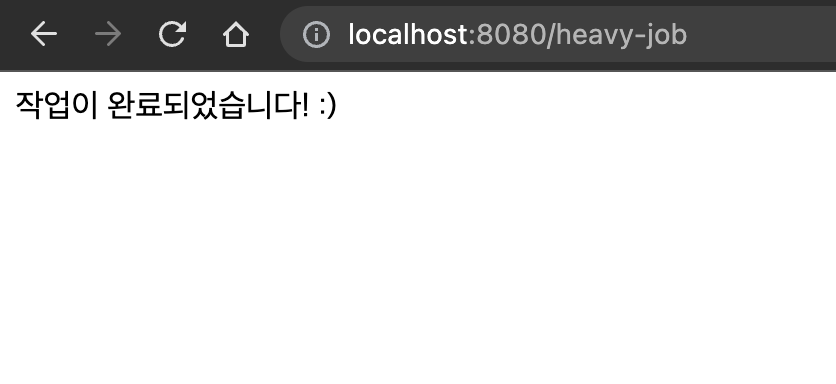
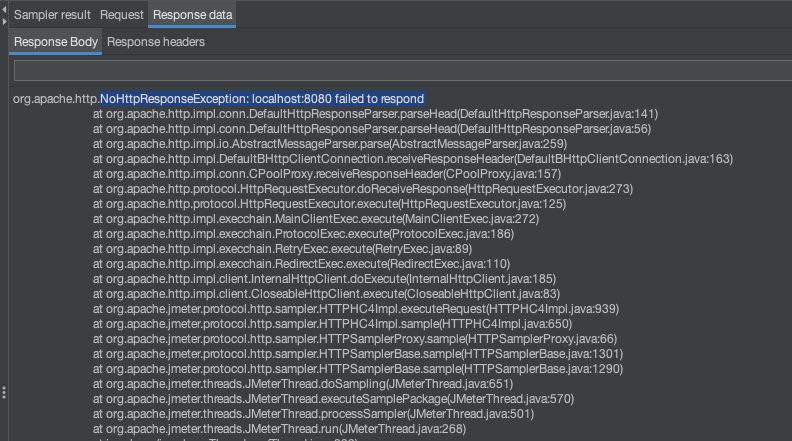
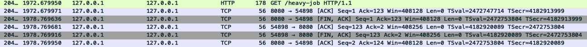
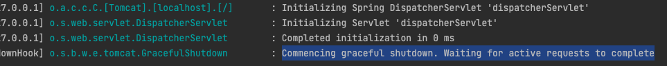
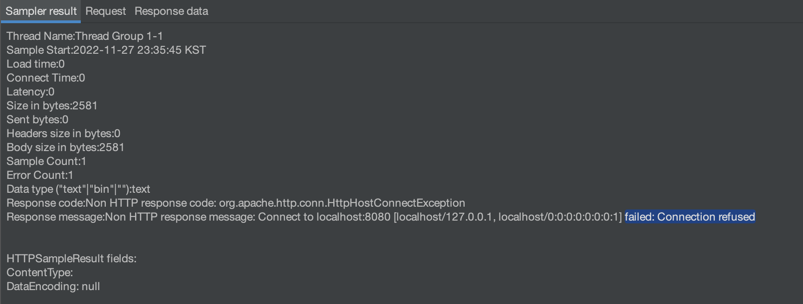

이전 포스팅인 **[무중단 배포 중 구버전 프로세스를 그냥 종료해도 괜찮을까? (feat. Kill, Graceful Shutdown)](https://hudi.blog/how-to-gracefully-zero-downtime-deploy/)** 에서 스프링부트의 Graceful Shutdown에 대해서 간단히 다루어보았다. 이 내용을 조금 더 자세히 다루어보려고 한다.

## Graceful Shutdown 이 없다면?

일단 처리 속도가 굉장히 느린 API를 하나 만들자. 단순하게 요청이 들어오면 Thread Sleep 하여 20초를 기다리고 응답하는 API이다.

```java
@RestController
@RequestMapping("/heavy-job")
public class HeavyJobController {

    @GetMapping
    public String startHeavyJob() throws InterruptedException {
        Thread.sleep(20_000);
        return "작업이 완료되었습니다! :)";
    }
}
```

위 엔드포인트에 접속해 20초간 기다리면 아래와 같이 ‘작업이 완료되었습니다! :)’ 라는 응답을 성공적으로 받게된다.



그렇다면, 응답을 받기 전에 서버 프로세스를 종료해버리면 어떤 일이 발생할까? 이번에는 한번 서버가 요청을 처리중인데 프로세스를 종료해본다. 이때, 프로세스에게 보내는 시그널은 IntelliJ의 Stop 버튼을 눌렀을 때 보내지는 `SIGINT` 이다.

> 참고로 `SIGINT` 와 `SIGTERM` 은 정상 종료, `SIGKILL` 은 강제 종료 시그널이다. `SIGINT` 와 `SIGTERM` 은 둘다 정상 종료지만, `SIGINT` 는 우리가 Ctrl + C를 눌렀을 때 발생하는 시그널이다.
> 



위와 같이 적절한 HTTP 응답을 받지 못하여 에러가 발생하는 것을 확인할 수 있다. 



Wireshark로 패킷을 캡처하여 분석해보았다. 클라이언트가 서버로 HTTP 요청을 하였지만, 서버가 중간에 종료되어 적절한 HTTP 응답을 받지 못한채 TCP 4-Way Handshake가 진행되고 TCP 커넥션이 종료된 것을 확인할 수 있다. `SIGKILL` 로 프로세스를 죽이지 않았음에도 불구하고 비정상적으로 종료된 것이다.

## Graceful Shutdown

Graceful Shutdown은 SpringBoot 2.3 버전부터 제공하는 기능이다. 스프링부트의 내장 웹 서버 4개 (Tomcat, Jetty, Reactor Netty, Undertow)에서 모두 지원한다. 

Graceful Shutdown을 활성화 하면 스프링부트 애플리케이션이 `SIGTERM` 이나 `SIGINT` 와 같은 정상 종료 시그널을 받았을 때 곧바로 애플리케이션 프로세스를 종료하지 않는다. **추가적으로 요청이 들어오는 것을 거부하고, 기존에 처리중인 요청이 있다면 해당 요청을 모두 처리를 완료한 다음 프로세스를 종료**한다.

추가적으로 요청이 들어오는 것을 거부하는 방법은 웹 서버마다 조금 다르다. Tomcat, Jetty, Reactor Netty는 아예 네트워크 계층에서 새로운 연결이 맺어지는 것을 거부한다. 반면 Undertow의 경우 요청을 받되, 곧바로 503 Service Unavailable 으로 응답한다.

## 직접 적용해보기

그리고 Graceful Shutdown을 활성화해준다. 방법은 간단하다. `application.yaml` 에서 아래와 같이 설정을 추가만 해주면 된다.

```yaml
server:
  shutdown:graceful
```

위 설정을 적용하고 애플리케이션을 실행해보자. 그리고 다시 한번 `/heavy-job` 엔드포인트에 접속한 뒤, 작업이 처리되는 도중 애플리케이션을 종료해보자. 그렇다면, 아래와 같이 **‘Commencing graceful shutdown. Waiting for active requests to complete’** 라는 로그가 출력되며, 현재 진행중인 요청이 모두 처리될 때 까지 기다린다.



이때 또 다시 `/heavy-job` 엔드포인트에 접속해보자. 



그렇다면, 위와 같이 **‘Connection refused’** 가 발생하며, 접속이 거부될 것이다. 즉, Graceful Shutdown 이 실행된 이후의 새로운 요청은 거부하고 있는 것이다.


실제로 Wireshark로 패킷을 캡처해보니 서버가 클라이언트에게 RST 플래그를 전송하는 것을 확인할 수 있다. **RST 플래그는 비정상적인 상황에서 연결을 중단함을 알리는 TCP 제어 플래그**이다. (내장 웹 서버는 톰캣을 사용하고 있다.)

## 타임아웃 적용하기

그런데 만약 현재 진행중인 요청이 데드락에 빠져 영원히 작업을 끝내지 못하는 상황이라면 어떨까? Graceful Shutdown 과정이 끝나지 않고 영원히 프로세스가 종료되지 않을 것이다. 이런 상황을 방지하기 위해 아래와 같이 우리는 타임아웃을 설정할 수 있다. 

```yaml
spring:
  lifecycle:
    timeout-per-shutdown-phase: "20s"
```

위 설정을 `application.yaml` 에 적용해주면 된다.

## 참고

- [https://docs.spring.io/spring-boot/docs/current/reference/html/web.html#web.graceful-shutdown](https://docs.spring.io/spring-boot/docs/current/reference/html/web.html#web.graceful-shutdown)
- [https://www.pico.net/kb/what-is-a-tcp-connection-refused/](https://www.pico.net/kb/what-is-a-tcp-connection-refused/)
- [https://effectivesquid.tistory.com/entry/JVM의-종료와-Graceful-Shutdown](https://effectivesquid.tistory.com/entry/JVM%EC%9D%98-%EC%A2%85%EB%A3%8C%EC%99%80-Graceful-Shutdown)