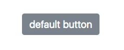
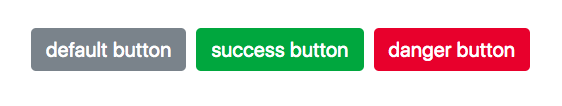
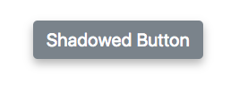
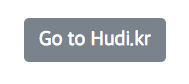
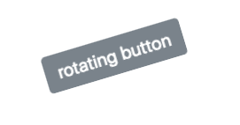
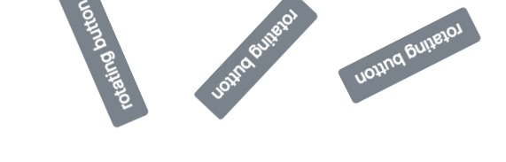
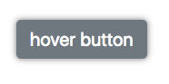
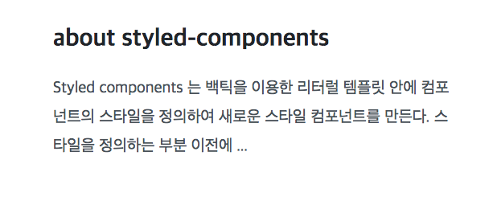
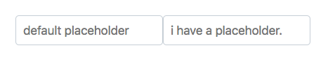

우리는 React 에서 컴포넌트에 스타일링을 하기 위해서, 외부에 CSS 파일을 작성했다. 그리고 아마도 Webpack 의 css-loader 를 사용하여, 다음과 같이 CSS 파일을 불러왔을 것이다.

```js
import "./foo.css"
```

물론, 이 방법이 나쁘다는 것은 아니다. 하지만 외부에 CSS 파일을 만들어서 불러오는 과거의 방법은 몇가지 불편한 점이 있다. 일단 첫번째로 **CSS 의 Class 가 중복** 될 수 있는 점이다. CSS 파일을 분리하고, 컴포넌트 별로 따로 불러와도 결국 여러 파일이 번들링 되기 때문에 Class 는 전역으로 작동한다. 신경쓰지 않으면, 스타일이 겹쳐버릴 수 있다. 그렇기 때문에 우리는 접두사를 만들거나, 부모클래스를 명시하는 등의 불편한 방식으로 해결해왔다.

```js
.Card-title { /* ... */ }
/* 접두사를 붙이거나 */

.Card .title { /* ... */ }
/* 부모 클래스를 명시한다 */
```

이런 문제들을 어느정도 해결하기 위해 SASS 를 설치할 수도 있다. 하지만, node-sass, sass-loader 등 여러가지 모듈의 설치가 필요하고, 특히 Webpack config 를 수정해야하기 때문에 CRA (Create-React-App) 으로 프로젝트를 생성했다면, Eject 하는 작업도 필요하다.

상황에 따라 컴포넌트의 클래스를 바꾸기 위해 컴포넌트 className 내부에 삼항 연산자를 사용하기도 했었다.

```jsx
/* ... */

<button className={this.props.danger ? "button button-danger" : "button"}>
  Danger button
</button>

/* ... */
```

컴포넌트의 스타일을 변경하기 위해 JSX 내부에서 직접 스타일에 관한 로직을 처리하는 모습이다.

우리가 어떤 컴포넌트를 만들어야한다는 상황을 가정하여, 기존 CSS 방식의 스타일링의 불편함과 Styled components 가 어떤 방법으로 문제를 해결해 주는지 알아보자.

## Why use Styled Components?

하나 가정을 해보자. 우리는 색상이 Prop 을 통해 관리되는 새로운 버튼 컴포넌트를 제작해야한다. 색상은 Default 색상 (회색), Success 색상 (초록색), Danger 색상 (빨간색) 3가지로 설정할 수 있다.

일단 기존의 CSS 파일을 작성하는 방법으로 코딩해보자. App.js 에서 다음과 같이 button 엘리먼트를 추가한다. 단, 스타일 적용을 위해 class를 button 으로 설정한다.

**App.js**

```jsx
import React, { Component } from "react"
import "./Button.css"

class App extends Component {
  render() {
    return (
      <div>
        <button className="button"> default button </button>
      </div>
    )
  }
}

export default App
```

그리고 Button.css 라는 파일 하나를 만들고, 다음과 같이 기본적인 스타일링을 하자.

**Button.css**

```css
.button {
  padding: 10px 15px;
  margin: 0 5px;
  border: none;
  border-radius: 5px;
  background-color: #7b838b;
  color: #ffffff;
  font-size: 15pt;
}
```

부트스트랩 느낌의 간단한 회색 버튼 하나가 만들어졌다. 이제 우리는 저 button 엘리먼트를 따로 컴포넌트로 분리시키고, 색상에 관한 Prop 을 받아오게 설계할 것이다. 일단, Success, Danger 버튼별로 클래스를 추가하자.

**Button.css**

```css
/* ... */

.button-success {
  background-color: #249d3d;
}

.button-danger {
  background-color: #d72e3d;
}
```



그리고 다음과 같이 App.js 를 수정한다.

**App.js**

```jsx
import React, { Component } from "react"
import "./Button.css"

class App extends Component {
  render() {
    return (
      <div>
        <Button> default button </Button>
        <Button success> success button </Button>
        <Button danger> danger button </Button>
      </div>
    )
  }
}

const Button = ({ children, success, danger }) => (
  <button
    className={
      success
        ? "button button-success"
        : danger
        ? "button button-danger"
        : "button"
    }
  >
    {children}
  </button>
)

export default App
```

> Button 컴포넌트는 Prop 으로 children 을 받아오는데, 이 Prop 에는 컴포넌트의 여는 태그와 닫는 태그 사이의 요소들이 담겨 있다.



success 와 danger 를 Prop 으로 받아와서 JSX 내부에서 복잡한 삼항 연산자를 사용하여, 조건별로 다른 클래스를 나타내는 모습을 볼 수 있다. 위의 예제는 구조가 단순해서 if 문을 사용하여 처리할 수도 있겠지만, 컴포넌트가 조금만 더 복잡해진다면, 그런 방법은 결코 좋은 해결방법이 될 수 없다.

그렇다면, Styled-components 는 어떤 방식으로 이런 문제를 해결해줄까?

## Hello Styled Component

이제 한번 Styled components 를 사용하여, 위의 컴포넌트를 다시 만들어보자. 우린 이제 더이상 CSS 파일이 필요 없으니 CSS 파일과 CSS를 import 하는 코드를 지우자. 그 대신 styled-components 를 설치하자.

```bash
yarn add styled-components
```

그리고 기본 버튼 컴포넌트를 Styled components 방식으로 만들어보자.

```jsx
import React, { Component } from "react"
import styled from "styled-components"
// Styled components 추가

class App extends Component {
  render() {
    return (
      <div>
        <Button> default button </Button>
      </div>
    )
  }
}

const Button = styled.button`
  padding: 10px 15px;
  margin: 0 5px;
  border: none;
  border-radius: 5px;
  background-color: #7b838b;
  color: #ffffff;
  font-size: 15pt;
`

export default App
```

Styled components 는 백틱 (`) 을 이용한 리터럴 템플릿 안에 컴포넌트의 스타일을 정의하여 새로운 스타일 컴포넌트를 만든다. 스타일을 정의하는 부분 이전에는 HTML Element 를 명시해준다. 우리가 위에서 작성해준 Button 컴포넌트는 템플릿 리터럴 안의 CSS 스타일이 적용된 button 엘리먼트이다. 처음에는 이런 문법이 이상하다 생각될 수 있다.

> 리터럴 템플릿이 무엇인지 모른다면, ['ES6 문법으로 다시 시작하는 자바스크립트'](/restart-js-with-es6/) 를 읽고오자.

이제 Prop 에 따라 버튼의 색상을 변경해야한다. 다음과 같이 소스코드를 변경해보자.

```jsx
import React, { Component } from "react"
import styled from "styled-components"

class App extends Component {
  render() {
    return (
      <div>
        <Button> default button </Button>
        <Button success> success button </Button>
        <Button danger> danger button </Button>
      </div>
    )
  }
}

const Button = styled.button`
  padding: 10px 15px;
  margin: 0 5px;
  border: none;
  border-radius: 5px;
  background-color: ${props => {
    if (props.success) return "#249D3D"
    else if (props.danger) return "#D72E3D"
    else return "#7B838B"
  }};
  color: #ffffff;
  font-size: 15pt;
`

export default App
```

놀랍게도 스타일 내부에서 Prop 에 따라 다른 값을 반환하는 로직을 처리한다.

Styled components 는 기본적으로 no-class 철학을 따른다. 스타일을 외부 CSS 파일에 분리시키지 않고, 컴포넌트 내부에 정의하기 때문에, Global 하게 영향을 끼치는 Class를 사용하지 않아도 된다. (사실 굳이 필요하다면, SASS 문법을 사용하여 과거의 방식처럼 Class를 사용할 수 있다) 또한, CSS 파일을 사용하지 않기 때문에 놀랍게도 React Native 와도 스타일 공유가 가능해진다.

Styled components 의 개념에 대해 알아보았으니, styled components 에서 지원하는 여러가지 유용한 기능들을 알아보자.

## 글로벌 스타일 (injectGlobal)

Styled components 를 사용하면, 해당 컴포넌트에만 스타일이 적용된다. 하지만, Body 의 margin 이나 background-color 와 같이 Global 하게 적용되야할 스타일이 있다면? inject Global 을 사용한다.

```jsx
/* ... */

import styled, { injectGlobal } from "styled-components"

injectGlobal`
  body {
    margin: 0; background-color: #F7F7F7;
  }
`

/* ... */
```

## 상속 (Extend)

객체지향에서의 상속 개념과 같이, 원래 존재하는 스타일 컴포넌트의 스타일을 새로운 컴포넌트에 상속하고 싶을 때가 있다. 그때 Extend 를 사용한다. 기존 Button 컴포넌트를 확장(Extend) 하여 그림자가 있는 버튼을 새로 만들어보자.

```jsx
/* ... */

render() {
  return(
    <div>
      <ShadowedButton> Shadowed Button </ShadowedButton>
    </div>
  );
}

/* ... */

const ShadowedButton = Button.extend`
  box-shadow: 0px 5px 15px rgba(0, 0, 0, .3);
`;

/* ... */
```



흔한 상황은 아니지만, 확장을 하면서 다른 컴포넌트나 태그로 변경하고 싶을 경우가 있다. 예시로 Button 컴포넌트를 a 태그로 변경하면서 LinkButton 이라는 컴포넌트로 확장해보겠다.

```jsx
/* ... */

render() {
  return(
    <div>
      <LinkButton href='https://hudi.kr'>
        Go to Hudi.kr
      </LinkButton>
    </div>
  );
}

/* ... */

const LinkButton = Button.withComponent('a');

/* ... */
```


a 태그에 Button 컴포넌트의 스타일이 적용된 모습을 확인 할 수있다. 하지만, a 태그는 밑줄 등의 독자적인 스타일을 가지고 있다. 다음과 같이 extend 를 사용하여 해결할 수 있다.

```jsx
const LinkButton = Button.withComponent("a").extend`
  text-decoration: none;
`
```



## 애니메이션 (Animation)

CSS Animation 도 객체를 만들어서 스타일 컴포넌트에 적용할 수 있다. 360도 회전하는 RotatingButton 을 만들어보자.

```jsx
import styled, { keyframes } from 'styled-components';

/* ... */

render() {
  return(
    <div>
      <RotatingButton> rotating button </RotatingButton>
    </div>
  );
}

/* ... */

const rotation = keyframes`
  from {
    transform: rotate(0deg);
  }
  to {
    transform: rotate(360deg);
  }
`;

const RotatingButton = Button.extend`
  animation: ${rotation} 5s linear infinite;
`

/* ... */
```



keyframes 를 사용하여, 키프레임 객체를 생성하고, CSS 에서 애니메이션을 사용하듯 추가해주면 된다. 조금 응용해서 회전 주기를 Prop 으로 받아오는 기능도 구현해보자.

```jsx
/* ... */

render() {
  return(
    <div>
      <RotatingButton duration="10"> rotating button </RotatingButton>
      <RotatingButton duration="5"> rotating button </RotatingButton>
      <RotatingButton> rotating button </RotatingButton>
    </div>
  );
}

/* ... */

const RotatingButton = Button.extend`
  animation: ${rotation} ${props => (props.duration ? props.duration : 2)}s linear infinite;
`

/* ... */
```



duration 이라는 Prop 을 받아와서 1회 회전하는 시간을 조절할 수 있게 되었다. 삼항연산자로 duration Prop 이 주어지지 않았을때는 기본 값인 2초로 설정된다.

## Mixin

Mixin 은 쉽게 말하면 CSS의 코드블럭 객체를 만들어 재사용 가능하게 하는 방법이다. Mixin 을 사용하여, Hover 시 그림자가 생기는 HoverButton 을 만들어보자.

```jsx
import styled, { css } from 'styled-components';

/* ... */

render() {
  return(
    <div>
      <HoverButton> hover button </HoverButton>
    </div>
  );
}

/* ... */

const hoverShadow = css`
  &:hover {
    box-shadow: 0 0 10px rgba(0, 0, 0, .5);
  }
`;

const HoverButton = Button.extend`
  ${hoverShadow}
`

/* ... */
```

여기서 사용된 & 은 SASS 문법중 하나로, 부모 선택자를 레퍼런스 할때 사용된다. 여기서 부모는 HoverButton 가 된다.



외부에 재사용 가능성이 있는 CSS 코드를 객체로 분리하고, 여러 컴포넌트에서 재사용할 수 있다.

## 테마 (Theme)

Styled-Components 에도 Redux 와 같은 기능이 존재한다. Redux 는 여러 컴포넌트에서 공유되는 state 를 관리한다면, Theme 은 여러 컴포넌트가 동일한 CSS value 를 공유할 수 있게 해준다.

일단 theme.js 파일을 새로 만든다. 그리고 이 테마파일에 버튼에 적용되어 있는 default color, success color, danger color 를 테마로 정의할 것이다.

**theme.js**

```js
const theme = {
  defaultColor: "#868e96",
  successColor: "#249D3D",
  dangerColor: "#D72E3D",
}

export default theme
```

테마를 불러오고 적용하기만 하면된다. Redux 의 Provider 처럼 ThemeProvider 를 사용하여 테마를 사용한다.

**App.js**

```jsx
/* ... */
import styled, { ThemeProvider } from "styled-components"
import theme from "./theme"

class App extends Component {
  render() {
    return (
      <ThemeProvider theme={theme}>
        <div>
          <Button> default button </Button>
          <Button success> success button </Button>
          <Button danger> danger button </Button>
        </div>
      </ThemeProvider>
    )
  }
}

const Button = styled.button`
  padding: 10px 15px;
  margin: 0 5px;
  border: none;
  border-radius: 5px;
  background-color: ${props => {
    if (props.success) return theme.successColor
    //#249D3D
    else if (props.danger) return theme.dangerColor
    //#D72E3D
    else return theme.defaultColor //#868e96
  }};
  color: #ffffff;
  font-size: 15pt;
`

export default App
```


JSX 의 최상위 레벨을 ThemeProvider 로 묶어주고, 작성한 테마 모듈을 theme prop 으로 넣어준다. 하단의 Button 스타일 컴포넌트를 보면 theme.successColor 처럼 우리가 정의해놓은 테마를 사용하는 모습을 볼 수 있다.

야간모드, 색약모드, 커스텀 테마 등을 구현할 때 아주 유용하게 사용되는 기능이다.

다른 컴포넌트 참조 (Referring to other components)
다른 스타일 컴포넌트를 선택하기 위한 레퍼런스가 필요할 수 있다. SASS 와 같은 문법으로 다음과 같이 사용된다.

```jsx
/* ... */

render() {
  return(
    <Container>
      <Header> about styled-components </Header>
      <Paragraph>
        Styled components 는 백틱을 이용한 리터럴 템플릿 안에 컴포넌트의 스타일을
        정의하여 새로운 스타일 컴포넌트를 만든다. 스타일을 정의하는 부분 이전에 ...
      </Paragraph>
    </Container>
  );
}

/* ... */

const Container = styled.div`
  margin: 0 auto; width: 500px;
  ${Paragraph} {
    font-size: 15pt; line-height: 180%;
  }
`;

const Header = styled.h2`
  color: #212529;
`;

const Paragraph = styled.p`
  color: #495057;
`;

/* ... */
```



스타일 컴포넌트 Container 에서 외부 스타일 컴포넌트인 Paragraph 를 참조하여 새로운 스타일을 적용한것을 볼 수 있다.

추가적인 속성 (Additional Attributes)
만약 input 엘리먼트에 기본 placeholder 를 적용하고 싶다면 어떻게 해야할까? attrs 를 사용하여 styled element 에 custom attributes 를 적용할 수 있다.

```jsx
/* ... */

render() {
  return(
    <div>
      <Input />
      <Input placeholder="i have a placeholder." />
    </div>
  );
}

/* ... */

const Input = styled.input.attrs({
  placeholder: "default placeholder"
})`
  border: 1px solid #C7CED5;
  border-radius: 5px;
  padding: 10px;
  font-size: 13pt;
`;

/* ... */
```



## 마치며

필자도 처음 Styled components 를 접하고, 표준에도 어긋나는 것 같으면서 마크업과 스타일의 분리를 위해 등장한 CSS 를 왜 다시 컴포넌트로 합치는지 의문이었다. 하지만, 알면 알수록 강력한 styled components 의 기능에 흠뻑 빠져 앞으로의 프로젝트에서는 적극적으로 도입해볼 생각이다.
