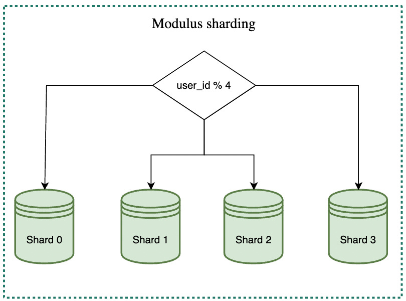
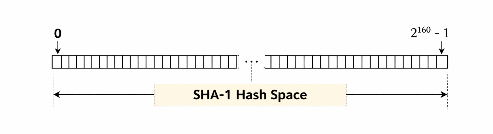
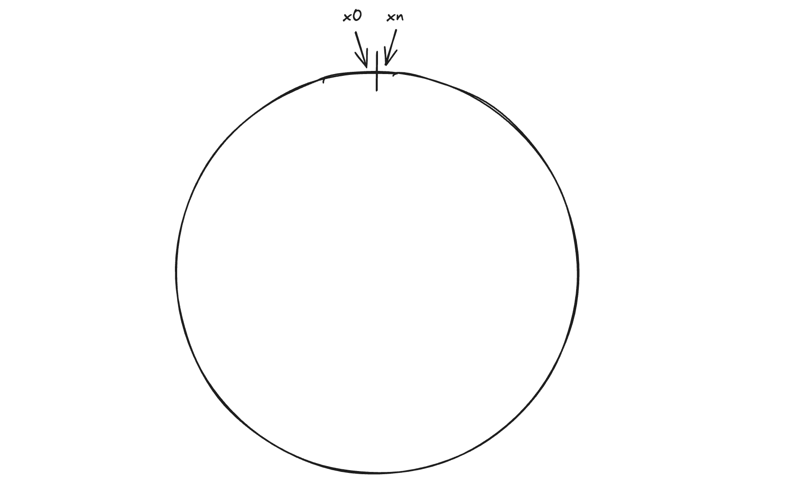
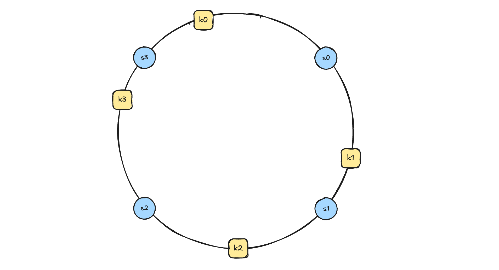
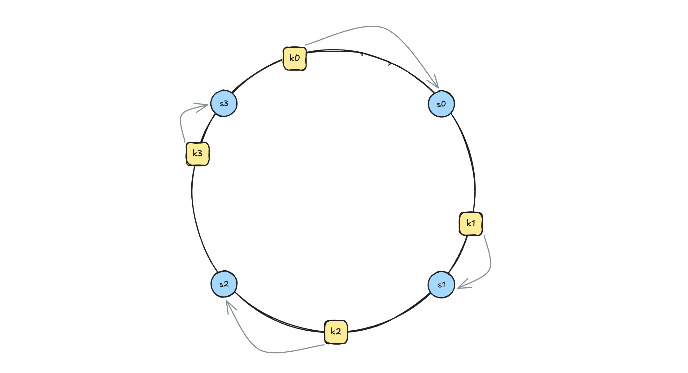
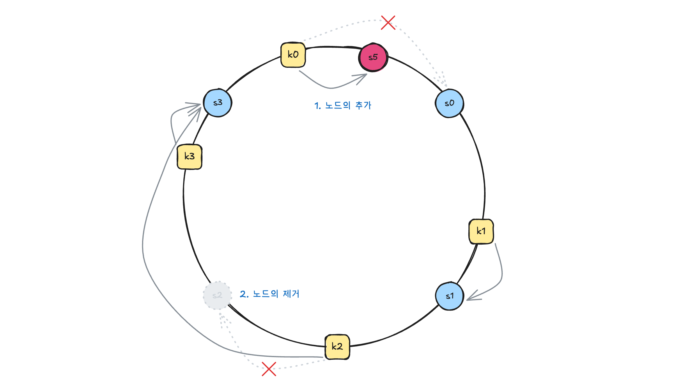
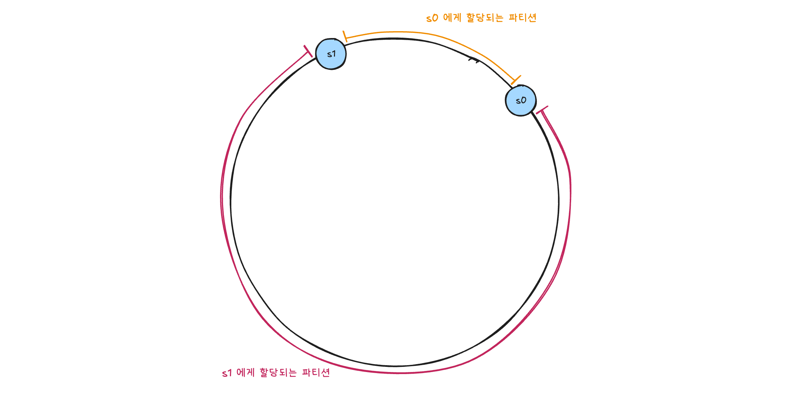
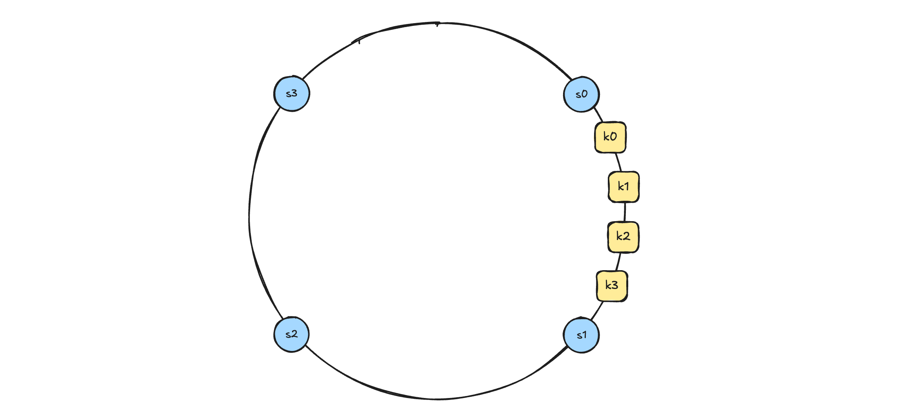
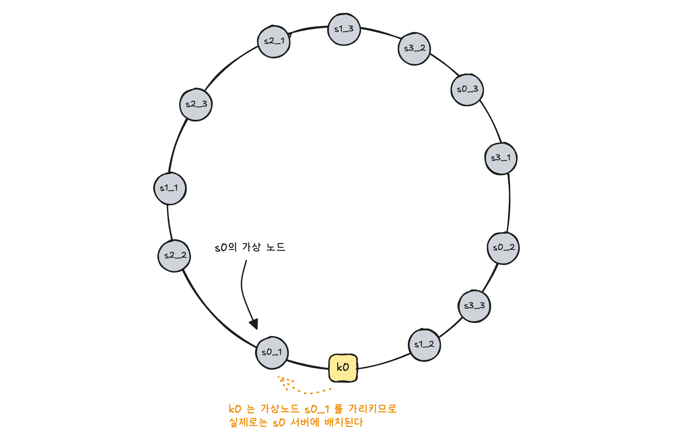

## 해결하고자 하는 문제 상황


데이터를 샤딩하는 상황을 생각해보자. 보편적으로 샤드키를 모듈로 연산하여 만들어낸 해시를 사용할 것이다. 예를 들자면, 노드가 총 N개인 상황에서 `nodeIndex = hash(key) % N` 와 같이 연산하여, 해당 데이터가 배치될 노드를 식별할 것이다. N이 고정된 상황에서는 문제가 없을 것이다.

문제는 N값이 변경되는 상황이다. 분산 시스템을 설계하는 입장에서는 시스템이 실패하는 상황까지 반드시 고려해야한다. 즉, 일부 노드가 실패해 N이 기존보다 작아질 수 있다. 물론 성능 향상을 위해 노드를 추가로 투입해 N이 커질수도 있다.

N값이 변경되면 어떤 문제가 발생할까? `hash(key) % N` 의 결과는 대부분 달라질 것이고, 대부분의 데이터의 노드를 재배치 해야하는 일이 발생할 것이다. 아래 표를 한번 보자.

| hash(key) | % 5 | % 4 | 변경 여부 |
| --------- | --- | --- | ----- |
| 11        | 1   | 3   | O     |
| 22        | 2   | 2   | X     |
| 33        | 3   | 1   | O     |
| 44        | 4   | 0   | O     |
| 55        | 0   | 3   | O     |
| 66        | 1   | 2   | O     |

N = 5 일때와 N = 4 일때, 하나의 데이터를 제외하고는 모두 노드 재배치가 발생한 것을 볼 수 있다. 이는 아래와 같은 큰비용을 낳는다.

- **대규모 데이터 이동 및 복제 비용 발생**
- **(캐시라면) 대규모 캐시 미스 발생**

즉, 한마디로 노드가 추가/삭제 되었을 때 불필요하게 대부분의 키를 재배치 하게 되는 문제가 발생하는 것이다. 이번 포스팅에서 알아볼 **안정 해시 (Consistent Hash)** 는 **노드가 추가/삭제** 되었을 때, **일부 키만 이동**하도록 만들어 **재샤딩 비용과 대규모 캐시 미스 문제를 해결**하기 위한 방법 중 하나이다.

## 안정 해시 (Consistent Hash)
안정 해시는 위와 다르게, 노드가 추가/삭제 되었을 때 **평균적으로** $k/n$ **개의 키만 재배치**하는 기술이다 (이때, $k$ 는 키의 개수, $n$ 은 노드 수).

### 해시 링 (Hash Ring)
해시 링은 안정 해시에서 사용되는 핵심 자료구조이다. 해시 링을 이해하기 위해서는 먼저 **해시 공간 (Hash Space)** 에 대해 이해하고 넘어가야한다. 해시 함수로 SHA-1 을 사용한다면, SHA-1 에 임의 데이터를 입력한다면 출력값 범위는 0부터 $2^{160} -1$ 이다. 이 범위가 SHA-1 해시 함수의 해시 공간이라고 할 수 있다. 좀 더 일반화 하자면, 해시 공간은 해시 함수의 출력값 범위인 `x0` 부터 `xn` 까지의 범위를 말한다고 할 수 있다.



이제 해시 공간을 둥글게 말아 양 끝이 만나는 모양으로 만들어보자. 아래와 같이 해시 공간의 양 끝인 `x0` 와 `xn` 가 만나는 원형 모양이 만들어진다. 이를 **해시 링 (Hash Ring)** 이라고 한다.



### 해시 링 위에 서버와 키 배치하기
자, 이제 이 준비된 해시 링 위에 서버를 배치할 것이다. 해시 함수를 사용하여 서버를 해싱한 값에 해당하는 해시 링 위치에 서버를 배치한다. 

```kotlin
serverHash = hash(nodeId)
```

그리고 이어서 키(Key)도 링 위에 배치해보자. 마찬가지로 아래와 같이 해시 함수를 사용하여 반환된 값에 해당하는 해시 링 위치에 키를 배치한다.

```kotlin
keyHash = hash(key)
```



그럼 이런 형태로 서버(`s0` ~ `s3`)와 키(`k0` ~ `k3`) 가 해시 링 위에 배치된 모습을 상상해볼 수 있다. 그렇다면 키는 어떤 서버에 배치되는 것일까? 



키는 자신으로부터 시계 방향으로 링을 탐색해 나가면서 만나는 첫번째 서버에 저장된다. 즉, 위 그림처럼 `k0` -> `s0` , `k1` -> `s1` , `k2` -> `s2` , `k3` -> `s3` 와 같이 키가 배치되는 것이다.

### 서버가 추가/제거 되었을 때



이렇게 해시 링 위에 서버와 키를 배치하고, 각 키는 시계방향으로 탐색해서 처음 마주하게 되는 서버에 배치하면 어떤 점이 유리할까? 위 그림처럼 해시 링 위에서 **(1) 노드가 추가되거나 (2) 노드가 제거될 때**, 해당 노드와 연관된 **최소한의 키만 재배치** 된다는 점이다. 

위 그림처럼 `s5` 서버가 추가되더라도 기존에 `s0` 에 배치된 `k0` 만 재배치 되었고, `s2` 서버가 제거되더라도 기존에 `s2` 에 배치된 `k2` 키만 `s3` 로 재배치 되었다. 나머지 `k1` 과 `k3` 키는 재배치 없이 그대로 유지된 모습을 확인할 수 있다.

## 한계와 보완

위 설계에는 2가지 한계점이 있다.

1. **파티션 크기가 균등하지 않다.**
2. **키의 분포가 균등하지 않다.**

이 문제를 하나씩 살펴보자.

### 한계점 1. 파티션 크기가 분등하지 않다


**파티션이란 인접한 서버 사이의 해시 공간**을 의미한다. 해시 링 위에 서버를 배치하는 것은 서버 식별자의 해시값 기준으로 수행되기 때문에, 위와 같이 **파티션 크기의 불균등**이 발생할 수 있다. 위 상황에서는 `s0` 에 배치되는 키보다 `s1` 에 배치되는 키의 수가 훨씬 많을 것이다. 즉 `s1` 의 부하가 훨씬 클 것이다.

### 한계점 2. 키의 분포가 균등하지 않다


파티션 크기만 균등하다고 문제가 해결되지는 않는다. 해시 링 위의 키 위치 또한 해시값 기준으로 배치되기 때문에, 위와 같이 해시 공간의 한쪽으로 키 위치가 쏠리게 된다면, 특정 서버가 부하를 과도하게 부담할 수 있다. 위의 경우에는 `s1` 이 모든 부하를 감당하게 될 것이다.
### 보완 : 가상 노드 (Virtual Node) 도입
이 문제를 해결하기 위해 가상 노드를 도입할 수 있다. **가상 노드란 실제 노드를 가리키는 노드**이다. 일종의 원본 노드에 대한 심볼릭 링크라고 생각하면 이해가 쉬울 것이다. 만일 특정 키가 실제 노드가 아닌 가상 노드를 가리키게 된다면, 그 키는 **실제로는 가상 노드가 가리키는 원본 서버에 배치**된다. 예를 들어, 아래 그림에서 `s0_1` 은 실제로는 `s0` 를 가리키는 가상 노드이며, `k0` 이 `s0_1` 가상 노드에 배치되었으므로, 실제로는 `s0` 서버에 배치되는 것이다.



이런 가상 노드를 무수히 늘리게 되면, 앞서 살펴본 파티션 크기와 키의 분포의 불균등을 해소할 수 있는데, 그 원리는 아래와 같다.

1. 가상 노드를 도입하기 이전에는 하나의 노드가 하나의 큰 파티션을 담당했지만, 가상 노드를 도입하면 여러개의 노드가 작은 파티션 구간 여러곳을 분산하여 담당하게 된다.
2. 그 결과 각 가상 노드가 담당하는 파티션 크기의 분산이 줄어들게 되며, 키 분포의 편차도 평균화된다.
3. 즉, **노드 별 담당 파티션과 노드별 키 개수의 표준 편차가 작아져, 데이터가 고르게 분포**된다.

단, 이는 Trade-off 인데, **가상 노드의 개수가 늘어날수록 표준 편차는 줄어들 수 있으나, 그만큼 가상 노드를 저장할 공간이 더 많이 필요하게 되기 때문**이다.

## References
- 가상 면접 사례로 배우는 대규모 시스템 설계 기초