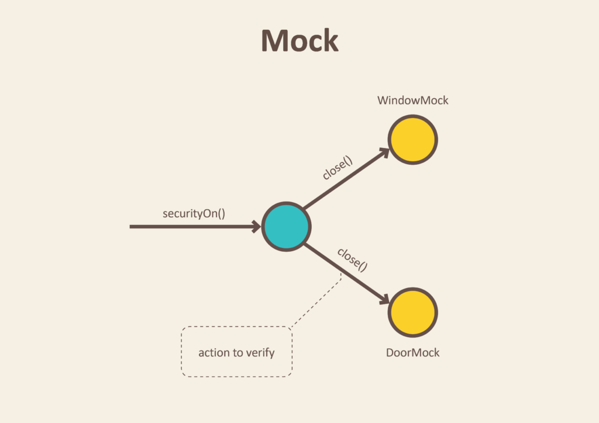

## 테스트 더블 (Test Double)

테스트 더블은 영화를 촬영할 때 배우를 대신하여 위험한 역할을 하는 **스턴트 더블(Stunt Double)**이라는 용어에서 유래된 단어이다.


자동화된 테스트를 작성할 때, 여러 객체들이 의존성을 갖는 경우 테스트 하기 까다로운 경우가 있다. 예를 들어서 프로덕션 코드에서 Service Layer는 Dao에 직접적으로 의존하고, 따라서 Database 까지 의존하는 형태를 갖는다.


의존 관계가 간단한 경우 테스트 대상과 의존하고 있는 대상을 함께 테스트할 수 있다. 이를 **Sociable Test** 라고 한다. Sociable Test 에서 우리가 테스트할 Service 객체는 실제 동작하는 Dao 객체를 통해 데이터베이스에 액세스할 수 있다.

하지만 테스트 대상이 아닌 의존 대상의 결함으로 테스트가 실패하는 경우가 발생할 수 있다. 의존 대상으로 인해 테스트가 실패하는 것을 막기 위해 의존 대상 대신 **실제 동작하는 것 처럼 보이는 별개의 객체**를 만드는 것을 고려할 수 있을 것 이다. 이 방식을 **Solitary Test** 라고 하며, 이때 만드는 별개의 객체를 **테스트 더블 (Test Double)** 이라고 한다. 즉, 테스트 코드에서 Service가 데이터베이스를 실제로 조작하는 Dao 대신에 가짜 Dao를 사용하게 만드는 것 이라고 할 수 있다.

즉, 테스트 더블은 테스트하고자 하는 대상만 독립적으로 테스트할 수 있도록 별개로 구현한 실제 객체보다 단순한 객체를 의미한다. 테스트 대상을 **SUT(System Under Test)**라고하고, SUT가 의존하고 있는 구성요소를 **DOC(Depended-on Component)** 라고 하는데, 테스트 더블은 이 DOC와 동일한 API를 제공한다.

## 테스트 더블의 종류

테스트 더블도 테스트에서 수행하는 역할에 따라 많은 종류로 나뉜다. 대표적으로는 **Dummy, Fake, Stub, Spy, Mock** 이 5가지로 크게 분류된다. 각각의 특징을 간단하게 알아보자.

### Dummy

Dummy는 아무런 동작도 하지 않는다. 인스턴스화된 객체만 필요하고, 기능까지는 필요하지 않은 경우 Dummy를 사용한다. 주로 파라미터로 전달되기 위해 사용된다.

예를 들어 로깅을 하는 객체는 테스트에서는 사용되지 않을 수 있다. 그렇다면 아래와 같이 아무런 행위를 가지지 않은 Dummy 를 만들어볼 수 있을 것 이다.

```java
public interface Logger {
    void log();
}
```

```java
public class LoggerDummy implements Logger {
    @Override
    public void log() {

    }
}
```

### Fake


Fake는 실제 동작하는 구현을 가지고 있지만, 프로덕션에서는 사용되기 적합하지 않은 객체이다.

예를 들어 위 그림처럼 `LoginService` 가 실제 프로덕션에서는 `AccountDao` 에 의존하여 데이터베이스를 사용하고 있다. 하지만 테스트코드에서는 데이터베이스 대신 `HashMap` 을 사용하는 `FakeAccountDao` 를 대신 `LoginService` 에 주입하여, 데이터베이스와 연결을 끊고 테스트할 수 있다.

Fake는 우아한테크코스 레벨2 스프링 체스 미션에서 `BoardDao` 를 대신하기 위해 만든적이 있다. `BoardDao` 는 아래처럼 `JdbcTemplate` 을 사용하여 데이터베이스에 접근하는 객체이다.

```java
public class JdbcBoardDao implements BoardDao {

    // ...

    @Override
    public void createPiece(RoomId roomId, Position position, Piece piece) {
        String query = String.format(
                "INSERT INTO %s(room_id, x_axis, y_axis, piece_type, piece_color) VALUES(?, ?, ?, ?, ?)",
                TABLE_NAME);
        jdbcTemplate.update(query, roomId.getValue(), position.getXAxis().getValueAsString(),
                position.getYAxis().getValueAsString(), piece.getPieceType().name(), piece.getPieceColor().name());
    }

    // ...
```

아래는 `BoardDaoFake` 의 소스코드이다. 데이터베이스를 흉내내기 위해 `HashMap` 을 사용하였다.

```java
public class BoardDaoFake implements BoardDao {
    private final Map<Position, Piece> fakeBoard = new HashMap<>();

    // ...

    @Override
    public void createPiece(RoomId roomId, Position position, Piece piece) {
        fakeBoard.put(position, piece);
    }

    // ...
```

### Stub


Stub은 Dummy가 마치 실제로 동작하는 것 처럼 보이게 만든 객체이다. 미리 반환할 데이터가 정의되어 있으며, 메소드를 호출하였을 경우 그것을 그대로 반환하는 역할만 수행한다.

우아한테크코스 레벨1 첫번째 미션인 자동차 경주 미션에서 랜덤을 사용하는 객체를 테스트하기 위해 아래와 같이 `RandomGeneratorStub` 을 사용했다.

```java
public class RandomGeneratorStub implements RandomGeneratable {
    private static final int[] randomNumbers = {2, 3, 4, 5};
    private int sequenceCursor = 0;

    public int generateNumber(int min, int max) {
        int currentNumber = randomNumbers[sequenceCursor % randomNumbers.length];
        sequenceCursor++;

        return currentNumber;
    }
}
```

`RandomGeneratorStub` 은 랜덤 숫자 생성을 흉내내지만 실제로 `generateNumber` 를 호출하게 되면, _2 ⇒ 3 ⇒ 4 ⇒ 5 ⇒ 2 ⇒ 3 ..._ 순서대로 숫자가 반환된다.

### Spy

실체 객체를 부분적으로 Stubbing 하면서 동시에 약간의 정보를 기록하는 객체이다. 기록하는 정보에는 메소드 호출 여부, 메소드 호출 횟수 등이 포함된다.

### Mock



**호출에 대한 기대를 명세할 수 있고, 그 명세 내용에 따라 동작하도록 프로그래밍된 객체**이다. Mock 외의 것은 개발자가 임의로 코드를 사용하여 생성할 수 있지만, Mock은 Mocking 라이브러리에 의해 동적으로 생성된다. 또한 설정에 따라 Mock은 충분히 Dummy, Stub, Spy 처럼 동작할 수 있다. **즉, 가장 강력한 테스트 더블이라고 할 수 있을 것 같다.**

아래는 우아한테크코스 레벨2 ATDD 지하철 노선도 미션에서 작성한 테스트코드 중 일부이다. 서비스 레이어인 LineService 를 테스트하기 위해 Mockito 라이브러리로 LineService 가 의존하고 있는 LineDao 를 Mocking 하여 호출에 대한 기대를 명세했다.

> Mockito는 Java 진영에서 널리 사용되는 Mocking 라이브러리이다.

```java
@DisplayName("새로운 노선을 등록한다.")
@Test
void createLine() {
    // ...

    given(lineDao.save(line)).willReturn(new Line(1L, lineName, lineColor));
    // 객체를 모킹하는 부분

    LineResponse actual = lineService.createLine(lineRequest);

    Assertions.assertAll(
            () -> assertThat(actual.getId()).isOne(),
            () -> assertThat(actual.getName()).isEqualTo(lineName),
            () -> assertThat(actual.getColor()).isEqualTo(lineColor)
    );
}
```

`LineDao` 객체의 `save()` 메소드를 mocking 하였고, 그에 따라 `LineService` 가 Mocking 된 `LineDao` 를 사용하는 것을 볼 수 있다.

## 테스트 더블의 경계


테스트 더블을 공부하면서 가장 혼란스러웠던 부분은 같은 개념을 많은 곳에서 다르게 혹은 모호하게 설명하고 있다는 점 이었다. 하지만 위 이미지의 출처인 마이크로소프트 문서에서는 여러 테스트 더블이 이론상 구별되는 것으로 보이지만, 실제로는 그 차이가 흐려진다고 말한다. **즉, 테스트 더블의 경계는 명확한 것이 아니므로 스펙트럼으로 바라봐야 바람직하다.**

> _Although these types seem distinct in theory, the differences become more blurred in practice. For that reason, I think it makes sense to think of test doubles as inhabiting a continuum, as illustrated in Figure 2. - MSDN Magazine -_

## 상태검증? 행위검증?

흔히 Stub은 상태검증을, Mock은 행위검증을 위해 사용한다고 한다. 하지만 아직 테스팅 경험도 적고, 이론적인 개념이 와닿지 않아서 이와 관련해서는 추후 공부해본 다음 따로 글을 작성해보려한다.

## 참고

- https://martinfowler.com/bliki/TestDouble.html
- https://codinghack.tistory.com/92
- https://martinfowler.com/articles/mocksArentStubs.html
- https://johngrib.github.io/wiki/test-terms/
- https://martinfowler.com/bliki/UnitTest.html
- https://docs.microsoft.com/en-us/archive/msdn-magazine/2007/september/unit-testing-exploring-the-continuum-of-test-doubles
