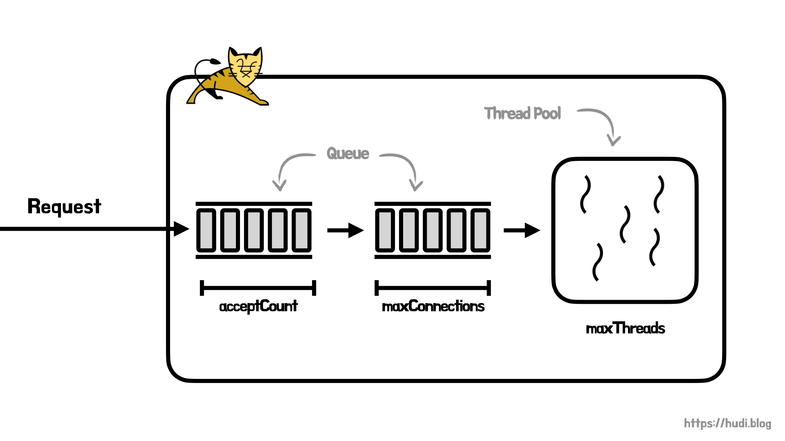

## 학습 배경

우아한테크코스 레벨4 Thread 활용하기 실습을 진행하며, 톰캣의 `acceptCount` , `maxConnections` , `maxThreads` 설정을 변경해보며 튜닝을 찍먹해보았다. 톰캣이 멀티 쓰레드 환경에서 여러 요청을 어떻게 다루는지 대략적으로 알아보자.

## maxConnections

서버가 허용하고 처리할 수 있는 최대 연결 개수를 의미한다. 만약 서버의 연결 개수가 `maxConnections` 에 도달하면, 서버는 계속 요청을 수락하지만 처리는 하지 않는다. 처리중인 연결 개수가 `maxConnections` 아래로 내려가야 비로소 서버는 다시 연결에 대한 작업을 시작한다.

단, 연결 개수가 `maxConnections` 에 도달했다고 하더라도, 운영체제는 `acceptCount` 설정 만큼 추가로 연결을 수락한다.

## accpetCount

들어오는 연결 요청이 `maxConnections` 에 도달했을 때 들어오는 요청의 대기열(queue) 길이를 의미한다. 일반적으로 이 큐에 메시지가 쌓여있다는 것은 톰캣이 요청을 처리할 수 있는 유휴 쓰레드(idle thread)가 없다는 의미이며, 이미 장애가 발생했을 확률이 높다.

이 대기열이 가득 차면, 운영체제가 요청을 거부하거나 연결이 타임아웃 될 수 있다.

## maxThreads

톰캣 내의 쓰레드 최대 개수를 결정하는 설정이다. 이때, 쓰레드 수는 실제 Active User 수 이다.

## 전체 구조 다이어그램



정리해보자면, 위와 같은 그림으로 그려볼 수 있을 것 같다.

## 실습 결과

> 실습은 [woowacourse/jwp-hands-on](https://github.com/woowacourse/jwp-hands-on/tree/main/thread) 저장소의 코드를 기반으로 진행하였다.

### 실습 환경

톰캣 서버로 총 10개의 요청을 보낸다. 각 요청의 타임아웃은 1초로 설정되어있다. 이 환경에서 톰캣의 설정을 이리저리 바꿔보며 각각의 설정을 이해해본다.

### Case1. 모든 설정이 충분할 때

```yaml
server:
  tomcat:
    accept-count: 10
    max-connections: 10
    threads:
      max: 10
```

요청 대기열, 한번에 처리할 수 있는 요청 수와 쓰레드가 모두 충분하다. 아래와 같이 요청이 거의 한번에 아주 빠르게 처리되는 모습을 확인할 수 있다. (요청 처리 속도는 로깅 시간을 확인하자)

```
2022-09-09 01:14:06.007  INFO 35341 --- [nio-8080-exec-2] concurrency.stage2.SampleController      : http call count : 2
2022-09-09 01:14:06.007  INFO 35341 --- [nio-8080-exec-1] concurrency.stage2.SampleController      : http call count : 3
2022-09-09 01:14:06.007  INFO 35341 --- [nio-8080-exec-3] concurrency.stage2.SampleController      : http call count : 1
2022-09-09 01:14:06.013  INFO 35341 --- [nio-8080-exec-4] concurrency.stage2.SampleController      : http call count : 4
2022-09-09 01:14:06.070  INFO 35341 --- [nio-8080-exec-5] concurrency.stage2.SampleController      : http call count : 5
2022-09-09 01:14:06.126  INFO 35341 --- [nio-8080-exec-6] concurrency.stage2.SampleController      : http call count : 6
2022-09-09 01:14:06.177  INFO 35341 --- [nio-8080-exec-7] concurrency.stage2.SampleController      : http call count : 7
2022-09-09 01:14:06.232  INFO 35341 --- [nio-8080-exec-8] concurrency.stage2.SampleController      : http call count : 8
2022-09-09 01:14:06.287  INFO 35341 --- [nio-8080-exec-9] concurrency.stage2.SampleController      : http call count : 9
2022-09-09 01:14:06.339  INFO 35341 --- [io-8080-exec-10] concurrency.stage2.SampleController      : http call count : 10
```

### Case2. acceptCount만 부족할 때

```yaml
server:
  tomcat:
    accept-count: 1
    max-connections: 10
    threads:
      max: 10
```

위와 같이 `acceptCount` 설정만 `1` 로 부족하게 설정했다. 하지만, `maxConnections` 수가 10개의 요청은 한번에 처리할 수 있도록 설정되어 있어서 아래와 같이 Case1 과 다름 없이 빠르게 요청이 처리되는 모습을 확인할 수 있다.

```
2022-09-09 01:17:06.901  INFO 35427 --- [nio-8080-exec-1] concurrency.stage2.SampleController      : http call count : 1
2022-09-09 01:17:06.905  INFO 35427 --- [nio-8080-exec-3] concurrency.stage2.SampleController      : http call count : 3
2022-09-09 01:17:06.905  INFO 35427 --- [nio-8080-exec-4] concurrency.stage2.SampleController      : http call count : 2
2022-09-09 01:17:06.905  INFO 35427 --- [nio-8080-exec-2] concurrency.stage2.SampleController      : http call count : 4
2022-09-09 01:17:06.954  INFO 35427 --- [nio-8080-exec-5] concurrency.stage2.SampleController      : http call count : 5
2022-09-09 01:17:07.008  INFO 35427 --- [nio-8080-exec-6] concurrency.stage2.SampleController      : http call count : 6
2022-09-09 01:17:07.060  INFO 35427 --- [nio-8080-exec-7] concurrency.stage2.SampleController      : http call count : 7
2022-09-09 01:17:07.113  INFO 35427 --- [nio-8080-exec-8] concurrency.stage2.SampleController      : http call count : 8
2022-09-09 01:17:07.164  INFO 35427 --- [nio-8080-exec-9] concurrency.stage2.SampleController      : http call count : 9
2022-09-09 01:17:07.216  INFO 35427 --- [io-8080-exec-10] concurrency.stage2.SampleController      : http call count : 10
```

### Case3. acceptCount와 maxConnections가 부족할 때

```yaml
server:
  tomcat:
    accept-count: 1
    max-connections: 5
    threads:
      max: 10
```

위와 같이 대기열 길이는 1로, 최대 처리 연결 개수는 5로 설정하였다. 아래와 같이 최초 5개의 연결과 대기열에 쌓여있는 1개의 연결만 처리된 것을 확인할 수 있다.

```
2022-09-09 01:20:14.332  INFO 35496 --- [nio-8080-exec-2] concurrency.stage2.SampleController      : http call count : 1
2022-09-09 01:20:14.336  INFO 35496 --- [nio-8080-exec-1] concurrency.stage2.SampleController      : http call count : 2
2022-09-09 01:20:14.389  INFO 35496 --- [nio-8080-exec-3] concurrency.stage2.SampleController      : http call count : 3
2022-09-09 01:20:14.389  INFO 35496 --- [nio-8080-exec-4] concurrency.stage2.SampleController      : http call count : 4
2022-09-09 01:20:14.392  INFO 35496 --- [nio-8080-exec-5] concurrency.stage2.SampleController      : http call count : 5
2022-09-09 01:20:16.106  INFO 35496 --- [nio-8080-exec-1] concurrency.stage2.SampleController      : http call count : 6
```

나머지는 요청은 어떻게 되었을까? 클라이언트 쪽 출력을 살펴보면 아래와 같이 나머지 4개의 요청은 타임아웃되어 처리되지 않은 것을 확인할 수 있다.

```
Exception in thread "Thread-12" java.lang.RuntimeException: java.net.http.HttpConnectTimeoutException: HTTP connect timed out
```

아래와 같이 `acceptCount` 를 3으로 늘리면, 당연히 2개의 요청을 더 처리할 수 있을 것이다.

```yaml
server:
  tomcat:
    accept-count: 3
    max-connections: 5
    threads:
      max: 10
```

실행 결과는 아래와 같다.

```
2022-09-09 01:22:59.419  INFO 35545 --- [nio-8080-exec-3] concurrency.stage2.SampleController      : http call count : 1
2022-09-09 01:22:59.422  INFO 35545 --- [nio-8080-exec-1] concurrency.stage2.SampleController      : http call count : 4
2022-09-09 01:22:59.421  INFO 35545 --- [nio-8080-exec-4] concurrency.stage2.SampleController      : http call count : 3
2022-09-09 01:22:59.421  INFO 35545 --- [nio-8080-exec-2] concurrency.stage2.SampleController      : http call count : 2
2022-09-09 01:22:59.478  INFO 35545 --- [nio-8080-exec-5] concurrency.stage2.SampleController      : http call count : 5
2022-09-09 01:23:01.173  INFO 35545 --- [nio-8080-exec-1] concurrency.stage2.SampleController      : http call count : 6
2022-09-09 01:23:01.176  INFO 35545 --- [nio-8080-exec-3] concurrency.stage2.SampleController      : http call count : 8
2022-09-09 01:23:01.176  INFO 35545 --- [nio-8080-exec-2] concurrency.stage2.SampleController      : http call count : 7
```

### Case4. maxThreads만 부족한 경우

```yaml
server:
  tomcat:
    accept-count: 10
    max-connections: 10
    threads:
      max: 1
```

위와 같이 `acceptCount` 와 `maxConnections` 는 넉넉히 설정했지만, 쓰레드 개수는 1개로 제한했다.

```
2022-09-09 01:24:17.944  INFO 35565 --- [nio-8080-exec-1] concurrency.stage2.SampleController      : http call count : 1
2022-09-09 01:24:18.487  INFO 35565 --- [nio-8080-exec-1] concurrency.stage2.SampleController      : http call count : 2
2022-09-09 01:24:18.991  INFO 35565 --- [nio-8080-exec-1] concurrency.stage2.SampleController      : http call count : 3
2022-09-09 01:24:19.496  INFO 35565 --- [nio-8080-exec-1] concurrency.stage2.SampleController      : http call count : 4
2022-09-09 01:24:20.004  INFO 35565 --- [nio-8080-exec-1] concurrency.stage2.SampleController      : http call count : 5
2022-09-09 01:24:20.515  INFO 35565 --- [nio-8080-exec-1] concurrency.stage2.SampleController      : http call count : 6
2022-09-09 01:24:21.020  INFO 35565 --- [nio-8080-exec-1] concurrency.stage2.SampleController      : http call count : 7
2022-09-09 01:24:21.532  INFO 35565 --- [nio-8080-exec-1] concurrency.stage2.SampleController      : http call count : 8
2022-09-09 01:24:22.042  INFO 35565 --- [nio-8080-exec-1] concurrency.stage2.SampleController      : http call count : 9
2022-09-09 01:24:22.553  INFO 35565 --- [nio-8080-exec-1] concurrency.stage2.SampleController      : http call count : 10
```

위와 같이 모든 요청을 타임아웃 없이 잘 처리했지만, 처리 속도가 현저히 떨어지는 것을 확인할 수 있었다. 아무리 커넥션이 연결되고 처리하려 해도 막상 일할 쓰레드가 1개 밖에 없기 때문이다.

## 참고

- [https://tomcat.apache.org/tomcat-7.0-doc/config/http.html](https://tomcat.apache.org/tomcat-7.0-doc/config/http.html)
- [https://bcho.tistory.com/788](https://bcho.tistory.com/788)
- [https://www.adservio.fr/post/tomcat-performance-best-practices](https://www.adservio.fr/post/tomcat-performance-best-practices)
- [https://github.com/woowacourse/jwp-hands-on/tree/main/thread](https://github.com/woowacourse/jwp-hands-on/tree/main/thread)
