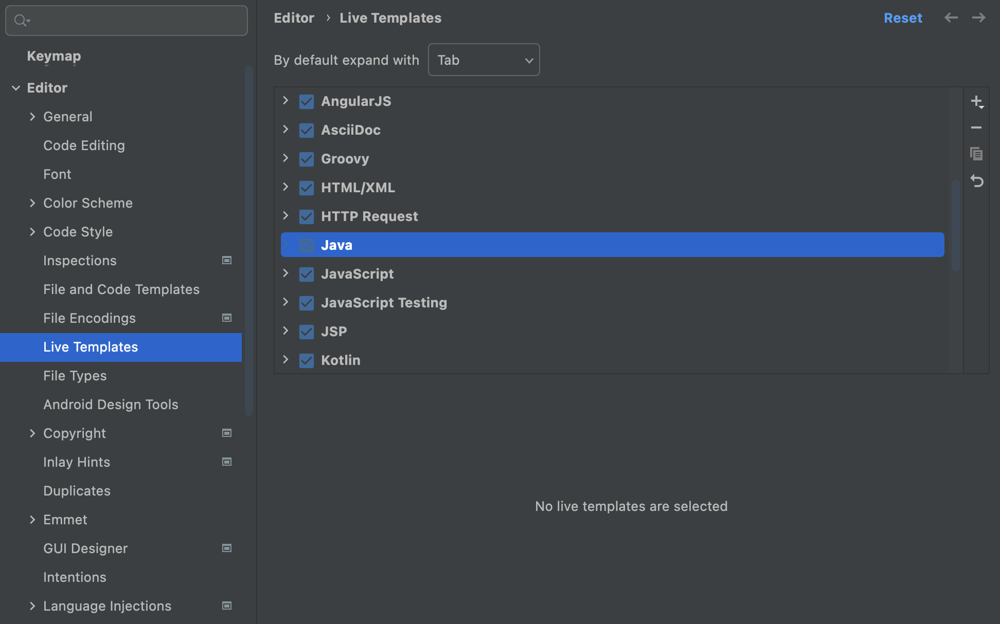
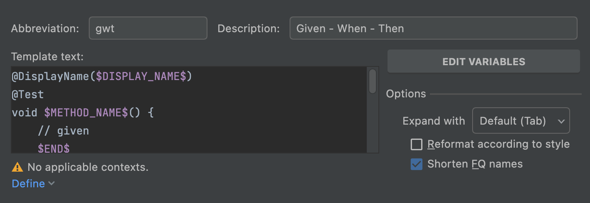

## Live Template

우리가 개발을 하다보면 많이 사용하는 형태여서 템플릿으로 만들고, 단축어로 템플릿을 불러올 수 있게끔 만들면 좋겠다는 생각을 자주한다. IntelliJ는 Live Template 이라는 이름으로 이런 편리한 기능을 제공한다.

사실 우리는 이미 Live Template을 많이 사용해왔다. IntelliJ를 켜고 `psvm`을 입력해보자. `psvm`은 `public static void main`의 약자이다. `psvm`을 입력하면 아래와 같이 자동완성 제안이 표시된다.


이 상태에서 엔터를 입력하면, 아래와 같은 코드 스니펫이 자동으로 완성된다.

```java
public static void main(String[] args) {

}
```

`sout`, `fori` 등등 유용하게 사용할 수 있는 Live Template이 기본적으로 많이 제공되고 있다. 이런 편리한 Live Template을 우리가 직접 정의할수도 있다.

나는 테스트코드를 작성할때 보통 Given - When - Then 패턴의 BDD 스타일로 작성하는 것을 선호한다. 이를 한번 템플릿화 해보겠다.

## Live Template 커스텀

> 맥 기준으로 작성되었다.

IntelliJ의 **Preferences > Editor > Live Templates** 메뉴로 들어가자. 그리고 여기서 자신이 사용할 언어를 선택하여 펼치자. 나는 Java를 선택하였다.



우측의 + 버튼을 클릭하고, Live Template을 클릭한다.



Abbreviation에 단축어 이름*(e.g. sout)*을 입력하고, Description에 설명을 적는다. 그리고 좌측 하단 Define 버튼을 클릭하여, Live Template을 사용할 환경을 선택한다. 나는 Java를 선택했다.

마지막으로 Template Text에 코드 템플릿을 적어주면 된다. 이때, `$`로 텍스트를 감싸면 Live Template 변수로 사용할 수 있다. 나는 아래와 같이 작성했다.

```java
@DisplayName($DISPLAY_NAME$)
@Test
void $METHOD_NAME$() {
    // given
    $END$
    // when

    // then
}
```

모든 설정을 했다면 아래와 같이 만든 Live Template을 사용할 수 있다.


Live Template에 대한 더 자세한 내용은 [IntelliJ 공식 문서](https://www.jetbrains.com/help/idea/using-live-templates.html)를 참고하자.
