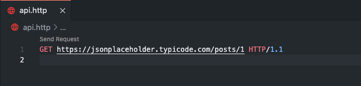
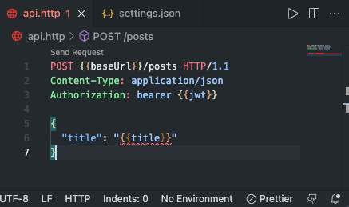

## 1. REST Client
REST Client 는 VS Code 의 확장 프로그램으로 Postman 과 같은 외부 API 테스팅 프로그램을 사용하지 않고도, 간단한 파일을 작성하여 VS Code 내부에서 API 테스트를 할 수 있는 기능을 제공한다. 또한 Swagger 와 같은 복잡한 API 문서화 프레임워크를 사용하지 않고도, 쉽게 API를 문서화할 수 있다.

Swagger 등으로 API를 문서화 하는 경우 문서화만을 위한 코드가 기존 코드에 추가되어 가독성을 해치는 문제가 있는데, REST Client 를 사용하면 코드에 영향을 주지 않고 API 문서화와 테스트를 동시에 할 수 있다.

### 1-1. 설치하기

VS Code 의 확장 프로그램 메뉴에서 **‘REST Client’** 를 검색하여 설치하자.


설치가 완료되면 세팅은 끝이다.

## 2. HTTP 요청 작성방법 훑어보기
REST Client 는 `.http` 또는 `.rest` 를 확장자로 갖는 파일에서 HTTP 요청을 작성하고 파일 내부에서 요청을 실행할 수 있다.

요청은 **HTTP 1.1 표준**에 따라 아래와 같이 작성한다. 본 포스트에서는 테스트를 위해 **[jsonplaceholder.typicode.com](https://jsonplaceholder.typicode.com)** 라는 Fake API 서비스를 사용한다.

실습을 위해 적당한 디렉토리에 `api.http` 파일을 생성하고, 아래 내용을 따라해보자.

### 2-1. GET 요청 작성하기
요청을 작성하기 위해서는 요청의 메소드와 URI 를 가장 먼저 작성해야한다. 가장 간단한 `GET` 요청을 먼저 작성해보자. 아래와 같이 `api.http` 파일에 작성한다.

```http
GET https://jsonplaceholder.typicode.com/posts/1 HTTP/1.1
```

혹은 `HTTP/1.1` 은 생략하고 아래와 같이 작성할 수 있다.

```http
GET https://jsonplaceholder.typicode.com/posts/1
```

아래 사진과 같이 작성한 코드 위에 **Send Request** 라는 글씨가 보인다면 성공이다.



한번 Send Request 를 클릭해보자. REST Client 가 VS Code 내부에서 직접 URI 에 요청하여 아래와 같이 응답 결과를 보여준다.


위와 같이 새로운 탭에서 HTTP Response 를 확인할 수 있다면 성공이다.

### 2-2. POST 요청 작성하기

`GET` 메소드에 이어서 `POST` 요청도 작성해보자. 그 전에 한 파일에서 여러개의 요청을 작성하기 위해서는 요청과 요청 사이를 구분해야 한다.

아래와 같이 이미 작성한 GET 요청 아래에 `###` 을 추가하자. `###` 로 구분하지 않는다면, REST Client 가 두개의 요청을 구분하지 못한다.

```http
GET https://jsonplaceholder.typicode.com/posts/1 HTTP/1.1

###
```

그리고 그 아래에 하단의 POST 요청을 작성하자. 

```http
POST https://jsonplaceholder.typicode.com/posts HTTP/1.1
Content-Type: application/json; charset=UTF-8

{
  "name": "sample",
  "time": "Wed, 21 Oct 2015 18:27:50 GMT"
}
```

`GET` 요청과 다르게 하단에, Content-type 이라는 **Header** 와 **Request Body** 가 추가된 것을 볼 수 있다. Header 와 Body 의 더 자세한 내용은 글 아래에서 다루니 일단 작성 형식만 눈에 익혀두자.

### 2-3. PUT/PATCH 요청 작성하기
```http
### 업데이트 요청
PUT https://jsonplaceholder.typicode.com/posts/1 HTTP/1.1
Content-Type: application/json; charset=UTF-8

{
  "id": 1,
  "title": "Updated Title",
  "body": "Updated Body",
  "userId": 1
}

### 패치 요청
PATCH https://jsonplaceholder.typicode.com/posts/1 HTTP/1.1
Content-Type: application/json; charset=UTF-8

{
  "title": "Patched Title"
}
```

`PUT` 메소드는 리소스의 전체를 업데이트할 때 사용되며, `PATCH` 메소드는 리소스의 일부분을 업데이트할 때 사용된다. 위와 같이 `PUT` 과 `PATCH` 도 `POST` 요청과 큰 차이 없이 작성할 수 있다.

또한 위 예시처럼 `###` 구분자 뒤에 요청에 대한 설명을 주석과 같이 작성하면, 해당 요청이 어떤 요청인지 다른사람도 쉽게 알 수 있을 것 이다.

### 2-4. DELETE 요청
```http
### 삭제 요청
DELETE https://jsonplaceholder.typicode.com/posts/1 HTTP/1.1
```

## 3. 상세 작성 가이드
### 3-1. 요청 헤더 (Request Header)
```http
POST https://jsonplaceholder.typicode.com/posts HTTP/1.1
```

위와 같이 요청 메소드와 URI 를 명시한 라인을 **요청 라인** 이라고 한다. 이 요청 라인 바로 아래줄 부터 HTTP 요청 헤더를 작성할 수 있다.

요청 헤더는 `헤더명: 값` 의 형태로 작성하며, 여러개의 헤더를 설정하려면 개행으로 구분하면 된다.

```http
POST https://jsonplaceholder.typicode.com/posts HTTP/1.1
User-Agent: rest-client
Accept-Language: en-GB,en-US;q=0.8,en;q=0.6,zh-CN;q=0.4
Content-Type: application/json
Authorization: bearer abcdef...
```

### 3-2. 요청 바디 (Request Body)
요청 바디는 요청 라인 혹은 요청 헤더로부터 1개의 개행 간격을 두고 작성한다. `Content-Type` 에 따라 Body 의 형태도 달라질 수 있다.

#### JSON Body
```http
(생략)
Content-Type: application/json

{
  "foo": "bar"
}
```

#### XML
```http
(생략)
Content-Type: application/xml

<request>
    <name>sample</name>
    <time>Wed, 21 Oct 2015 18:27:50 GMT</time>
</request>
```

#### Multipart
```http
(생략)
Content-Type: multipart/form-data; boundary=----WebKitFormBoundary7MA4YWxkTrZu0gW

------WebKitFormBoundary7MA4YWxkTrZu0gW
Content-Disposition: form-data; name="text"

title
------WebKitFormBoundary7MA4YWxkTrZu0gW
Content-Disposition: form-data; name="image"; filename="1.png"
Content-Type: image/png

< ./1.png
------WebKitFormBoundary7MA4YWxkTrZu0gW--
```

#### Form Data (x-www-form-urlencode)
```http
(생략)
Content-Type: application/x-www-form-urlencoded

name=foo
&password=bar
```

### 3-3. 쿼리 스트링 (Query String)
```http
GET https://jsonplaceholder.typicode.com/comments?postId=1 HTTP/1.1 
```

요청 라인에 위와 같이 쿼리 스트링을 포함하여 요청을 전송할 수 있다.

### 3-4. 파일 변수
`@` 를 사용하여 파일 내에서 변수를 정의할 수 있다.  정의된 변수의 값에 접근할 때는 `{{변수명}}` 형태로 작성해주면 된다.

아래와 같이 Base URL 이나 테스트용 토큰을 변수로 따로 분리하는 등의 활용이 가능하다.

```http
@baseUrl = https://jsonplaceholder.typicode.com
@jwt = testjwt

GET {{baseUrl}}/posts HTTP/1.1
Authorization: bearer {{jwt}}
```

만약 변수가 정의되지 않은 경우 `{{baseUrl}}` 와 같은 형식이 그대로 평문으로 사용되는 점 유의하자.

### 3-5. 환경 변수
`.vscode/settings.json` 에 REST Client 에서 사용할 수 있는 환경변수를 정의할 수 있다. 여러 환경을 정의할 수 있고, 환경을 전환할 수 있다.

`.vscode` 라는 디렉토리를 생성하고 `settings.json` 파일을 생성하여 아래와 같이 작성 해보자.

```json
{
  "rest-client.environmentVariables": {
    "$shared": {
      "baseUrl": "https://jsonplaceholder.typicode.com",
      "jwt": "testjwt"
    },
    "development": {
      "title": "Development Title"
    },
    "production": {
      "title": "Production Title"
    }
  }
}
```

`$shared` 에는 어떤 환경에서든 공유되는 환경변수 `baseUrl` 과 `jwt` 를 정의했다. 그리고 `development` 와 `production` 이라는 환경을 따로 정의 한다음 각 환경에서만 사용될 `title` 변수를 정의했다.

그 다음 아래와 같이 요청을 작성해보자.

```http
POST {{baseUrl}}/posts HTTP/1.1
Content-Type: application/json
Authorization: bearer {{jwt}}

{
  "title": "{{title}}"
}
```

현재 환경이 **‘No Environment’** 로 설정되어 있어, `{{title}}` 부분은 오류가 난 상황일 것이다.



VS Code 의 우측 하단을 보면 No Environment 라는 글씨가 보일텐데, 이를 클릭하여 환경을 전환할 수 있다. 혹은 윈도우의 경우 키보드에서 `Ctrl + Alt +E` 맥의 경우 `Cmd + Alt + E` 단축키를 사용할 수도 있다.


development 를 선택하여 환경을 전환하고, Send Request 를 클릭하여 요청을 실행해보자.


우리가 환경변수에 정의한 값이 Request Body 에 실려 전송된 모습을 확인할 수 있다.

### 3-6. 요청 변수
다른 요청의 응답을 변수에 담아 다른 요청에서 사용할 수 있다. 포스트 리스트를 불러오고, 리스트 첫번째 포스트의 `title` 과 Response Header 의 `content-type` 을 그대로 `POST` 요청으로 보내는 예제를 작성해보자.

`# @name variableName` 형태로 해당 요청의 응답을 담을 변수를 정의할 수 있다. 그리고 해당 변수를 참조하는 요청은 이전에 참조하는 요청이 이미 실행된 상태여야만 실행이 가능하다.

```http
# @name getPost
GET https://jsonplaceholder.typicode.com/posts HTTP/1.1

### Create Post
POST https://jsonplaceholder.typicode.com/posts HTTP/1.1
Content-Type: application/json

{
  "title": "{{getPost.response.body.$[0].title}}",
  "content-type": "{{getPost.response.headers.Content-Type}}"
}
```

위 요청을 실행하면, 아래와 같이 응답 값을 그대로 요청하는 것을 확인할 수 있다.


### 3-7. 주석

`//` 혹은 `#` 를 사용하여 주석을 작성할 수 있다.

```http
GET https://jsonplaceholder.typicode.com/posts HTTP/1.1
# 포스트 리스트를 가져옵니다.
// 포스트 리스트를 가져옵니다.
```


## 4. 유용한 기능
### 4-1. 요청 내역 확인하기

윈도우의 경우 `Ctrl + Alt + H` , 맥의 경우 `Cmd + Alt + H` 단축키를 사용하면 최근에 실행한 요청 내역을 확인할 수 있다.


### 4-2. Response 저장하기
Reponse 를 `.http` 파일로 저장할 수 있다. Response 탭의 우측 상단의 저장 아이콘을 클릭하여 저장하자.


### 4-3. 코드 스니펫 생성하기
생성할 요청 HTTP 부분을 드래그하고 우클릭 후 **Generate Code Snippet** 을 클릭하여 여러 언어의 다양한 라이브러리로 요청 코드를 생성할 수 있다.


굉장히 다양한 언어를 지원한다. **Javascript** 를 선택해보자.


해당 언어에서 지원하는 대표적인 라이브러리도 선택할 수 있다. **Axios** 를 선택하자.


사진과 같이 Javascript 의 Axios 라이브러리로 요청 코드 스니펫이 생성되었다.

## 5. 마치며
규모가 큰 프로젝트의 경우 Swagger 같이 다양한 기능을 제공하는 API 문서화 프레임워크와 Postman, Thunder Client 와 같은 API 테스팅 도구를 사용하는 것이 적합할 것이다.

하지만 MVP 를 개발하거나, 소규모 사이드 프로젝트를 진행할때에는 REST Client 를 사용하여 간단하게 문서화와 테스트를 동시에 관리하는 것이 좋아보인다.