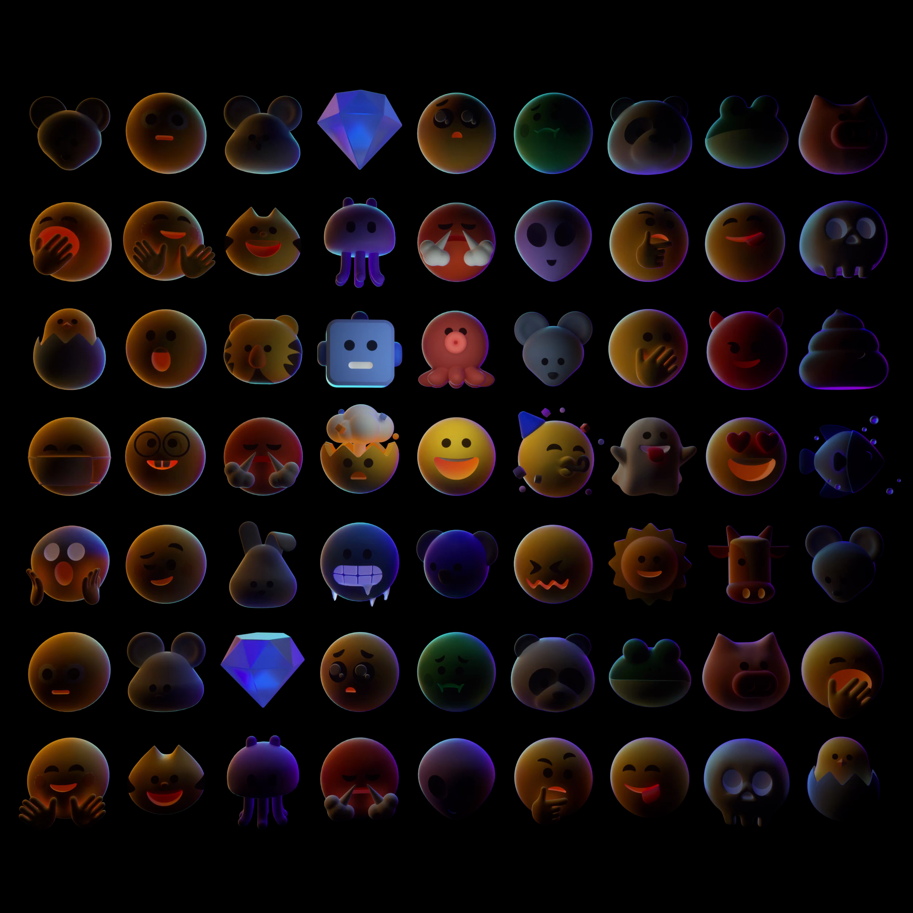
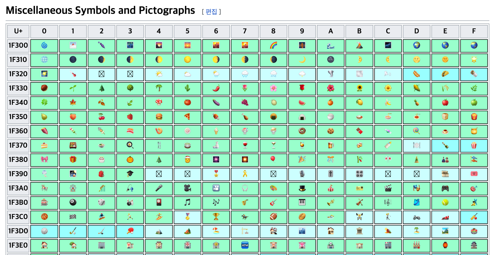
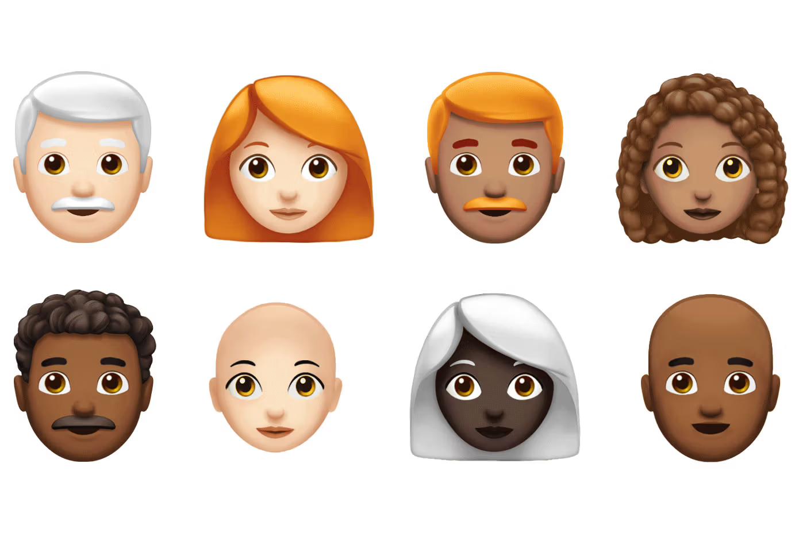
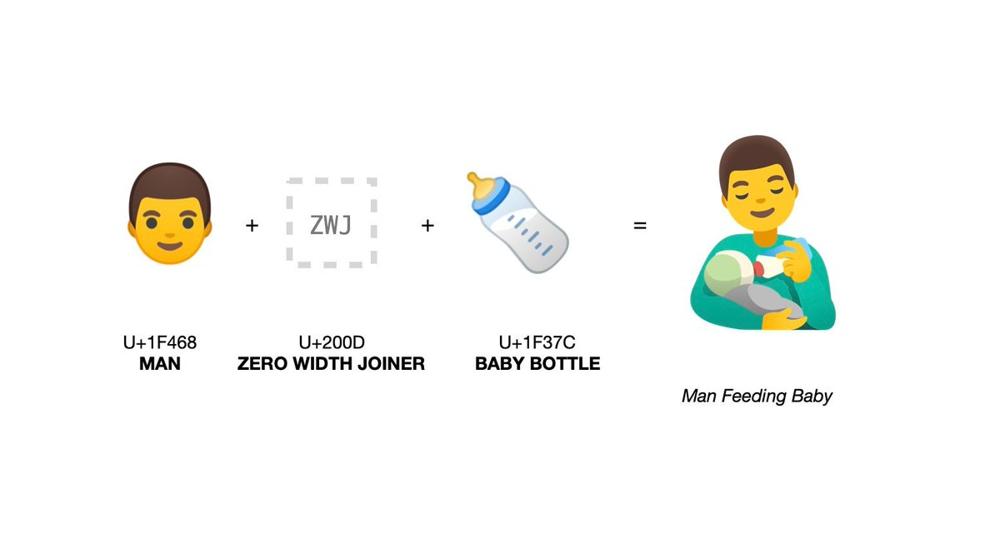
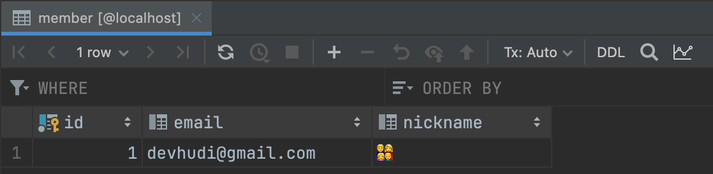
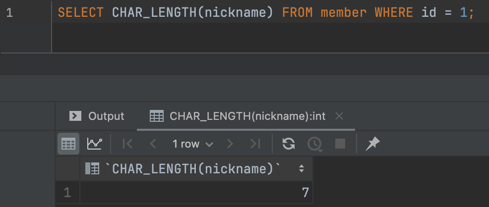
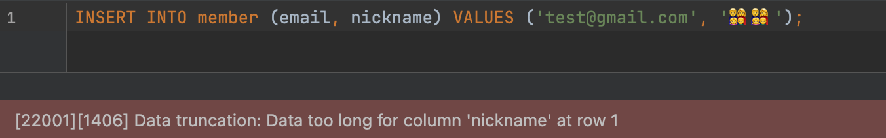
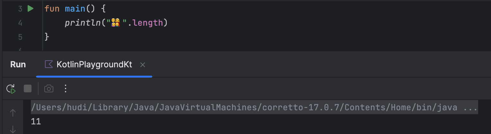

> 이 글을 읽기 전에 직전 포스팅인 [**유니코드는 어떻게 구성되어 있을까?**](https://hudi.blog/what-is-unicode/) 를 먼저 읽고 온다면 더욱 도움이 될 것이다.

## 이모지



이모지… 이모지가 무엇일까? 단순한 텍스트로는 감정 전달이 어려운 그 미묘한 부분을 시원하게 긁어주는 그림 문자. 한국에서는 스마트폰이 보급되고, SNS가 유행하기 시작하면서 많이 사용하게 되었던 것 같다. 그 유용성은 실로 어마무시해서, 필자도 사내 슬랙에서 **:pray:** (🙏) 와 **:bow:** (🙇) 를 남발하곤 한다.

이모지에 대한 재밌는 사실을 먼저 알아보자. 이모지의 기원은 일본이라는 사실을 아는가? 애초에 emoji 라는 단어의 뜻도, 그림을 뜻하는 **絵(에)** 와 **文字(모지)**가 합쳐져서 만들어진 단어이다.

1999년 NTT 도코모[^1]에서 이미지로 된 문자 ‘이모지’를 처음 도입하였고, 자사의 단말기끼리 주고받을 수 있도록 만들었다. 이후 다른 통신사들에서도 경쟁적으로 이 이모지를 도입하게 되었다. 일본은 한국처럼 휴대전화로 SMS를 보내는 것 보다, 이메일을 보내는 것이 더 보편적이다. 그래서 휴대전화에서 이모지를 포함한 이메일을 보낼 수 있다. 문제는 그 이메일을 PC에서 읽으면 이모지가 보이지 않는 상황이 발생한다는 것이다.

이런 문제를 해결하기 위해 당시 NTT 도코모와 심비안(노키아의 자회사)이 유니코드에 이모지 도입을 제안하였으나 거절되었고, 이후 시간이 흘러 2007년 스마트폰이 보급되면서 애플과 구글이 다시 도입을 제안하였고, 유니코드 표준으로 포함되게 되었다.

🗾, 🏯, 🎏, 🎑, 🍣, 🍥, 🎌, … 이모지에서 풍겨왔던 미묘한 일본 분위기의 비밀이 이제서야 풀리는 기분이지 않는가.

## 유니코드로서의 이모지



> 현재 존재하는 모든 이모지 리스트를 보고 싶다면, [unicode.org](http://unicode.org) 의 [Full Emoji List](https://unicode.org/emoji/charts/full-emoji-list.html) 문서를 확인하자.

앞서 말했듯 이모지는 유니코드에 포함되어 있다. 이모지는 유니코드 평면 중 다국어 보충 평면(SMP)에 포함되어 있다. 이 평면에서 `U+1F000` ~ `U+1F9FF` 영역에 이모지가 위치해있다.

하지만 모든 이모지가 이 유니코드 평면에 존재하지는 않는다. 이모지는 유니코드에 포함된 스펙인데, 이게 무슨뜻일까? 이모지에는 여러 유니코드 문자가 결합되어 하나의 이모지를 표현하는 이모지 시퀀스 (Emoji Sequence)라는 것이 존재한다.

## 이모지 시퀀스 (Emoji Sequence)

이모지 시퀀스는 다양한 형태로 기존의 이모지를 다른 여러 형태로 표현할 수 있도록 해준다. 이모지 시퀀스 메커니즘은 크게 5가지로 나눌 수 있다.

1. Emoji Modifier Sequence
2. Emoji ZWJ Sequence
3. Emoji Flag Sequence
4. Emoji Tag Sequence
5. Emoji Keycap Sequence

하나하나 간단하게 알아보자.

### Emoji Modifier Sequence



이모지는 다양한 인종에 대응하기 위해 여러 피부색을 지원한다. 예를 들면 👮 이런 중립적인 피부색의 경찰관 이모지를, 👮🏻 👮🏼 👮🏽 👮🏾 👮🏾 이렇게 다섯가지 피부 색상의 이모지로 표현할 수 있다. 유니코드는 중립적인 피부색의 이모지를 포함해서 모든 피부색의 경찰관 이모지에 모두 코드 포인트를 부여했을까? 만약 그렇다면, 하나의 인물 이모지를 만들기 위해서는 최소 6개의 코드 포인트를 사용해야하고, 이는 유니코드 평면을 낭비했을 것이다.

유니코드는 이런 문제를 Emoji Modifier 로 해결한다. 이모지 문자는 5가지의 피부 색상의 수정자(Modifier)로 변형될 수 있다. Skin Tone Modifier 는 아래와 같다[^2].

- 🏻 - Light Skin Tone
- 🏻 - Medium-Light Skin Tone
- 🏽 - Medium Skin Tone
- 🏾 - Medium-Dark Skin Tone
- 🏿 - Dark Skin Tone

Emoji Modifier Sequence 가 지원되는 이모지 바로 뒤에 Skin Tone Modifier 가 삽입되면, 자동으로 적용되어 이모지에 피부색이 반영되는 것을 확인할 수 있다.

유니코드 15.1 버전 기준 모든 Emoji Modifier Sequence 목록은 [unicode.org](http://unicode.org) 의 [Full Emoji Modifier Sequences, v15.1](https://www.unicode.org/emoji/charts/full-emoji-modifiers.html) 문서에서 확인할 수 있다.

### Emoji ZWJ Sequence



ZWJ은 Zero Width Joiner의 줄임말로, 2개 혹은 그 이상의 문자를 연속적으로 묶어서 새로운 단일 이모지를 표현하기 위해 사용되는 유니코드 문자이다. ZWJ은 이모지가 아니며, 그 자체로는 눈으로 볼 수 없다. ZWJ도 유니코드이므로 `U+200D` 라는 코드 포인트를 가지고 있다.

ZWJ를 사용하여 새로운 이모지를 만드는 사례를 몇가지 알아보자 (찾아보면 신기한 조합들이 많다).

- 🐻 (Bear) + `ZWJ` + ❄️ (Snowflake) = 🐻‍❄️ (Polar Bear)
- 👨 (Man) + `ZWJ` + 🎤 (Microphone) = 👨‍🎤 (Man Singer)
- ❤️ (Heart) + `ZWJ` + 🔥 (Fire) = ❤️‍🔥 (Heart on Fire)
- 👁 (Eye) + `ZWJ` + 🗨 (Left Speech Bubble) = 👁‍🗨 (Eye in Speech Bubble)
- 👨 (Man) + `ZWJ` + 👩 (Woman) + `ZWJ` + 👧 (Girl) + `ZWJ` + 👦 (Boy) = 👨‍👩‍👧‍👦 (Family: Man, Woman, Girl, Boy)

ZWJ는 non-emoji 문자를 결합할때도 사용한다. 이에 대한 예시는 위키백과 [폭 없는 접합자](https://ko.wikipedia.org/wiki/%ED%8F%AD_%EC%97%86%EB%8A%94_%EC%A0%91%ED%95%A9%EC%9E%90) 문서를 참고하자.

### Emoji Flag Sequence

ISO 3166-1[^3] 는 ISO 3166 표준의 일부로, 특정 국가나 영토에 고유한 알파벳 부호를 부여한다. numeric, alpha-2, alpha-3 세가지의 부호를 부여하는데, 한국을 예로 들자면 각각 410, KOR, KR 이다.

Emoji Flag Sequence 는 ISO 3166-1 의 alpha-2 를 기반으로 각 국가별 국기를 표현한다. Emoji Flag Sequence 로 한국의 국기인 태극기를 표현해보자. 아래 두가지 유니코드 문자를 이어 붙인다.

- 🇰 (Regional Indicator Symbol Letter K, `U+1F1F0`)
- 🇷 (Regional Indicator Symbol Letter R, `U+1F1F7`)

위 두가지 문자를 이어 붙이면, 🇰🇷 태극기가 만들어진다. 마찬가지로 🇺와 🇸를 결합하여 🇺🇸 성조기를 만들 수 있고, 🇯와 🇵를 결합하여 🇯🇵 일장기를 만들 수 있다.

### Emoji Tag Sequence

Emoji Tag Sequence 는 일련의 문자가 새로운 이모지를 만들 수 있도록 하는 메커니즘이다. 현재는 ISO 3166-2[^4] 에서 지정된 국가의 하위 지역의 (지방 혹은 주 등) 지역 국기(regional flag)를 표현하는데만 사용된다.

Emoji Tag Sequence 는 🏴 (Black Flag) 뒤에 일련의 태그 문자들이 이어져 하나의 이모지를 표현한다. 예를 들어 🏴󠁧󠁢󠁥󠁮󠁧󠁿 (Flag: England)는 🏴 뒤에 Tag Latin Small Letter G, Tag Latin Small Letter B, Tag Latin Small Letter E, Tag Latin Small Letter N 가 이어져 표현된다.

### Emoji Keycap Sequence

Combining Enclosing Keycap (`U+20E3`) 이라는 이모지를 특정 문자 뒤에 붙이면, 키캡모양으로 보이게끔 할 수 있다. 예를 들면 1️⃣, 2️⃣, 3️⃣, #️⃣, \*️⃣ … 등이 있다.

## 그러니까, 그 이모지는 사실 한 글자가 아닐수도 있다

앞서 이모지 시퀀스를 사용하면 여러개의 이모지를 이어서 한글자로 ‘보이는’ 이모지를 만들어낼 수 있다고 했다. 이런 이모지의 특징은 종종 개발자를 당황시킬 수 있다.

### MySQL 에서



여기 MySQL 테이블에 `nickname` 컬럼의 값으로 👨‍👩‍👧‍👦 (Family with Mother, Father, Son and Daughter) 라는 이모지가 저장되어 있다. 이 이모지는 👨 (Man, `U+1F468`), 👩 (Woman, `U+1F469`), 👧 (Girl, `U+1F467`), 👦 (Boy, `U+1F466`) 이 4개의 이모지를 ZWJ 으로 묶은 것이다. 즉, 우리 눈에는 1글자로 보이는 이 이모지는 실제로는 7글자라는 긴 길이를 가지고 있다.

이는 MySQL의 `CHAR_LENGTH` 함수로 확인해볼 수 있다. `CHAR_LENGTH` 는 특정 문자의 개수를 가져오는 함수이다. 결과를 확인해보자.



실제로 7글자를 반환하는 것을 볼 수 있다.

만약 `nickname` 컬럼의 데이터 타입이 `VARCHAR(10)` 인데, 아래처럼 가족 이모지를 2개만 넣어도 INSERT 쿼리는 아래처럼 실패한다. 이는 일반적인 기대와는 다른 동작으로, 자칫하면 장애 상황으로 이어질 수 있다.



### Java, Kotlin 에서

그렇다면 Java, Kotlin 에서는 어떨까? Kotlin 으로 직접 실험해보자.

```kotlin
println("👨‍👩‍👧‍👦".length)
```

뭔가 맥락상 7이 출력될 것 같다. 맞는지 한번 직접 실행해보자.



어라, 예상과 다르게 조금 뜬금없는 11이라는 숫자가 출력되었다. 그 이유가 무엇일까?

직전 포스팅인 **[유니코드는 어떻게 구성되어 있을까?](https://hudi.blog/what-is-unicode/)** 에서 알아봤듯이, Java나 Kotlin 같은 JVM 계열 언어는 UTF-16을 기본적으로 사용한다 (그리고 Big Endian 을 사용한다). UTF-16은 `U+10000` 이상인 Surrogate Pair를 표현하기 위해 2바이트 값 2개를 사용하여 한 글자를 표현한다.

가족 이모지를 구성하는 이모지들의 Surrogate Pair 는 아래와 같다.

- Man 이모지 : `0xD83D` 와 `0xDC68`
- Woman 이모지 : `0xD83D` 와 `0xDC69`
- Girl 이모지 : `0xD83D` 와 `0xDC67`
- Boy 이모지 : `0xD83D` 와 `0xDC66`

따라서 위 가족 이모지를 Unicode Escape 를 사용하여 표현하면 아래와 같다.

```
\uD83D\uDC68\u200D\uD83D\uDC69\u200D\uD83D\uDC67\u200D\uD83D\uDC66
```

JVM 계열 언어에서는 Surrogate Pair 를 두개의 `char` 유닛으로 계산한다. 따라서 JVM 계열의 언어에서는 위 이모지는 11글자이다.

그렇다면 이를 정확히 7글자로 나타내고 싶다면 어떻게 해야할까? String 의 메소드인 `codePointCount` 를 사용하면 된다. 이 메서드를 사용하면 Char 의 개수가 아닌, 유니코드 코드 포인트 기준으로 글자수를 셀 수 있다.

```kotlin
val emoji = "👨‍👩‍👧‍👦"
println(emoji.codePointCount(0, emoji.length)) // 7
```

## 참고

- [Java에서의 Emoji처리에 대해 - NHN Cloud Meetup!](https://meetup.nhncloud.com/posts/317)
- [length of a String with surrogate characters in it - java - Stackoverflow](https://stackoverflow.com/questions/28252750/length-of-a-string-with-surrogate-characters-in-it-java)
- [Emoji Sequence - emojipedia.org](https://emojipedia.org/emoji-sequence)

[^1]: 일본의 통신사다.
[^2]: 이 스킨톤은 Fitzpatrick scale 에 기반한다.
[^3]: https://ko.wikipedia.org/wiki/ISO_3166-1
[^4]: https://en.wikipedia.org/wiki/ISO_3166-2
